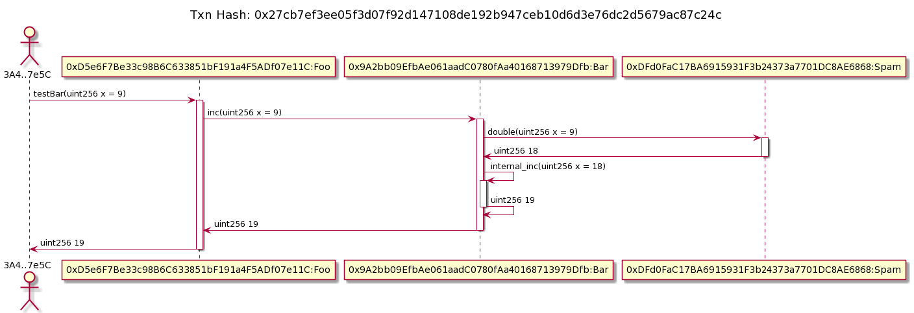
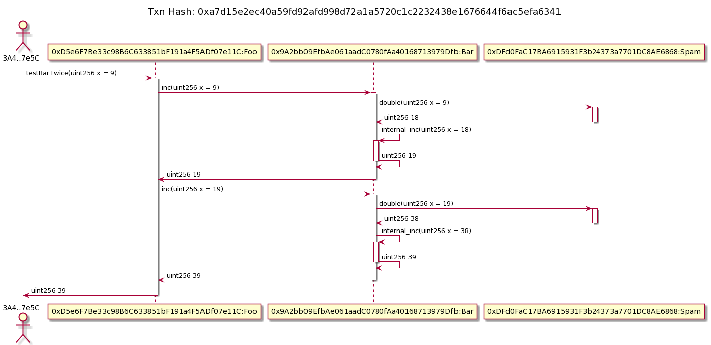
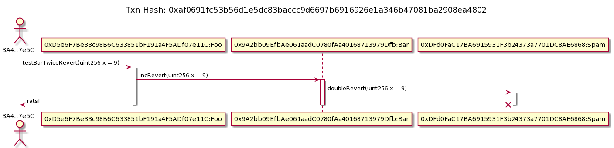
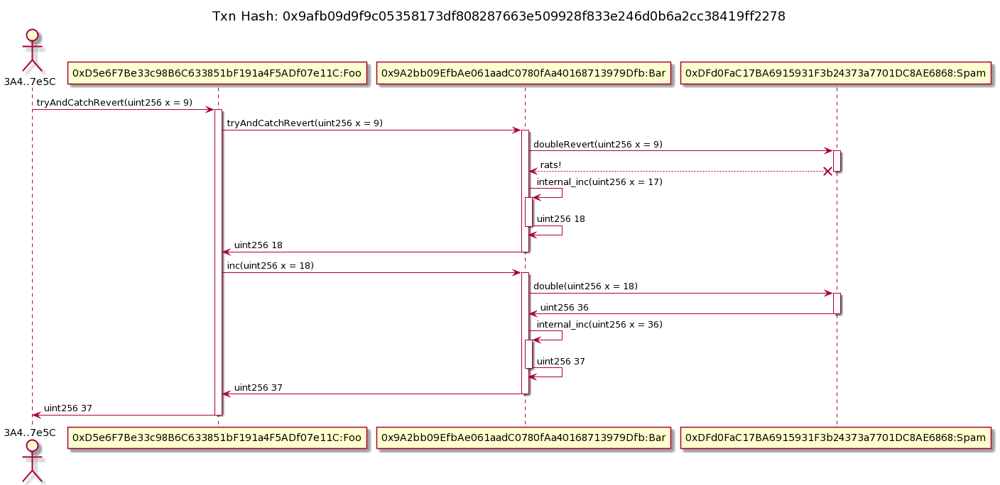

# txlog-seedlings

Truffle project to test `txlog-to-plantuml`


## Setup

1. Clone txlog-to-plantuml in another folder.
   ```sh
   $ git clone git@github.com:trufflesuite/txlog-to-plantuml.git
   $ yarn
   ```
1. Use yarn link to register txlog-to-plantuml for local node projects
   ```sh
   $ yarn link
   ```
1. In the folder of txlog-seedlings, link to txlog-to-plantuml
   ```sh
   $ yarn link txlog-to-plantuml
   ```
1. Run ganache in another terminal, make sure to use the
   `--noVMErrorsOnRPCResponse` flag. For your convenience there's a script.

   ```sh
   $ yarn ganache
   ```
1. Migrate the contracts.
   ```sh
   $ truffle migrate --reset
   ```
1. Seed one or more transactions depending on your needs. The output of the
   exec script will give you the full command you need to execute; and you're
   off the races.
   ```sh
   $ truffle exec scripts/test01.js
   truffle run tx2seq 0x9ad55ccdbea38485dc37e50dc63dd5547ad91b14d3b176b0d196d8b10967e78c
   ```

## TODO
1. More test scripts will be needed and it should be documented here.
1. Explain structure of test scripts; maybe

## Gallery or Test cases

The Solidity contracts used for testing:
  * [Foo](contracts/Foo.sol) - the entry point for all the tests. It calls bar.
  * [Bar](contracts/Bar.sol) - an intermediary contract, it sometimes handles exceptions calling Spam.
  * [Spam](contracts/Spam.sol) - Spam has methods for reverting or not reverting.
  * have to be renamed sometime :see_no_evil: :thinking:
### 01 happy path across 3 contracts


```javascript
  const res = await foo.testBar(9);
```

<details><summary>Generated Plantuml</summary>

```
title Txn Hash: 0x27cb7ef3ee05f3d07f92d147108de192b947ceb10d6d3e76dc2d5679ac87c24c

actor eow as "3A4..7e5C"
participant p1 as "0xD5e6F7Be33c98B6C633851bF191a4F5ADf07e11C:Foo"
participant p2 as "0x9A2bb09EfbAe061aadC0780fAa40168713979Dfb:Bar"
participant p3 as "0xDFd0FaC17BA6915931F3b24373a7701DC8AE6868:Spam"

eow -> p1 ++ : testBar(uint256 x = 9)
p1 -> p2 ++ : inc(uint256 x = 9)
p2 -> p3 ++ : double(uint256 x = 9)
p3 -> p2 -- : uint256 18
p2 -> p2 ++ : internal_inc(uint256 x = 18)
p2 -> p2 -- : uint256 19
p2 -> p1 -- : uint256 19
p1 -> eow -- : uint256 19

```

</details>



### 02 happy path across 3 contracts multiple (2) invocations


```javascript
  const res = await foo.testBarTwice(9);
```

<details><summary>Generated Plantuml</summary>

```
title Txn Hash: 0xa7d15e2ec40a59fd92afd998d72a1a5720c1c2232438e1676644f6ac5efa6341

actor eow as "3A4..7e5C"
participant p1 as "0xD5e6F7Be33c98B6C633851bF191a4F5ADf07e11C:Foo"
participant p2 as "0x9A2bb09EfbAe061aadC0780fAa40168713979Dfb:Bar"
participant p3 as "0xDFd0FaC17BA6915931F3b24373a7701DC8AE6868:Spam"

eow -> p1 ++ : testBarTwice(uint256 x = 9)
p1 -> p2 ++ : inc(uint256 x = 9)
p2 -> p3 ++ : double(uint256 x = 9)
p3 -> p2 -- : uint256 18
p2 -> p2 ++ : internal_inc(uint256 x = 18)
p2 -> p2 -- : uint256 19
p2 -> p1 -- : uint256 19
p1 -> p2 ++ : inc(uint256 x = 19)
p2 -> p3 ++ : double(uint256 x = 19)
p3 -> p2 -- : uint256 38
p2 -> p2 ++ : internal_inc(uint256 x = 38)
p2 -> p2 -- : uint256 39
p2 -> p1 -- : uint256 39
p1 -> eow -- : uint256 39

```

</details>



### 03 Reverting transaction

```javascript
    res = await foo.testBarTwiceRevert(9);
```

<details><summary>Generated Plantuml</summary>

```
title Txn Hash: 0xaf0691fc53b56d1e5dc83baccc9d6697b6916926e1a346b47081ba2908ea4802

actor eow as "3A4..7e5C"
participant p1 as "0xD5e6F7Be33c98B6C633851bF191a4F5ADf07e11C:Foo"
participant p2 as "0x9A2bb09EfbAe061aadC0780fAa40168713979Dfb:Bar"
participant p3 as "0xDFd0FaC17BA6915931F3b24373a7701DC8AE6868:Spam"

eow -> p1 ++ : testBarTwiceRevert(uint256 x = 9)
p1 -> p2 ++ : incRevert(uint256 x = 9)
p2 -> p3 ++ : doubleRevert(uint256 x = 9)
p3 x--> eow: rats!
deactivate p3
deactivate p2
deactivate p1

```

</details>



### 04 Transaction with try/catch

```javascript
  let res;
  try {
    res = await foo.tryAndCatchRevert(9);
    console.log('tx hash:', res.tx);  // exception raised before res was assigned :(
    console.log(`truffle run tx2seq ${res.tx} `);
  } catch (error) {
    console.log(error);
    console.log('um... something went wrong');
  } finally {
    callback();
  }
```

<details><summary>Generated Plantuml</summary>

```
title Txn Hash: 0x9afb09d9f9c05358173df808287663e509928f833e246d0b6a2cc38419ff2278

actor eow as "3A4..7e5C"
participant p1 as "0xD5e6F7Be33c98B6C633851bF191a4F5ADf07e11C:Foo"
participant p2 as "0x9A2bb09EfbAe061aadC0780fAa40168713979Dfb:Bar"
participant p3 as "0xDFd0FaC17BA6915931F3b24373a7701DC8AE6868:Spam"

eow -> p1 ++ : tryAndCatchRevert(uint256 x = 9)
p1 -> p2 ++ : tryAndCatchRevert(uint256 x = 9)
p2 -> p3 ++ : doubleRevert(uint256 x = 9)
p3 x--> p2: rats!
deactivate p3
p2 -> p2 ++ : internal_inc(uint256 x = 17)
p2 -> p2 -- : uint256 18
p2 -> p1 -- : uint256 18
p1 -> p2 ++ : inc(uint256 x = 18)
p2 -> p3 ++ : double(uint256 x = 18)
p3 -> p2 -- : uint256 36
p2 -> p2 ++ : internal_inc(uint256 x = 36)
p2 -> p2 -- : uint256 37
p2 -> p1 -- : uint256 37
p1 -> eow -- : uint256 37

```

</details>



