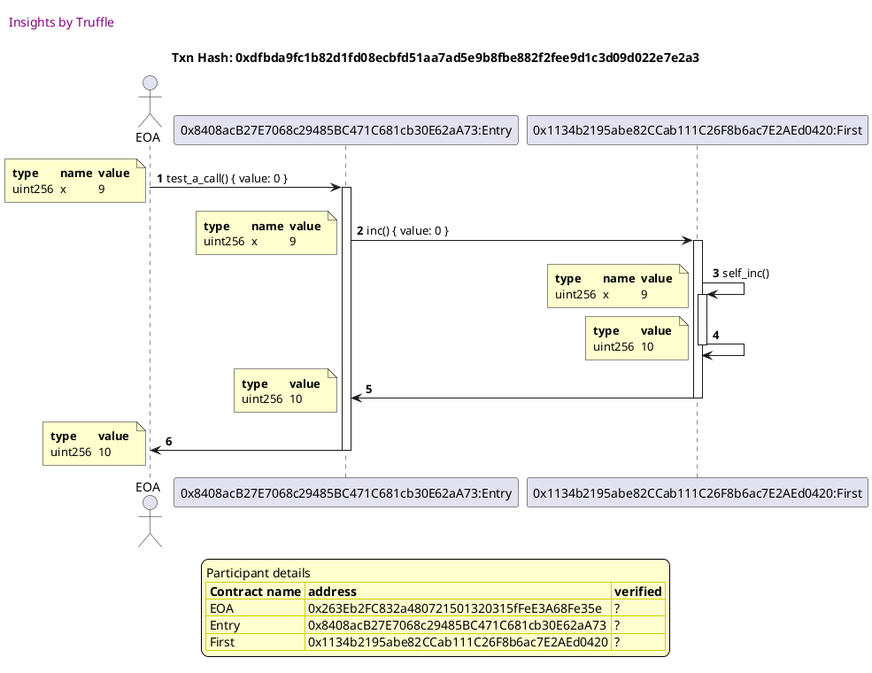
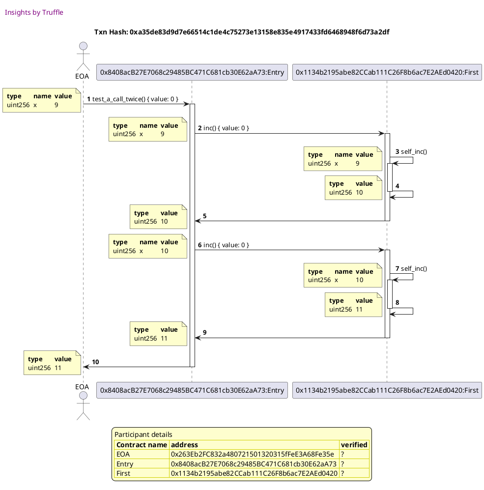
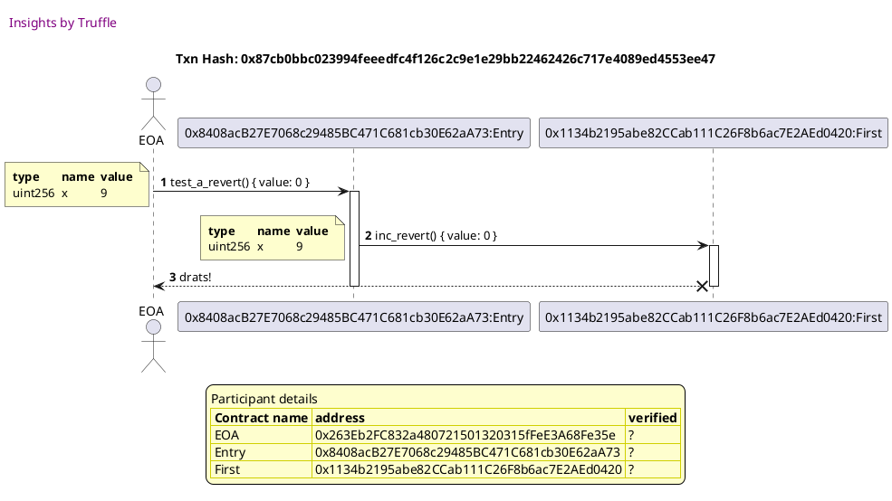
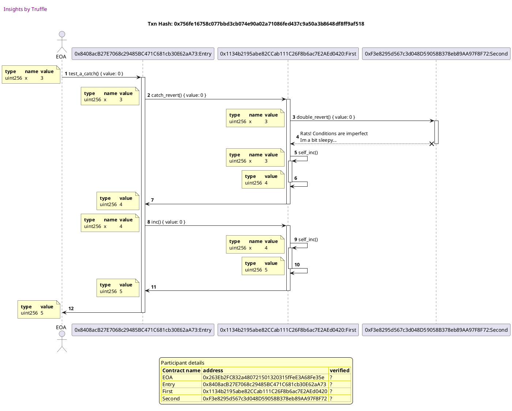

Test date: 2021 Feb 08

## tests a call: x -> 2x + 1
##### d1, tx: 0xdfbda9fc1b82d1fd08ecbfd51aa7ad5e9b8fbe882f2fee9d1c3d09d022e7e2a3

[SVG :telescope:](https://www.planttext.com/api/plantuml/svg/lPHDJzmm48Rl_XKMlRIYgBRpvQmePGc9wAb8vOwSUBnOP9sLurIxiFntPiEoKDfAz02Heabi-NbVpzXpt0Vbmp1l2L53wDmmhy4JqbzRjr1UpMaBCt3wH3NNCzyDJXTTstdweIghiYW9EUp3geKZGgv0QV3qbb1wrdbxqxcWscbhPsuEBY3619ogSFY1i1ZyeeNjq4zx0vJ7-7UkjBPkHZaZTqZ_yeX_v7ztlPrTXPxMAthX1sEGGO8DBT2BfQDdgh-QKBRKfjOgDmslfT3SQ2QXgOrEk5APqWdajJGrI2cCC02vvasaMQwP4921K15cemdeilmnfQgdUnZt22OasCOk5EwdTC6lBXaVPzbInaogvaHaPSPIsOWybib94MUyI2LlweYLgL3JB9gCwtv7LTRtuGd5UHJNWkU9GeEYA5JDEIz4MiawLKrMYccfMIpOP5otHyZ6uy7HawFz_GaDW4XrsQYs_VY9tj9VgXq04qFlYEi2ZENO5V5m-_5v6u_MNsbOBO1YT6e-nX50rsHD1-k2I5AwfajySnp3yq4tLBJow07zxBQryMDTyvu-TjelVVJGcii7C-zluE1Wyh-gVrFZx9zIJ_b_4wddvHrFtPke4FBGSyZviqkY8IZRzi_Of-oKCRPX5zX1FDxNNOsmXtZe-r4Fl3KMD2eSxkoCvjVO9aGQbRMe2Xa95KkM2Pum7WaMySHKK4RJL5OG9GYbtruGDgaO6Q-z-dyonigDZDVU-Iq3axDD4Jx763Vz-nu0)

## tests a call twice: x -> 2(2x + 1) + 1
##### d1, tx: 0xa35de83d9d7e66514c1de4c75273e13158e835e4917433fd6468948f6d73a2df

[SVG :telescope:](https://www.planttext.com/api/plantuml/svg/nPLTJzim58Rl_IiiThE9eVaZNwqOeuH4x6f8uxvoufDYaJgLusmjbF--qr1QniRKIQEhL9tMZf_p-hpHEQUjLyvtqveGrVd6TjC2727jZR4pvTIKrZ01gyzKUJDnJMTrsjIDes_oBC_IZ93ZrYzgE27a6fG6H-y8fHUDCxUDzQeUrMPYfs0zOYgFMpakFn1cdPlLi5xwQcw1yW3_NIgjZPrGpiWzqZyyuX_vdsrh9jU-fSM2Nhckgf11lF4rqAkvfHUglHvIDbSor918FT0nH578Wv9h2Ceu5B44BdcOu6u8mO37WPILZe8e6GH95UbOAg4hh4RfKMNsPKHLImym7X0iY3UbcIcyJsQzMumPxtVPF0bOeiep4MSnYv9I82iyIuEOfr72oqAoB19g5CjXV-vdL6vSwxSepcLG23u8LG69I5DLSCvJ4UL94QaopiGeqomGRDYVEo1afV7ePAley718FI1IZKjLrsF_tPJmzXszezzKtG6MXzuJstZeJTbOURp-yNuTJvOVgL_CW6AqQjh77a2NP4axOxq88xgaS_mES0tV4hgYeg179QXgSxcLAcFBVUhOv7wkeuMw6Z-8sR-0ewFXtsRzNJRENaorhV-hfFf_zlxXpdloTnS5_whgV7y6ynSDxflBgsGXv66qaCidlL23LwPkdx3FsJbZRCLESL0uRCiRat1KE6ZRFXyuKndGcE5u8wSNlyHf82AP5I9F4obKaB1Oy91nAHZEWIg7J8wY90SS1_ZmfsU4LIbwnguT_bT6xrpFsBMrhnbOd7M9y7EASJMcVm00)

## reverts an entire transaction
##### d1, tx: 0x87cb0bbc023994feeedfc4f126c2c9e1e29bb22462426c717e4089ed4553ee47

[SVG :telescope:](https://www.planttext.com/api/plantuml/svg/nPHDJzmm48Rl_XLJUcb5KMtdUqKfIvg8da0gT-GuayKYwwmS1-t2yjyx2RiBRI_S6YcQP18_VcVcJSvxhvmVbYrZQl2T7POLEiRwUsDNogabjBX0MryeVRzmtM3hl6ix1n_BeYpoWh7JtczQF6Fi3bMD3fuOm6Ndp6DdlMhdhLdO9LfFcCRJevBIBuJLu5OjxbA_p2E22EdkMjMriGiGd3qJ_UiUl-V_jBrPtFaUgWtSkA5fYC6yyIt2pTh2fUhlPi3NQQ8hNbMQoo3BmWOHwqQ7ZP2nbZf3WJAhAYd3M8QKIaI28KyphCCe2X33XBgXFQaihkQWUZYYUCIe8Tveir9KJs6zsznoCJsb_MYvqXSoAH8UfrfcOHfTv64YyZWLkWfu4KirJuBPjEvFL6bSxrzHGWHX9KKMgGfJcUUg4aBaCYxJAbOwAUIyg7ae-MnQTyJOgF7ax5NHyV4CF19ItJfyGES_VOOdU53jWDGQU6QsypWDv336qzt5brqystu3lraXKBHgESK905ksXS5OBwCOjh2cCwCSEGH6AedPgo15Xy96HSRg_o3d865zChReQZw3sYdVVs0rqeJDWwAzzo-zpUth8EUzV07i-it8QlJAjFqReJ_u3yxvA3GdFplY79IIents_IGQdMaCrgJnz53RPB8jcLR6GL79Cay3gSAK9r94N0II1o9gIYo2UPoM64G4XUz_4KQr4-EzHloNCNLXOhpNWJi6DMVN8ZhEAOv_azy0)

## catches a revert
##### d1, tx: 0x756fe16758c077bbd3cb074e90a02a71086fed437c9a50a3b8648df8ff9af518

[SVG :telescope:](https://www.planttext.com/api/plantuml/svg/nPPDRziu48Rl_1MpwQMBDbbINwICR5f7aT2UjjZsk410IIE7g4mP51NOgVlVEvOTEsaRD7j8Qi2WJ8BFl7ndnF7RtcldXtdBc1vyPuTvYOwn_hEn2-tq75gSeQtFTVLvvhh1rbdNTWvU57cHPpbZfxrVjNZ6s1Ng6XryOG3lEcTkEkjrEstDpCxHUi8qdfOAcjuI5eDRjBYR-cXk44H4lpxekZPs1eAphqJ_wnP_otzlUpExyZsKA_ZaXgOX1lF6jmYVbXRUwVvg0dmfuwH1aSXOLLpAigp3gkGomfHh7cWfkABrEWfbbUgOwx1KIQJgHZLDgfjOA7AZygGo_sSAkeSZ6eyO6U9DPHQQpfDRxrQNN8ohVAaYhdHr7iXSyaHLGHgf-3oBfCWI9Qeov7aIwAaC9-E--wZ2kDuVK4A4KHc8DDObgY3BT2c4o8AaK6MYAva7qxpcKS0duxxxg8zOTRO-i8gG46bSnuciGjgbBkAKn-eyb0fBbKwdgInK8OF9TkCHOvi37vyTZlVgrGGyaZvzMMbVNRty4xx0jMu799lXAxETnp6v-v8utJsyterdwx_1hnO8D5ez7ySH06ksXi5O7yG9h659tv3cgDfWGoKjjo98qDwaZQ1HoQN3QtJ-EGNjHP2WWzKRHNKtb2t-1aa76SlZEpPDu5_j-pyWeqNZJMTxq0x1p1Ve6gpyV_Rz73IKnaFV8YvM9oSdh4OgUdEjIUqUU-_CzvBGOzjS6blHQP_DzCFpyUJ_HlrPjEZ1I8VQUuf83rRsriydh9xerzu-RNAZPqjk_6p9ZHzCxdYTFaKGnhQDcNsuS_tNwBLf-ple2tx1ET-WwIRmZjxlVOAeqJhi-p4SEjCOh2d2wLxDg7rDlJH8mhmCYao5WOuKbu68kGW37eguAJ0FfuagC8m92c--8soS61cFxOy_CiQyZOp7DiOV6TlRR8GyjYFk8EJmpcVwlALnyq_f6m00)

