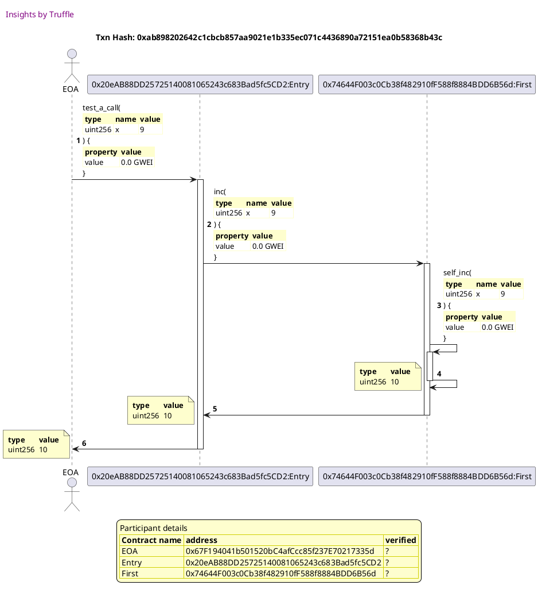
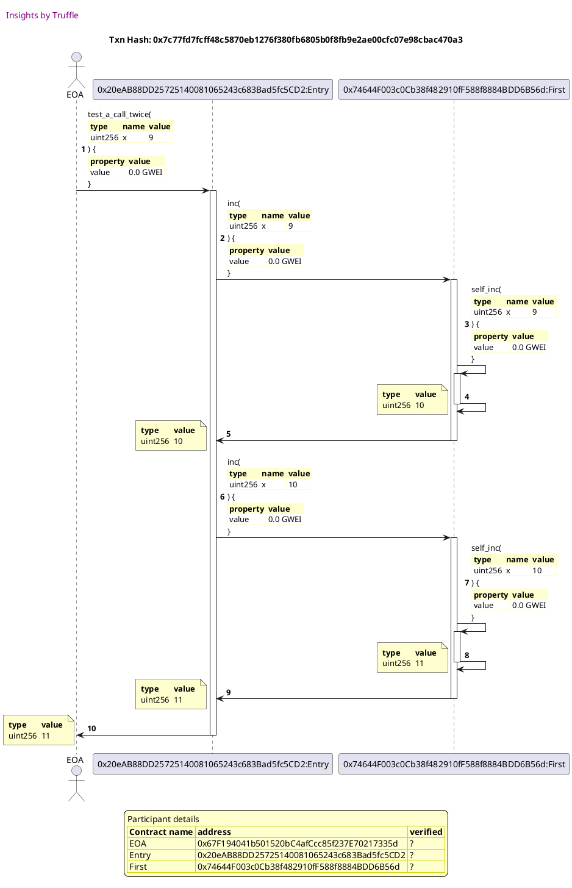
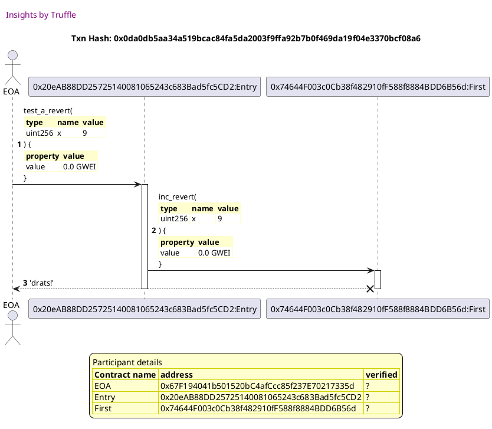
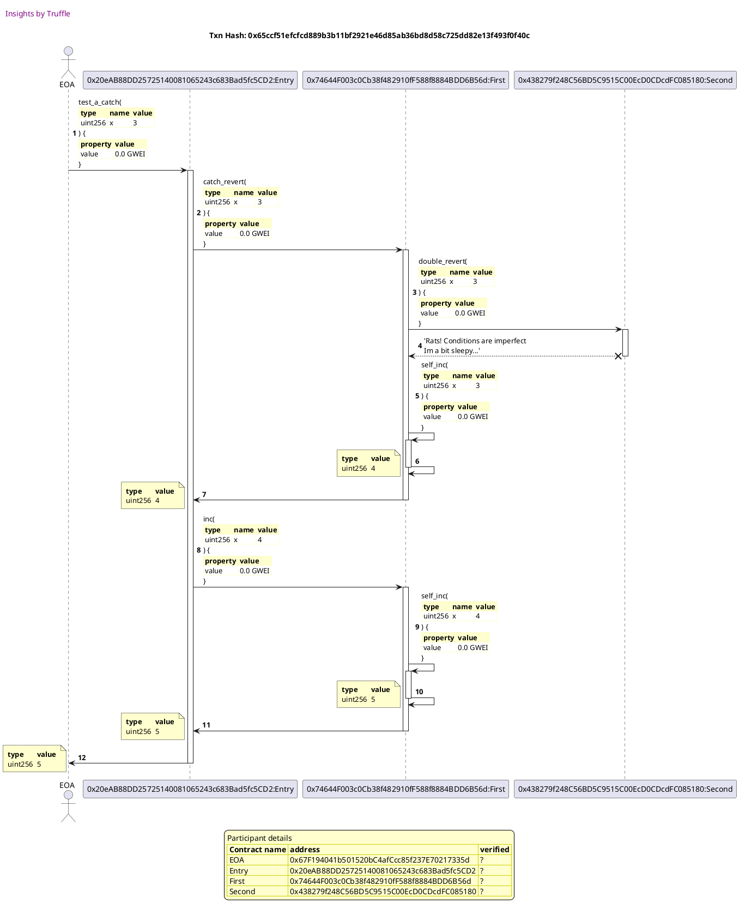

Test date: 2021 Feb 12

## tests a call: x -> 2x + 1
[link to test...](http://github.com/trufflesuite/txlog-seedlings/blob/152a410baf2d76d60511fdf559e3219e7a4ffee9/test/basics.js#L14)

##### d1, tx: 0xab898202642c1cbcb857aa9021e1b335ec071c4436890a72151ea0b58368b43c

[SVG :telescope:](https://www.planttext.com/api/plantuml/svg/rPNBJjmm58RtVeeZkcb5QUqaJZoZAON9fR0gKf6wGKAEummM6ITod6e6XdUlS-a8g5gnGMeZHISvjh_pnvS_29sqbXlRhIk4U6ThtQrpQL1xgtJ33Lz39LTI5qikRbUcxdGHrrLju4sMPccS8hHexRQInmY6wqRoGXgudru1pcgZxcfjUNLQgPLUIsqTiRJx3fbh795DPvfAFcdufkuaa62Vk-15eVGA29vI3qDSV9n4eAd-kMxLwiQsa6_XqdHbwRZ8Abj9kDneEEFjpHpmXkTinZpiXO4dYCX5pcZ4-GnxH9BSzwaKE28Y2FoGpJ2FF4A9v3Ydp2Nom1V8JPcmJdhwzHHu2mSk7Y3aviqgeHhklZNLrco7Dhpni3nTCfOa7eqyIWAC6S4XzHmfPFwI5xGKD4wy-J3e6IXJfhKJA0h28CWmzWMESv-L0VDc19SPPQnaZ0NB90cND2pcmo076eJ1qR5JEA3Xy70ELhRscbyBNbLlh_GLManh-dwAnxjFOBUD11SrNm_n1wywzz1ttq6djFLe23lOk7isfj_1_PzWZQaRQUns3veu4nJm1mnVlgVd8-YXbpsgxOMFdp88Lrhygu8dbSy4jx8gh_yhrKT7Sq2wjd8uhFlJ_ZVj4_w9O89Tmha7zAYdXNujxUiKUhHnngt_AcKG6iqHNJmwg8MqN5Nj8tQ24unnpuwTfnbd6Vk5TdvcPDiEzQHHfPA5gx3OoncSnItP9emoCWjmG7AA2VLm7WUyZ8LWjFJyA8sSPqNEiTne-FoCC3XGptYf__pE6CsdPxpKUYQ6cvnfYX0wSS7zPdu2)

## tests a call twice: x -> 2(2x + 1) + 1
[link to test...](http://github.com/trufflesuite/txlog-seedlings/blob/152a410baf2d76d60511fdf559e3219e7a4ffee9/test/basics.js#L19)

##### d1, tx: 0x7c77fd7fcff48c5870eb1276f380fb6805b0f8fb9e2ae00cfc07e98cbac470a3

[SVG :telescope:](https://www.planttext.com/api/plantuml/svg/rPPTJzim58Rl_IkEsCqcndRoxLOTWxRfu6f8GzeDKkKuTh58dSfnjXRAVv_piGgOcBWOQ4IAJcB7ptdZu_WD8KULPSRMou8GLjjIryjC659TARrYXYsX40kXyp7ZLmjJrZgVb4LfuCqidQMJb91HPJU5E2JG7fU2vSB0JNyBS58QTLrgouhZGYtqKcZhYDBk7fYvpWwvgisg4FSwlgbh0LwuQpjZUQxq0ZpicsxREFhOYo1z_bDTgSMbhI3RmBcffNHSOfKj19olDPomwd88k4vuaiWyaLpAaFA89YWopqzY6L2KMKmnob1IcGs4pmGYbnmJCQ0yOpnCa0N4JHctJdhwzHXO1NikxX7YviqghbRClMkghTcqVRZsKHoFAPrE_IZn8oz4f1x6aHy6FAR1cEMHvD5awW_RGGz0CsKgsuEIC0x36MB0SP85r8dt1nxAMKIff9I6u-aq7aTnFcm7EL0h30uEdS8M3VlxGx2YidCsvwmevlQdukBjXRuWexwox_jukFq4ThCIuA9copR-O4NjBfh7jr0hRVqeXYsitJdecj_1pMEmbIbNmjZD3jHpUYZW1uGltzFJ3dJRYEyqD_Ax5shbAyt_Ly6zoWU2Ar78-QjIVN0m1A9BAzfFTlVD_qrxZxyds4FNuFOGQ53t4_qkxVCaUjQ5qoHxXIldXMJ_gufwBxLql4UNJhTtFaiQGZft9MTtTlfSMAQAwWvxYbD4RDWJPuh6USwkqiuGZQYgDfymIYgHkmoZdPpMcbp9rd4oymOXXbuMeHVvc4r29YUSqqZwGP8cw7j944HkD7n-G6Wjh64yrS3-P7JkrJ2UwbqzmqrEFqM47BdW_bD-0G00)

## reverts an entire transaction
[link to test...](http://github.com/trufflesuite/txlog-seedlings/blob/152a410baf2d76d60511fdf559e3219e7a4ffee9/test/basics.js#L24)

##### d1, tx: 0x0da0db5aa34a519bcac84fa5da2003f9ffa92b7b0f469da19f04e3370bcf08a6

[SVG :telescope:](https://www.planttext.com/api/plantuml/svg/pPJVJzim4CVV_LVSs0ER69kJsFbHiGwQj8Ed8MtINf3G9RQBHUfMZeDQAF_xd3HKm3I9nqMABZdxFlxU-Mn2JXk7rhMBcX1itTAqYr9QqjngiqAB2wZbN1enmUfsRfUj4VcoNbfuFvlEflcKa9F6RMev9j0_DnA5jF0m_0ASBws-Nng7zLcjvsOXZVD4vVOJPdvmXrorTbNB5mC_zRs4WErzboY4DdC8wE1wxEt9bq446TQ_C8sUtxW6oWtyigrIdakSThM4Nsi3vzZSZ82kgK0gIeuOCUH1LbPOfKmX5nXI6gbCASp2CYcfOd4cCCWKPJAA4bfMYgOO4r-ooddfqnzdW0qSU7j0YA-RqvLUeSzrQfpTz6Dq7L9vDadJeWXv4lA0KPe6DEOXYweuZIOekAfuNeIZFkWLQAPjumPGmcB6PbvYHVCoIXLBmooWQiRJLALfoYP54KzuB4Pza0Vrmk1ux1NsQ3Ww6e6JZRl6Qollf7KVhimLEHbszTDWnzklu3Oh2TuQNFJs3klMVtJJjz1guq8UmnRM_irsxe_my2_OoYvNVh7D7ZHm1YZGpnI-_vvUx42FdV2TtaxwBfbUkZRLVwvx4Bi-xelULNy4XyAYQzuT4YAaxnjzXqu-fVN2zRJ_P7VsoEMpFX3IeQwRPp8BMb1AEvcvFpBMO_P9--DYPTFqigNLIai1stteUDithfU_ZfDPa37AWfBJW8Uqp1cglAfIhi8ecIOq398euZuQlhqYz0tUCTxQtdypThtTCTxQsGF35sSe4I6dtlXRx0y0)

## catches a revert
[link to test...](http://github.com/trufflesuite/txlog-seedlings/blob/152a410baf2d76d60511fdf559e3219e7a4ffee9/test/basics.js#L34)

##### d1, tx: 0x65ccf51efcfcd889b3b11bf2921e46d85ab36bd8d58c725dd82e13f493f0f40c

[SVG :telescope:](https://www.planttext.com/api/plantuml/svg/rPPRRzCm5CVV_IaEy01eR3Y9dRhL6An9o_O40YHU9asEBvr5wbIECxKmlZlEPTKsBjh3Der8qKdi-7V-FiTs3aBlQi-TRvObGhpnbMsMXNAe_cRiYZk-X58jb9LJBhujNDLOcLLbvU3PV3QVPJE4zck_ATK1WkuwKrmg1p-6Lu2ZofdlbVMyF2pDmYwLzO6e_VQ3UUZiaQl6hKfrhUEp-QuW8jksZrnAOnSGuQ7fPsVtNmyYqE3_sDPcSUPhA3RmnJLQ1oxonfSAlgmj7F7wR09udL8XD8sK5bf8niP5KaHHeUDn72cIIaPvaQI5P98oCOgfb2nMKQB9ED5O4onG29dmGVhimo7m6fu6-nIX43TlX5dnCDUPzMxJzU5rZDNXbB4yZscWHGHZ5k6KnYGHAKkcN58jQ9R7asxG3T3SkDeFe1592PbZd0YS5GdJXCNZ2EivPKmpniWqpzCfJUMa6tG3z5c9oig1H18MZyOw9YoZwJIdsPX6DCDu9dASvKBECynenF2a7nLGtHnXzo1CjbC9EpiJyAhsf_nKS2_ENfpO4xG_h8zNWpsuU0D-ir8GhENBpfxpiWaFxUSNq1ZhOvh21Qp3dVJDB-77ts0hLwsKyvijQE0CKC1x6Dv_dHtte9-jxbvkgxmFIwUyatpgr7c0FLRbWznM-P26Jhgicg9KZrpxfU3rxfN0J-3v9-xh9v25FkDDPMlWJe5P1hfMmf_OuoLmA8o7kbHgjTdRstkEa5HXkvbpxjKs4jUYSoMljIhrgR7YFyZfvUFk192jmjpQyt5xmFvB-u2_9fY4zt1UGqkwxkTo0zoBdp_lhZjA07cG1DpriY7_qxAX3xHiw5-NJVzVkGyl2FKr3FfuvJSebUUchA-WSvnZZ5jqE9Qy2qVDDikXx72ghZjtoXbjb0mUzhTgkWBWegqeHlDeJ3292eeZ6kCY8rndGZ2gusGq6-4u6YK93QFXxGr2LoYqZDkM2Ryp-XgXPTosGlYTCPG7BUIsnS402H4UuepGks12IVaB)

