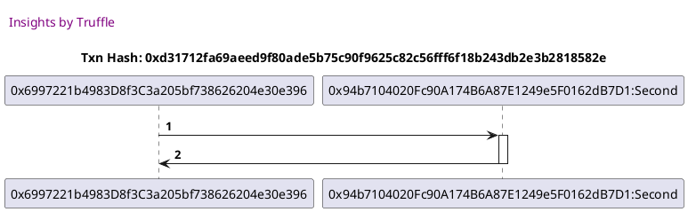
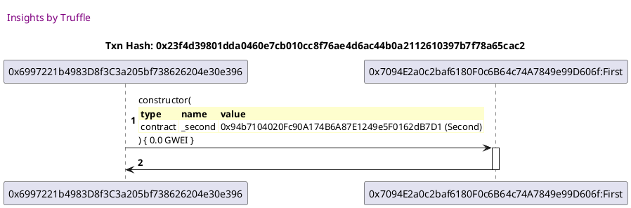
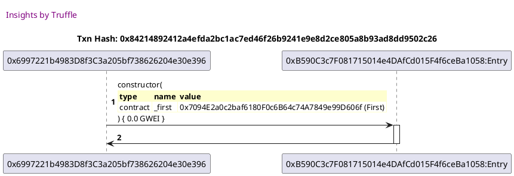

Test date: 2021 Feb 15

## creates subjects for the test
[link to test...](http://github.com/trufflesuite/txlog-seedlings/blob/3bcab5a6f1789676792542f75bc3a5a304fb8b1a/test/basics.js#L14)

##### d1, tx: 0xd31712fa69aeed9f80ade5b75c90f9625c82c56fff6f18b243db2e3b2818582e

[SVG :telescope:](https://www.planttext.com/api/plantuml/svg/dLBRQiCm37ttLuZkiPJvaZXs6MEzXUvjiFw07SjfMEeKnu5kO_y-ivN17ZUz2EaSdIEG27aOaubfElM4c2aDOJfPZ6HywSBPH7E27biCRcsQbpOEKt2ReHyYtDIxUhVP4N8tfjSUxmbynH6DmmZlrn9WFyJkRGZ9zAk-QyC9GygAFlqGwWn-IvwdUExn5_3SlI6mugVtP9phGWkCNbiVN_dkzhe4kVe_Xh5hZsa4-mg7E7cVTKdgKezmk0JOc_6u17fnWbMCUoErGNJQAvgdIrkLZQPUIrusYZUbzDvBpvJbXN2Mex1SCLKgdZN9Z5warXNdp1PQYQtoOYCCfwNrbL2IIquB51I5bZDOt4Fcwy9MZ1QKqphxh5XLhELALJl62urbJPdaRbrjsV8Pco6u6SpdIo3_6Vps-yD-Ysn47lAvypjy0W00)

##### d2, tx: 0x23f4d39801dda0460e7cb010cc8f76ae4d6ac44b0a2112610397b7f78a65cac2

[SVG :telescope:](https://www.planttext.com/api/plantuml/svg/dLBBRjim4BppAnRk9K6QTadHf6YuHloGcjmA940l0GgAecmXCcLGL64dph-NiOK0EQQyp3vcXylb4dBJ1Ur3lsq8qNreNRyjh2VTK-rsskijD7PjNRdGvcdjszwLoxPfFNp9ipnRPeHCkt1ex8p0wMoiBgs7by45k6rz_Towe9jvKw_TrheG5QlmJiXZyYovw_skiHyIz_Mp1ShVOxzqMTPk3HI7qEi9fz-79iXm_vthwlKcT50SuC7tLHLrIQX3O-5Xx-1MTvi9u9ub5IyJbI8jIurSe9McG8h6f9KKsl9IQCDvWPfHoWJ5HCb2LZBLOcoqOOIG4Uw5Kf8nMd2L9gkqIfQ9PZWkAfcaWWc6t2Pe4oL6S3s3o9UeUCOq6bReIj0KSpHY8RYHV2vJhgnIAu6YckIrxy88hgucO5hN1T-RqFgBH_T8fiFylmuuE_w0SDXPYEZqzeH_TTD7uur-V1C8Nfi0H_ZJsUYLqSAzueMao95XRXJEgUGBCKzbHbdiOvmZ5QnSo1M5Y_jJqULPxn9U0ByX_FoTtSK_-8z7dKVnYT5TJu2GcxY9SLF_0G00)

##### d3, tx: 0x84214892412a4efda2bc1ac7ed46f26b9241e9e8d2ce805a8b93ad8dd9502c26

[SVG :telescope:](https://www.planttext.com/api/plantuml/svg/dLBBRjim4BppAnRk9K6QbgGeYZHS8tv8JMu16g2N00N5Xor4fWoAAkp4_VTAjX0WnvQNMUxE3idX8dJNHXLYjwiHKbriVBShRK3jI-NtAgWTr7PZlLag_R89JUVDggcR09-AlCXNEKApDXvhEqTmNbkhZ0tmDcu1xfjGlJO-gdfHLnk_ipxsYYw-4ug-U97STs5Vsm-57zMh1SBUSu_AcCflWE0nzUUCiw_Z9T1u_eDlgyqsjb0UuIbqplMwA5Qnjl1qy72lskqKy44mIfYGb16gc7L6qL8JfJDh67UKbqF5IYiCrLRWL8bI9ie8OsIAgQOS8JJ11ovbHYafcHJ9MhXabIYAqz9bYU2KKyniWcqY-GHkvz3pbwd4gqHd1HOa8oacpBBrmgqC9cd17DTsgGXEnJJtCHmdS7Cp1TtuDePEnoPSFVjdD1lz_ppY_FGDud5leKUlTcVyhUgk3mRwQH28GUa89_Zbgj0E0JvaMBASAgnfgHmd0XTOyoLdEcEBJ31ffLnpp1rS5KFFzKNj6ju0Vy7m_MV-qF_0VppfOiG_67Sx1OJk-Zdiv_Gl)

