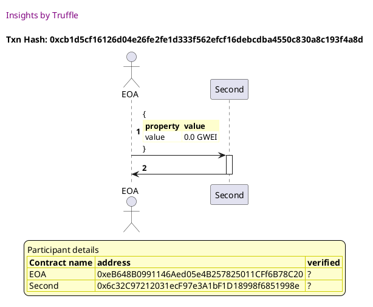
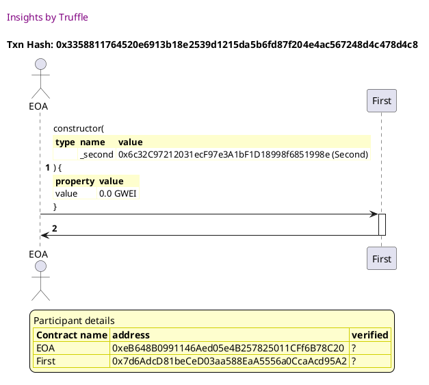
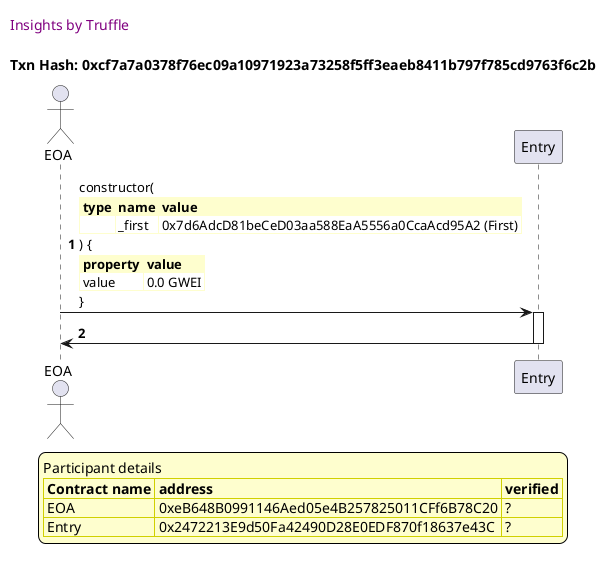

Test date: 2021 Feb 12

## creates the test subjects
[link to test...](http://github.com/trufflesuite/txlog-seedlings/blob/0e1d57622e2550f3c79e053fbe2365c8768e8cda/test/basics.js#L14)

##### d1, tx: 0xcb1d5cf16126d04e26fe2fe1d333f562efcf16debcdba4550c830a8c193f4a8d

[SVG :telescope:](https://www.planttext.com/api/plantuml/svg/LL9DRzim3BthLn3TiUic-Ijsa6LDd7ZjQGLQO9TUP8bAX3go8Sj3qhh_VRBZ1Qqkf4dwlSSd4NBREcvTTwW8uPshJNSeqPBsHPk6Mtw02dTev9gBbvsjEoFpkgejV2csnJRV4h9etQd29O7nx95BjF0sVGBSrLQ_riRnQbNfdJcWSHvHkSj0uPjdoAQpJOMV6e_w5O55bze3brAR7J0wbTx7kFW-YI0J_xrfzMxlMYXFy6GxfJmkSTfL24z70tUytS-17aN9P2mKIrYGI1fXa2WC538PXg6Aam3Lq9HO2bdoA8wfI4FAKy6oK4KybSHR9foNllsz0jx2bOzNX7ZVd1QwuNxNHnIraMFpdFh-E0Otoqi9hg_dyFPidibYylNh59Vz3sXitQ1r9_3vNrvrs0-J_Jc77kWt2h_-REzXhBzx_F-m0yMPwsOENYmvtoLv-21GekEwQZymR-Y6KZemv_uAhDyG33_WGE_jjzYsenAqMccKq5z-NVQZ4LxH4TT9bAvfbZ4M9IkKDCPe7SIpD8WfOtcXalKipGFgXtz-HfWC6q0I4GPvDWjOG4E6eiXc6AvOMR0DIxCiLKaQCnzn0l6RJViHSkk3VzB_0000)

##### d2, tx: 0x3358811764520e6913b18e2539d1215da5b6fd87f204e4ac567248d4c478d4c8

[SVG :telescope:](https://www.planttext.com/api/plantuml/svg/TLDDJzmm4BtxLupe1KHfxIJE1w9RijbDuLGaa7f1ghpnPB78Ef7jLBkm_FSwsNG5X-QGvtZ6R-OzJmYvjauOrsyQGaJlMjrlLcY8VLQw4qPieC4rQZaNrVFQjBsMHTkq1ZwLot9PB0cvicxNu8p0-3oXa6ZWTVe4k6cDUccr4qtUgBNUe7QUiNR7XD873vHTRxe6FmJkrGi2YuvxTq9AfTV0wBJrDkBLrwa9CjM_rLQjdvo5rGuUJ5_NdfSuvHg4Xws66s6VBe5kmv2dAMD97F60OfonSCLI37YOIHOmBWLVnRLCapgW4KQYud4IHAcCgYWPtYdnbbNEjxxycOEmSEBnX13lcrELweJNMYfZtHWRLpuw9i75xDyEd9zVGjLgwqm_a9q-waToDVdxUSBP_XkuNOVWKOlDY7z4q_l5aBu7sCDlYvv6-XNTnbKO55aIi8263AioIp3CsQfa2vPcMLh7AMSU4KxlnqDd1vupUFrVzSwq7HgtErQU2azT0Fr2uSUlvUs1wCthdEGDIW-IBox1EqOE0qNkthaaqGdLs7U55tH1AHqA5tuEZBVvgDlFW45hnqRGg5gXrtmyEjkFjp6OWFCuIkSqonYBuXmbvHZD0vwa0QUC5MKTpvEq2AXF_lwHuN1h0qSYurnMYvIjiC053ONm8xCKEUSy5hIeH5x9ZEV1nE65JV88kVRWVwk_)

##### d3, tx: 0xcf7a7a0378f76ec09a10971923a73258f5ff3eaeb8411b797f785cd9763f6c2b

[SVG :telescope:](https://www.planttext.com/api/plantuml/svg/TLDDRzim3BthLn3RfKNNJVANvABBwZZssjCAhC0k1GR5fbAXZcp8yj2qwN-Vx7X1Ds2-a2QfHxudYf2htadhXcr3Y1nSQuRj6Ytf7xNff9LRQ723fbxAwd5Zsy7KUTkq5jwNHLda1I6NlTirk20mVGyeQxJmCly2NBTMFxV6oIPhzCPiqJYFgDoneFJ90sGtsAx1lnBVzJC2YuwnMrdNsco0qJdqEjdBJ_CGPEv_OtgzUN0zh7TmPmUbF2vnsZK8Tqy6hcN_S07qgL9SSab3BXHFiAAfP3JbB0r2oSCW5YfMAaI9Qn4njkOfLrp4LPto95H95Qo9bwnoVlJYMmQoXtVUlYF4w-PqfJlfkHR6sTqXDte-EnN1-U9F1CxEBg1gJU_iC8ATt9jxSZdh-s6sY_rdSBiEmLiZjvFz9Pl1EsFv7c0FFvMslVCEVU9rajNLIh0rvhYYePIn48NCuZXE9CqhcNaMSHR0IJcUEJsWdCBB_tftjktGkjsnxznsdW7eHmfVVnGt1w3NaUM1tCHp8dn-0LulSbWdSlj6engTr4t_fl6AhYYbO-FSRu7r8XzP-msmsFVJ86YrqbZ3_dXqiP_kOjG0bqaabZHD6OkI36iQOxGCOYw2c3AMbofPSf47r1T_-GTXkhCH8uXu4B2mIEkObZ8AefIk0b7GObKAJXKJISWn2lCPmnERwH5ovOr_LBy1)

