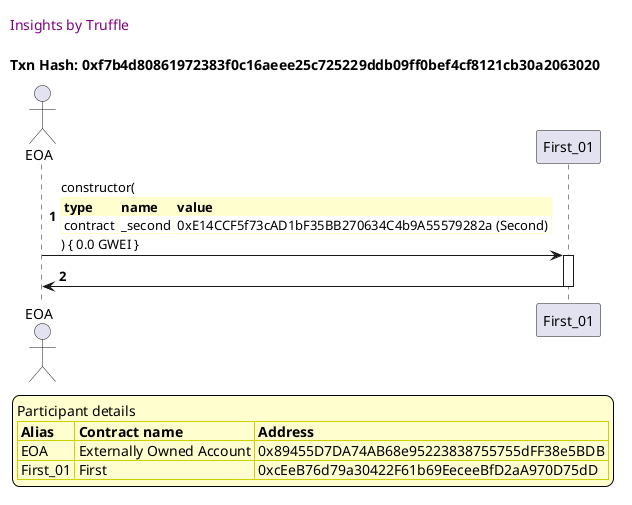
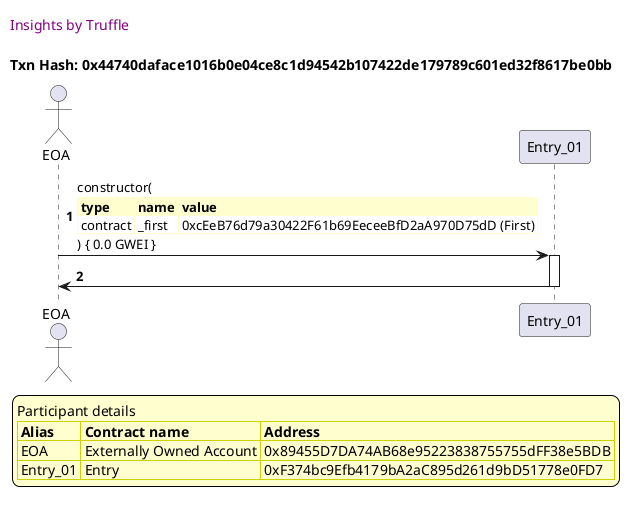
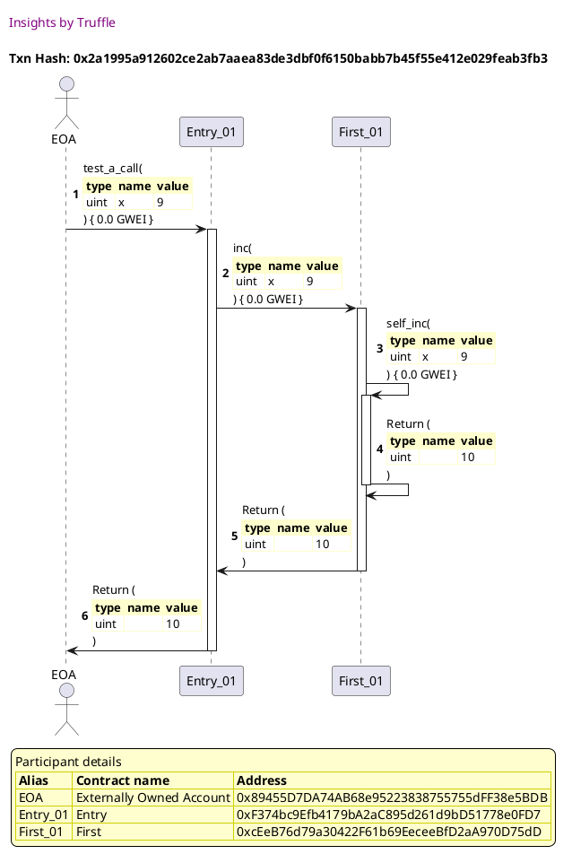
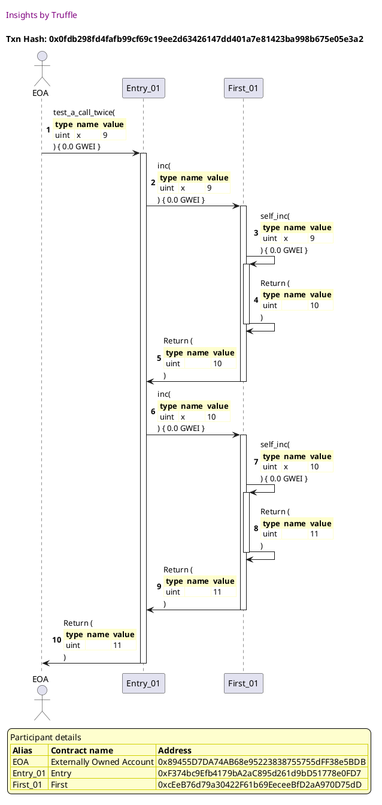
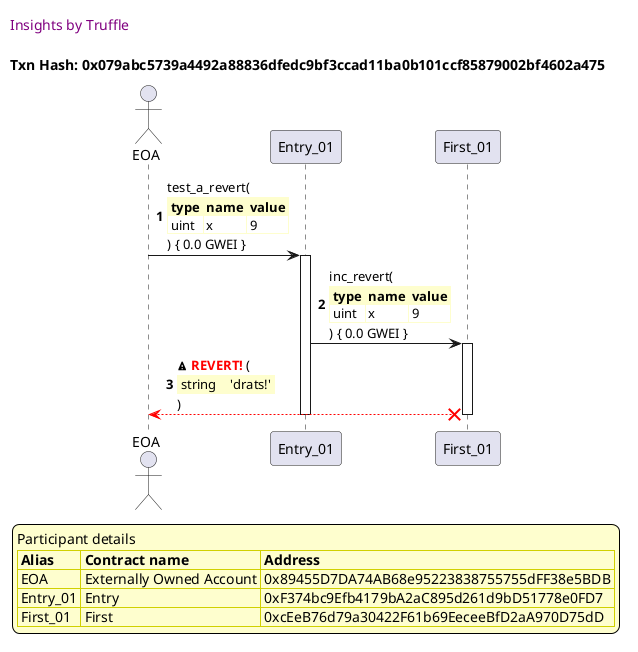
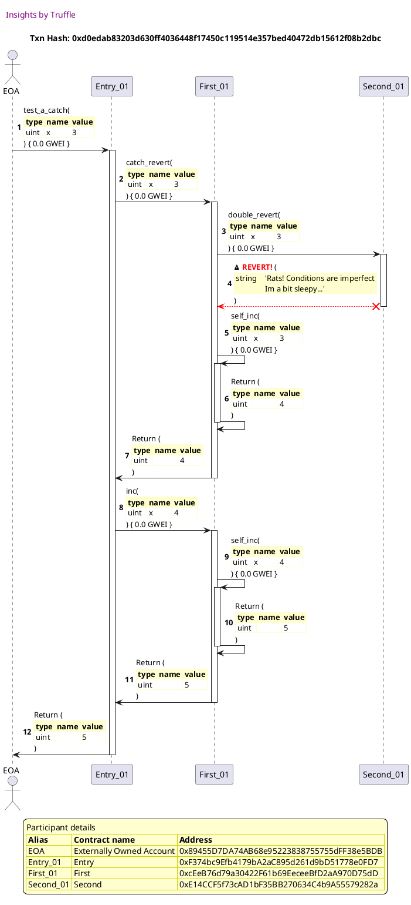
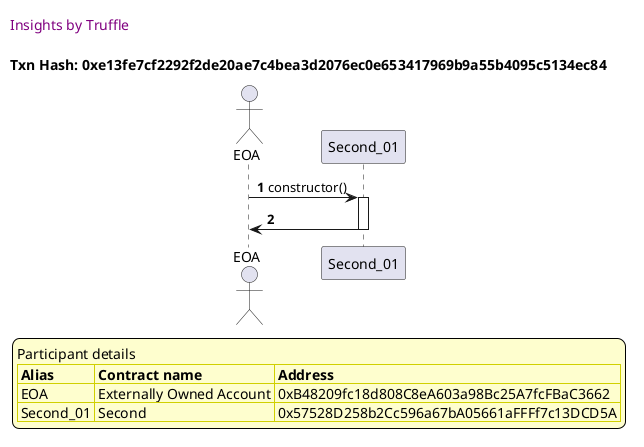

Test date: 2021 Feb 22

## creates subjects for the test
[link to test...](http://github.com/trufflesuite/txlog-seedlings/blob/1d44e677781e9cf21f80c1c42ebf5a82a0cd8a22/test/basics.js#L14)

##### d1, tx: 0xc1dd0ee90ad4bbae49cc400646d92d816d1ddb0bb72a06d69a8e36553be2723c

[SVG :telescope:](https://www.planttext.com/api/plantuml/svg/LLBRRjim37tNLn3fouQkc7otWooeBp6wfnPetmTPOXAZYXp8CfPqxR-FSRmi5GH9vA6Eo2CoTjyxOTsmquo9mNLcs3LeMV_QchsmOWSQDsXK8UJhndQ3KMMdEmitzQfUbIl65hqxQbmo6CSMXK8BVoOJuA6pxLjddD2vRZTcXyOHuzfT0ce2pvJxmUurVWAUspS4BxpudeHIhTc0noVNnxWllaz9iEdzdwPlDrlNGtE45pkiryJBNEiqmil1m8FejtFW1-afnH4pBbJOD0B3JCgGypYCLUQhr8iL1JIyQH9Vy5Z5cKWnYACeQD1F_40oaamwIdtrc8FeOKRxZ95ihfNjNb2fpoWxetvnRuGlreonCHRkbjTUkBsT0ncziyE9zyjNTesUWi-txkR0sFbZsDFLSmgTQ7NF5jFtVBkfUCKvNxx_0DAVSg13IS9QoXkCsE79aIjbiIViSc_vFfP4wy6XDKBh8pp-DgWWbvAQm1743saMHb6LL7aIvaMSOXRvVf06QH95D5LT1ob6HLLy9luloR_pIBRomhAietKIoBpocZg8Yi9FU1o4PTXaUKIScP_wWiYewgbsTayhjUvV)

##### d2, tx: 0xf7b4d80861972383f0c16aeee25c725229ddb09ff0bef4cf8121cb30a2063020

[SVG :telescope:](https://www.planttext.com/api/plantuml/svg/LLFVJwGm47xlNp7nNZIUTwLG2iRR20keJvfeSYycfj2o4jcoAULkL_V-zvjbSRFoqFdPZ_bcfeHSzqvQDonRGkJWEZCiIsr9_zQObRHo2QrUQADIMRqjR3SODU_QpiAt8Y_oUKx8LUyshPuH6BzNBPMsy36P0BUTRTuxusIRjCt2BBLnY5YxGqA1mJtaQh2hLdy9F3Rl6hpWu7kGIZLc0HwTNFz6UVLpAe9C_xypVRDuTJsK6tYoGrqZBd6DQpKyhGtSolxr4kYw5cMW8Xg5NYoO7_arhRnGQgqPhmJZZCLAbJIkQrhgEgZgo6DULVfKCXhwb562BQiSbfxV9o1xE45vGh1jhgcQbKIgHMDxzqAzCVffd10oPiB5xCW9v-UNK7McTtROWPu-csToDVNv-oHdsr_WDYiDA8rSZlAFR0TKTkdR7O2pM1HiuQNNQ2dKw3htWlcyuBNmgoJpoiBdQSe4iWZcGHadd7CHiuX9E7qSBvtjySxW0-WF2ZU_yplizL6nkzBt72ukWP3zaf278-fAEzcq_H65Z6QKqXq5t0Li22hppt8_oIHAMTrZx71ljXtRY-VQQMjassxW_g_H2fAgmeLq8y4e3ZZFH9Q884d3ICSuFPne990Pvwee_4ZpD4k_0X_6CwaZL9NhL8HAnDAd0MD5w9LXdEjAwxJEc4nYGJF1LOPGo7bYJgxnn4Vq7m00)

##### d3, tx: 0x44740daface1016b0e04ce8c1d94542b107422de179789c601ed32f8617be0bb

[SVG :telescope:](https://www.planttext.com/api/plantuml/svg/NLDHRvim47xthpXrBwswReO0XYYBIWAiVMgbLTfBfShOHufAJ6JCbhJPVz-5q2eRGhwpx_pnVNS7OzUTazRrwuOnsRlMzEiIBUjUQhEHLgwXmHKQlP3gPMNRtkXbsxGMFXLvaIzpncQTspKuPp0ypoWrMdWRjm0thQrVM-DaapRrogpHE4Ait4T2GS4ZvAQtcmR_2VoeNn6yuEFiNcfTcnLuV3pwCzZPrv446xz_QxfwzUmwA7VmOFkg8bpcQjSWF6mDtCZkUGfy6mGYu5fMKg77lQZao0E5iV9q4eI1NtfS1BwlqHE9Y1CLSG_rnA_Yo1Cbyh9aL3BbY7f-buBiu8pi6QEokLhL6qbIS-Fixebxn-YuEMDio8Ih-SaXN5vEGRMcSxO_W9u_caSs6-lyURJp_JTmkmq2MIFNW_qbcvwSG_h-0E0iaO8zF5MrxGuEtweS5oBI8f4JJegAo2kZ94U5kAWoNwQ9u9a8TGRdnU7EnH7j0jw0V-7m_MT-IvK-eJeG7nHSJO6nuuYm-nFX6fsic-v4GCOpplb104q2bOESvJlPTocfrXOxYdtSc--7ujAwTMYDR9eTtFqsg25LYiRng2-cVeMPo58Hf8ienYJq_KayYKKOqgkBOX9ZkCWM_m6_DsTq1wXY8e9I9NbL1jJsClNbCav2xKSq56KMUaB4o8jC41Hf7fMpQrhf5_eB)

## tests a call: x -> x + 1
[link to test...](http://github.com/trufflesuite/txlog-seedlings/blob/1d44e677781e9cf21f80c1c42ebf5a82a0cd8a22/test/basics.js#L20)

##### d1, tx: 0x2a1995a912602ce2ab7aaea83de3dbf0f6150babb7b45f55e412e029feab3fb3

[SVG :telescope:](https://www.planttext.com/api/plantuml/svg/nPJVJzim4CVV_LUSsCicnkRyJX2hI9jay0JQaFQ2XEpuKY9IjtASqKBtl--QXgvbZnDQbFZyu_pzE6UV6JjlhJ2scpMCYSxETJUJQ5ZxKEk5C6863KvHgx4e7wPctcarcJTp0--AlCWdEMDdhLqrE6BGF_Se51fu7fe05tDJFysr5KtQr5CzGsr9iR8xXu86jvABpYmQF1ZuNZyXEFwkxreeLUifE7pe-jNRiy_38jZ0lzHjFRstBSWLt9YkgaYNsTes23TB3HUYlJy5ldI5aoI1I1mtv6w9hf2H42XYJw6dPCMhq0cu5596qW-g843VSP6xIOL2UfNq68MijBJq_2e5qS8HsID6ORDrMIy4_MgkhLdTSMSxEZGENOhQjFR5vQLnn5Wl1YUZlNbmV7mA5ib3t9MYQTxVwbjsDcp5ny6Erb_0hXO8PBMOzVQdQ3ggRDpNqDL4NSEIlcJRzm6UWN_YyFL7VaaXtGDkyBirzVXQbs-5_GFw6zjYKztz1_R9oIbyGziP3V-4fjVX0_erRI_SRq8xtCxjiNeB4DjU5UnwxtGhjA9ksZr0nZFE-GP0DmATUQfCADKDPT8EbIfbiAMntRpHkayoAfSMZQR3luAhHuqAqhAaQscp6BwC4py8iYXB8pyTXp4cWUjwiHT7GK2lAWelnc2SZLy9loJfKEsb2Y_oPPdabVITA96fAoPn4YWtT5GYiy29eXXvaKM7Khja7ggzL9dZE0fLb0YF-wvRX8uCannBn76LkI9D8fv5WSf8Yi8t196TKqctycy0)

## tests a call twice: x -> x + 2
[link to test...](http://github.com/trufflesuite/txlog-seedlings/blob/1d44e677781e9cf21f80c1c42ebf5a82a0cd8a22/test/basics.js#L25)

##### d1, tx: 0x0fdb298fd4fafb99cf69c19ee2d63426147dd401a7e81423ba998b675e05e3a2

[SVG :telescope:](https://www.planttext.com/api/plantuml/svg/nLNVJzim47xtNs6nbqsCpVdf6B6Aj4c09z26j1Uaoeal9I9rAySPBNJ_-wvfw0hJ7gQj8qfyP_lyVPSxwJCXfusLnhRJcX3PsfbkfpaOqjnLUYwDdD8Q9g3LK1Pt4pDhjHhDwfcXRx8qIqSf8IUDNTOm8BHxRa4gCFIndr9wFZFLmqnRMSTrDT5Jq1OHIxiDo71p0pblpRo6PnjVgWUWZhzTkv9ALNf27TOlVU_ioSS-2TBpN-YccjpQXkPBUctQiaHSOYjR0xrUQ7ekczjZoXQiLBahebBvfInp8Oeo58KZ05mLUhuREZvNocUEv10vlklbKeWe3ta0B01FkWHBLbXCFRsCgMpe0Te3WcMpLL7D9VvgggrPZfcpsUqdpqEooZJsAUHfSa181qQF1ZldwE7XCRM04N9SoBeUs_kgWBSt-eQSz0rvtzl1wXEropbGj5fEE_jDrYqww_0LRIlaNj45VcApzeu-KlQ1qRElwGKMTeTsdSGsiow9IXVxelr9z2jj0tKvVWNkewDZ-XbiQpJzAsfy7TPJlsJRAVTUsFRTpYtLQ_JpJyd_POcT_zfGvpSDtQZ5FeZ8vWOWLpkYfS3Agcvs21AMCCRM12ZqA6NeZ5313GhabYfMoa23UzjpWrMddJWkB1YDchQab_SQ58sB0c-RTJ9i4Ga_21AUnDoFXs448d1TB_8Y7WJugYpp8WY6oV05y9Fszcu7bNdSpmkHbhdlS977hXn58b2ezKhaIU1m7W7B4luSQglHlTj15IaCUQYua1xpNJSBdJmKAHG0mp9nPImuItYW4eJ2ylL59ASuucNx0m00)

## reverts an entire transaction
[link to test...](http://github.com/trufflesuite/txlog-seedlings/blob/1d44e677781e9cf21f80c1c42ebf5a82a0cd8a22/test/basics.js#L30)

##### d1, tx: 0x079abc5739a4492a88836dfedc9bf3ccad11ba0b101ccf85879002bf4602a475

[SVG :telescope:](https://www.planttext.com/api/plantuml/svg/jLJVJzim47xtNt60DBOoDkTNdQ2k8csImHE8eUrXJCYndHAHkfNZG0lT_xvh6agPjCT5Zi--Etzt-UuSGavhourjfXKXlB4ptKnpPKXzN-evDtmAbPeeBKTSt4_ChD5oFAjc1WwoD4l7AI63sYuhDIJGFdUAIsNWkTi2dCrC-JJJbbTnLKxqL6cBY8NTEcHet43E6pElr1l3j_99WUDlTPTSob9FmA6TwdSh1v-x94WN_rpNvUJErf0luTeqHO6un9QsKd2zq736wxiJe0lA8fwBW7aHz_t8vM4OUdrPA2cYlF24uD9nSavpXpf2564GieXIDo_yFdMvpmA2b0cBgQSNCV0Qzb7k4wJDbgASS_pKL5kplANEnjfjthfafQdjYylBPf-G5WoEXplduEZe1An23tvhr8CozlsDlY63hXWVEpbSVG6xd2j0gVcqbG-yQd2nTbz1KsBS5IpmZJQw3_0Cz1E5hp_ISoHr9-GwWMrMRGAb5lyv-ckynV7F0wFahvQ6be_Z4nYyU-H6OnyCOI0stOW-mrxlAlsUNbtlzNg3pwr-2F_846fhrdsq0Xo7qd1RxnrskH2fiAZb0xTgjnwxsjT2aitj89Sx1PNAyhAgTy8cDA6Khed1Iu1bniKOkziWufQYM4gZQhHjps6Qwxx2UM6LqRogbd3ng9M4M0YyYMiIwIAC_218M18pFnxrGnK5hkk5NiY208VCCYzKmIWP_GNyqfVTieNAFERd8agBt7TObCSk7uTH8Ds-8wCy2Hp6GaMpXBs5slPljsoXHAf6h2_nVddKTzsix-JzA5L2gL6Hk3oE64rO81E4Glew4iafplWZ-WC0)

## catches a revert: x -> x + 2
[link to test...](http://github.com/trufflesuite/txlog-seedlings/blob/1d44e677781e9cf21f80c1c42ebf5a82a0cd8a22/test/basics.js#L40)

##### d1, tx: 0xd0edab83203d630ff4036448f17450c119514e357bed40472db15612f08b2dbc

[SVG :telescope:](https://www.planttext.com/api/plantuml/svg/nLPHRzis47xdhxYcmDgcIqf9f2K5db7PajOyjKY3zM4T0aeyEK9bog2er6wp_rvQbXqhM0iKRJg35e_awVkETqUU27dP6A5DkwW84QsfLRl8K9FcGwcMGei5L3X79QSY_p3NTQlahAvg3O_J94rc2I7Zngmhd13eVjSe96hut0y1NjMw_5Gh8wgeAkTgWSfOnCBi5LAxk8LSjdfPuM3XRVa9mM7xkJT2obBDmQ7zrBzTFtxH6q5w_dFLbFDhqq2sXalT5eN59QOq5SBbIi4hqLoV0Lr9Yb9aWUTIJuuyMXICUYF6WiBn6QUvuuJSOUXnFqF9AFDTcJbyvBW53J8hvyIwB3VMzEHr1AA18ziV4UisK-RbKjYj9ihezHLrjglzOAYIbhenEvNTOAZo5lDQoPtEVdH4ICS89vC3S7Z-_0mCMXXnbGkJNpzzhzwJSH-mt_j-Sli7cFKImVPABBh-HbIj5JRgjz2MblWMLlRlRUUUmMUWfnJ-V9USMySVC6xuzvPt_1tnbSORrEQX-EyOD_ntNkaCa7MRLVZ05Xnmhax-VgnH_ZDqnSd96On_-oYqibaxWN6-FJjMSN9yV97ybLnSFZe-7h_evYVm5JkXCNgJzRTWsvCBOPf7CBF4fIbhrO3G2ELYYRh0t6mD_G-CxTld2n2GbGQQ2d6vFZqzVT9lZKYqkLpU28E35Bldvc6O6woAgrBbloR4GxzUe6crWX-Yjetjzd-Fx22x7uBiMuVdPpYKVPz3VsemsVyMJFuhWyc_4ipjbVm0F6HRYicRWz8WqOYoQWxmOnfJIZVujkBQUc45UraORK_tdYcIKcDZr_RlsHjYKyJiSsLGAr5LQtZzKQ64ACzjsT_OGbT1o3YF_JZoMJGT1HXor_K2B_0vjqscgHSWdyRJUy2x8jYB7LJg-IpBmwJ8cEE7MUIAMH1owOuS6MOnTtm_G9h6_X1gNonxiOFA4vpw8-c7mgFCTTEHaut217F4QH6x8Wfz6ljSnaEekwAwapkmn66pMSeBtykZsCbIZq-dhaz77fknB8outMde1gwmO3OMVKJ8I_kqdr1V0000)

## deploys with ETH
[link to test...](http://github.com/trufflesuite/txlog-seedlings/blob/1d44e677781e9cf21f80c1c42ebf5a82a0cd8a22/test/basics.js#L45)

##### d1, tx: 0xe13fe7cf2292f2de20ae7c4bea3d2076ec0e653417969b9a55b4095c5134ec84

[SVG :telescope:](https://www.planttext.com/api/plantuml/svg/LLBBRjim4BppAnREfKKQbA94FGpNY2nRI4y9aDmBYbpPGcJAe2ZKJfD_xzfMNOS7ahkp7CuEoTXzxvNpmxPbJ0s-iyEsGiVwryRkb5DRQ76DrYoKVbsxRh2cwDhEmKsvAbV5Yh5PxmyjpXcSnWQLGGT_nX3WeNFDMsUzQlEsMTijMa-CjRyKb0IUANU3sxNu2NXktX22w99xKiOqTWq17rCVftNsVHJ1nlj_shvPRtmFrG5Ut53NnCjyurk4bxs51zLlfi3t68Gr9heM8XErC2YueZ2gK8L6y2H6pJ6MOHGaMPnLcPAoYdWcjGp227KQCR9CUvA-Uin1zJ2XTSB8Dj_ePgUerMVKdJM_U722Bz64iLCjtCslit1xEmKAUk-68--Nh-mQFHQVJzrDWR7pmx2dg-iCUjMqFPkDp_FjPicNdFFv-myW_qa3RGeorf5ki6gBnqHkZCEUiCkv-Vkf9Pht7frLRNk0nzyM3UHQqoVm1F7z8ae5pseTf2RbQP5Y7lDGPUb22vadjIuNgWZZM7mc_c_9l_s9J2PIf4iXqqeKMcQnYfCgvpAE0rMMPPte85mMIqcY67KzzixkQQQl-nS0)

