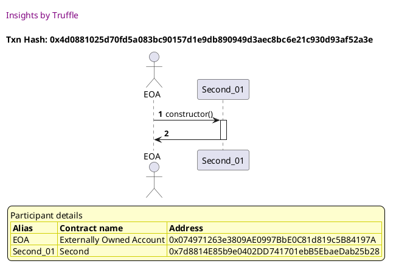
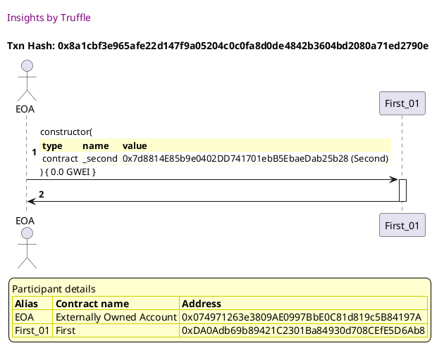
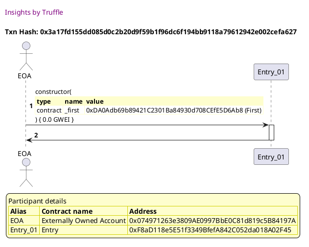
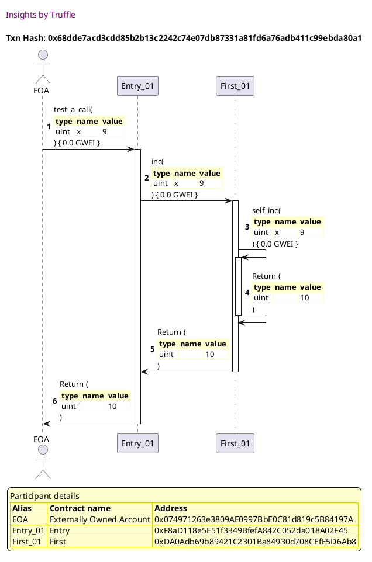
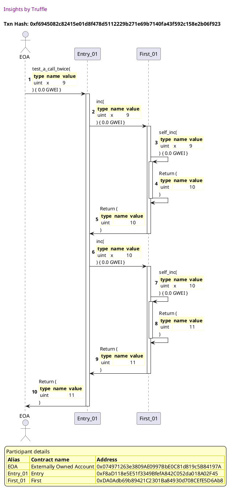
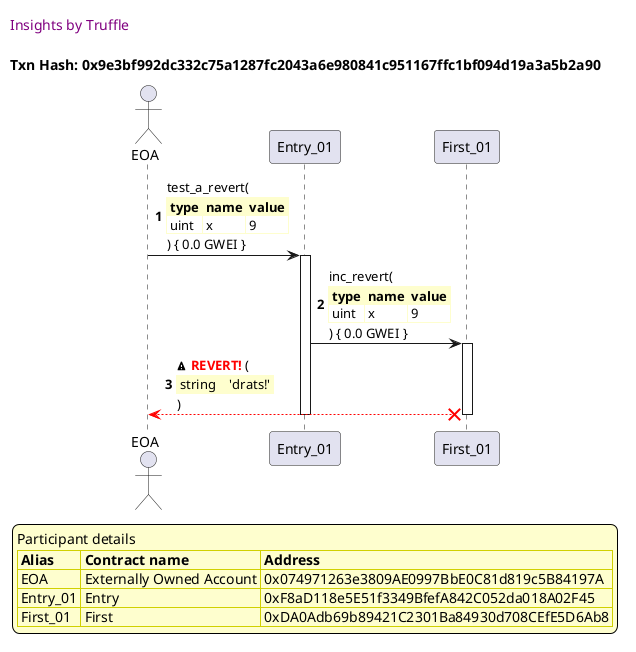
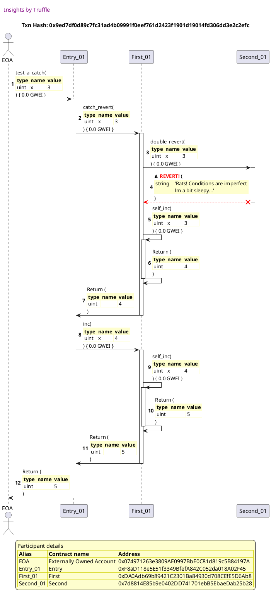
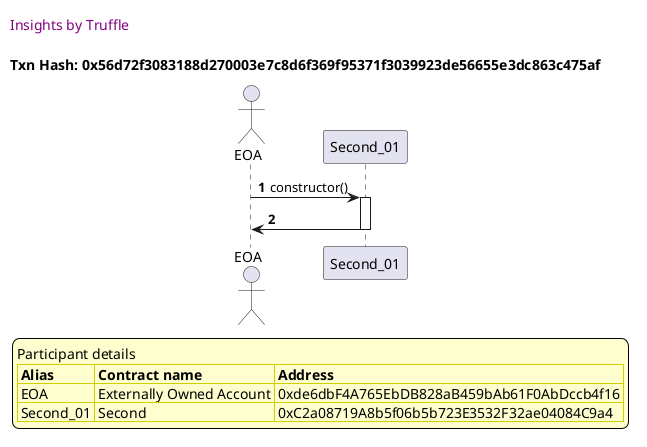

Test date: 2021 Feb 21

## creates subjects for the test
[link to test...](http://github.com/trufflesuite/txlog-seedlings/blob/4af7c9e1104b5a1147ba37abd1c5713b86598a3a/test/basics.js#L14)

##### d1, tx: 0x4d0881025d70fd5a083bc90157d1e9db890949d3aec8bc6e21c930d93af52a3e

[SVG :telescope:](https://www.planttext.com/api/plantuml/svg/LL9BR-8m4BxxLupePLVTgdOUZOqeQe2WxgcLsllAZWU86XpaE5hejlzzXv1bgGzZptpZRvwCFRH1-z1jQyPq5nhNRGrwrhvLRgUztaADQtHsfiktjMywP-TDtNYuMXRBObumDcd3eSOfW_viK5lqy6TG0HuRNxqtBkWwhwkrsw8BnBWAPuSbWIVANUTtDNu1Ngft196SRS_QsigjGV31zDdVaziX2JR4_-dQQhq9BPW3lFfkjI9U5gfG8xpk7JpgTZC6layibrBmABKPNzbKSncRKd6HPbQWiaOghX9bOusbDEKTHg9KCRSgrgiqqZ5nCbq6Ihruoa6tCA9xnAXjeIghdQPINx1idFt5HG-VjH5ZlI_SJ2-jS7qz1bBQuBiZxxVlx18zEfz-tOo1iTDWsFD5E8j1LtNB9iDuVbmj-89pFlsu1-e_vK2FEJNMKzxWz1QFXjnQZorXvt_JZxuaalk0tkcwFi3JRuSMyhAa9GW4yJtF4fM9w2x6M7AL5rofR6OAFfV2Ig7AT2OJeRByA_7_blnxzsIPfL4aXKoDGfxmQB784f5nWMQM5aRZGfieDP4aCgfwg9qzaAJL_Gi0)

##### d2, tx: 0x8a1cbf3e965afe22d147f9a05204c0c0fa8d0de4842b3604bd2080a71ed2790e

[SVG :telescope:](https://www.planttext.com/api/plantuml/svg/LLDDJ-Cm4BtxLupO2uXbTvmwZOtOYhH9WHD88Eq52TcnKo9IftAStHQw_ttTD5Gb1y-dNzwRJ0YvRhrqlblMXCZEDxPRAkD8-rRPbNHo2RLP6AkdidXRkAQpUjRKZODlytoUpt92hbg_gSs4GF-y6gcDWuyX1BXjNFNUM2_hjAuMTcci3uYbFpJCGt4FkUhSgZPV2e_Lkm7A3ha7gNLb5q1nIFthxTNFWGGPtdzdsshnwbjG6tXoNLa6NE8hNnjuMbkubUth9U2QIrgeScJ4E9QbYI9DML8AYN64hC02IyarQiCuYzHeZ4pf23dAX1eT9G839f653zJp-nHa2oV1df0mDbyLrKe6gVFAjVu5QL_z34u8wJlXOdAKXFFpIoWQsthNxK1Fd-qpkHhc_7sma-qly9kLWM2jNFRsZwoxuEpQjpi0xm8fsC9BQqAaWuVhH7DEMSvZ9GmoZB8iOJH1QjGqpfKqcLHHh28Efu_zfRCztXby0Fv0kFcTtuLP7v7TKTzhkBW4GlPBGXwEf6lZPLMtHn8op11n9o7iGXX8S6QVT3_5f5exquRQuTvasuytd6jld9LrlO7xlzPeI8iYBAJl1MB2H4AZySYCE8eqHo6IgSfnngdcL1Jnb3CgalGhyE7p36uFbQMOQZKMYWiMqLaqGZgLd8aHwWJvB2_pE1kdYWUee7bGJgx36NwY_m00)

##### d3, tx: 0x3a17fd155dd085d0c2b20d9f59b1f96dc6f194bb9118a79612942e002cefa627

[SVG :telescope:](https://www.planttext.com/api/plantuml/svg/NLDDRzim3BthLn3TfKNNZVAd56H17STPUsg15TYbG25RKchKaGDPtf8s--zJ7BV8veD8aTJpUnH5o7NdX7NzkY54zAur_RfKbdGljTa8AzRGg9KoSYwgbvLjUoFpjcajV5eMoo8l29bsRjUe6O7XUrP2AWjlunRWfhNrQskSQBAcNfcrCiuZQlTHiFJ98-Icjvj6_PFuKRygeD57x5v8MPiLK1n3VmOx_JgI8EF_RqrNhvvT1-KE7coljSSbhdQDWeUjWHlHFKy0jw6WgPOqZgL45akiWZ90oNNCIwfv8gj4KnwL9QUKYPGdDE1He123IccH12dnBQkSfrxSPI0wEFFsZFYskRggDy9BBOopkoUan-ouEIDag8IhsKaGBYydKBMcSxO_W9u_caSo7VlyURIp_JTmkuq2RurO3_QNQ7hl7Cht1m1dFIdOmvEkRNTmSBl8C9Dbmalc1T0y297E1OjuY395bXUwY1T9LZ8uNnxEN1pHBk0Dy0l2zv_5hU_q2TM1-A3WQWA474U4t9y8byg9kkbE12nmWOW70NuIV3kyax-JVPUIIMbLvtCVvsRxeRb-tJfbZMYQ7TpzDaf2LbL-78_wC8ruIeCaL253dXN8UJel2ymPbOpoAfwpYF8q-m_u_N96Tu1QCh7mrwtY8gOw32C-rqfdB0foZ0CfaB8CWsKKUoYlULHEhltgdz1V)

## tests a call: x -> x + 1
[link to test...](http://github.com/trufflesuite/txlog-seedlings/blob/4af7c9e1104b5a1147ba37abd1c5713b86598a3a/test/basics.js#L20)

##### d1, tx: 0x68dde7acd3cdd85b2b13c2242c74e07db87331a81fd6a76adb411c99ebda80a1

[SVG :telescope:](https://www.planttext.com/api/plantuml/svg/nPHTJzim58Rl_IkEsCqcncRdet4GgqZJT705sf1sWuGSsoaMgLivpcYX--yxJKFNiii9BKfy_77yFiwnZmavRxnmlftLX8ZMpsqxAxKZpOEn2-7436ezrLQDX7oOkdbhLJwlvmxUJOf9aHU4d3L-LUiXWUwvrq9f1yzz4-1YxipJt7fHPxMPsfcs7XKhltEOuE1MSj6wHQqF1hwR9mqislLT2wMCdGAZVTUlpfvzxXT1UlwbRSpqtZTGhk36jLM5kiGRNskuMLgu4CtzAT3bW2kb4o5LA9NYSHcKB9H140KoYJHDLCcJC6I2iqeDH38GgemOascgIoKu5OnWoAJ7fHTN6OW6Zj0U4GoRDz8i1FvgORrRtL6s7UqRXouJunh_ulBIE2Aa4uEJuTuyE3u-1Q_HGzn9KTVlR-qjEUktucDlX-ilu5SB3MYjc7NsfwXRh6pSrz0QfAvXYL-wxVi0pq0_KVZwexZ4aEu1D_ZTcZgyiVAji7z0VsCRNLTt_u5zSd8AtxHldOL_GkFBQ8z-JTiBzvlG3hTpUwpU0aIsLmMvtZlTIdjXwcOFCAPZIka6W3S2ddciv9Zg3ZDfXygKShh1iTsyuRfBCYoNNZkBXty5LuzMAyYan6jfinYwf4cK9YmOX3haDCqAcgR9g2nepfdYB9NnY4SiJR9NmYz9sbSxgGaNOyQuZekOLM4OfQDALncFWfp6WHAKyOm6aoW-bDebSr_jfCOPpLGvI4kUHW7BWv2oaU1H6bALK9uNLH6F1rd9KGh3rmUHd6E9j_9l)

## tests a call twice: x -> x + 2
[link to test...](http://github.com/trufflesuite/txlog-seedlings/blob/4af7c9e1104b5a1147ba37abd1c5713b86598a3a/test/basics.js#L25)

##### d1, tx: 0xf6945082c82415e01d8f478d5112229b271e69b7140fa43f592c158e2b06f923

[SVG :telescope:](https://www.planttext.com/api/plantuml/svg/nLLHJzim47xthpYnbqsCpNQInaQi8crJu0cq8Uq5gN8IfqIaRkKueuNkl--QXgmmxM7QEgB4P_lEttUvapuJSbevPLqzAmbHjPkRUfPeIwgxmYoKLJCezLIRRA3IkwcTroORpikvXJVZU1mFOq9EAhSgTPz0yzngbMaBZ-qIu7nkYuUvSQgCoc9gPjeuHCnT5p16vnPoKTj5gPyvlXGF6fZVxLsfB2lC51XjjxutzkHZcmHf-IzCLKnlNGN92gvjdUU8IrpXIWtNImFdghez1hhCUz8FgE2fu3uBD6MPoFrGP05Zd7EPy93fdan2vjDS-LuUI9woG6YUq5ukkKUmPAd3rEFB25G51sWF29RD5McnKFYhiN5sDQ5iwsqNpqF6XQtSKyZJue2G1WoE-ZlduF3m69p623L9LLbEt7sHwhStveQSj0rvtzh--XEurK83MgDcZVscoXedc_0rr0Lohs69dzpklOD7e1yed7sDBx2mExIR9BhCcYGAa-wBzYVHhxILBlF9At0V7Ht3P-rgQ-2lgF5bjAL-oRPJxhsmxRkT7TLhzFDFoVzbYTb_RIZxJKEtQh4F8hAz0SZLZcXbsgcYh7O8HdH4ATqGeD2ZbE5aY0fkKI0xgYZBhAxGrvthhnljn77fj3MeQIkul3SwWoXDyRRP94ENDFHbo7ZFqvwWCegfbE4WYUbGe68pcGO3uJCPHY-0dxItdJPGOw56Z0aTn07BFS-NWrpdaV3va0OyKvI9YFAn7po7wZIwdJPGeuX6MOBtWv0-PqFkKJPGmfSUpK8gXd4U1wDUb0Y4mlArHIIdEE9b-mC0)

## reverts an entire transaction
[link to test...](http://github.com/trufflesuite/txlog-seedlings/blob/4af7c9e1104b5a1147ba37abd1c5713b86598a3a/test/basics.js#L30)

##### d1, tx: 0x9e3bf992dc332c75a1287fc2043a6e980841c951167ffc1bf094d19a3a5b2a90

[SVG :telescope:](https://www.planttext.com/api/plantuml/svg/jLJVJzim47xtNt60DBOoDZi_6Xjr5McR3fv036qFOq9Ex9I8rAqS1rhe_lTTqr3Af3qkIdpdkyjtb-_E8UIqSjAwUbeI8citC_KqrPPKzuMPIokdKEg9DceWi_k9dTL63MVbpCB1E1admuIGNkMMfUuJQAuxBPMsyDnk0SvcjdYQ6IVBk2mcPggDGyJSRGF6wDn0pcixB_KRnxVYIGCBjhPBgLHX9i1eQ_hToDxdjWZIvZytLJ6vSnMaIxYsTPuZBd65ApLSBmoSoUhk1EX2Q3_DXV1KvljU5eMIUJpACuy6lkngmIaFM2P2nhfHdcSipQa851FIbs7gIK49KfOvB3svY45Mi8zodo1jhiYAkSHFJOoporlADjvsypPaNDZAlOIyRFO9QS3WkB_p7XmTdO3J625lhNxGrhs_CJUarpRZOolxgo_WbdCDA8sSDl91bZKgw_0Lr0NcNS427x6nVO1de9yeVFsHd2EfEodN1MohQWeeJFQVix_cMnp_FB1Q_MfeQFWuFe7UkqTf3Sv17thPPXenfj_fN2NVawlhlKwdzxcnz-4V5KBbx7gELe3teRBILNk7RIr4QMngyI2Ttkt7hlMraMHpEiZbJaELTh8egvsq8pgYbAw9mKE0RKPbYDDj4N5BKQoKrHNwjkzXcUkvmdNXj3MoB9TmyMYqWZZBy2IkIQGB6WKYObxNrpwd8awe4D4WJUYGCyMPoC813h68uh-0N-QoLHkeCPSZnhWEav3blX-8GQxpc0VUa8QUafJnc7hZ87mBjPtVLcsWHZ6DLTeLAHU1nuQUJzb0ya3uL4MK3vCy2KVTEEK8XVIr999JNF57z0S0)

## catches a revert: x -> x + 2
[link to test...](http://github.com/trufflesuite/txlog-seedlings/blob/4af7c9e1104b5a1147ba37abd1c5713b86598a3a/test/basics.js#L40)

##### d1, tx: 0x9ed7df0d89c7fc31ad4b09991f0eef761d2423f1901d19014fd306dd3e2c2efc

[SVG :telescope:](https://www.planttext.com/api/plantuml/svg/nLPlRzC-47xlJt4CYJ_Zjs7dJvDCfI9jKzWhq9ZW1VmqEV6biqYTod562-ExuwHfrqo0X61GfVRPlZpF-Uxi2o7FAyErgHS58RmsfQeNAMfIVPHgoJLVG85pL6BCiuzpNTPAJCgYr71_bioIIKB8i3Bh0aS4sjybSe4QldH3W9UbbfzBPNWH5tAk5gYCHSpDJc5c5pUGorel2-mjl96V4PYtctlDXP1g3ensKr_RVlYqCu9q_AUgalDBKq6wXdDTvxd59KQQ0k5yfU0bhovFWAuY5878gGYZBCWpbt7XfJIA8fPJn3mOCE5uZfkpY3BHD5ukN3eGmaKdSp3FY7LPPgpfoQiOU0K7jZyWrcr6PdB9xLOJPVJwWhBDQZVegyoahinMPJlegxp1h5HYgxCR7H3ICiBHQ0ySdZmv0OCMXbzat6INZpwe3sJO1Uo_hXzTFmEpNYBONl55sr_nehP2etuDjRJ4rx2oVtSpznY-03scyE9TSceTlyVOyEyiR_bRuWkDLwZDNV7VC3RyDrvf3H1bdHPunnRiSQwEtj_NAFxlk-Bew0I63pvnhMpMZc2ORSwELHmT7fubRvEpytk7XyEdxVm8Vc0dL4OtMNyDzdbunarr3oQMM1fPgWguHf2B9UeSCxCnz3iOcxTF5y0XbGQg0d6vFZu-VjXjZGYqkIolkC5UYjroSp_C5HRvXLJPtmbntwzdQ6gjuBUexUDjzt-BR2-xxuBiPuVdJpZK-pM7_j5WUlyicFxV3AR_Ws1khkGxu26RKanUxvK6WORBejh3dz8ffRJ1jnNNrWihsCl2Q7kwTqon41ehkxPxpzuGJH6pxSgWLhmerl3gaq81SPRPij_OGbSqyAA0EGCNtP16SMABPJ1E4pe9cGXPbFdZq6DH4Dy2tXR1JcoXPY6VCXQYd_WiTrql6kUOnw7dJAZl24vP65Ddvlbzg5snxCGMQXhJMAI3A0qZps4JnwLip4ClSga8Q3X9yiIV3k8qx4FT5DMjt8858WoPbuH-6Y7rg3ET1XuBACDqx2SfnobF7Jzr6Z0RYouYvBbjxIVKDm00)

## deploys with ETH
[link to test...](http://github.com/trufflesuite/txlog-seedlings/blob/4af7c9e1104b5a1147ba37abd1c5713b86598a3a/test/basics.js#L45)

##### d1, tx: 0x56d72f3083188d270003e7c8d6f369f95371f3039923de56655e3dc863c475af

[SVG :telescope:](https://www.planttext.com/api/plantuml/svg/LLBHRjiW57tdAwxIbqrTDMmCjgCigfFOwfvQgNsViC6ELO8ZZBMaQ_zzDuwNfJm0zvxBuPu3XDptNZe_x0mXSl2T7NQbTgH_RUrUEha3enjjrKfMhuth1glMdUaSt1HvaQzpGXQzFngz932EhPPAE_WpXG0FdMlVEkkboKpRs9ss7XbhVoae43nJxWUtD_eJyDo-QGYYI-v9AjNQ1W8wfJx6TV5zQe9Cz_-qVTjiVG_b4LxSKDV8ItphZOQNWuK7sM_dG0zSg3Yi6KrOa2GgZ2cbJCTLeaJDH5gddCK1mYnDGwOq5u9ppLIL25P5CPSrGSigZwtdZnd87cQupWZQvjkgtKkK-gohpgfVD1ZXIpGZPAo5k-Lr5cvlvu11xzrmultobLoZf-BpgRiv479-6F9qTPtINhQc9ulfURxTREW6LItVVm3wZptWPet6EkmRhDpfKo9JokaUiSkvvVie2UU3ryvAOuxm-Djg1LbLuIVm2D63qaALHPJ5WkVbPfM4YLn5F2spKWG5pSfDLPLH7OZFnFyj-RSVoTQXf4aSf5bIyfgAafTno7B6MLYmK6eQqIHQfp92CbGzQIVtEEFN_Gi0)

