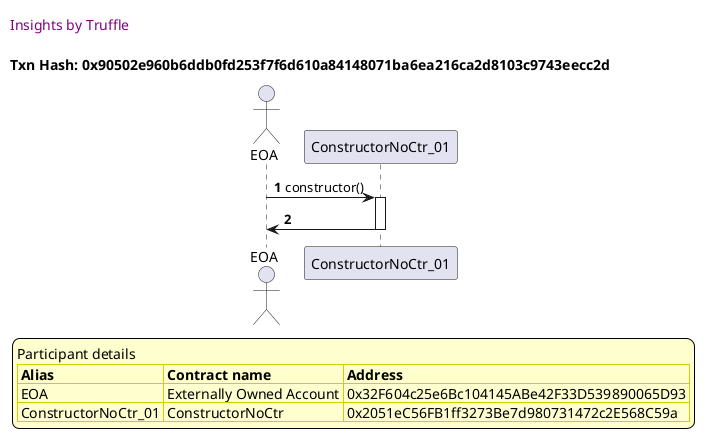
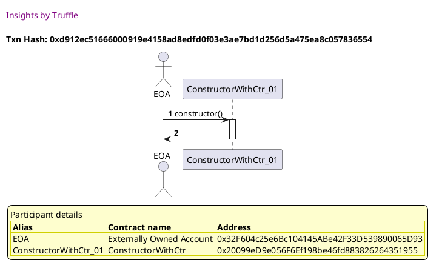
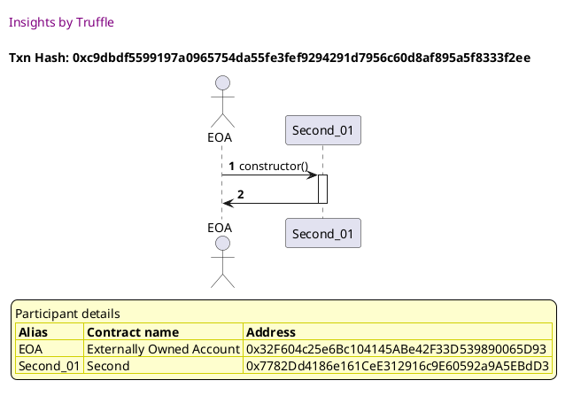
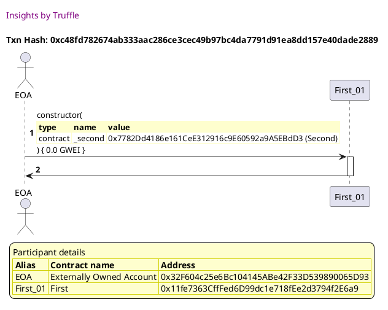
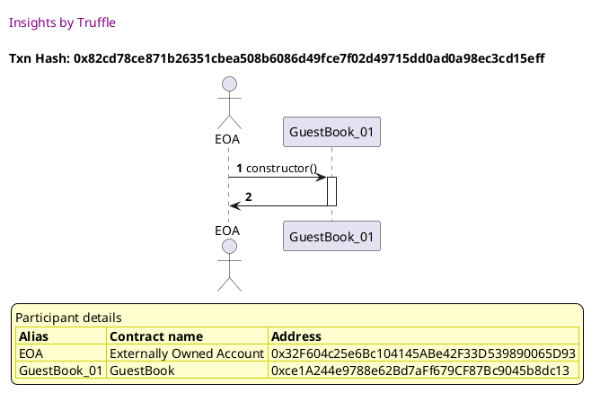
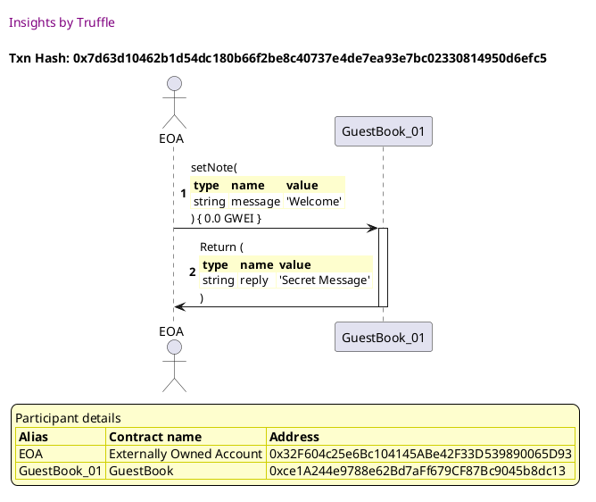

Test date: 2021 Feb 22

## deploys a contract declared w/o constructor function
[link to test...](http://github.com/trufflesuite/txlog-seedlings/blob/1d44e677781e9cf21f80c1c42ebf5a82a0cd8a22/test/constructor.test.js#L14)

##### d1, tx: 0x90502e960b6ddb0fd253f7f6d610a84148071ba6ea216ca2d8103c9743eecc2d

[SVG :telescope:](https://www.planttext.com/api/plantuml/svg/RLBBRjim4BppAnREfKKQb0yzBCCrOiiMqaiJeBaNDBcoXSYKGL6edQR_thKik0rg7KXgPZcxEql6xjkWVUXsDMEw2uthTclqh7sft5vxlOCQD-ZiGfkNZMywP_EcRZpS5AjYbQyOcxRXMEECGVzjKLlqy6lu1NXeVFNQkA3hULrjt0vT8CKoN08A8i-I-yxlQtn7VAzU4KHqmPwqjPNRWE03zBlVfv-78jYG_wjhgyqsjB0-mhFlof9qMQX2ZV1ySF2Ws-q4-27ZCPUO9NoTMBlcfPMnAjCoiOdWUXo9QCnJiTO9QYaIewKT2wvCbaOAqHXf6Lbc0fM-Ufo3Rc54-uYHRQ4orLvJgtdZsk2xKz2t9W_-1nTzu1Lyn5X_7-vcrtculPs0-Kjy-CYknvq4paft4s3iF43sz4zP5eEkwfPDXp5-kbdo9UTyzlO5Q4vK8Hr8EtZg3vpUuGcOM-kn9UvoR_RMjqxh8Q1tkgwFyFZJeOMvCVHO0b7ye6IHyCZ869E54PnyZUSBZ6IXr39MsJZZF8cNcNelVCsw_z4-WUInm3nEYeKeIoLJjS3KPZGy9Q9K6hcAat4UPveIa1E37-oULdhsVm00)

## deploys a contract declared w/ constructor function
[link to test...](http://github.com/trufflesuite/txlog-seedlings/blob/1d44e677781e9cf21f80c1c42ebf5a82a0cd8a22/test/constructor.test.js#L19)

##### d1, tx: 0xd912ec51666000919e4158ad8edfd0f03e3ae7bd1d256d5a475ea8c057836554

[SVG :telescope:](https://www.planttext.com/api/plantuml/svg/TLDDRzim3BthLn3fPKDNJB8jnGwoeFaokbCBjC2EWsBHYL553cGPIxhsluznZAm5KXyec-_vaNgK6BjjWlQXtLh6T1jgrsvNw5dpNBcTzdeB5jVep4mNpsjVjyxCQrjxkCgN-NA-P6pSX8F52OFksQ0swE5l_mbmL_lgfNP1swcjrcwBBf1Y6Sw4dC2JvAxrEuiVWCVg1K4avzo3DgPoQn2yJxrrw_XxtmJhw_zqJRNUX0PM1tZoRLcIBWjLi0XFUmTtkjcCWEzD9Y8if51ASSupaM4YPAfDYgOqlEGnnXg7AoDC99MHEXbAr6d1vJ2DbPG98ykAGAqlxwUW6nZGEc1aMwYAQgTfg_FQDS6tHzAlAcpcmV_cegDUH0QCTHfmC_cC0TVN8oZ-Gr--ii-OHv6Jsiq863iDaZsyQyzWq9LjsBWVvxUh1L-G5PFN7q3peZxfXTI3fts2qriy9gR6U6m8E_ytUUqieBWFw9sszW3tVnmQc1O57Pf04D_7KQvuKaGIrQmGF169dCumYV8uNiWuIpFEbLnayKVXonPUodT58XfaXeiCkLIvMfOYIrUOgDAaQPn6Ab99B4Kc9HKXDtfFs2r5kWB_0000)

## takes a contract as a parameter
[link to test...](http://github.com/trufflesuite/txlog-seedlings/blob/1d44e677781e9cf21f80c1c42ebf5a82a0cd8a22/test/constructor.test.js#L24)

##### d1, tx: 0xc9dbdf5599197a0965754da55fe3fef9294291d7956c60d8af895a5f8333f2ee

[SVG :telescope:](https://www.planttext.com/api/plantuml/svg/LLB1Rjim3BthAuZqig4h9jcMRGLPK2Tsq9rQeBqFYaGdHXKva6KiwTf_d-9uMQe39V9HJ-IZ2Bdll7I-tnb2PEzRs-_Mw4ZtsjYzT7871ZTezKAgrurhUwkNhMaTtAogLRMi29br_cXmJc1OMvGQ7VmPNO27rZLlhVNI5ARPs1rQ7nXhVqbO1V1CkU_Ttk0duBbvGs399VOajMxi1XWTGn_3Fli-5a76zt_QhjbiVGVh8xoulgu3B_6DDmWl1miFijjEWHwKq6jTSou44vca8kKPJxJalCQunbf48ea4qvdWgKgfpcMT2ovvdSTnN4SOE8bKFfHUFHOWEvY4VKA2RBvHpLw6LfzHjLR_eco0Bzw4a24NxkRNKRYzdK9mEk_w4--Nh-GQFIMVRzrDWP3pOCZJrNCQlMnCHsRZUBxTbBIabCxVVq3GFzGG3iiWh0jrWvKxF0KAhHrs0RlScxyFBGLxyEYiDEO8ZxyjQYYK2f_01uWUucYLqaH57DE5OZHX2IyMc4IhE2vvB791QSfB4Nyc_Y_9l_D0bcLvLEg4vIcob2snYbdGFbMYIYaNaHG5hnQwF965hiVUoNsmuUl-1G00)

##### d2, tx: 0xc48fd782674ab333aac286ce3cec49b97bc4da7791d91ea8dd157e40dade2889

[SVG :telescope:](https://www.planttext.com/api/plantuml/svg/LLDDJ-Cm4BtxLupO2uXbruxpPTIjQ9i4E844qbwGa6jFseZKgHndjuNkVryt3LN9mJFZ6J_FUnaJSjCwQLstgWcHdMjCjvgZ9UrRPTRIoXNKk42ZfrAzBMpJ6JrhwiR2jo8lybbEoAXrsnh71FflYLAZXOyX1BXhRFNU62VhILqjp0gDyuYbEnOKFdc0N7TsNUENn5FrZi32uzwZrBeo2s1qsFhNsz7FeGaot7zlscgnT2tCj_1ikxBqkCHLhaPutXYua-to6kX6XMcfapI8ar3EEUTIgY2D5NA5AXHpaSnLg6MI2AO5GvbgpQ84Gwhz9K6Q2k8bKywtdZzCGBPmvkqPyRAvIbLhwQaMbMtTAsLzzZCu8wIlXAlnoIPSNbw3QaphRBS7FNynBsGqwFnziEFTBt3RDOAtHgvw-qVMdNVsvRizWBE-ATZ1Qui-qjwZcyIpp7J8qXXPp6QOSnO85YkHnpGIWHIJA9_gZCFvKt_eue1t0Hz0Vr2u_PtVUwrFcjstVk1mTGs478Q4F9vGr-XaLRSd53AQKKht5FmiU46yC_jizvFCH6kBhSyTpurtlRn-tJYqHjRr5Xx-6jGmKSeFfEi9yg28QQY22EEfOZHaOJIPOXWKd6SH5wcWD8uomRy27t_FuFPGZ9MOy9ZFoh907MT2QCKmOMcPOw1v8i8oo6CfF9JdF30dDtxrZ-W_)

## takes a struct as a parameter
[link to test...](http://github.com/trufflesuite/txlog-seedlings/blob/1d44e677781e9cf21f80c1c42ebf5a82a0cd8a22/test/constructor.test.js#L31)

##### d1, tx: 0x82cd78ce871b26351cbea508b6086d49fce7f02d49715dd0ad0a98ec3cd15eff

[SVG :telescope:](https://www.planttext.com/api/plantuml/svg/NLBRRjim37tNLn3fouQkcEIxWooedSJhdbfWVHzaYKwCA78WoLZIjVy-nJ62f8QX2mzvI1wAa4Vhk77zJX72UzVfVbUZ8NRRwZqtV0SArwXboSLsRRfUoqMdEWDtrQfQBLQ4pAmxAfmJ6BuDSea6_erNWAVEj6-TTbmLgbth7Mhd6HjtSQWyUARSzsQly0RutRuXiEXYU-5IjdeDZ8wcZs6VVH-B86F-NzgswuspK1_XrVHDutc9Qvr2U3reUE9sCmLwo08XqqnWbh8wICAOYHfvJBCweLaYexmHc3OqyAUKnL9IxlyyGn4AoM9i6k8b4ywNldekW5kO-7r2l6ok5UsU-rP_zcXTsNNRFvGD7jU62I5313pCFm5mVpy5qMdhJ7zAyEKh-UHm2Zd7Fao1aFEGoCjLQecEjygIsJYgRtTBkgIKpjz_W9-5ByOV5bvauti0pNTuCXHI6hGUkyJDtuVs_7fmQ3HNwWZFVpLAA8Jm3y9vY1x2e4fe988Oar8m6h4eBagCWYeCbt6OPpcbIRpCmrlY6tckhWEbG5O4KOHvccMO1ALCUTKaQRweihGKEOtYEfE2dIXzxwC2vD6l_Z7_1m00)

##### d2, tx: 0x7d63d10462b1d54dc180b66f2be8c40737e4de7ea93e7bc02330814950d6efc5

[SVG :telescope:](https://www.planttext.com/api/plantuml/svg/fLDDRzim3BthLn3TeHkwRlAtNNH1y-MsXwt5Mg2N0eCiCQbHMmuakKlQxB-FSRmWwNK-Y199FJuzqenTM2UCQ-kACT6wHhTrWORPvr8lX14rL3X7hKP2FizDqserRgh6m8Tyca_7KyREhLjLE63GVKye51fuwuy0LuqfNnljH3MiohckKJj2dBbTGax1BUIYDOiA3m9tvIk25-vyjqAfKi_1uxthJsVFl_OaM5__Mjjo_kGi52kuD-riHhZCbQv2k5zgk1BswGpuCb5ne3mUndxXgIXKqajv4SSply1KXZm94WmL9YYo09D2SZy8UEg5MSHLZ3CPCP9CEg8-lHc2i714zeYHRAwKvKBGKozRj6xKDC-_kDTbx3kE6EjkmEdWNG1EJix0ellHEFpug1_PUQ_tvzuErj_0hHO8PBMeE_iYgfOsc_GrM6SsGgsXHcl5dFnm_82LR6eytkPyWZVWNpXSFaolISTt13QKjjnEp-0dkjPe-4yc1XVLQiFZ3gL11z-tpFxHOMmxQUnsJp-5JfILtQiwuHFE-QOg3HGfIfinJOgXHkpg3vKo10xhtRt1kkiHhKk7HekAcDpyrgXWA2LDjQCGNmP-7lDG-X768qbpuONHS8IXdmV190goDECyZYPPS0XyqEEzOmSfqHlwOOXPagOO-oELY7mM9zauJvEHp7WO5IdDtGQItjuhm2vefJ_oBm00)

