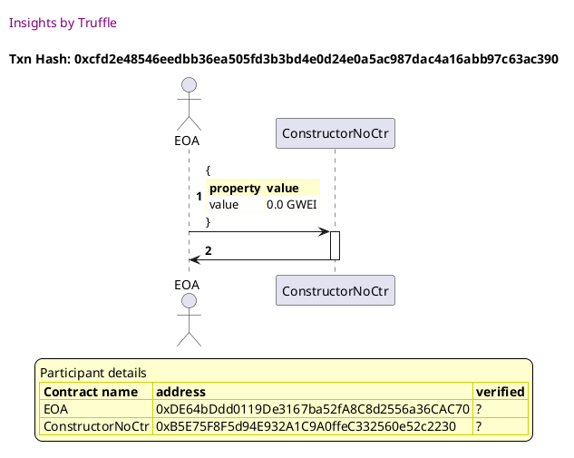
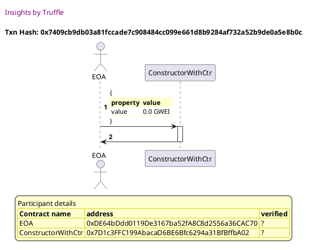

Test date: 2021 Feb 12

## deploys a contract without a constructor function
[link to test...](http://github.com/trufflesuite/txlog-seedlings/blob/0e1d57622e2550f3c79e053fbe2365c8768e8cda/test/constructor.test.js#L10)

##### d1, tx: 0xcfd2e48546eedbb36ea505fd3b3bd4e0d24e0a5ac987dac4a16abb97c63ac390

[SVG :telescope:](https://www.planttext.com/api/plantuml/svg/RLDDRvj04BtlhnYbnpJjyh7OMAuRWd6JInkfaNh9PM07UnMye6Mfd8JyzowOMabJ3imo7s_UUoiOksmj6jljAyQmixNkzZaPrZuetQ31FLIq9Isli7ZOchhJCgshsi27JRR9qeonPMiVAren69yTeIG3pzCdm7Ljr5EjBLP9fRPwJzewnDAU6ZQkU8HiEjDKzARmKpqHUE4fTujIAhq5Zq-fbp4kFqyasBJ_HhTgkxCjv8zmPxgoTBZCAbiHt1qqN6ExMm0_5ANqAPoBC2AIUHv4X8ABKWPvaCkGkFJT2mKMyNmciGZHYp3FuraH1LW4CMVEii8wwjcF1B25CnVF67E-MLMe1ftMjDQjDTtGzRrEhHdR_aswcN4KBbR_ASBv-GAUx_KzMqwkVvpYgly2ZQaRClOHtFatLXtrGsT_F4CF_1E7Rx-o6nZpBsxJ-mN3skF-YmKuKUnuv-psbH195bNLlkAmvclE-S318LhZd02DUng8k6iorBOZ9pAgL2IXFusk-j4mn-smpg8mNql9FIzUK-15ino5NoRpT2vz8I8CeZH9PzmrVtsByCxO0UvAP3EncM-4ZCCi3lp4I-E4boMbGU2BY9Fm2zyF_i8vZPDInYvTS3_17m00)

## deploys a contract without a constructor function
[link to test...](http://github.com/trufflesuite/txlog-seedlings/blob/0e1d57622e2550f3c79e053fbe2365c8768e8cda/test/constructor.test.js#L10)

##### d1, tx: 0x7409cb9db03a81fccade7c908484cc099e661d8b9284af732a52b9de0a5e8b0c

[SVG :telescope:](https://www.planttext.com/api/plantuml/svg/RLFBRjim4BppAnRfCKrBFQo7uRgHzMXoQe06o2KNYgHi8Z8bK5HX9yg_ToKBHe9QboLtPsTdXn0XjvrbnlRxcX3MsqRt-r8QqhqetJB3zb3BhTHYm_ZBrZIz5cbJDmQ-57cHfpaXgyuUQxacC7qxoOGqy3PV0UuQeruRRLcTr6ghzr9RPApi6L1WyKJPzgQjvQV27_KgmV7FkGScXD9RSEYSUf_YwliiWippxtMdjZlRGNc4HzDN5V8IgsmjuV6WuOvrkoNGG-ZJc9UnAAd78gVY79j37jF8ZtpEQHpB8714LCPkvBCgz5osS14kALl8gAISe6NSelJyTmAiWokCLuIWRrPnrJBSDMrqPqq_efwKtQNMJC3_qzWtjSFD-c8Phg-NyFQidybgzlxh7DV33sXDqqfZZu3dlwpkvJ0YXzCP1g3VAFnwokzXoh_Zh4iZnj4d3JTBmEN8wUt9muU5XBHCrTq75HdDAAMZ2kIq1Xq1pVPob8BFPMJNJQgaKPMI0ePpwtgOZ4DrXomF_38JWZfEd4dF2S8IlQwIA8s4krW4p0lI90qfWdz-PhXWy4WOPWxtYY9ruZWf6MTPiCc3JSK3D_QPvsogJLML2NLdGjnotfMGMmpuE_m3)

