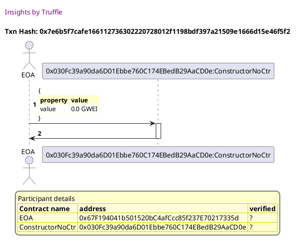
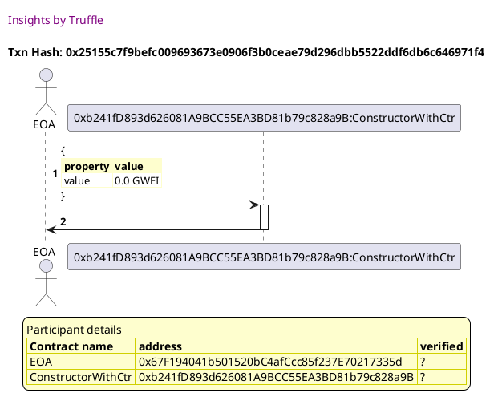

Test date: 2021 Feb 12

## deploys a contract without a constructor function
[link to test...](http://github.com/trufflesuite/txlog-seedlings/blob/152a410baf2d76d60511fdf559e3219e7a4ffee9/test/constructor.test.js#L10)

##### d1, tx: 0x7e6b5f7cafe166112736302220728012f1198bdf397a21509e1666d15e46f5f2

[SVG :telescope:](https://www.planttext.com/api/plantuml/svg/ZLDDRzim3BthLn3PiUj6-JCEigo9uxIzR0LMO9TUP9jEX3go8Sj3qhh_VR9Z1ErocIwK-V7U8oapTjCOeKsxBnaJhQbKkqz9i-PPgbfeiOUIjgJobSYUjxfgLHvNPQNXqoRP9772sBmnnv8M38Qp8v6JXjVn4-2kqlAbKaQKor9krPwKiOY5EITiRF04MRUwBkb3u9Ty8U3UsVSWybogBN0SNM-3dNyTHR2H_rurShip3QH7UDHjKLXSPgGf2HuF2kv4ivi17a8AKhy8Cr4G3mBEdT0DN7GS1qDdYjmfE8-cQLwuKIWSxcFKfmKvzyaB2hzmc1rPPgpqvESIH0CJQoUCsRaPcSbQs5xZIZL6jttMZoesUaZ30xguoTn8H9YBO8qyILCA0unvw2KhobTEj1Jn6cdsRxs57rZWUW6JYo1SNStWzKaziVcueC-ZNNJVeDPLJTeSmTx_YBAbhi_iJdVe0ByWtFvExc7mlrccIuAUziH_FGFRFpiz3_RmhkUSZ91byqx36jU8s6kmY4RReO4IU-g5s8rgQff14sbPICgXEvSkkc6sLjiX23Syyj3ZgO_STp2DFL74MJQrYt3394I7Xwxhsshu_X7XOWSztFzkO8IpFOwTCdPZZVrV_W80)

## deploys a contract without a constructor function
[link to test...](http://github.com/trufflesuite/txlog-seedlings/blob/152a410baf2d76d60511fdf559e3219e7a4ffee9/test/constructor.test.js#L10)

##### d1, tx: 0x25155c7f9befc009693673e0906f3b0ceae79d296dbb5522ddf6db6c646971f4

[SVG :telescope:](https://www.planttext.com/api/plantuml/svg/ZLDDRzim3BthLn3PiUicVyYsWYnhuZXjJokm0htq8bkI8zIH3LaUajRzxvCT8sYn7AOBQP9wxv6K4RffBJEssrS8iSxMkjldmg3sHUc66RQ7IfH2ypKhNafJTvgdTLKR-BBDjbcQ8RHexR4IImJZsGd6XO6twHFWhZRgjTQMLQjAbNelj7M8qfuBjYvvWcmwqrJYK-AtUXNWXUVO0-DSwH8yF8NUHxluFeb04_-zRbMviotaHtWqdPGE5rbbAm6F1mrthDtD0HzyuX5In9BcGXOOquW6KHm8J74aWnmNWecOSfz6FCy9yNtEfNEZ8WeZ6dioH6vaXNNIiryhO2tCd9qXvEPcLQ4QvdfDQzrQqmrLJyhkKcl6Gdp8_T2JcuG6FF8Zd7WhkavJGh9LiDuaNXxJ8l4JHjVpVn4SnSW4rqkONKZ3rTKStfxrCrfCQ_ewsMN_0nfJDyBO8pZ_3wiwqG-L_Sc77l0t3BTFsJsCyNV7TObYe3vfk9w3cmCwFHFqyA5tBYnJLVj1nGPlCCQ32eTfZHiUQBONWnItMIFQTbGbZ99ASEZFLvVzE6EdxX35Mu-6EFHoWZtYupmDcKoB8Y7I3-8inhuN1m5nj-7dPuGBknW0_tSJ4w3hSkeLeHjdt9_p5m00)

