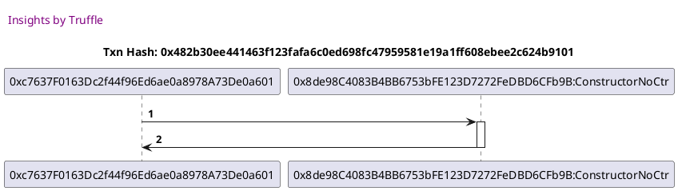
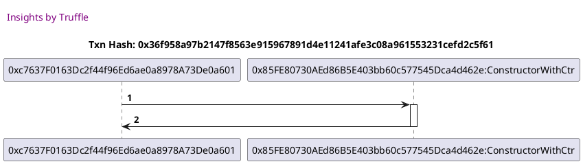
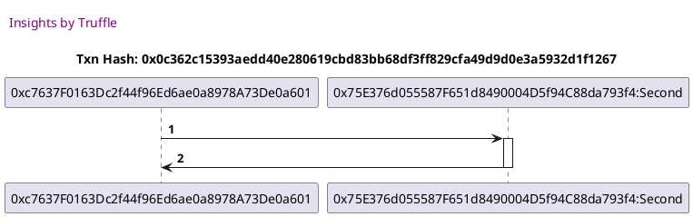
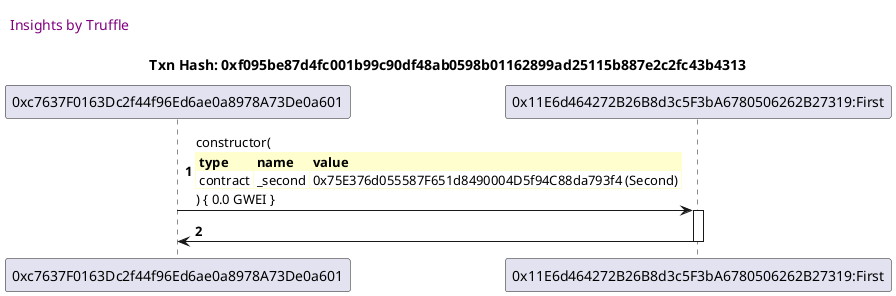
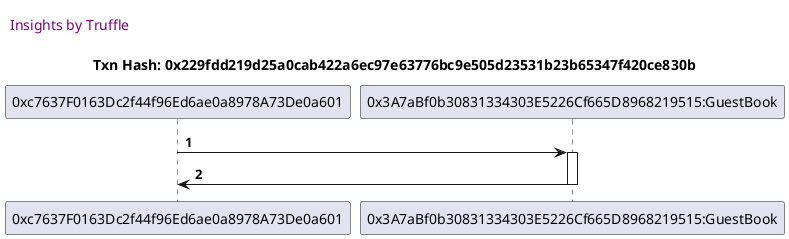
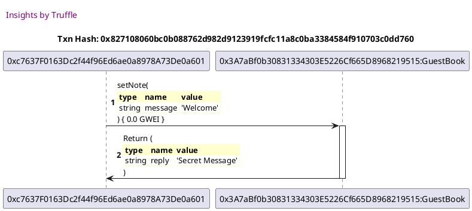

Test date: 2021 Feb 15

## deploys a contract WITHOUT a constructor function
[link to test...](http://github.com/trufflesuite/txlog-seedlings/blob/3bcab5a6f1789676792542f75bc3a5a304fb8b1a/test/constructor.test.js#L15)

##### d1, tx: 0x482b30ee441463f123fafa6c0ed698fc47959581e19a1ff608ebee2c624b9101

[SVG :telescope:](https://www.planttext.com/api/plantuml/svg/fLBBQiCm4BphAvRqM4ebMv6b44Bh5-cb59eVaEsLO-98GPOXRUc_LwIXq6FfNlOrpCnX27cOWlPXFew4w3auEnyRz6Gw3FQalJx2Y3tQBjVjeVTkjbtXHkVXfgxgggW8MK_XRSGDWKljKNVeuUEw0coT7zwT3Nfy78VU7j66o6Z23w2Eps_Aq-nF8_vwl0xl28p_t5vqrmss1qQlfyzBNzzVJP2h_fETXduV9cZUOETdOo8l2KCO4NPd2rizxLT0prmcJKeHEMTSf8ObgT56YvPY9vGqBS_KKYqbGwOqCqPGYGrYqeg4DufHHWXPq7ERYJIhAHDfsIQ6SwD4rGcDL4kLoSSiBUCeA5l0tGOYNdQePC6fJ7EUvo9RfarTHUqoIxAanZ8lHL4tAbyLpax1psrm_jaLmI_WzdO5v7yKtnx-uFakIfA7684OaIy0)

## deploys a contract WITH a constructor function
[link to test...](http://github.com/trufflesuite/txlog-seedlings/blob/3bcab5a6f1789676792542f75bc3a5a304fb8b1a/test/constructor.test.js#L20)

##### d1, tx: 0x36f958a97b2147f8563e915967891d4e11241afe3c08a961553231cefd2c5f61

[SVG :telescope:](https://www.planttext.com/api/plantuml/svg/fLB9QiCm5BphAnxfCPHArcQ7KhBPjBT20ptBMXmJHmwo34bA_xqY2O4UIz_bBJFCcyCWD1-Y2d7STmYfCVP-tDSse67N-eCAQW-TRQmtIwLtJUX7RrPzrmTugCggN9K8FG_nrDaN19VQMcLiWA_R2l3QX_RS-wYwHTSsVczzJ8ektWbL0g-IXp4SEliB-6ZF5WYxtzwLCQrlWE3RwVlIdvzk9j3j_viVscOR1wXFi0cZSqaNnJPs5ZP73wzgsCu07wbm1SzL8UkCCEboBgWj22-4p0jYc2KaOqGvIpLEB44ufnabsZgJQUu4GGXDy55BGMM5YQ1hdJd6N25A8vJ5AYzalf1qdKQ1oGGUNo3nSrwLEPOKBqgJYoKl6QPrBR3cKdB6rrenmqHcPwlU3p6CElRXiutRLGmJc4vdWFuhSlNn1z-FwIcQfnYacFm0)

## takes a contract as a parameter
[link to test...](http://github.com/trufflesuite/txlog-seedlings/blob/3bcab5a6f1789676792542f75bc3a5a304fb8b1a/test/constructor.test.js#L25)

##### d1, tx: 0x0c362c15393aedd40e280619cbd83bb68df3ff829cfa49d9d0e3a5932d1f1267

[SVG :telescope:](https://www.planttext.com/api/plantuml/svg/dLBBQiCm4BphAvRq64ebIzOZb90qiKblXVO7PA_ac3Xoa6L8MlhlDMaezDZkPTyp0xk4h8PaOngF7I5sJ7qOZvMBP3YquMIZFKBd6XVmoTQ79lPZm4tVzH7kog8iDWKXZqEwT6v9u6fxPz55-BYb0Bi-jkzzIBPRTsqJZYwa2T6ddu5oQdv3diPuwjolnclxxe29dzgBHMn30upUIfzN__Xm4q5k_CzXQ9jz6g2wm5iSlPzmIMfJv-3j761dX_q2w9dMN6OroxdXrY4AwZ9D9JDrXPfNbTJekVSwCxMtmg11whZD3S-GUPP9HGYPqNEj95SbPP9lwymBuOqiK5f7hJPAhnNVJg6aR0RtIvZcLLvm9P7cUQvLANE6MXXAgTZcteYDrcYLuLuiNbtT1vp1VBu0yf_5Rxu_wBkVYCXgElVq3by0)

##### d2, tx: 0xf095be87d4fc001b99c90df48ab0598b01162899ad25115b887e2c2fc43b4313

[SVG :telescope:](https://www.planttext.com/api/plantuml/svg/dLBBRjim4BppAnRf9K6QbXJVXcl43wd9hK02z1AWe4JA5Y9J1aKLTkByUnbR2D1ZoylixYo7v70HkksZ2N7OjWYP8NP-s9OkeFwvyJiJp1PQjtRUBaprl0xTuEsoQxi0dugyo9SvGjC-7betGt1Q6sUi2_0wfW1tNMXUEXzDEs-RjTyw7vDY7JyQYaIU9NT3sBNkB-AXUN50s4VjXx6syMiWU2ozdN3wTRm46i-_ztsptiGUoWCyXg6kaowAJMmTFEuzt9b-Cm6yhx7cfLFIihh2c9HQLnhRcYbJOgvLYGaHcTBQs8mJmakbfCkghAuOBHab525qWVUL55GMc0YwIXnZjHQv5SPXexHKSqbNAHIONC3D358_8RcmJB1CPejCB9Ib5IzeEHTIOOv59b9PKg8dHHFwU07NrnEeEj_7C5In2vTF_WbDH_y_ZpWxVeDus3b8wCtsXBzDEwJWlVtuBX23gI8SuLVlKcPJXFUIvrGAYpddIXQ24wkOnXYp5QyrMofbZTIqPd3vSDfqTTQxWbV0Np1y_vdVfp_uZqUThVW7wsucWD1jciGqgNy0)

## takes a struct as a parameter
[link to test...](http://github.com/trufflesuite/txlog-seedlings/blob/3bcab5a6f1789676792542f75bc3a5a304fb8b1a/test/constructor.test.js#L32)

##### d1, tx: 0x229fdd219d25a0cab422a6ec97e63776bc9e505d23531b23b65347f420ce830b

[SVG :telescope:](https://www.planttext.com/api/plantuml/svg/dLBBRiCW4Bpp5Qlq64N5OC2EeYWlk-cjKlC3s81ZnSOHnbAIglzUb5YHUcptmZ8xEpCI8BJglNH-Q1k4vE0xExI5TgW_rVOidMoXqPMsQYFBK-MwmQfjrtGENl8ipxOPGelUNnkzH72levPAE_WQhm3xpjMtpdhPh9kwigssFYWQ_oJaOVYGF0_ktEXVWy_wfY6AdzY7LAgs5KHuXBxlv-9r3856_tVRrzNHzr1SuU06Ou8kyhLlD1mk5lQoFyu1NmX9ZL8aIXLX4fUoY0cHN9Ufq9mAmOiorGmpHIYZKK5emHcDXOa9BdL2SO4Gck1BAG8vnn6dkvAOE3OfpnIN6iia5SbQq5reEOucC5j2uDEra1k32ueJ6b4QKqmpHWZV6ixPBabv4XAnYCtV1jtxJTUT9Z2TpW7zS_VX-eUKi-25Lk7HmwVu0G00)

##### d2, tx: 0x827108060bc0b088762d982d9123919fcfc11a8c0ba3384584f910703c0dd760

[SVG :telescope:](https://www.planttext.com/api/plantuml/svg/fL9DRzim3BthLn3PeHkwRfBbo7AG1Ss7q_QmOLWBzDABOjEE4LaE9Bb8sko_Jqcy0Zjk4o0yYdoW-1v8oBNpolgkqOIephUcQrPeYTlKPgkiQa1ZXQQOgNnJsROpnRpLhOLtosoPpJD2nixlDKu8dCuQLO4MNlidm6rhwvVMUAMdkgvCWyQ7ZgL_8on3yTnoszcjnZyAz_KB0elVSjzLKTIc0aRxrCyJZZ_tGv3-_plZwchj7Qpsy62xiWnzYQ-zHdZO6RXLRZq2kfDHmgYaWgvokg9I9Y8gKXakYtZAqZ8lSyQK34N5kOo7CYvJHXFASreKYQ24a07TvOdWoP8omHTvLCQ18x92AAHAfecS9dmHGa7P0Auc4FXycgXPILUSIiuuZpdbsJ2AnBmKOhYGgP0HIuTiEBhfqFbPssu6S7av0eV-M-ln_PDv8kFU_uyzJWvVmE-t206DQaxuh7GNWYFz0CxRet47QD0vLOKyN3oYpji6BywS3_0Az1E5cyViBlZwZuEU9Vw59LSZ-86-imR-KvZ5hTuVPTrZRj73rxFGt-e8kGvh7DRy5m00)

