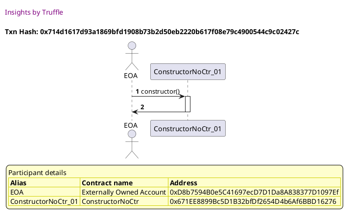
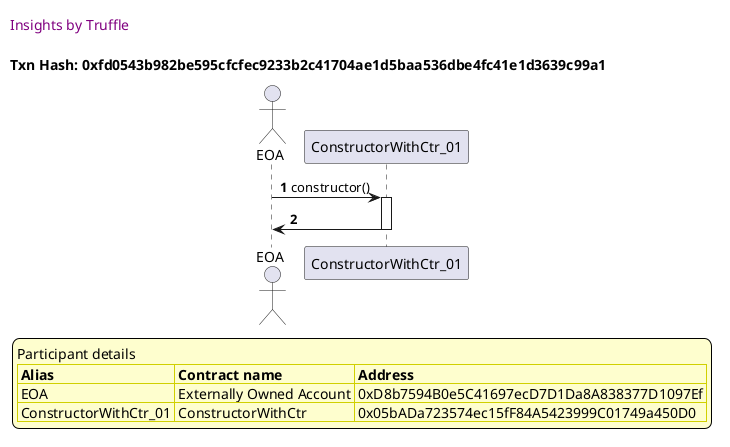
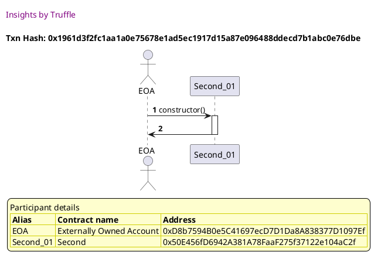
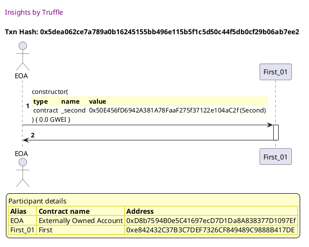
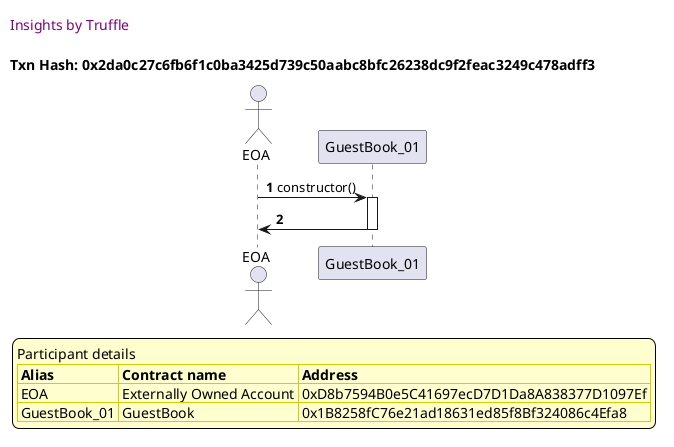
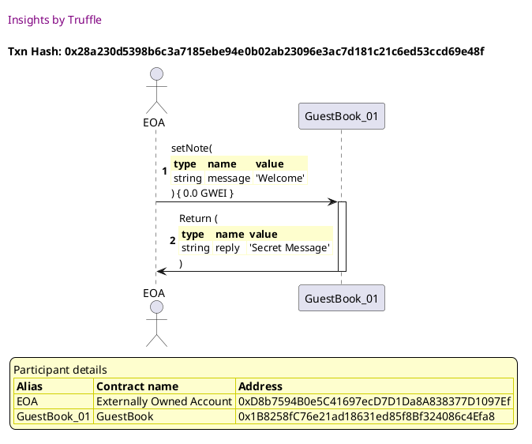

Test date: 2021 Feb 21

## deploys a contract declared w/o constructor function
[link to test...](http://github.com/trufflesuite/txlog-seedlings/blob/4af7c9e1104b5a1147ba37abd1c5713b86598a3a/test/constructor.test.js#L14)

##### d1, tx: 0x714d1617d93a1869bfd1908b73b2d50eb2220b617f08e79c4900544c9c02427c

[SVG :telescope:](https://www.planttext.com/api/plantuml/svg/RL9HRvim47xthpYbBvkwQZO1ZACiAWIYxcMjjBvFnZO4bPZ862tfkl--2q7PgeK7szpt-Rkxxqp8VU-byyEk9KGElhF3hZIEz2-DtKidTz2QsbYTIVLIkswmUjsrdOERJR4frWKXozuVMxCYC7vR8xLny6lw1NZeNFFQMI_Rj6rgkpFMesBbBuGDWcV9_U3shNa7V6zU3R3m4dkIMZUs1aQdqEznNtwUYY1J_g-sR-gjxw4ymhCRgWfrYMzyQ-3vOE51zji5q0DdeMOnurhC9KjYKLQQ2PgKV5u6EgAc38A0baYeQ6AuKA6WD0f39HGDme0hWfOfZwKNZod87cQupmZQvXlLx2Mskkvixzrm8dthrjxze6maNedF21dlmztgEWwtjmjGVu4F7ybrtadWh7It04BE0oHF_vIbZPTDsvFbDCPFDpdDAQMhjo-0Sy8AyO3Qtc5_OENEd0AfrixqY5tkhTx6rd4zUEEiRDiZFFwqHaEg53uMZn0zvEXe9CACccWTibXmetAUirmcQJ9FvXpFLF2YUYzypRh_esE2cBEYI18XCXNbB9i7PPLNGHo5ULZ6QHLdMSxYWCUO09sO_23tkEAp_mC0)

## deploys a contract declared w/ constructor function
[link to test...](http://github.com/trufflesuite/txlog-seedlings/blob/4af7c9e1104b5a1147ba37abd1c5713b86598a3a/test/constructor.test.js#L19)

##### d1, tx: 0xfd0543b982be595cfcfec9233b2c41704ae1d5baa536dbe4fc41e1d3639c99a1

[SVG :telescope:](https://www.planttext.com/api/plantuml/svg/TLDHRvim47xthpYbBvkwQYRO0KTPL0f4tLChhT8U9sERn2enaJ5QqhN_VHU2ibLAUR3DzntVtNrd2BdjWlIXtpQ4o3wqhjzMnfFksRgTz78BZLaRf--aUbxxjdSwRvlMmzMgN9LvISYY2uV6B0aCpyP8RJpy6Ly1xbjlNreNP9CrTkssnWLKhCCvO8NaINBN-rrZtX4_x8k1Y9snHwcrTMk8w0Yz3VlYwrW46VD_TvrTRq87rG6UV5_Ng4k23Os1fxs3Uzbjva3tjQQSnPL8fvNXWgjQrKQ9QHnNKyMYX39f8iqhANayqvLXDQA8nBDOA25aHD0o5R3qyY43sS44zmb1su9LTYUnrRnrNV3zCUYd3Piy-5yq6a8lCXD21WsuMNuK0TVNSr3_g4-VoKUHHv6JsiqS23aDaZp-LvusGTgc8ujnd5-k2bfGIfUltm3dXNNY0TM3npx1oQqv0fdMtdJ8dRzRlWuMuBeFnZlPD0Tu-EsCXamfl3G1ARelqYhXWjrHmtCMpKHYL94KKI7JB8tJEC4p5KbPlnU-RE4bV4X2UPKLCfd6F656HRnUfIpZR1eB8N8Q9Kn8nh59J89kZ9wGMrpn5_WB)

## takes a contract as a parameter
[link to test...](http://github.com/trufflesuite/txlog-seedlings/blob/4af7c9e1104b5a1147ba37abd1c5713b86598a3a/test/constructor.test.js#L24)

##### d1, tx: 0x1961d3f2fc1aa1a0e75678e1ad5ec1917d15a87e096488ddecd7b1abc0e76dbe

[SVG :telescope:](https://www.planttext.com/api/plantuml/svg/LL9DRzim3BthLn3fPKDNJ79iomwoe6wSe3krG7iVQ8jEZ3fo8CjOqhN_VOphPQaE5Cb7FV5BYDlEe_FzhX42Uz_QVbUG4zrBRVVeS0SDRSYQEonVDgxjhLcsJUlWQhrQhvOh8UQTFpQq432SBQ4X1tz64-2-TVLhQpqsMLDlx8wiPyRAdmFM37vGxdktR-WJy5I_4gZmx7j4Osgx0IL7r_jmpx-FIOZn_v-sgpTRtq5nX6VNLnNp2b_xXk3vOE4Uk-qCv46biJBJAgXAXQXGaevYdP124r6fKgMDYZ3H9DCuJ19Zg3IwK5YK71cRWZa5bfvJNpraW1rC-9u8RfklotgFNEeJbQqrlwGQuBCr4MA8XPl5fHUkhsV0HkTTV-BzybLSegVWZrStCn3YOp3YyU8xGnxhfXFpSJpVhdAPIoaNRp-0-yyviBBanZhE6opkwEJ8Z77KCNP-jtWRIc9vyEGiDiqH7dvRCf2L9I-1PqWUygJGKHhUIOgMeOfJJMMkSvLZaYNJPAfPbwbULP-9_xVadpwGHN8LHd6LnsaOPDD4PJfP8wu37LLJhOA0b0nn6Pp8kEgnTd7BabVtBm00)

##### d2, tx: 0x5dea062ce7a789a0b16245155bb496e115b5f1c5d50c44f5db0cf29b06ab7ee2

[SVG :telescope:](https://www.planttext.com/api/plantuml/svg/LLDDJ-Cm4BtxLupO2uXbrqwSs45iHPeFu0GII7j1GaxYb8ZKgHndjuNkVzzf6ggIW-VJB_DU9eHSzqvPDonRGjJWEZCi2sr9_zQObR9g2QrUQ5FDLVcsiDrWggHhEmlVyYpFaeoGgzvjMZqZC3wlMbNQmiSK0jnsjddlZ5Djt3OBizJ68MBj3Wqv5lUGgy6kMlsbyDYyQs3ya7jGLTMO1J0wfVwDzkhdD0IPtdzd-cRnwdeeDl1aXxf6NE8QrsfuMXkuLVth9T1rK6b5Gw_KGWaPALgmqEC12uAYu56e6GkAe6PbK0MqvBmEgeAMjHSLD5I5qDeZA5dfSFJiFWRLmmdQ4uAokQPiLWgfvetjtGjbO_KpE25ax8IBsL4IpiyleUnCx-om0przDi_aQjBv-sHdsr_WDYiDQ8rQZlQFQWTqTktR7O2pE1HiuQNN65Ne8LEQyI2iqp3YNknB5WkPAvLx8gXzmJnFCyfLujLm-ZXUEjlZdS47q1yKRdvdTwZrqR2xqVSSBYw1aFsIa8SZwfLsgcdx8mefJIcbEmgu2oW8Eiddk9zauggokiVQuTviEygBvzffQrJRRk3-hz4Ln6M92-b6WgaiH13nETL1mbaO2Lsc8cMfah7qfI_Gfv78wg_0XyypkIEKbjpZlfVuOkud8irouNjXaaiUSHabaPHopXdc4GevJyp9DPxu4_q7)

## takes a struct as a parameter
[link to test...](http://github.com/trufflesuite/txlog-seedlings/blob/4af7c9e1104b5a1147ba37abd1c5713b86598a3a/test/constructor.test.js#L31)

##### d1, tx: 0x2da0c27c6fb6f1c0ba3425d739c50aabc8bfc26238dc9f2feac3249c478adff3

[SVG :telescope:](https://www.planttext.com/api/plantuml/svg/NLBRRjf047tVhnYHbrPfrFLzZIWAODFqAP6Qzsgy5x0mQxHUgv0c_zu1B0JPXxtCcJapSsOPU-myEjzl6yQmzwtjjvLshDlKTeSEjz3ebRPgZdApScrlrQ9jMWTtot9PBah69fq_D7hAuBJM6fLsy6zu0ZorhdvhhSTcrjGhkzNM4wFn5uSbWMVANUzsZRu1VjTl6eBuOdj1fMgxWe0Ffe_JEVa-5C66_BziLw_MleFg0A-kDuPucQzze-5rR-49k_KO-3vKo6MOoTHKgGaahp2AmqHbKIuJZbX9KHaPfc4abCnDQ3JAA8np6MS2bJ4H8ycafzBBvnbW1oCwHunayxMiTqYj_knrv-Tjk_d3WvF7jM74s2a27gQV0BY_7uDiRUTTVqpmvIlxv70CESS-Z86nyv3OorLgfJtMJSScmwY-tHMyu9nFtty0pOAAeSk2H7RK0rZSwgDXffJJ7M6NkEdxgJtQzruxYqrpWEU_LYkOIKaVmXF4zuMeiYIFvrmdYpX8yqpB8Yk20iLCH2BAwCxph3Itn3VoN3rFbC5SX8amYopLOO0g46aKQ2KI8-Q6ni15AkFIe21AwdrGW3tIJf_vFm00)

##### d2, tx: 0x28a230d5398b6c3a7185ebe94e0b02ab23096e3ac7d181c21c6ed53ccd69e48f

[SVG :telescope:](https://www.planttext.com/api/plantuml/svg/fLDBRzim3BxhLn3TeHkwRl8ZjXnaGVDm7uUjnLgWbmA3BDEfKLaEPBbBsko_Zt6y8ErrFeWKINtyz8bcxAnnqhgsqep9rjMchJAqh7agpL9QMO761PfyAjNJmjQjoMUrhYryE4_FqrdAsAXnQurZ1jttY3972w_z5k2ojkLBRPpK4rqkJ8N64MBXzWNdbDn1BbkxrFWcSLk-87ZXFdOZyxmq2_1u7_hJsT7NdWJh-r-PfbmykWQoDTpPjYW8bxdIQOIxbO5BsJmEWQzy8Vs0vuCW4Lca0XbxOe0P9Y7oZFioesGIOI1Ld7l2Kxwd8gHgfV8emL0KZ2HJZgYdrnEG3HoHFM8acojLkPHqrOiM6pUjwwTVtEig3WD7Z7Kdu7JyBW4d9qDeqFse7NvyC0zirElzkRVZpJTmwoK2MIEhpZvBtPApBTz0u-nMg0rKs3HoGN4ulaUjwWgFTpMVu1Nu5muNz-aLwVYEm9RIZjlf47wYQws1_sHYSQdNMnwtg2mw-BvZzeyEOxj9OpS7-kNePAcRWwvpFkUSRxlIG96YvCneKYmznBx_9CyjWSDcVswywTw8rfL3QwGc9jU_3UOmKOgcsb6Ah-OYYmT9EEKuc8LUbCIevl7Scqin4O48Ol9v4gV5M-0tRtomxI2zgV07efZ54VgUf36A0WzpCIZ4j0Zya8j8XMaX1K7ItNi5s1cjz4V-1G00)

