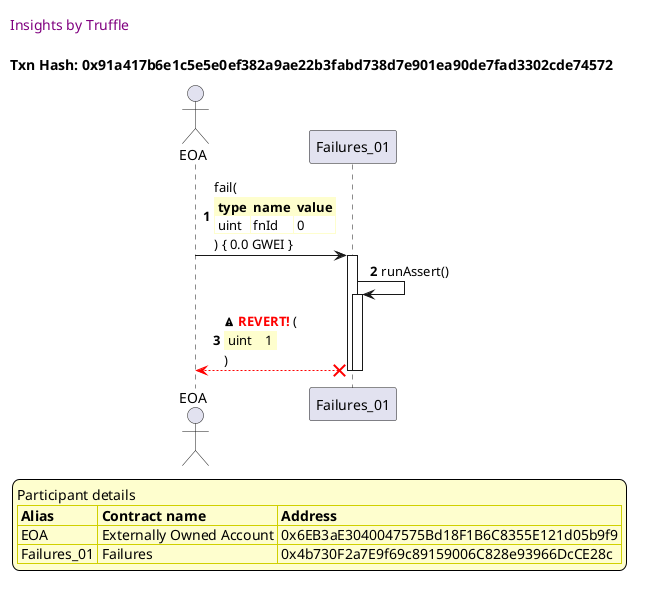
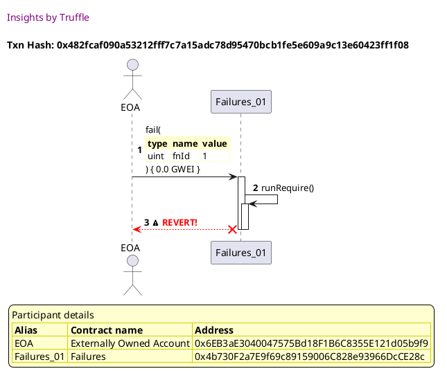
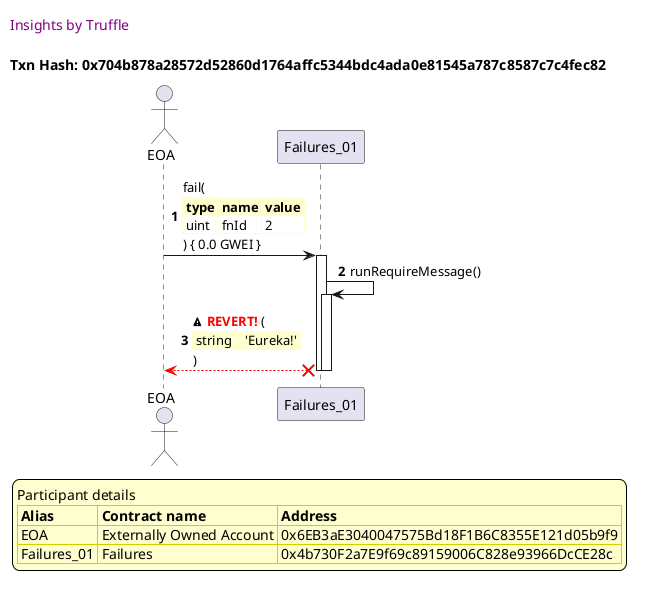
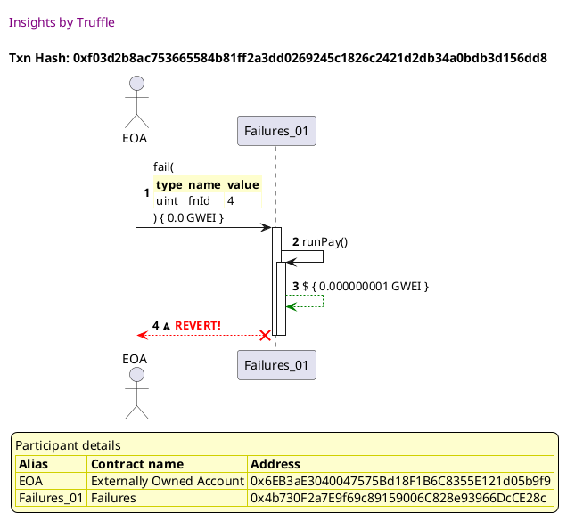
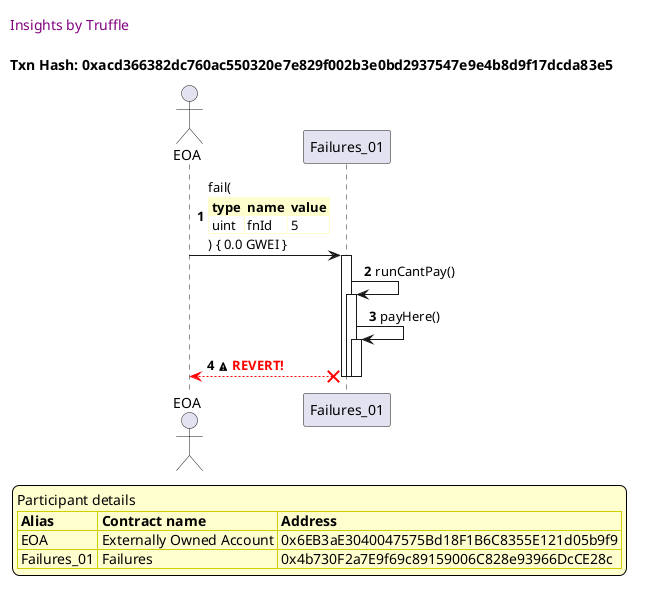
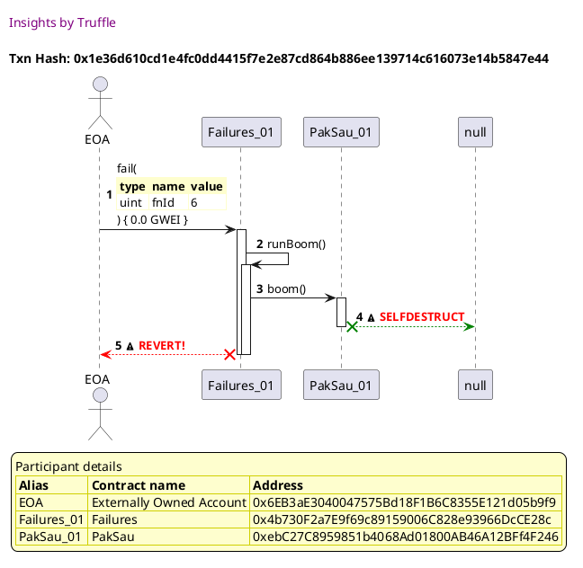
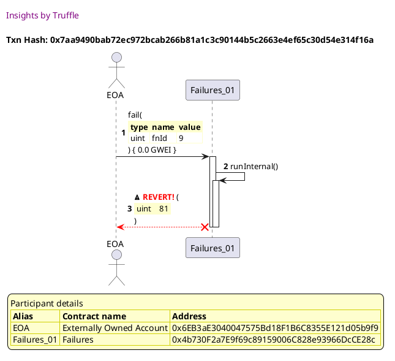
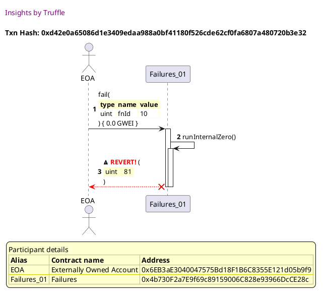

Test date: 2021 Feb 21


## assert
[link to test...](http://github.com/trufflesuite/txlog-seedlings/blob/4af7c9e1104b5a1147ba37abd1c5713b86598a3a/test/insurance.js#L29)

##### d1, tx: 0x91a417b6e1c5e5e0ef382a9ae22b3fabd738d7e901ea90de7fad3302cde74572

[SVG :telescope:](https://www.planttext.com/api/plantuml/svg/TLDjJzim4FxkNt43QO8oXfqqJOAwYhuaq4yWXhOFOvgS-58YKhTo76YX---xfbdNeX55Fllk_DpTSsV6BaehZQsc1MEoiZDTJHCqh7pCzLmQEOK29wZLGAQF4pEhj1hEYfc1mpYAes74MBUqom9x3Ehl0QL20w_D4U1gPlANcRQow1VvH4zHMqBCxDOX9kC6SbwPUO5xXg_v2u9eRtKtKgbSJq3mHlMxbjsp9WdMn1_hCfyys1AI9ToPAii8bzdS5WXt2mrNidmu1xu8XMmBF-cWI3tqa6Fc1euC9JfEucOoKRuRA1z3Bb26NA6VIUMwt4bfs_PyXn5bgQNKe-i-o18EI1umeitcQJwNL6eiyw8oMFxYedROEHymLll3QMzV3oSdvv2HukXUtxDkm_IdHlPMNy0kvmWajPpMyaaM5MtMxYkeSegxWaoF5Gc-KH_3A_3F72w_HsCYRJ_UVnCmbUwN9HfxTFp6VN7wuz2W-hc-jYdWz1ow7v-bqTIR7dJJpOIGJw_Lkes-HRTt7rgjxbcjxy4xPVrDd7xH9CqK4h_vaxJuXhft3MmphkncfmaABRcKEp57VCGvNrD9KqbzeSsGniqGw9RKlb84IhRjFSfntMXQ5nQDbaMnXEjdZGhwQKfFOvqzNtIYWIiZbxSvR_kUxmsK268nw0m3r_CYuGZ5lIJCmdtWtK7vTwe1sudlyjYHVXHcdJ0DGk65d1EU4s3eXftEA1r6Jf0I85NUrCykQAL7_GS0)





## requires: no message
[link to test...](http://github.com/trufflesuite/txlog-seedlings/blob/4af7c9e1104b5a1147ba37abd1c5713b86598a3a/test/failures.test.js#L17)

##### d1, tx: 0x482fcaf090a53212fff7c7a15adc78d95470bcb1fe5e609a9c13e60423ff1f08

[SVG :telescope:](https://www.planttext.com/api/plantuml/svg/TLFRRjim37tNLt0jCBJfkag-n7QH6St5MVlK8WksXtKO55rIeuwIoNARjDc_Zt6CB2asFuWYUNH47j64N9MEMrVD2a9uvUQccasK9ULZRXRSyXaKQggCx77nEBNpoiZ-l9XRE1vcmwoV4T8ftQfGAO7wUr1SAWklZGjmFRVvozmuNdIBV6fcoZXar6u7669oIxcexA9G1ual-Oi25knYTrpAt4o1qIRqkxQTYwO8qjn_Oyfy-k1AcAnWR2kjaPUut1KAnai3rxnyk0Iw369F2wvfGddeUypJMaSYuYpaKaInJC8WeXCnOLg5gaqJdWZcuoRmVAsPfZ51oOJ3qhFRBl0IZj0U4PJDvI9VS6nroFEYighyILaDsFEF2AdnS9uUnk7ix18q1axkpJtfD4f_Q6ow_WHkjL20rl1PRPzuKU5c0rz3bUEzQz3cHg9Xs_0fl0BzIE7pj-m6HJkyxvy5sCgCrAygj-haz0r-UVxzs2hvOtDksy7v9NJUFtDhy75Iw8ZjY20cRRL6sTTiD7xNQdKkwdXAf4BLyYVkr1j1_fiWso4aTtlIIkKGKku9DA03Ikb689mrL1itVHmYYwGxgRfI8YdcTkVITVryk2wTieONnGfkdusIq1K21tuZ9bssivxFCvy6b0PH68KzoU8XwxNxiH-66VEOfE4aqSaXyVxp__Lgmc0I-NJeyIXBT3iHSSB2X5BaysAL-4cxFH3zp8i54cBdJV_a2bVyLVy0)





## requires: a message
[link to test...](http://github.com/trufflesuite/txlog-seedlings/blob/4af7c9e1104b5a1147ba37abd1c5713b86598a3a/test/failures.test.js#L24)

##### d1, tx: 0x704b878a28572d52860d1764affc5344bdc4ada0e81545a787c8587c7c4fec82

[SVG :telescope:](https://www.planttext.com/api/plantuml/svg/TLDjJzim4FxkNt60DA2CuQHvSL1NqHPtzCC4wj3sOKoJQpib8dMBuq0BtN_VDOsw5eqeyjbtv-VkdZiJSb4uOLqvoGaHfPkQSZBIbXGFcPa9AoQGwx4sgYlamzXEIwDwqtnguQ3F-xp72MaLRf7hDe7gkzT2QGklzH7WQcgpbwbn8k_asTXCj768cBgDGn-DQyXPQMUvtZ5yoruqUC56ToEKoimOF5gh_bIoTLOdGUhu0rDautjNm6W1jxPCKyGbBdEvXjkvWIjHt9y3dSSq6B6O2P-5iQz2dqLKUN4KY3ILOJC8Hae6GWcgcHS6eOXPB5c8Ioo3L4lc4wHCEaoTNtT05B2FSfyWRIwJsKnWgNsHvQNLnM_gLGvRvtr2AdyuRU_guUJa759K7DsPEzAgcVvOo_RoCxZ5J0DA8oQLV19vYPkL-nBA3ECk8JK3XS9Vgu_X5UWd2bz-y06IjXlllmdOqWprOvbP_LKNXHZhe-Ctr-QdFm-iLhzMrzU5d9v3wyEpi0Pxr8QMN4yA-hGRZI7_peUtUur6wwpIj-6Tyg1mTjNZ9U1_o37SWzWxhCiWIYFZsPDm-WsPxnh8Ue39pLPRb7ReKcn5lwINbD8LkJYds2dSz700BO9kQEueXQ1eszp3R5UjntNkj3KYpnTm_MoqWewK-5XMZQ3pY7URWZTfG6aGXt7OLHxhUzsenvfXo3tVKpGS9Mco2xmzElzE5M0mYfkqxukO9scKI9PuOK8fulbC9yqaYYvbZ_jC8Y1MNjTFBd35P_uN)





## divides: tries going to the moon
[link to test...](http://github.com/trufflesuite/txlog-seedlings/blob/4af7c9e1104b5a1147ba37abd1c5713b86598a3a/test/failures.test.js#L33)

##### d1, tx: 0x3fb1f67cdc82fe3f3ad6f7ad2e7a57dc5086f5c2839bc0a9c12152c1984f3ba5

[SVG :telescope:](https://www.planttext.com/api/plantuml/svg/TLDjJzim4FxkNt43QOAo3YTftb1NqPSK-0HYrVPXJ9FZbsAHkfNZG0lil--QPbsBHXJvxBlpStVFdGavBnsphfeLXB3ApKqrowKbvOCs2sRP30evbKOC67-Osdbbn71Up2qSZhDnDim8wPPkLSWUWVgxbqn82o_D4U1oRlNpt3XMz0izDJDf728gjtKOet43kQZief1xXg_wMOBNsUfkc13QJC6ZZUftBRkdJHAaYNzbIZszToNaAvZOIYd49KwxGi9aQU2IbVTdG9U1oZqLnLpmn5SoK04JaOgPy6NCmbZma2QH2hcV16dEAKkvvtkXpxqqwQWWPo51ohZ3rBFhFh0I3b0U4AJDQQuN34iTCrrKLfQ_g5Sxx9mF2AdzeTtRryF9oHaeL1pTcJlIRPZ-rCZUwnTmguK4b8RDQld8YWetQ_TNg3J6VGLbhWIAOAC-XXUWdobSVC-kaBJzUFzDm5Pcf1-ra4V7RzoNxH-7LegVwskR0jfdqFtunAp1tlIWopSJWZwzLkis-vRTJZwqMjtJMj-3TyhwcpZ-Nj9aJOH4WlKZS_8DT-yQo6PUoSrE5uHqw5Bk11tH4QLqpIME9JO6DqESDukWMrRxGY0eshRtCCbrft5TEcaDAueLN3yPAQ3FERwDTVfq6MM3W6K1xL3QYSCu70Wl6Nk3Q9W4OPZX20aQvgbAzu5t9-NVgGRiv750npwBirH5AKzIBqmfHJm_aMcGHj683pC_uGY8bJVratDSyLN_0G00)


## transfer: tries to pay self
[link to test...](http://github.com/trufflesuite/txlog-seedlings/blob/4af7c9e1104b5a1147ba37abd1c5713b86598a3a/test/failures.test.js#L40)

##### d1, tx: 0xf03d2b8ac753665584b81ff2a3dd0269245c1826c2421d2db34a0bdb3d156dd8

[SVG :telescope:](https://www.planttext.com/api/plantuml/svg/TLFRRjim37tNLt3fCBJfkihNs45cD1TdpLE3BjWUrc6GBTarwiY1BBT9c_tx6Dl8agxJWoYHr25vI15oLMgcTBNC2M6LBcIrZ8GYvKCcLqon9UGY5PAFMFoGggAIV5paXOAJQJWDno4XWr9lSX4GgDUzO5meU6cl0DU5ofuBgLa-pBDKBeNKY9ZelSCKZGtagbAhN1mPlcRF0WnxhvippZEPWa5RrUzQ3YxR94WRVoRBBBtN9KGRMAWgIH2Nw4pd0XPh2TUilEy3NIVKucRaiRZdMAxhE9uTUKQIcCpYd9gkRzfER7Yc6vksQN2JHvRDQ8I26uxBkKUGibXZwk7D45W97PGTWhJfBCvM34kTiYolb2X_KQDsEBXt2AdzuI8uriFvUHyIL9pUoJioQ9d-sCfW-ndqPYK0fMJBMZwolCB3pdqBLOPnjv386KTXD-epU07wYSANx-4CIJkEzsO2gf9pjZazU-txuoHLGiYV_ppgm_icIBkCjuEj4K49Nhzloh_em-334rCIEnl086xc2ts2RlSs_1RUBjvrkuFBMXyGBf3ox95fyOhD_nf8Cy5aVj0NBZIwb0ViJkW4azwnYuEAhSB362TG8UYUvo7d28gs_RjWM_SUzxKMIh8yty3DanGSXd6ClsNN2Rfsmv75GelQbDezf-UCkE5DZP4xzYp72GsSBUf4Vk8V0n_EpjzR3MX7FOjEJTOB_SJrOyyt79zIn3CzuLk-wqxYSMXwCG9YvMtzv0ft_ET_0000)





## transfer: tries to overpay self
[link to test...](http://github.com/trufflesuite/txlog-seedlings/blob/4af7c9e1104b5a1147ba37abd1c5713b86598a3a/test/failures.test.js#L47)

##### d1, tx: 0xacd366382dc760ac550320e7e829f002b3e0bd2937547e9e4b8d9f17dcda83e5

[SVG :telescope:](https://www.planttext.com/api/plantuml/svg/bLDDKzim4BthLsnXfWEX5DcElvZKGpwSmWc6CksXT3goj0uU72KZov10-j-xSJnfqlRGwg2LTf-Uj6zNZ5rKLXXRJql6H6rdkfvcQ5ZrMEYvC68A9KvGgu6GZnCpgxKQpigPWSDnEaw7AMEzoYvBJ1Wqum65GWElxHRWScQAbvcsekoNnKHFKLjYpEqMCARWXd9Uctc9Uu5FnGk2qztwReHIXPw0mrlNZyRspjf7iFR-ArqLamTRGRQ4ErFdEV4oMzWIuMwXuL9K3-V05q8gBmYyo5Ko3BYGliyzbsE8aHlddBkPXpnJRko5VZV46BjPfEBS2PLK8lBGPoIPjFJqzBeFee83iWUCPBE5BEQ2KXsBegmDLj-vqm1szWUCDNWuJVRzS79o3ZavZkxrFUkrIhzhRRBw07OvHo2hnRInJwAiQR66hw0kwDuLvFfAaV4txcDu1VwUmySlwHM9jd_VNnzWQZsa36x4ykZuN_1piRn4Wt-05wTV3msgR-j3ctHFpw7tzbaOJPLCe2St_KIOfDEvJJ-djtTlEftUMUDFc4AIk7WI5dzJx_y3RDFAx6QdG0ejGQeTcKTyn3bVoqmTIpMZnP1QqH3fLl2-KaHAiUsvPDKq0SqBYqQBibp2zRD61NqfwTkiIy8NGJhmHEhnBkVTq0_zWNAYiJC8Xf7d-wdZEehxMPp7-yIxJVHhrn1siz3ZOrU4QPm7iOnYnuyv9putmjYBWs0aXwaRIIAapDlysGNDzE5_0W00)





## boom
[link to test...](http://github.com/trufflesuite/txlog-seedlings/blob/4af7c9e1104b5a1147ba37abd1c5713b86598a3a/test/failures.test.js#L55)

##### d1, tx: 0x1e36d610cd1e4fc0dd4415f7e2e87cd864b886ee139714c616073e14b5847e44

[SVG :telescope:](https://www.planttext.com/api/plantuml/svg/VLHjJzim4FxkN-61D44PmqwSDzHLj6a2I9D0jDi-Z6boOgT4f4xbED12zzztJKDf4Li--Eoxny_Pzvo3q5bbk3Rrj428rwPKzJIH6bNtkPfnpQUua1Efn82dznDTrag4PL5gl1z7SHH627KhioXa3-7ckvDSI8sVsoN65wNEdqfbUD4lyecQIcM0CJCRG0p1DUMirhD2xWH6-PF4b6ryrro8N4qm9QthJsEx9-qXK9l_KbNvvCvKE5dWiQwp37YHoKqXyNYky0MlxauncLDfkyAb91LKiYmbGZ16dSoJblIzLFWkItpVbPBQWKTPwbANUBQaB75yvad649GiDN3qwAgFUONtmEuXA9l9qtp6uQenpujQo-eteGrWQxqBlERt8rw_m3QhFOGQKdpSszsCZuvESGQEWrjrYxgj79zQsrj-mMOnanYiujF6Fl2YXiaAliHr3ZcNE5EN0eoxTX_YPqm-4tp-8xg4okxcU_S0kbQ3ifmU7Bu3Vhr30qrQt9PxVlnpVwAbLBzMU5KN1UmyFiNTZuzSAz2vXxlfkjkq5BrEPnHzZOVHQ7ppBHntEjsJ9jXxatl52l26Srsw_r7UHD-Zc_67BJOXGTFyWHlvHgv_1j3wYQ3hBJs5D02fjfGPaY4XPAKCl0GG6IOXjBW6qer6VI6056ARVRrbqrmmpetKYXV50byzAYbmFqtXEQvK97Ct6jWyiWaZX7cEvmm4zMCwS4FVTfo8MbGG9mcoO9TukpbVLmqXIpoRn1RteY1pWzGFg1CG0doMBmCxSDrX6aQMd-uIlZRnoxmXaqbeUQ4VE87lq8GHr-yBGdr2-WFczgarY3CMMmow444PssAYCnZXh_GN)





## Out of gas
[link to test...](http://github.com/trufflesuite/txlog-seedlings/blob/4af7c9e1104b5a1147ba37abd1c5713b86598a3a/test/failures.test.js#L62)

##### d1, tx: 0x92f97d7c891d95f4e34e1b798297f58c8e3fee9b04ec921155fac25a42bb966e

[SVG :telescope:](https://www.planttext.com/api/plantuml/svg/xPpVRjem58Vl_HGUbQQLhgiJ4X9N31LeQ7j5rLNRnJfDJkpGgC51YTD2ozvz9Y06qnvW5pykSh2_ynt_kVSXvA8oeZJrB2T4rARGzInM9QcUCZqNfPZHN4sLbaEHF4tBejPoLEH5IO_6qJWQHOJqAhFCLP_GvlUeX5GbVTiEARqkokorq4RaWpoRwfdInbPCpIvXRE6cvBmkvxaw05-oLqKTRpTtAwJCz9GwR3lrguczi-qco7Rz6rrbqqTJqNX9xyiwJMrTOZAJAtg_qFHQL8_db2suc_901ad87Sdzr5CTJpbnm4EN1waV9g7gf4hnc7aguQxZ-7ug4jSNdXl7lDkrDOb8ZDrwD1bGKT6MZIrYhyraIJONzgXZaULrgQgVp6aIziOjGffyUje_dASd9-SqjHCV7lG3wMrl-kCszbUVgLdE5RLHYraJdqLUsp_hz1MjCxlkYgRwHjeGRAQFwHjbdnYz-XRTs4ixNE-V6oXhFQdD9BqIrOTZ210WG8000G84210WG8000G84210WG8000G84210WG8000G84210WG8000G84210WG8000G84211QT77w_QXKyiTQtBoCEJsdlVSlejIPdlPfBzayFR8v_NRxBleQtTs_QxTxPyrydqWb4fCz2wF-UcW300000000000000000000000000000000y7y2ikb5HsxtEgn9PMnAjTSdxP9TCiRMVT86UIQgTOEqKQ5DQOlkEgODfBH5BTjv_LNJnSr-5qQLMkJvaavUj99qa2H5tVHKOujkDEo8gCCynhp03_oXTCAnC-oEmexlHuxhIER7FEM7XVUxmFqPDGMzEEYmiIk2YATTlkv4vtF6R3qtLBp3kztBP1IvOM8BsfDlpqykxBUUvRy1)


```plantuml


@startuml

autonumber
skinparam legendBackgroundColor #FEFECE

<style>
      header {
        HorizontalAlignment left
        FontColor purple
        FontSize 14
        Padding 10
      }
    </style>

header Insights by Truffle

title Txn Hash: 0x92f97d7c891d95f4e34e1b798297f58c8e3fee9b04ec921155fac25a42bb966e


actor EOA as "EOA"
participant Failures_01 as "Failures_01"

"EOA" -> "Failures_01" ++: fail(\n\
<#FEFECE,#FEFECE>|= type |= name |= value |\n\
| uint | fnId | 7 |\n\
) { 0.0 GWEI }
"Failures_01" -> "Failures_01" ++: runOutOfGas()
"Failures_01" -> "Failures_01" ++: runOutOfGas()
"Failures_01" -> "Failures_01" ++: runOutOfGas()
"Failures_01" -> "Failures_01" ++: runOutOfGas()
"Failures_01" -> "Failures_01" ++: runOutOfGas()
"Failures_01" -> "Failures_01" ++: runOutOfGas()
"Failures_01" -> "Failures_01" ++: runOutOfGas()
"Failures_01" -> "Failures_01" ++: runOutOfGas()
"Failures_01" -> "Failures_01" ++: runOutOfGas()
"Failures_01" -> "Failures_01" ++: runOutOfGas()
"Failures_01" -> "Failures_01" ++: runOutOfGas()
"Failures_01" -> "Failures_01" ++: runOutOfGas()
"Failures_01" -> "Failures_01" ++: runOutOfGas()
"Failures_01" -> "Failures_01" ++: runOutOfGas()
"Failures_01" -> "Failures_01" ++: runOutOfGas()
"Failures_01" -> "Failures_01" ++: runOutOfGas()
"Failures_01" -> "Failures_01" ++: runOutOfGas()
"Failures_01" -> "Failures_01" ++: runOutOfGas()
"Failures_01" -> "Failures_01" ++: runOutOfGas()
"Failures_01" -> "Failures_01" ++: runOutOfGas()
"Failures_01" -> "Failures_01" ++: runOutOfGas()
"Failures_01" -> "Failures_01" ++: runOutOfGas()
"Failures_01" -> "Failures_01" ++: runOutOfGas()
"Failures_01" -> "Failures_01" ++: runOutOfGas()
"Failures_01" -> "Failures_01" ++: runOutOfGas()
"Failures_01" -> "Failures_01" ++: runOutOfGas()
"Failures_01" -> "Failures_01" ++: runOutOfGas()
"Failures_01" -> "Failures_01" ++: runOutOfGas()
"Failures_01" -> "Failures_01" ++: runOutOfGas()
"Failures_01" -> "Failures_01" ++: runOutOfGas()
"Failures_01" -> "Failures_01" ++: runOutOfGas()
"Failures_01" -> "Failures_01" ++: runOutOfGas()
"Failures_01" -> "Failures_01" ++: runOutOfGas()
"Failures_01" -> "Failures_01" ++: runOutOfGas()
"Failures_01" -> "Failures_01" ++: runOutOfGas()
"Failures_01" -> "Failures_01" ++: runOutOfGas()
"Failures_01" -> "Failures_01" ++: runOutOfGas()
"Failures_01" -> "Failures_01" ++: runOutOfGas()
"Failures_01" -> "Failures_01" ++: runOutOfGas()
"Failures_01" -> "Failures_01" ++: runOutOfGas()
"Failures_01" -> "Failures_01" ++: runOutOfGas()
"Failures_01" -> "Failures_01" ++: runOutOfGas()
"Failures_01" -> "Failures_01" ++: runOutOfGas()
"Failures_01" -> "Failures_01" ++: runOutOfGas()
"Failures_01" -> "Failures_01" ++: runOutOfGas()
"Failures_01" -> "Failures_01" ++: runOutOfGas()
"Failures_01" -> "Failures_01" ++: runOutOfGas()
"Failures_01" -> "Failures_01" ++: runOutOfGas()
"Failures_01" -> "Failures_01" ++: runOutOfGas()
"Failures_01" -> "Failures_01" ++: runOutOfGas()
"Failures_01" -> "Failures_01" ++: runOutOfGas()
"Failures_01" -> "Failures_01" ++: runOutOfGas()
"Failures_01" -> "Failures_01" ++: runOutOfGas()
"Failures_01" -> "Failures_01" ++: runOutOfGas()
"Failures_01" -> "Failures_01" ++: runOutOfGas()
"Failures_01" -> "Failures_01" ++: runOutOfGas()
"Failures_01" -> "Failures_01" ++: runOutOfGas()
"Failures_01" -> "Failures_01" ++: runOutOfGas()
"Failures_01" -> "Failures_01" ++: runOutOfGas()
"Failures_01" -> "Failures_01" ++: runOutOfGas()
"Failures_01" -> "Failures_01" ++: runOutOfGas()
"Failures_01" -> "Failures_01" ++: runOutOfGas()
"Failures_01" -> "Failures_01" ++: runOutOfGas()
"Failures_01" -> "Failures_01" ++: runOutOfGas()
"Failures_01" -> "Failures_01" ++: runOutOfGas()
"Failures_01" -> "Failures_01" ++: runOutOfGas()
"Failures_01" -> "Failures_01" ++: runOutOfGas()
"Failures_01" -> "Failures_01" ++: runOutOfGas()
"Failures_01" -> "Failures_01" ++: runOutOfGas()
"Failures_01" -> "Failures_01" ++: runOutOfGas()
"Failures_01" -> "Failures_01" ++: runOutOfGas()
"Failures_01" -> "Failures_01" ++: runOutOfGas()
"Failures_01" -> "Failures_01" ++: runOutOfGas()
"Failures_01" -> "Failures_01" ++: runOutOfGas()
"Failures_01" -> "Failures_01" ++: runOutOfGas()
"Failures_01" -> "Failures_01" ++: runOutOfGas()
"Failures_01" -> "Failures_01" ++: runOutOfGas()
"Failures_01" -> "Failures_01" ++: runOutOfGas()
"Failures_01" -> "Failures_01" ++: runOutOfGas()
"Failures_01" -> "Failures_01" ++: runOutOfGas()
"Failures_01" -> "Failures_01" ++: runOutOfGas()
"Failures_01" -> "Failures_01" ++: runOutOfGas()
"Failures_01" -> "Failures_01" ++: runOutOfGas()
"Failures_01" -> "Failures_01" ++: runOutOfGas()
"Failures_01" -> "Failures_01" ++: runOutOfGas()
"Failures_01" -> "Failures_01" ++: runOutOfGas()
"Failures_01" -> "Failures_01" ++: runOutOfGas()
"Failures_01" -> "Failures_01" ++: runOutOfGas()
"Failures_01" -> "Failures_01" ++: runOutOfGas()
"Failures_01" -> "Failures_01" ++: runOutOfGas()
"Failures_01" -> "Failures_01" ++: runOutOfGas()
"Failures_01" -> "Failures_01" ++: runOutOfGas()
"Failures_01" -> "Failures_01" ++: runOutOfGas()
"Failures_01" -> "Failures_01" ++: runOutOfGas()
"Failures_01" -> "Failures_01" ++: runOutOfGas()
"Failures_01" -> "Failures_01" ++: runOutOfGas()
"Failures_01" -> "Failures_01" ++: runOutOfGas()
"Failures_01" -> "Failures_01" ++: runOutOfGas()
"Failures_01" -> "Failures_01" ++: runOutOfGas()
"Failures_01" -> "Failures_01" ++: runOutOfGas()
"Failures_01" -> "Failures_01" ++: runOutOfGas()
"Failures_01" -> "Failures_01" ++: runOutOfGas()
"Failures_01" -> "Failures_01" ++: runOutOfGas()
"Failures_01" -> "Failures_01" ++: runOutOfGas()
"Failures_01" -> "Failures_01" ++: runOutOfGas()
"Failures_01" -> "Failures_01" ++: runOutOfGas()
"Failures_01" -> "Failures_01" ++: runOutOfGas()
"Failures_01" -> "Failures_01" ++: runOutOfGas()
"Failures_01" -> "Failures_01" ++: runOutOfGas()
"Failures_01" -> "Failures_01" ++: runOutOfGas()
"Failures_01" -> "Failures_01" ++: runOutOfGas()
"Failures_01" -> "Failures_01" ++: runOutOfGas()
"Failures_01" -> "Failures_01" ++: runOutOfGas()
"Failures_01" -> "Failures_01" ++: runOutOfGas()
"Failures_01" -> "Failures_01" ++: runOutOfGas()
"Failures_01" -> "Failures_01" ++: runOutOfGas()
"Failures_01" -> "Failures_01" ++: runOutOfGas()
"Failures_01" -> "Failures_01" ++: runOutOfGas()
"Failures_01" -> "Failures_01" ++: runOutOfGas()
"Failures_01" -> "Failures_01" ++: runOutOfGas()
"Failures_01" -> "Failures_01" ++: runOutOfGas()
"Failures_01" -> "Failures_01" ++: runOutOfGas()
"Failures_01" -> "Failures_01" ++: runOutOfGas()
"Failures_01" -> "Failures_01" ++: runOutOfGas()
"Failures_01" -> "Failures_01" ++: runOutOfGas()
"Failures_01" -> "Failures_01" ++: runOutOfGas()
"Failures_01" -> "Failures_01" ++: runOutOfGas()
"Failures_01" -> "Failures_01" ++: runOutOfGas()
"Failures_01" -> "Failures_01" ++: runOutOfGas()
"Failures_01" -> "Failures_01" ++: runOutOfGas()
"Failures_01" -> "Failures_01" ++: runOutOfGas()
"Failures_01" -> "Failures_01" ++: runOutOfGas()
"Failures_01" -> "Failures_01" ++: runOutOfGas()
"Failures_01" -> "Failures_01" ++: runOutOfGas()
"Failures_01" -> "Failures_01" ++: runOutOfGas()
"Failures_01" -> "Failures_01" ++: runOutOfGas()
"Failures_01" -> "Failures_01" ++: runOutOfGas()
"Failures_01" -> "Failures_01" ++: runOutOfGas()
"Failures_01" -> "Failures_01" ++: runOutOfGas()
"Failures_01" -> "Failures_01" ++: runOutOfGas()
"Failures_01" -> "Failures_01" ++: runOutOfGas()
"Failures_01" -> "Failures_01" ++: runOutOfGas()
"Failures_01" -> "Failures_01" ++: runOutOfGas()
"Failures_01" -> "Failures_01" ++: runOutOfGas()
"Failures_01" -> "Failures_01" ++: runOutOfGas()
"Failures_01" -> "Failures_01" ++: runOutOfGas()
"Failures_01" -> "Failures_01" ++: runOutOfGas()
"Failures_01" -> "Failures_01" ++: runOutOfGas()
"Failures_01" -> "Failures_01" ++: runOutOfGas()
"Failures_01" -> "Failures_01" ++: runOutOfGas()
"Failures_01" -> "Failures_01" ++: runOutOfGas()
"Failures_01" -> "Failures_01" ++: runOutOfGas()
"Failures_01" -> "Failures_01" ++: runOutOfGas()
"Failures_01" -> "Failures_01" ++: runOutOfGas()
"Failures_01" -> "Failures_01" ++: runOutOfGas()
"Failures_01" -> "Failures_01" ++: runOutOfGas()
"Failures_01" -> "Failures_01" ++: runOutOfGas()
"Failures_01" -> "Failures_01" ++: runOutOfGas()
"Failures_01" -> "Failures_01" ++: runOutOfGas()
"Failures_01" -> "Failures_01" ++: runOutOfGas()
"Failures_01" -> "Failures_01" ++: runOutOfGas()
"Failures_01" -> "Failures_01" ++: runOutOfGas()
"Failures_01" -> "Failures_01" ++: runOutOfGas()
"Failures_01" -> "Failures_01" ++: runOutOfGas()
"Failures_01" -> "Failures_01" ++: runOutOfGas()
"Failures_01" -> "Failures_01" ++: runOutOfGas()
"Failures_01" -> "Failures_01" ++: runOutOfGas()
"Failures_01" -> "Failures_01" ++: runOutOfGas()
"Failures_01" -> "Failures_01" ++: runOutOfGas()
"Failures_01" -> "Failures_01" ++: runOutOfGas()
"Failures_01" -> "Failures_01" ++: runOutOfGas()
"Failures_01" -> "Failures_01" ++: runOutOfGas()
"Failures_01" -> "Failures_01" ++: runOutOfGas()
"Failures_01" -> "Failures_01" ++: runOutOfGas()
"Failures_01" -> "Failures_01" ++: runOutOfGas()
"Failures_01" -> "Failures_01" ++: runOutOfGas()
"Failures_01" -> "Failures_01" ++: runOutOfGas()
"Failures_01" -> "Failures_01" ++: runOutOfGas()
"Failures_01" -> "Failures_01" ++: runOutOfGas()
"Failures_01" -> "Failures_01" ++: runOutOfGas()
"Failures_01" -> "Failures_01" ++: runOutOfGas()
"Failures_01" -> "Failures_01" ++: runOutOfGas()
"Failures_01" -> "Failures_01" ++: runOutOfGas()
"Failures_01" -> "Failures_01" ++: runOutOfGas()
"Failures_01" -> "Failures_01" ++: runOutOfGas()
"Failures_01" -> "Failures_01" ++: runOutOfGas()
"Failures_01" -> "Failures_01" ++: runOutOfGas()
"Failures_01" -> "Failures_01" ++: runOutOfGas()
"Failures_01" -> "Failures_01" ++: runOutOfGas()
"Failures_01" -> "Failures_01" ++: runOutOfGas()
"Failures_01" -> "Failures_01" ++: runOutOfGas()
"Failures_01" -> "Failures_01" ++: runOutOfGas()
"Failures_01" -> "Failures_01" ++: runOutOfGas()
"Failures_01" -> "Failures_01" ++: runOutOfGas()
"Failures_01" -> "Failures_01" ++: runOutOfGas()
"Failures_01" -> "Failures_01" ++: runOutOfGas()
"Failures_01" -> "Failures_01" ++: runOutOfGas()
"Failures_01" -> "Failures_01" ++: runOutOfGas()
"Failures_01" -> "Failures_01" ++: runOutOfGas()
"Failures_01" -> "Failures_01" ++: runOutOfGas()
"Failures_01" -> "Failures_01" ++: runOutOfGas()
"Failures_01" -> "Failures_01" ++: runOutOfGas()
"Failures_01" -> "Failures_01" ++: runOutOfGas()
"Failures_01" -> "Failures_01" ++: runOutOfGas()
"Failures_01" -> "Failures_01" ++: runOutOfGas()
"Failures_01" -> "Failures_01" ++: runOutOfGas()
"Failures_01" -> "Failures_01" ++: runOutOfGas()
"Failures_01" -> "Failures_01" ++: runOutOfGas()
"Failures_01" -> "Failures_01" ++: runOutOfGas()
"Failures_01" -> "Failures_01" ++: runOutOfGas()
"Failures_01" -> "Failures_01" ++: runOutOfGas()
"Failures_01" -> "Failures_01" ++: runOutOfGas()
"Failures_01" -> "Failures_01" ++: runOutOfGas()
"Failures_01" -> "Failures_01" ++: runOutOfGas()
"Failures_01" -> "Failures_01" ++: runOutOfGas()
"Failures_01" -> "Failures_01" ++: runOutOfGas()
"Failures_01" -> "Failures_01" ++: runOutOfGas()
"Failures_01" -> "Failures_01" ++: runOutOfGas()
"Failures_01" -> "Failures_01" ++: runOutOfGas()
"Failures_01" -> "Failures_01" ++: runOutOfGas()
"Failures_01" -> "Failures_01" ++: runOutOfGas()
"Failures_01" -> "Failures_01" ++: runOutOfGas()
"Failures_01" -> "Failures_01" ++: runOutOfGas()
"Failures_01" -> "Failures_01" ++: runOutOfGas()
"Failures_01" -> "Failures_01" ++: runOutOfGas()
"Failures_01" -> "Failures_01" ++: runOutOfGas()
"Failures_01" -> "Failures_01" ++: runOutOfGas()
"Failures_01" -> "Failures_01" ++: runOutOfGas()
"Failures_01" -> "Failures_01" ++: runOutOfGas()
"Failures_01" -> "Failures_01" ++: runOutOfGas()
"Failures_01" -> "Failures_01" ++: runOutOfGas()
"Failures_01" -> "Failures_01" ++: runOutOfGas()
"Failures_01" -> "Failures_01" ++: runOutOfGas()
"Failures_01" -> "Failures_01" ++: runOutOfGas()
"Failures_01" -> "Failures_01" ++: runOutOfGas()
"Failures_01" -> "Failures_01" ++: runOutOfGas()
"Failures_01" -> "Failures_01" ++: runOutOfGas()
"Failures_01" -> "Failures_01" ++: runOutOfGas()
"Failures_01" -> "Failures_01" ++: runOutOfGas()
"Failures_01" -> "Failures_01" ++: runOutOfGas()
"Failures_01" -> "Failures_01" ++: runOutOfGas()
"Failures_01" -> "Failures_01" ++: runOutOfGas()
"Failures_01" -> "Failures_01" ++: runOutOfGas()
"Failures_01" -> "Failures_01" ++: runOutOfGas()
"Failures_01" -> "Failures_01" ++: runOutOfGas()
"Failures_01" -> "Failures_01" ++: runOutOfGas()
"Failures_01" -> "Failures_01" ++: runOutOfGas()
"Failures_01" -> "Failures_01" ++: runOutOfGas()
"Failures_01" -> "Failures_01" ++: runOutOfGas()
"Failures_01" -> "Failures_01" ++: runOutOfGas()
"Failures_01" -> "Failures_01" ++: runOutOfGas()
"Failures_01" -> "Failures_01" ++: runOutOfGas()
"Failures_01" -> "Failures_01" ++: runOutOfGas()
"Failures_01" -> "Failures_01" ++: runOutOfGas()
"Failures_01" -> "Failures_01" ++: runOutOfGas()
"Failures_01" -> "Failures_01" ++: runOutOfGas()
"Failures_01" -> "Failures_01" ++: runOutOfGas()
"Failures_01" -> "Failures_01" ++: runOutOfGas()
"Failures_01" -> "Failures_01" ++: runOutOfGas()
"Failures_01" -> "Failures_01" ++: runOutOfGas()
"Failures_01" -> "Failures_01" ++: runOutOfGas()
"Failures_01" -> "Failures_01" ++: runOutOfGas()
"Failures_01" -> "Failures_01" ++: runOutOfGas()
"Failures_01" -> "Failures_01" ++: runOutOfGas()
"Failures_01" x-[#red]-> "EOA" --: <&warning> <color #red>**REVERT!**</color>
deactivate "Failures_01"
deactivate "Failures_01"
deactivate "Failures_01"
deactivate "Failures_01"
deactivate "Failures_01"
deactivate "Failures_01"
deactivate "Failures_01"
deactivate "Failures_01"
deactivate "Failures_01"
deactivate "Failures_01"
deactivate "Failures_01"
deactivate "Failures_01"
deactivate "Failures_01"
deactivate "Failures_01"
deactivate "Failures_01"
deactivate "Failures_01"
deactivate "Failures_01"
deactivate "Failures_01"
deactivate "Failures_01"
deactivate "Failures_01"
deactivate "Failures_01"
deactivate "Failures_01"
deactivate "Failures_01"
deactivate "Failures_01"
deactivate "Failures_01"
deactivate "Failures_01"
deactivate "Failures_01"
deactivate "Failures_01"
deactivate "Failures_01"
deactivate "Failures_01"
deactivate "Failures_01"
deactivate "Failures_01"
deactivate "Failures_01"
deactivate "Failures_01"
deactivate "Failures_01"
deactivate "Failures_01"
deactivate "Failures_01"
deactivate "Failures_01"
deactivate "Failures_01"
deactivate "Failures_01"
deactivate "Failures_01"
deactivate "Failures_01"
deactivate "Failures_01"
deactivate "Failures_01"
deactivate "Failures_01"
deactivate "Failures_01"
deactivate "Failures_01"
deactivate "Failures_01"
deactivate "Failures_01"
deactivate "Failures_01"
deactivate "Failures_01"
deactivate "Failures_01"
deactivate "Failures_01"
deactivate "Failures_01"
deactivate "Failures_01"
deactivate "Failures_01"
deactivate "Failures_01"
deactivate "Failures_01"
deactivate "Failures_01"
deactivate "Failures_01"
deactivate "Failures_01"
deactivate "Failures_01"
deactivate "Failures_01"
deactivate "Failures_01"
deactivate "Failures_01"
deactivate "Failures_01"
deactivate "Failures_01"
deactivate "Failures_01"
deactivate "Failures_01"
deactivate "Failures_01"
deactivate "Failures_01"
deactivate "Failures_01"
deactivate "Failures_01"
deactivate "Failures_01"
deactivate "Failures_01"
deactivate "Failures_01"
deactivate "Failures_01"
deactivate "Failures_01"
deactivate "Failures_01"
deactivate "Failures_01"
deactivate "Failures_01"
deactivate "Failures_01"
deactivate "Failures_01"
deactivate "Failures_01"
deactivate "Failures_01"
deactivate "Failures_01"
deactivate "Failures_01"
deactivate "Failures_01"
deactivate "Failures_01"
deactivate "Failures_01"
deactivate "Failures_01"
deactivate "Failures_01"
deactivate "Failures_01"
deactivate "Failures_01"
deactivate "Failures_01"
deactivate "Failures_01"
deactivate "Failures_01"
deactivate "Failures_01"
deactivate "Failures_01"
deactivate "Failures_01"
deactivate "Failures_01"
deactivate "Failures_01"
deactivate "Failures_01"
deactivate "Failures_01"
deactivate "Failures_01"
deactivate "Failures_01"
deactivate "Failures_01"
deactivate "Failures_01"
deactivate "Failures_01"
deactivate "Failures_01"
deactivate "Failures_01"
deactivate "Failures_01"
deactivate "Failures_01"
deactivate "Failures_01"
deactivate "Failures_01"
deactivate "Failures_01"
deactivate "Failures_01"
deactivate "Failures_01"
deactivate "Failures_01"
deactivate "Failures_01"
deactivate "Failures_01"
deactivate "Failures_01"
deactivate "Failures_01"
deactivate "Failures_01"
deactivate "Failures_01"
deactivate "Failures_01"
deactivate "Failures_01"
deactivate "Failures_01"
deactivate "Failures_01"
deactivate "Failures_01"
deactivate "Failures_01"
deactivate "Failures_01"
deactivate "Failures_01"
deactivate "Failures_01"
deactivate "Failures_01"
deactivate "Failures_01"
deactivate "Failures_01"
deactivate "Failures_01"
deactivate "Failures_01"
deactivate "Failures_01"
deactivate "Failures_01"
deactivate "Failures_01"
deactivate "Failures_01"
deactivate "Failures_01"
deactivate "Failures_01"
deactivate "Failures_01"
deactivate "Failures_01"
deactivate "Failures_01"
deactivate "Failures_01"
deactivate "Failures_01"
deactivate "Failures_01"
deactivate "Failures_01"
deactivate "Failures_01"
deactivate "Failures_01"
deactivate "Failures_01"
deactivate "Failures_01"
deactivate "Failures_01"
deactivate "Failures_01"
deactivate "Failures_01"
deactivate "Failures_01"
deactivate "Failures_01"
deactivate "Failures_01"
deactivate "Failures_01"
deactivate "Failures_01"
deactivate "Failures_01"
deactivate "Failures_01"
deactivate "Failures_01"
deactivate "Failures_01"
deactivate "Failures_01"
deactivate "Failures_01"
deactivate "Failures_01"
deactivate "Failures_01"
deactivate "Failures_01"
deactivate "Failures_01"
deactivate "Failures_01"
deactivate "Failures_01"
deactivate "Failures_01"
deactivate "Failures_01"
deactivate "Failures_01"
deactivate "Failures_01"
deactivate "Failures_01"
deactivate "Failures_01"
deactivate "Failures_01"
deactivate "Failures_01"
deactivate "Failures_01"
deactivate "Failures_01"
deactivate "Failures_01"
deactivate "Failures_01"
deactivate "Failures_01"
deactivate "Failures_01"
deactivate "Failures_01"
deactivate "Failures_01"
deactivate "Failures_01"
deactivate "Failures_01"
deactivate "Failures_01"
deactivate "Failures_01"
deactivate "Failures_01"
deactivate "Failures_01"
deactivate "Failures_01"
deactivate "Failures_01"
deactivate "Failures_01"
deactivate "Failures_01"
deactivate "Failures_01"
deactivate "Failures_01"
deactivate "Failures_01"
deactivate "Failures_01"
deactivate "Failures_01"
deactivate "Failures_01"
deactivate "Failures_01"
deactivate "Failures_01"
deactivate "Failures_01"
deactivate "Failures_01"
deactivate "Failures_01"
deactivate "Failures_01"
deactivate "Failures_01"
deactivate "Failures_01"
deactivate "Failures_01"
deactivate "Failures_01"
deactivate "Failures_01"
deactivate "Failures_01"
deactivate "Failures_01"
deactivate "Failures_01"
deactivate "Failures_01"
deactivate "Failures_01"
deactivate "Failures_01"
deactivate "Failures_01"
deactivate "Failures_01"
deactivate "Failures_01"
deactivate "Failures_01"
deactivate "Failures_01"
deactivate "Failures_01"
deactivate "Failures_01"
deactivate "Failures_01"
deactivate "Failures_01"
deactivate "Failures_01"
deactivate "Failures_01"
deactivate "Failures_01"
deactivate "Failures_01"
deactivate "Failures_01"
deactivate "Failures_01"
deactivate "Failures_01"
deactivate "Failures_01"
deactivate "Failures_01"
deactivate "Failures_01"
deactivate "Failures_01"
deactivate "Failures_01"
deactivate "Failures_01"
deactivate "Failures_01"
deactivate "Failures_01"
deactivate "Failures_01"
deactivate "Failures_01"
deactivate "Failures_01"
deactivate "Failures_01"
deactivate "Failures_01"
deactivate "Failures_01"
deactivate "Failures_01"
deactivate "Failures_01"
deactivate "Failures_01"
deactivate "Failures_01"
deactivate "Failures_01"
deactivate "Failures_01"
deactivate "Failures_01"
deactivate "Failures_01"
deactivate "Failures_01"
deactivate "Failures_01"

legend
Participant details
<#FEFECE,#D0D000>|= Alias |= Contract name |= Address |
<#FEFECE>| EOA | Externally Owned Account | 0x6EB3aE3040047575Bd18F1B6C8355E121d05b9f9 |
<#FEFECE>| Failures_01 | Failures | 0x4b730F2a7E9f69c89159006C828e93966DcCE28c |
endlegend

@enduml
```


## checks out external garbage
[link to test...](http://github.com/trufflesuite/txlog-seedlings/blob/4af7c9e1104b5a1147ba37abd1c5713b86598a3a/test/failures.test.js#L70)

##### d1, tx: 0x7fa1acfababa95f41f5c40b1fca04d19a4e544d69d37f847583950f737185548

[SVG :telescope:](https://www.planttext.com/api/plantuml/svg/TLDjJzim4FxkNt43QO8oXjsyLrr4NrpW4uYXxSEO9ZUssuZKhHm7MkZ--wvfrBLeIoIVxyMFxvux4t9PEc5TDIi84PMRcsesLfQKJxbP22jcKAY9Ch8ligU9dLT63kR5tCBnY8_uW1FIBTsgK2c1-fig8PM5jqO5k9xR_7Lkd2XwHJunCsKS8cgt2nYXSmkvgEoYK0UEh_ch0kRlR7T2ojnCWD76zBkMtOic2TBSVsFAV39r9OnNy60hhH6NkDmL2XwM1gv5EUq0NKPQC95fCSO_2RJFT93vTCnq9gWlMI9y5VY-31FfHJhseo3sae3go8jO70H-J92op67g_BO7eeGZb4S4QNDvbYy4bZeIUL5PLVwYh0xOquy8gUFXF3sqmzbP1pGQJXxD8-asJ7zgPBh-0cwrK83IY5ajdqLHuMOJleOgntlNeCsDH15lpQVm1lGpXQll_0P9ExpldmdOol2bKzQ8ukJqtO7b-OzZg-JFpS5j2USTw7vy4TPWTrBePjiPmPYqrRhdt_ZzmuTMgtjHsrCY5TAMFmkdtZ7oNmVPJY6vs-DMAeSXvHv3Gpgab6uOmc53kd4pm2co2BhZgYSbWg9lTovTr_t3jQctMC7jYr4IUbc64xzXaov3tlS4zwXFAGv25FGbYqUi7mvYBmWuQpD9Wt6YaqFW_Vx_rMf0VnnvTDGM4Kzqc6HnmeA4KiHhnohnaZ0SPWFUZZC4nCgR-iabhlXM_m00)


## checks out internal garbage
[link to test...](http://github.com/trufflesuite/txlog-seedlings/blob/4af7c9e1104b5a1147ba37abd1c5713b86598a3a/test/failures.test.js#L78)

##### d1, tx: 0x7aa9490bab72ec972bcab266b81a1c3c90144b5c2663e4ef65c30d54e314f16a

[SVG :telescope:](https://www.planttext.com/api/plantuml/svg/TLDjJzim4FxkNt43QO8oXfrtewwYBIdq4uYXxSEO9iTsIaJgLeu3BR3_lckQTIqQKUIpxyxFtJrt9kIiSiAwUbeI8cetC_KqqvPK3uMP2okcKEg9DceWvCF4pcgZXhDoPc5_b8xIOKf8jtBBKlS8DD-z5afRU6cF09SpMppFZ1DblomcPggDGyJSRHn6Q5n3pcixB_MEuMlnh8456zsrKAem4s2qLVrkPFUaJOAqySUcAYRthe9i2RUspdF49QvmfORRXO5BKTsV0bt4Gl20qqnaiQSbZxrCYioBeYnXWabVSig280ibgdmTw3mAfKzL66YV1JcB147AfCFKqwi-Y0hsKEuHfCqLifWBB7KaYhAsklf5MUEmTTuZfF67uzwk7ewEJY57nS6TkIFTbkbFhUozVW6td6j0QSIqaO-Yh76pSd-5ki2uhv2RiKB1r-f3U07wcSB5ztICfEt6-sy2jZPZuxGreZmuV7DXSVnZtshrStLnNSBnANG_FWbhi3izwChrZA1FhzEvIR-bDxSVEftkIQFlmJk5_KqT_uIrUHEbaUBYKJZzXhrt3MGziUHwgmzAEtIfjeAUqtDAwOfD74ni3Mw6E74MGJUyzfL2KBHjxc6IgrxZkbXpKoxXwibe1NqfyNMiqgUBA1tu8lLfG6aGXt4uK2mPiK4qJFmmJ9d750qpdlDTuErP-NTg08Cizkd84t7AyuZBXBEGKufuNgAvpwFeN0vJBv48Y9MtzPCpNF5T_m40)





## InternalZero: stately
[link to test...](http://github.com/trufflesuite/txlog-seedlings/blob/4af7c9e1104b5a1147ba37abd1c5713b86598a3a/test/failures.test.js#L86)

##### d1, tx: 0xd42e0a65086d1e3409edaa988a0bf41180f526cde62cf0fa6807a480720b3e32

[SVG :telescope:](https://www.planttext.com/api/plantuml/svg/TLDjJzim4FxkNt43QOAoZdFUcbHTHLlIqKyWXZPfOvhSs2aHgLCv3hJ0_lkkQTQrQ4IHpxuxFtVtt9cniz8AOwjvpfYeRA6h-LGPLjvdUY6Cc4EkPahBeKZkPwQej1mLUM7WS1oFur7CMA-qgrpr6TJVdH9I6NXkZW0NXScU2cr5FiYpcPuhRGanjLk7CHata8lAB7ArP_YIFIdWtbPt9QJCz0muDghVjUoTDacm9lv4bzdipfOmNS6DgTAKS9dDRAxWPgdXGfHtNS2bz1o58l0n32HNheUHaa94OIXmcdgSXvZwJf185JX9Yga8Gkm8ZnO7fwvo7KQK9PPIZoy784eu87d0Y3QR9Tb2KAbZaUMLKUKlvBN3plc0iTeVslrzFPoST24bnT6jlcMzXkaFZUo_V0AxMYWWgSMybWyYhsYpTd-1AgEuBv3gYIJ1SQC_XcV0ZmYVlyKJOcq_u7ypC9MUQAkC5lbtPOgZurUNbkqVXqR9d-lBcphQNUYzVnH6Kulwq4isWq8-_LRhEluQNz-yQxLwfxM-3szKzpT_-aFUvCwa8fwp1s7LAmhVDB3DsBAhdMP8PScbt0bwZkU8kAQKffFwGviHZPqXq2sv0oa9b6pRUvJakk6qBZVyv2kuVDHAmY19w8ciqyTb40zT4Rle8NeTl-CF9G_7V1YCGjVtO-vmYVuqIgDzuDs1-NUg0RrfnyMn8pfnb0PH4aRSZn09pmbLv4P1S9wCOYTC290gR-fdPxJIu_u3)





## Index: out of range
[link to test...](http://github.com/trufflesuite/txlog-seedlings/blob/4af7c9e1104b5a1147ba37abd1c5713b86598a3a/test/failures.test.js#L94)

##### d1, tx: 0x10ed622c76dace311c736f1076b9d1591c84351040af41ecaadebeb6ba323e9a

[SVG :telescope:](https://www.planttext.com/api/plantuml/svg/TLDHJzim47xthxY1D44PmqwQf45THLjIw1E8eUrXJ9DZNqf4wbQE0osm_xvhcdKj6b7ai-_EtzrzTsRih7JIkcfQC2OhDpFLD4NBoeVSpAMLKoXmWaOFf7gOs5bbz71Mp2piZv9HCamOwvPkMM2FGVtTezHeuQKv0bpERFuyCquM_IAVc2aQHuYPspYCoBY6d5TsNk2EuMl-Z23Q6zsrr3et4n2yKVskPVUaIO8rySUcp2VtheHq2RUsoZB2PIvt1SBjmi2bBEzFWIy4Hnrwdef2BHNwGgZ83pF1ep2DjGXYeJfjFn2ypMNM5gWaWQUOXgdqFHzZoOWovIZrvAeFieGzadkCQ7EvokUIIXt9lAWibh-ug1sspdkCrVvmtDlLmz7HAMIaEBWpTwpRCFsfaRtNB-2MSmIIHavh-IYBYZOhzrUeSehx2faPQn92hFM7y0ByCuUBxycOMDiD-DyCR6N6HkFYuF2Dz-Bunxv5_NDrQrt0yIbqFpv9QwWtFUYgzOIGJw_Lkac-9JUt7rgjxacjxy4xPVrDdFw0DqapZKHm_YWTlk7kNGDRpokxtkg2HaSkvLRGStxEELznIMD9ZQ7DaERD4kY6rRxM14gspJrASjLfMXSEhP55iOIh9uCQ-ahHsrYbpnTXCl1bujFKy7OKHC50Yyv83C9Xnm-2H7X2yo2DitWNU7jI_frgm7OQ-NpaoIY9ip1MdPX6atF2ypeO-t4OdgjXudKK0LBbJVtiZ5PwrNy0)


