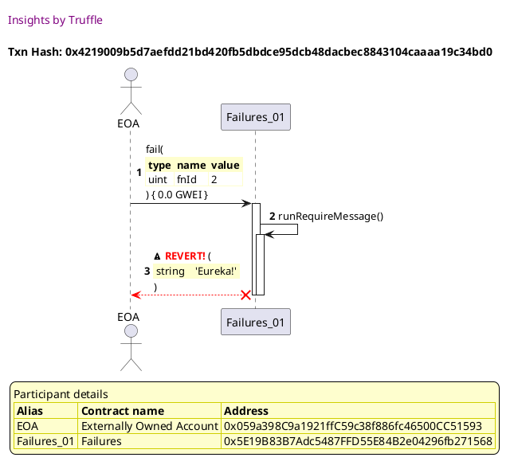
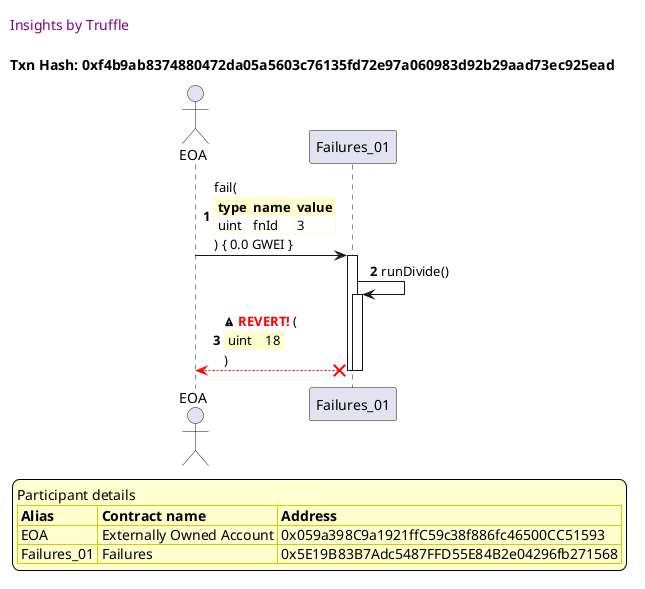
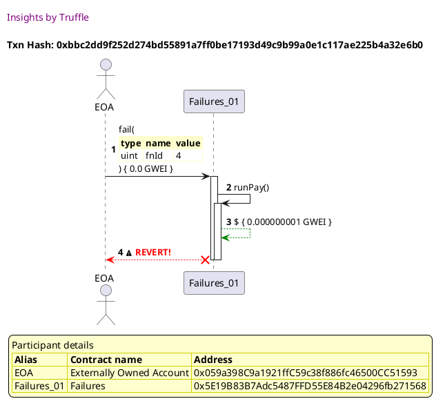
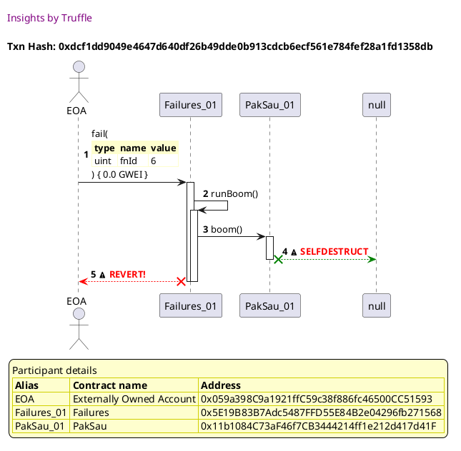
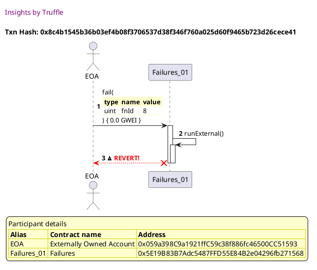
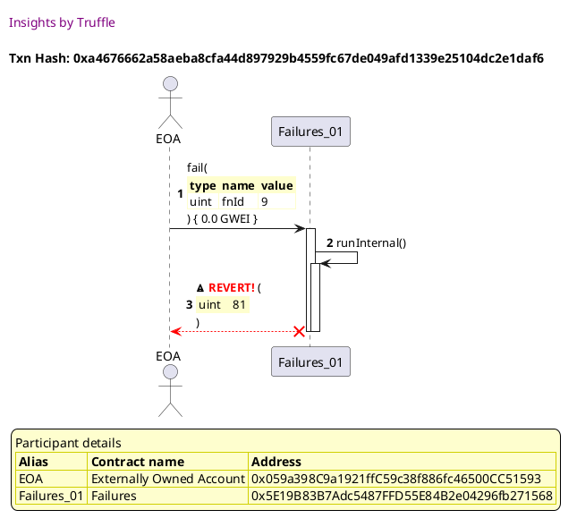
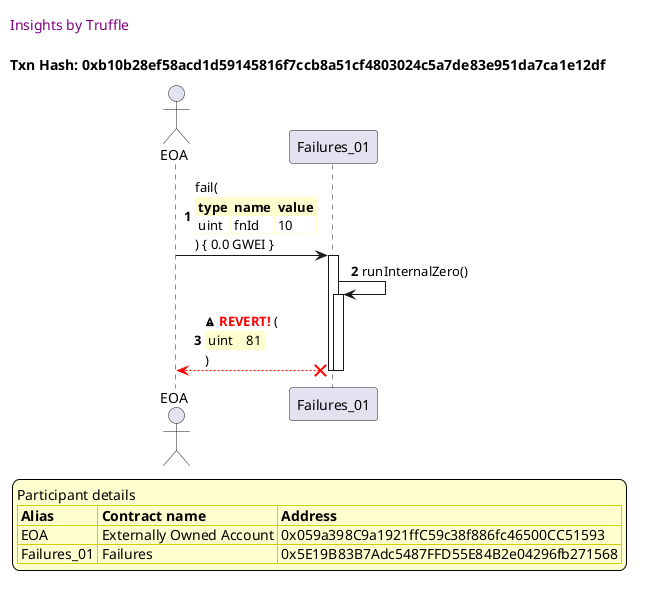

Test date: 2021 Feb 22


## assert
[link to test...](http://github.com/trufflesuite/txlog-seedlings/blob/1d44e677781e9cf21f80c1c42ebf5a82a0cd8a22/test/insurance.js#L29)

##### d1, tx: 0x4656ad451787f74fac372fe87f05d4625c0c921cf4da7b2573bbfb3bfcd00111

[SVG :telescope:](https://www.planttext.com/api/plantuml/svg/TLDjJzim4FxkNt43QO8oXlFY9a5THPkcm2SGGzk7CKsENqf4wbQE0osm_xvhcdKj6b7ai-_EpzqzToRah7BSkdfQ4i9hDpFrD5UML0-5cNFBfr2gYJ9ooCN3nCvg8zDPEREmFyx6MPeHqglSibHz0irthxXK5bxQ8y35p1RFC-DuEIYBYPagun1Hkut368rho7bjvwNQCNmjdXLuuKPtpQKip0Gysgf-Dx9tqYP1slYNfYeczww2V0ctjjOQSOahNAdWTc7WWbVtfq0NOPTrkGoP5yMHZaBDHH3vMk61CXbsVIQeI7nFw53oAFTP5EIvpeDS2qcfvta4AHCEKy-k1i0hs4EvHv0sLuXYph7KCI_Asghg5_KQXwtp7Y6DFnptT_LmT7GA6XK7T-QEz5gcFxMo__e5t7Ak0ANXqqO-yhB6pShz5Ue2uxw2DfSI1Lsh3-45w6SAvz-pIoHjDzv_4x2r6LILikxWy8txulZ7lbNov-hQke3ZK-XzVEBMO6_wq1Fh2K6VVgTpattBRcu_T3gzaqRVXtVA-fiu_bwRD94A-IqUkLDlg7lNGDRZIgwtcY2LGvTgA-Q8ZYYbAofnAh4lk4bnt2o2RaWTI8cWQDlSmnnNZSPruPGrl2oNSFLab8I14FWqLjdJ1MK93v8uJRY7iwDroX8Hn3gEkrhWm56QfinZIR0Bl3qe_quD8CkyP1W7msWW1GlZQ3mUCPR5uT1NDFIJhixzo6FT606nyhP-SeOhFke_)


## requires: no message
[link to test...](http://github.com/trufflesuite/txlog-seedlings/blob/1d44e677781e9cf21f80c1c42ebf5a82a0cd8a22/test/failures.test.js#L17)

##### d1, tx: 0x2cc50fffb3ac5a9b1a1a7c276e9324d7f17b84c5de2f49aa3a57ac55a9d46c33

[SVG :telescope:](https://www.planttext.com/api/plantuml/svg/TLDjJzim4FxkNt43QO8oXlFY9a5TH9kcWqyWXhOFOvfSlvI8rEqS1rhe_lkkQTIrQCi7dttt-F7TSnT2BYh7hQkd9I6yTZDJJyVAakgnC7Dk-HHADL563hXudDXPRMGsAsSM3aVvACzoGdgLMvOg9T1y3ufBPU6rFG9SpcpnCZEEb_soc9YfCWuPjTi2HXZSKCvhEo_LNk1ByQB02xU-6ovbOIRWqTRrkx6zipO9qhv_PQfYyk0g62_XpjPQ8oznXIiLt2qCNFBguHpemXU2KQtrEE22yMJiSOz7me-wAWdyK4RQYyPnA9XKlWuJpWFE8aGYL8PT4GG49HCEKy-l-y0hE41xG50sLuXYph7K4I_Asghg9_KQmCxvW9063wVflXzEJiv1e-FetjoJNglqXzQcgq_WbdC5Q0sVDlQ9bpLkrl0Lr0M-km9jhYGQR-C-XbUW7oby_fPVeMZxx_qp0LkRM_MhBgmwEdw3Nvn-FxHA_bZVsrHmUWwzzy_S6cnE2Zsn6H74f9tERVurlxrxr-dqpXf_IgH2rOedxjGRGVuR89iX93Sxqahb45Bj23IaGqhfMY2SDLGRDnaEaKNIhLHzAP4KOzjxwQff7wuBfwpXPRc4wsUZ9FI5m85VYqaNb2KyIE8iuLxYUrfdB151hEEugqNOPPHc6VDO4kmJxxR_xwaXPBcN3E9W4FMbO64SZKP3nl8u7FYAXdxIrMC_ybWtHaAilAsVNE2Al-eV)


## requires: a message
[link to test...](http://github.com/trufflesuite/txlog-seedlings/blob/1d44e677781e9cf21f80c1c42ebf5a82a0cd8a22/test/failures.test.js#L24)

##### d1, tx: 0x4219009b5d7aefdd21bd420fb5dbdce95dcb48dacbec8843104caaaa19c34bd0

[SVG :telescope:](https://www.planttext.com/api/plantuml/svg/TLDHJzim47xthpX06b36SDAaJL1NqOPqz642TMXx6DFas9SIaRh5SQ25xh_lcaPTYuOLvUoxytTttvqPkoYiCBQSv8o9qavrEKdGiE8XqpDXn0Ho7ADMVI4VncPQQXLDywc1Wq4yYAEOiKvX5pbs6LJh7eL20w_r4U1gQhANgROYx-NPM4zGMq9CxSPXGCOrvAmqinnt3D-o5mJ7s-XkX5AP7eF3QzMVIdREwYHO7N-eYsnyRmj85d1hoZGbN6OpcoFSpZLSYUB-7FZSSvsGyp3nLLjWgfJh9CfpUKgAH4aCVIKJBr129YY3m6iwt9E2bXFAffSepeWoQIdr-Be7ee1zalkCQBEPp6Q2IXs8B2yD5h-vKpbidVSPg_pXjBkhXvEJSqX9SNIdxrYdPlfZBRlBps0NCmIIMamg-IJoaZOhzoMK6SLTGgg7YeIxLX_3A_1F7BxyY8T4scwy_oPWIZt2np8p-1MBGepnwFZDjVdfpmE3wjVg-hgGqtFeV7WMHbEFkj2HwqaXdswZCOg_nwFRlKQZSrRfk_1EUL1Oi-hn4kWxZ2dSWzWxhCjW2ednx4bOV4FckmQs7c1sizKMXPPSYgteb_oISxuYb-QKEaMRY0RG4EY6vfvI14gspJtATjLw-iyj6YtoV07NpneLzAIanx9g19zpFnJDC8X26XpNITF8f_a9qY1efT9h-Pn7aU_uONCNU7jq_fqgG3zsmdxGxBTxIlfUq1uCBdq_3ho-YznpmrQQk6t7RmK4I9NNzRCB-jCp_mi0)





## divides: tries going to the moon
[link to test...](http://github.com/trufflesuite/txlog-seedlings/blob/1d44e677781e9cf21f80c1c42ebf5a82a0cd8a22/test/failures.test.js#L33)

##### d1, tx: 0xf4b9ab8374880472da05a5603c76135fd72e97a060983d92b29aad73ec925ead

[SVG :telescope:](https://www.planttext.com/api/plantuml/svg/TLDjJzim4FxkNt43QO8oXlFY94PTHPkcm2SGGzk7CKrkx1IBrAqS1rfW_ttNDEjQDAB8Pz-Tdxjxxap8MUM4TVMq94JKRcRgwLXPKZreCnTMJA5K4sNaGEGF4pkhZKndvSp2_YWRPMb6IBToorBr23JVlH9IMNXfZm0NCwkVPyQ9ib_gYPagun2nS1k74HhNaFFQpakrO_YgdnLuuKPtBQJKPW8URLM_6zazQPCWRVnBK-d9lQjWl8HRMnS5uXAdNQdWTc7WGbJtfq0NHJZcOfm4SPWaD8nzAIWJBA917aTUm0eP-uh7WaQK9u7a_jZdGiWuK3dt6KOYI5dkCFNigW-YWZsKUmHfSphNSu6bZeGkQwkgNzHh7BREUuGq_d3SszN3qT4f5AWuk3DtfDio_QcLlTSlu9Pp1IYDc3RoKPGrRbRkhr1hZFiAXRcKA8Ar-X1UW7wcSFuzkqJITkFzDm5Rcw5-r58T7BvnNnp_sBTA_bnTMnTmV0hTZq_26knD3xhvUaBGfzVft6JViflR3vrEzwJHz-2TilucZh-Nj5aJgP1W_IYSUiFTkmQodbTolTK5gHowL5j1XtH8ALrnYME9ZS5DYlDc4NJ3QbzA14NRvXuckUeqhWkdh15bkOIh9wCazFCStyOgVRgWZ8k09oaN7lUzeaWPpuEaI9AeoCE8KPgcp6Cys0NUdfH_fmQGPHuV9C4WxikSXKay6WqPov9mu2iQ-ZmgndxiiGX98rXvMpyvmnLVzHy0)





## transfer: tries to pay self
[link to test...](http://github.com/trufflesuite/txlog-seedlings/blob/1d44e677781e9cf21f80c1c42ebf5a82a0cd8a22/test/failures.test.js#L40)

##### d1, tx: 0xbbc2dd9f252d274bd55891a7ff0be17193d49c9b99a0e1c117ae225b4a32e6b0

[SVG :telescope:](https://www.planttext.com/api/plantuml/svg/TLDHJzim47xthxZ1D44PmqxZ9gwwY3QaWoSGGzl3c2OdTaf4wbQE0orq_tr76dKjOtxmsNVdx-w-EnDoMZbfNJqj2P6rcvbwccfBgll2pAMLKoZrH1irajdznCvge-9PEREmFqx6IPmGCgZSijGHWMRTQQcqXUVs2d0-iyNJp3XP3ijYOgRQE4JCtSPXZCOrvBosyrBl6BuMJngOlz5TIQKACm56MzNlHWvEsYH86__2LCNapbMGBk76rdcEkCGLhjHmip1mBgkxFj15ccQUKYBtkAUym4yLvw5WCiXpcceMCD5LliX4AeIaccMC1L9x7azzsVLqBwK4ASiSffvS3a5Mi8ToZo1jhiYAkSHInx8eQwkhNvGr3bltFK8QVpYETlLmTDI771K7j-QM35gcFxOoMdq6jvnhG6daj94FigpnyEA-Whh0k2l8pOL2uQ_LX_0Cz1E5Bz-J2oHjDzwR2TZQNCdbmU5htn_x4wkr-VdFepwyNmTf5tixs08Hh5RD-tNvntqOV7YKrc1d8nXaw_b2dwZJkKw-9TStxpgTmKcZZuZII7dn89r-nUP_3MGzmUHggozAEtIfjjWzesUOz0kxEAZOAZp4E84MGJSy3vL2KBHjtaMhflUuBvosHfRb4YuVZLOmp3ByBI-Te0lAXUoAC1QI2O_bUSn5rWtpCEpbcT_ZbCOnPrnqTu6tP-VlhG7a2HEZi3iAXYhZVXYCnsUS9w4_yZJrFT7BKozWl1SY85RUrazESST__WS0)





## transfer: tries to overpay self
[link to test...](http://github.com/trufflesuite/txlog-seedlings/blob/1d44e677781e9cf21f80c1c42ebf5a82a0cd8a22/test/failures.test.js#L47)

##### d1, tx: 0x280ab8e9acb3a5b31ba342d2b81350869f53a86fc653d66c1e3b22a23fb27530

[SVG :telescope:](https://www.planttext.com/api/plantuml/svg/bLDHJzim47xthxY1D44PmqdgaA0keWtfu8cALTl3cAPBx9I8rAqS1rhe_lkkQTIrsnwsFEJiky-VVPy_CtPPMJIsdfQCOMrdkfwcoh3giT1pD3Y5KasKbWFC7YTcLciPpygPWSDXCapYXB5UPPUbYXWqtuD2gGoyjbE0wvafNcRQOjalYucUAcs9CRTRm92A6yfvRUQbsYjyAbuKEDrjReHI5de23czJFvhOEsiFmThzRtHLJ1vi1UaIngRES-9bjh2bWl52mpLM3nV05sx0CGrKY5dgeKWz9qMlwqet3HnFyC0FS-5XuEUPBppf-vcZlDHrqVNor3qN7cSaMMRfwCbj7x220ue7Z6IpHLRCaLeTOb7MHbNVkTC0TkO7Z3LuE8tsyt1oSW4v9OxkzJthjKg_QsEq-W1sELT0KUEqYKzOrZHOmrTG5xJl2d9z8oc8JVeONe6_v_3nIt93ektlzzS3c5h7rC48bqV7_uAVu_9Q6VK7U77wzT0e-MszQDFkwGNqtZwZqNIJ4VIoZPy84tKwTyddv6xyfjFfdJNvY4b54XTFQDLlwlr_WMsip4Ox5oIL9KYr8_CLl-AShsKcnzATqI0cAneYtGhUbv98gRPT5wqQ4z1_OPNHM9PBk7tMIa8_o-ZPhA-4BxW8qGk3E4GdT9qyZqMOUK4Uh3tMzGNdSImS4NhxnBic-ZLh24NYX8F06vptPIQwmVbmU2L44dG7hk9TD_JNHdM47n0XTTxspoxfJm_-9m00)


## boom
[link to test...](http://github.com/trufflesuite/txlog-seedlings/blob/1d44e677781e9cf21f80c1c42ebf5a82a0cd8a22/test/failures.test.js#L55)

##### d1, tx: 0xdcf1dd9049e4647d640df26b49dde0b913cdcb6ecf561e784fef28a1fd1358db

[SVG :telescope:](https://www.planttext.com/api/plantuml/svg/VLHXJzim4FtkN-61D8qoXfquQOAwYZPD1j8a4Ess3sEQdDWk4QbJEGwqmFxxhcaeBMABb9nzz_pEldSEGgULvSRMim8XNjjIrxDK6bJTvdhE3P_XGawb5aEUtKvDMMiHbKLfy7uI9t4K8zIhxBAGVOIRvqPo8Gr-RASOdvKcVoYrvSMWoATw9hK5HcKtW0I2QyfvRUQ5t0cCymU9ATluBhaGkPvYIbhNdyRsZjjDe3R_kQxowOsjSBh44rCh1Rp8vhQGUBBG-8nNDoUOB4Icg10XOQ5aFkiAdn6X73zbeH2If25rCv6blioKvrFP3PYIoWauLOAwNY1I12NBB6mzlXXWNk4zi7i8ocRpB9zpE6h2yw8silfDQ0FOcky2B_djcDVFiCri3w6651_rTnVZmyCJhC3nuLfVeruhnyVMzfy-OxkSImnMyrbZxtXHms05Vy9r3ZcViDBd0eo_TX_WHqm-4VpbHtmEbTtDz-O6JAs7PJdxSF06-EKC3JHjSLlknT7F_QcHKlzQuNLT5B3ow0Jttjzpeq7dFkvbwsupKlGxdN7yDHd5uydLjsZIwVIEcs3_LUuLAy0RpdNf_aTv5N-FhoRljjY414tpEsxbAxd-6K3hAu8kj_GKqWAasb9cH4Q4a9KoS1D0P1X4qE86I3SQ3OG0KeXjrlMVckQ2xy9AetbHBF75lPO23x8ChkDAHR8WNiZTC8X2JaE7AXLvOUO6AWXybJ7V8oIAFEg5xYxnTdE-p1f2BwRXC727tO78F1PqasJaUN70Xeuap0bzbJfTwld1Bk5B4p-F6p9AKqe25dLTdZ1VTQEXonXpA5EAIeSwWj4kl0cGGHdROg9J-C9VwIy0)





## Out of gas
[link to test...](http://github.com/trufflesuite/txlog-seedlings/blob/1d44e677781e9cf21f80c1c42ebf5a82a0cd8a22/test/failures.test.js#L62)

##### d1, tx: 0x5109dfb5593a78ea1b92147c752e18b2423b516c397a71ac9de933a59e94856e

[SVG :telescope:](https://www.planttext.com/api/plantuml/svg/xPnTRzem58Rl_IiyAaqhNLVdmoIk62hGqFQAggksYtMQJEBGgC51YTD2o_xxJ40Cfls0NRnSv60_vpd-kFSXvA8oiZJrB2T4rgRGzMoYIb8zPNekIpcZkPegdGna_3GjYredmo8lIdeqYaRHC2AaMvbbhdg4Dhz79HDLqhVjaDBheinU2srati-pgPufRMp5rEmIHXPkIixhSfwh0_0bUrNKyNTpjp99CZsb3jjE_MfYzsox2R9T_qPNsVJHL7IofFTbdQQsBZ6PoHMzNsXwBQl7SyeMt64YIIUS2qy6ePBEHBYE7yG1TvKJJbpVzIRSwSIU26JWo5WaIdYUv489F-GTMvF8sDYjH-C-bHLjsTWYzjfC5cTpQOywabbUbwhwoPmcOM_S8gJ9fwUzmtbwSd9EKplnuK4_aExsfZzkOs_rcPhbN54RjPmryLdcjVspJb_HEhFhhcYgRn8RWitqCNsZx1EZLz-Y6tjfX-lzSmDbhSUr6QTNilfm304210WG8420004210WG8420004210WG8420004210WG8420004210WG8420004210WG84200052YovEln-LAlcn5ZSlOqxFQVVzYonrfgSzseqtJuziJg_Tlek-HdVtxzhjxbaptoE9ah79dgLHVpsq0G0000000000000000000000000000000FW_0TdqeYEtUntM4cLiIhNN9-sINJB6rdtI-dacgtM3j66XJMcBxZgczPF45hLiv_LMJHSt-rqOLMgPvqiwVj4geVquBkgcfnfRC2wa9yAXa8vmdJGTSX5xOHg6dJJsEvonuP0xN7Y7XVUxmFqPDGLvv8X1w0s2VX9pFmn6eqlEez0Vk8hvhkYa4pTmU2Uq1Ut9j-Sd5_PRp_BV)


```plantuml


@startuml

autonumber
skinparam legendBackgroundColor #FEFECE

<style>
      header {
        HorizontalAlignment left
        FontColor purple
        FontSize 14
        Padding 10
      }
    </style>

header Insights by Truffle

title Txn Hash: 0x5109dfb5593a78ea1b92147c752e18b2423b516c397a71ac9de933a59e94856e


actor EOA as "EOA"
participant Failures_01 as "Failures_01"

"EOA" -> "Failures_01" ++: fail(\n\
<#FEFECE,#FEFECE>|= type |= name |= value |\n\
| uint | fnId | 7 |\n\
) { 0.0 GWEI }
"Failures_01" -> "Failures_01" ++: runOutOfGas()
"Failures_01" -> "Failures_01" ++: runOutOfGas()
"Failures_01" -> "Failures_01" ++: runOutOfGas()
"Failures_01" -> "Failures_01" ++: runOutOfGas()
"Failures_01" -> "Failures_01" ++: runOutOfGas()
"Failures_01" -> "Failures_01" ++: runOutOfGas()
"Failures_01" -> "Failures_01" ++: runOutOfGas()
"Failures_01" -> "Failures_01" ++: runOutOfGas()
"Failures_01" -> "Failures_01" ++: runOutOfGas()
"Failures_01" -> "Failures_01" ++: runOutOfGas()
"Failures_01" -> "Failures_01" ++: runOutOfGas()
"Failures_01" -> "Failures_01" ++: runOutOfGas()
"Failures_01" -> "Failures_01" ++: runOutOfGas()
"Failures_01" -> "Failures_01" ++: runOutOfGas()
"Failures_01" -> "Failures_01" ++: runOutOfGas()
"Failures_01" -> "Failures_01" ++: runOutOfGas()
"Failures_01" -> "Failures_01" ++: runOutOfGas()
"Failures_01" -> "Failures_01" ++: runOutOfGas()
"Failures_01" -> "Failures_01" ++: runOutOfGas()
"Failures_01" -> "Failures_01" ++: runOutOfGas()
"Failures_01" -> "Failures_01" ++: runOutOfGas()
"Failures_01" -> "Failures_01" ++: runOutOfGas()
"Failures_01" -> "Failures_01" ++: runOutOfGas()
"Failures_01" -> "Failures_01" ++: runOutOfGas()
"Failures_01" -> "Failures_01" ++: runOutOfGas()
"Failures_01" -> "Failures_01" ++: runOutOfGas()
"Failures_01" -> "Failures_01" ++: runOutOfGas()
"Failures_01" -> "Failures_01" ++: runOutOfGas()
"Failures_01" -> "Failures_01" ++: runOutOfGas()
"Failures_01" -> "Failures_01" ++: runOutOfGas()
"Failures_01" -> "Failures_01" ++: runOutOfGas()
"Failures_01" -> "Failures_01" ++: runOutOfGas()
"Failures_01" -> "Failures_01" ++: runOutOfGas()
"Failures_01" -> "Failures_01" ++: runOutOfGas()
"Failures_01" -> "Failures_01" ++: runOutOfGas()
"Failures_01" -> "Failures_01" ++: runOutOfGas()
"Failures_01" -> "Failures_01" ++: runOutOfGas()
"Failures_01" -> "Failures_01" ++: runOutOfGas()
"Failures_01" -> "Failures_01" ++: runOutOfGas()
"Failures_01" -> "Failures_01" ++: runOutOfGas()
"Failures_01" -> "Failures_01" ++: runOutOfGas()
"Failures_01" -> "Failures_01" ++: runOutOfGas()
"Failures_01" -> "Failures_01" ++: runOutOfGas()
"Failures_01" -> "Failures_01" ++: runOutOfGas()
"Failures_01" -> "Failures_01" ++: runOutOfGas()
"Failures_01" -> "Failures_01" ++: runOutOfGas()
"Failures_01" -> "Failures_01" ++: runOutOfGas()
"Failures_01" -> "Failures_01" ++: runOutOfGas()
"Failures_01" -> "Failures_01" ++: runOutOfGas()
"Failures_01" -> "Failures_01" ++: runOutOfGas()
"Failures_01" -> "Failures_01" ++: runOutOfGas()
"Failures_01" -> "Failures_01" ++: runOutOfGas()
"Failures_01" -> "Failures_01" ++: runOutOfGas()
"Failures_01" -> "Failures_01" ++: runOutOfGas()
"Failures_01" -> "Failures_01" ++: runOutOfGas()
"Failures_01" -> "Failures_01" ++: runOutOfGas()
"Failures_01" -> "Failures_01" ++: runOutOfGas()
"Failures_01" -> "Failures_01" ++: runOutOfGas()
"Failures_01" -> "Failures_01" ++: runOutOfGas()
"Failures_01" -> "Failures_01" ++: runOutOfGas()
"Failures_01" -> "Failures_01" ++: runOutOfGas()
"Failures_01" -> "Failures_01" ++: runOutOfGas()
"Failures_01" -> "Failures_01" ++: runOutOfGas()
"Failures_01" -> "Failures_01" ++: runOutOfGas()
"Failures_01" -> "Failures_01" ++: runOutOfGas()
"Failures_01" -> "Failures_01" ++: runOutOfGas()
"Failures_01" -> "Failures_01" ++: runOutOfGas()
"Failures_01" -> "Failures_01" ++: runOutOfGas()
"Failures_01" -> "Failures_01" ++: runOutOfGas()
"Failures_01" -> "Failures_01" ++: runOutOfGas()
"Failures_01" -> "Failures_01" ++: runOutOfGas()
"Failures_01" -> "Failures_01" ++: runOutOfGas()
"Failures_01" -> "Failures_01" ++: runOutOfGas()
"Failures_01" -> "Failures_01" ++: runOutOfGas()
"Failures_01" -> "Failures_01" ++: runOutOfGas()
"Failures_01" -> "Failures_01" ++: runOutOfGas()
"Failures_01" -> "Failures_01" ++: runOutOfGas()
"Failures_01" -> "Failures_01" ++: runOutOfGas()
"Failures_01" -> "Failures_01" ++: runOutOfGas()
"Failures_01" -> "Failures_01" ++: runOutOfGas()
"Failures_01" -> "Failures_01" ++: runOutOfGas()
"Failures_01" -> "Failures_01" ++: runOutOfGas()
"Failures_01" -> "Failures_01" ++: runOutOfGas()
"Failures_01" -> "Failures_01" ++: runOutOfGas()
"Failures_01" -> "Failures_01" ++: runOutOfGas()
"Failures_01" -> "Failures_01" ++: runOutOfGas()
"Failures_01" -> "Failures_01" ++: runOutOfGas()
"Failures_01" -> "Failures_01" ++: runOutOfGas()
"Failures_01" -> "Failures_01" ++: runOutOfGas()
"Failures_01" -> "Failures_01" ++: runOutOfGas()
"Failures_01" -> "Failures_01" ++: runOutOfGas()
"Failures_01" -> "Failures_01" ++: runOutOfGas()
"Failures_01" -> "Failures_01" ++: runOutOfGas()
"Failures_01" -> "Failures_01" ++: runOutOfGas()
"Failures_01" -> "Failures_01" ++: runOutOfGas()
"Failures_01" -> "Failures_01" ++: runOutOfGas()
"Failures_01" -> "Failures_01" ++: runOutOfGas()
"Failures_01" -> "Failures_01" ++: runOutOfGas()
"Failures_01" -> "Failures_01" ++: runOutOfGas()
"Failures_01" -> "Failures_01" ++: runOutOfGas()
"Failures_01" -> "Failures_01" ++: runOutOfGas()
"Failures_01" -> "Failures_01" ++: runOutOfGas()
"Failures_01" -> "Failures_01" ++: runOutOfGas()
"Failures_01" -> "Failures_01" ++: runOutOfGas()
"Failures_01" -> "Failures_01" ++: runOutOfGas()
"Failures_01" -> "Failures_01" ++: runOutOfGas()
"Failures_01" -> "Failures_01" ++: runOutOfGas()
"Failures_01" -> "Failures_01" ++: runOutOfGas()
"Failures_01" -> "Failures_01" ++: runOutOfGas()
"Failures_01" -> "Failures_01" ++: runOutOfGas()
"Failures_01" -> "Failures_01" ++: runOutOfGas()
"Failures_01" -> "Failures_01" ++: runOutOfGas()
"Failures_01" -> "Failures_01" ++: runOutOfGas()
"Failures_01" -> "Failures_01" ++: runOutOfGas()
"Failures_01" -> "Failures_01" ++: runOutOfGas()
"Failures_01" -> "Failures_01" ++: runOutOfGas()
"Failures_01" -> "Failures_01" ++: runOutOfGas()
"Failures_01" -> "Failures_01" ++: runOutOfGas()
"Failures_01" -> "Failures_01" ++: runOutOfGas()
"Failures_01" -> "Failures_01" ++: runOutOfGas()
"Failures_01" -> "Failures_01" ++: runOutOfGas()
"Failures_01" -> "Failures_01" ++: runOutOfGas()
"Failures_01" -> "Failures_01" ++: runOutOfGas()
"Failures_01" -> "Failures_01" ++: runOutOfGas()
"Failures_01" -> "Failures_01" ++: runOutOfGas()
"Failures_01" -> "Failures_01" ++: runOutOfGas()
"Failures_01" -> "Failures_01" ++: runOutOfGas()
"Failures_01" -> "Failures_01" ++: runOutOfGas()
"Failures_01" -> "Failures_01" ++: runOutOfGas()
"Failures_01" -> "Failures_01" ++: runOutOfGas()
"Failures_01" -> "Failures_01" ++: runOutOfGas()
"Failures_01" -> "Failures_01" ++: runOutOfGas()
"Failures_01" -> "Failures_01" ++: runOutOfGas()
"Failures_01" -> "Failures_01" ++: runOutOfGas()
"Failures_01" -> "Failures_01" ++: runOutOfGas()
"Failures_01" -> "Failures_01" ++: runOutOfGas()
"Failures_01" -> "Failures_01" ++: runOutOfGas()
"Failures_01" -> "Failures_01" ++: runOutOfGas()
"Failures_01" -> "Failures_01" ++: runOutOfGas()
"Failures_01" -> "Failures_01" ++: runOutOfGas()
"Failures_01" -> "Failures_01" ++: runOutOfGas()
"Failures_01" -> "Failures_01" ++: runOutOfGas()
"Failures_01" -> "Failures_01" ++: runOutOfGas()
"Failures_01" -> "Failures_01" ++: runOutOfGas()
"Failures_01" -> "Failures_01" ++: runOutOfGas()
"Failures_01" -> "Failures_01" ++: runOutOfGas()
"Failures_01" -> "Failures_01" ++: runOutOfGas()
"Failures_01" -> "Failures_01" ++: runOutOfGas()
"Failures_01" -> "Failures_01" ++: runOutOfGas()
"Failures_01" -> "Failures_01" ++: runOutOfGas()
"Failures_01" -> "Failures_01" ++: runOutOfGas()
"Failures_01" -> "Failures_01" ++: runOutOfGas()
"Failures_01" -> "Failures_01" ++: runOutOfGas()
"Failures_01" -> "Failures_01" ++: runOutOfGas()
"Failures_01" -> "Failures_01" ++: runOutOfGas()
"Failures_01" -> "Failures_01" ++: runOutOfGas()
"Failures_01" -> "Failures_01" ++: runOutOfGas()
"Failures_01" -> "Failures_01" ++: runOutOfGas()
"Failures_01" -> "Failures_01" ++: runOutOfGas()
"Failures_01" -> "Failures_01" ++: runOutOfGas()
"Failures_01" -> "Failures_01" ++: runOutOfGas()
"Failures_01" -> "Failures_01" ++: runOutOfGas()
"Failures_01" -> "Failures_01" ++: runOutOfGas()
"Failures_01" -> "Failures_01" ++: runOutOfGas()
"Failures_01" -> "Failures_01" ++: runOutOfGas()
"Failures_01" -> "Failures_01" ++: runOutOfGas()
"Failures_01" -> "Failures_01" ++: runOutOfGas()
"Failures_01" -> "Failures_01" ++: runOutOfGas()
"Failures_01" -> "Failures_01" ++: runOutOfGas()
"Failures_01" -> "Failures_01" ++: runOutOfGas()
"Failures_01" -> "Failures_01" ++: runOutOfGas()
"Failures_01" -> "Failures_01" ++: runOutOfGas()
"Failures_01" -> "Failures_01" ++: runOutOfGas()
"Failures_01" -> "Failures_01" ++: runOutOfGas()
"Failures_01" -> "Failures_01" ++: runOutOfGas()
"Failures_01" -> "Failures_01" ++: runOutOfGas()
"Failures_01" -> "Failures_01" ++: runOutOfGas()
"Failures_01" -> "Failures_01" ++: runOutOfGas()
"Failures_01" -> "Failures_01" ++: runOutOfGas()
"Failures_01" -> "Failures_01" ++: runOutOfGas()
"Failures_01" -> "Failures_01" ++: runOutOfGas()
"Failures_01" -> "Failures_01" ++: runOutOfGas()
"Failures_01" -> "Failures_01" ++: runOutOfGas()
"Failures_01" -> "Failures_01" ++: runOutOfGas()
"Failures_01" -> "Failures_01" ++: runOutOfGas()
"Failures_01" -> "Failures_01" ++: runOutOfGas()
"Failures_01" -> "Failures_01" ++: runOutOfGas()
"Failures_01" -> "Failures_01" ++: runOutOfGas()
"Failures_01" -> "Failures_01" ++: runOutOfGas()
"Failures_01" -> "Failures_01" ++: runOutOfGas()
"Failures_01" -> "Failures_01" ++: runOutOfGas()
"Failures_01" -> "Failures_01" ++: runOutOfGas()
"Failures_01" -> "Failures_01" ++: runOutOfGas()
"Failures_01" -> "Failures_01" ++: runOutOfGas()
"Failures_01" -> "Failures_01" ++: runOutOfGas()
"Failures_01" -> "Failures_01" ++: runOutOfGas()
"Failures_01" -> "Failures_01" ++: runOutOfGas()
"Failures_01" -> "Failures_01" ++: runOutOfGas()
"Failures_01" -> "Failures_01" ++: runOutOfGas()
"Failures_01" -> "Failures_01" ++: runOutOfGas()
"Failures_01" -> "Failures_01" ++: runOutOfGas()
"Failures_01" -> "Failures_01" ++: runOutOfGas()
"Failures_01" -> "Failures_01" ++: runOutOfGas()
"Failures_01" -> "Failures_01" ++: runOutOfGas()
"Failures_01" -> "Failures_01" ++: runOutOfGas()
"Failures_01" -> "Failures_01" ++: runOutOfGas()
"Failures_01" -> "Failures_01" ++: runOutOfGas()
"Failures_01" -> "Failures_01" ++: runOutOfGas()
"Failures_01" -> "Failures_01" ++: runOutOfGas()
"Failures_01" -> "Failures_01" ++: runOutOfGas()
"Failures_01" -> "Failures_01" ++: runOutOfGas()
"Failures_01" -> "Failures_01" ++: runOutOfGas()
"Failures_01" -> "Failures_01" ++: runOutOfGas()
"Failures_01" -> "Failures_01" ++: runOutOfGas()
"Failures_01" -> "Failures_01" ++: runOutOfGas()
"Failures_01" -> "Failures_01" ++: runOutOfGas()
"Failures_01" -> "Failures_01" ++: runOutOfGas()
"Failures_01" -> "Failures_01" ++: runOutOfGas()
"Failures_01" -> "Failures_01" ++: runOutOfGas()
"Failures_01" -> "Failures_01" ++: runOutOfGas()
"Failures_01" -> "Failures_01" ++: runOutOfGas()
"Failures_01" -> "Failures_01" ++: runOutOfGas()
"Failures_01" -> "Failures_01" ++: runOutOfGas()
"Failures_01" -> "Failures_01" ++: runOutOfGas()
"Failures_01" -> "Failures_01" ++: runOutOfGas()
"Failures_01" -> "Failures_01" ++: runOutOfGas()
"Failures_01" -> "Failures_01" ++: runOutOfGas()
"Failures_01" -> "Failures_01" ++: runOutOfGas()
"Failures_01" -> "Failures_01" ++: runOutOfGas()
"Failures_01" -> "Failures_01" ++: runOutOfGas()
"Failures_01" -> "Failures_01" ++: runOutOfGas()
"Failures_01" -> "Failures_01" ++: runOutOfGas()
"Failures_01" -> "Failures_01" ++: runOutOfGas()
"Failures_01" -> "Failures_01" ++: runOutOfGas()
"Failures_01" -> "Failures_01" ++: runOutOfGas()
"Failures_01" -> "Failures_01" ++: runOutOfGas()
"Failures_01" -> "Failures_01" ++: runOutOfGas()
"Failures_01" -> "Failures_01" ++: runOutOfGas()
"Failures_01" -> "Failures_01" ++: runOutOfGas()
"Failures_01" -> "Failures_01" ++: runOutOfGas()
"Failures_01" -> "Failures_01" ++: runOutOfGas()
"Failures_01" -> "Failures_01" ++: runOutOfGas()
"Failures_01" -> "Failures_01" ++: runOutOfGas()
"Failures_01" -> "Failures_01" ++: runOutOfGas()
"Failures_01" -> "Failures_01" ++: runOutOfGas()
"Failures_01" -> "Failures_01" ++: runOutOfGas()
"Failures_01" -> "Failures_01" ++: runOutOfGas()
"Failures_01" -> "Failures_01" ++: runOutOfGas()
"Failures_01" -> "Failures_01" ++: runOutOfGas()
"Failures_01" -> "Failures_01" ++: runOutOfGas()
"Failures_01" -> "Failures_01" ++: runOutOfGas()
"Failures_01" -> "Failures_01" ++: runOutOfGas()
"Failures_01" -> "Failures_01" ++: runOutOfGas()
"Failures_01" -> "Failures_01" ++: runOutOfGas()
"Failures_01" -> "Failures_01" ++: runOutOfGas()
"Failures_01" -> "Failures_01" ++: runOutOfGas()
"Failures_01" -> "Failures_01" ++: runOutOfGas()
"Failures_01" -> "Failures_01" ++: runOutOfGas()
"Failures_01" -> "Failures_01" ++: runOutOfGas()
"Failures_01" -> "Failures_01" ++: runOutOfGas()
"Failures_01" -> "Failures_01" ++: runOutOfGas()
"Failures_01" -> "Failures_01" ++: runOutOfGas()
"Failures_01" -> "Failures_01" ++: runOutOfGas()
"Failures_01" -> "Failures_01" ++: runOutOfGas()
"Failures_01" x-[#red]-> "EOA" --: <&warning> <color #red>**REVERT!**</color>
deactivate "Failures_01"
deactivate "Failures_01"
deactivate "Failures_01"
deactivate "Failures_01"
deactivate "Failures_01"
deactivate "Failures_01"
deactivate "Failures_01"
deactivate "Failures_01"
deactivate "Failures_01"
deactivate "Failures_01"
deactivate "Failures_01"
deactivate "Failures_01"
deactivate "Failures_01"
deactivate "Failures_01"
deactivate "Failures_01"
deactivate "Failures_01"
deactivate "Failures_01"
deactivate "Failures_01"
deactivate "Failures_01"
deactivate "Failures_01"
deactivate "Failures_01"
deactivate "Failures_01"
deactivate "Failures_01"
deactivate "Failures_01"
deactivate "Failures_01"
deactivate "Failures_01"
deactivate "Failures_01"
deactivate "Failures_01"
deactivate "Failures_01"
deactivate "Failures_01"
deactivate "Failures_01"
deactivate "Failures_01"
deactivate "Failures_01"
deactivate "Failures_01"
deactivate "Failures_01"
deactivate "Failures_01"
deactivate "Failures_01"
deactivate "Failures_01"
deactivate "Failures_01"
deactivate "Failures_01"
deactivate "Failures_01"
deactivate "Failures_01"
deactivate "Failures_01"
deactivate "Failures_01"
deactivate "Failures_01"
deactivate "Failures_01"
deactivate "Failures_01"
deactivate "Failures_01"
deactivate "Failures_01"
deactivate "Failures_01"
deactivate "Failures_01"
deactivate "Failures_01"
deactivate "Failures_01"
deactivate "Failures_01"
deactivate "Failures_01"
deactivate "Failures_01"
deactivate "Failures_01"
deactivate "Failures_01"
deactivate "Failures_01"
deactivate "Failures_01"
deactivate "Failures_01"
deactivate "Failures_01"
deactivate "Failures_01"
deactivate "Failures_01"
deactivate "Failures_01"
deactivate "Failures_01"
deactivate "Failures_01"
deactivate "Failures_01"
deactivate "Failures_01"
deactivate "Failures_01"
deactivate "Failures_01"
deactivate "Failures_01"
deactivate "Failures_01"
deactivate "Failures_01"
deactivate "Failures_01"
deactivate "Failures_01"
deactivate "Failures_01"
deactivate "Failures_01"
deactivate "Failures_01"
deactivate "Failures_01"
deactivate "Failures_01"
deactivate "Failures_01"
deactivate "Failures_01"
deactivate "Failures_01"
deactivate "Failures_01"
deactivate "Failures_01"
deactivate "Failures_01"
deactivate "Failures_01"
deactivate "Failures_01"
deactivate "Failures_01"
deactivate "Failures_01"
deactivate "Failures_01"
deactivate "Failures_01"
deactivate "Failures_01"
deactivate "Failures_01"
deactivate "Failures_01"
deactivate "Failures_01"
deactivate "Failures_01"
deactivate "Failures_01"
deactivate "Failures_01"
deactivate "Failures_01"
deactivate "Failures_01"
deactivate "Failures_01"
deactivate "Failures_01"
deactivate "Failures_01"
deactivate "Failures_01"
deactivate "Failures_01"
deactivate "Failures_01"
deactivate "Failures_01"
deactivate "Failures_01"
deactivate "Failures_01"
deactivate "Failures_01"
deactivate "Failures_01"
deactivate "Failures_01"
deactivate "Failures_01"
deactivate "Failures_01"
deactivate "Failures_01"
deactivate "Failures_01"
deactivate "Failures_01"
deactivate "Failures_01"
deactivate "Failures_01"
deactivate "Failures_01"
deactivate "Failures_01"
deactivate "Failures_01"
deactivate "Failures_01"
deactivate "Failures_01"
deactivate "Failures_01"
deactivate "Failures_01"
deactivate "Failures_01"
deactivate "Failures_01"
deactivate "Failures_01"
deactivate "Failures_01"
deactivate "Failures_01"
deactivate "Failures_01"
deactivate "Failures_01"
deactivate "Failures_01"
deactivate "Failures_01"
deactivate "Failures_01"
deactivate "Failures_01"
deactivate "Failures_01"
deactivate "Failures_01"
deactivate "Failures_01"
deactivate "Failures_01"
deactivate "Failures_01"
deactivate "Failures_01"
deactivate "Failures_01"
deactivate "Failures_01"
deactivate "Failures_01"
deactivate "Failures_01"
deactivate "Failures_01"
deactivate "Failures_01"
deactivate "Failures_01"
deactivate "Failures_01"
deactivate "Failures_01"
deactivate "Failures_01"
deactivate "Failures_01"
deactivate "Failures_01"
deactivate "Failures_01"
deactivate "Failures_01"
deactivate "Failures_01"
deactivate "Failures_01"
deactivate "Failures_01"
deactivate "Failures_01"
deactivate "Failures_01"
deactivate "Failures_01"
deactivate "Failures_01"
deactivate "Failures_01"
deactivate "Failures_01"
deactivate "Failures_01"
deactivate "Failures_01"
deactivate "Failures_01"
deactivate "Failures_01"
deactivate "Failures_01"
deactivate "Failures_01"
deactivate "Failures_01"
deactivate "Failures_01"
deactivate "Failures_01"
deactivate "Failures_01"
deactivate "Failures_01"
deactivate "Failures_01"
deactivate "Failures_01"
deactivate "Failures_01"
deactivate "Failures_01"
deactivate "Failures_01"
deactivate "Failures_01"
deactivate "Failures_01"
deactivate "Failures_01"
deactivate "Failures_01"
deactivate "Failures_01"
deactivate "Failures_01"
deactivate "Failures_01"
deactivate "Failures_01"
deactivate "Failures_01"
deactivate "Failures_01"
deactivate "Failures_01"
deactivate "Failures_01"
deactivate "Failures_01"
deactivate "Failures_01"
deactivate "Failures_01"
deactivate "Failures_01"
deactivate "Failures_01"
deactivate "Failures_01"
deactivate "Failures_01"
deactivate "Failures_01"
deactivate "Failures_01"
deactivate "Failures_01"
deactivate "Failures_01"
deactivate "Failures_01"
deactivate "Failures_01"
deactivate "Failures_01"
deactivate "Failures_01"
deactivate "Failures_01"
deactivate "Failures_01"
deactivate "Failures_01"
deactivate "Failures_01"
deactivate "Failures_01"
deactivate "Failures_01"
deactivate "Failures_01"
deactivate "Failures_01"
deactivate "Failures_01"
deactivate "Failures_01"
deactivate "Failures_01"
deactivate "Failures_01"
deactivate "Failures_01"
deactivate "Failures_01"
deactivate "Failures_01"
deactivate "Failures_01"
deactivate "Failures_01"
deactivate "Failures_01"
deactivate "Failures_01"
deactivate "Failures_01"
deactivate "Failures_01"
deactivate "Failures_01"
deactivate "Failures_01"
deactivate "Failures_01"
deactivate "Failures_01"
deactivate "Failures_01"
deactivate "Failures_01"
deactivate "Failures_01"
deactivate "Failures_01"
deactivate "Failures_01"
deactivate "Failures_01"
deactivate "Failures_01"
deactivate "Failures_01"
deactivate "Failures_01"
deactivate "Failures_01"
deactivate "Failures_01"
deactivate "Failures_01"
deactivate "Failures_01"
deactivate "Failures_01"
deactivate "Failures_01"
deactivate "Failures_01"
deactivate "Failures_01"
deactivate "Failures_01"
deactivate "Failures_01"
deactivate "Failures_01"
deactivate "Failures_01"
deactivate "Failures_01"
deactivate "Failures_01"
deactivate "Failures_01"
deactivate "Failures_01"
deactivate "Failures_01"
deactivate "Failures_01"
deactivate "Failures_01"
deactivate "Failures_01"

legend
Participant details
<#FEFECE,#D0D000>|= Alias |= Contract name |= Address |
<#FEFECE>| EOA | Externally Owned Account | 0x059a398C9a1921ffC59c38f886fc46500CC51593 |
<#FEFECE>| Failures_01 | Failures | 0x5E19B83B7Adc5487FFD55E84B2e04296fb271568 |
endlegend

@enduml
```


## checks out external garbage
[link to test...](http://github.com/trufflesuite/txlog-seedlings/blob/1d44e677781e9cf21f80c1c42ebf5a82a0cd8a22/test/failures.test.js#L70)

##### d1, tx: 0x8c4b1545b36b03ef4b08f3706537d38f346f760a025d60f9465b723d26cece41

[SVG :telescope:](https://www.planttext.com/api/plantuml/svg/TLDjJzim4FxkNt43QO8oXlFYlA0kearJu1E8eUt3c2Odjaj4wbQE0orq_ttNDEfQjEM3xtntVknxxWaX5xNbnZRJYX3Us9bkfhaqf7ugzPmRFeLAJgGMGruyJSoiqIATLJC3X-DidAKP8VtQBYkP46Y_Hyc5DF3MRG6kPgPydMdBgq5LJlHKQek8ocuBnfZSGCuRCw_aNk9h-Ih1yRUnMov4gIVWq2xqkxNzi-uHfBl_MjVbvD7Ma2_XtZHA8IwnfQqat2yqNF7wyHpe8Yhyt64-oxqWfvvKVauZvOKqO5ueF7JzG8K1vTHb8g0gzWEMXwudtA2GXVGTWfGL5f-UtGo0rt20ze0WRROioZd7LiUyh1eZwr_KQGjszWU4jFLmckp7uUJa71G6ZXxq0-btJ7_gRBBw0dOvbu1MysbhdtdLeBCkNq5JuhqhKFfQe8asuMDu0_gPmkNtx1f9sx_ldmymZSuMLXhDgwFZTmSMfpyEZHG_rmStBPoUG__Z2pSQfvD0lzXe16kINkyk-vRTtN_ezVfdRJmXGY9jvJEtyXqZ_qsGZGh9xGwtGbeigNSO6j4HfNJD48eDwKOdHHKP1DroDH02GJ6tFPUisldXslLRBU7cHKi1Ww90nQ_Pf0lAOkx5KHfp9tOTfL8M5oYHA0fKWRgWD4sPms9l7tXt_dztBI3Bd7WOUSDm80hcH-5uF68iY_oXAwdlne7AtT1X0GwGOETT_-G2L_nN_m00)





## checks out internal garbage
[link to test...](http://github.com/trufflesuite/txlog-seedlings/blob/1d44e677781e9cf21f80c1c42ebf5a82a0cd8a22/test/failures.test.js#L78)

##### d1, tx: 0xa4676662a58aeba8cfa44d897929b4559fc67de049afd1339e25104dc2e1daf6

[SVG :telescope:](https://www.planttext.com/api/plantuml/svg/TLDHJzim47xthxY1D44PmqdZD4PTHPicq2SGGzl3c2Otjaj4wbQE0orq_ttNDEjQDAB8Pz-Tlxlxxap8HUc4TTMq84HKRcQgwLXPKZxcPYwic4AX9ih8WSWU9tPM6HdFYfc5mpH9apWXf5kwPQ5w1EhlGGcfBBmsHu2hcSrVPiQ9eb_a4pDLnY6YTbk758qRo7bbvuNQCtpDNnHumLPt8wJCpGGysgX-rx9xrYH1clWZK-QJ1rV2U0btjj8QSOdBNQ7WRc7WIfGFvq0N8WWxOHZwWaL2ZKMKQH44Ck8TxlDnm1ZNMTYHYWPSQEcrsrpvpAE1p7pbIQ53WfHb3bDFhliWIZX0UK2GDfTd-LnWgQd8YyggyXVrQeUTym4XjJ-SzlRrS79o3XeLH_VcddGRfZyrihVw0cuvLu3IY6ajdqHHuMRjle8gnxWhq6OaKV2D-XXUWNwcSFaz6I5f-_7-cu2jpCWuPOqeZexVN5YS_ZYqIlvSNzoKS7eEtO_FmXhiJW-wsMP6qAVNQjqctvBRkm-jLlUirlVWdSB-fev_v3Lv4wcGuln9EFM6lNSDP3Env6Qd3r8vT2btWWxfa5AwPXC74rk3cnWdpYBebjU-b0YAjkqzJ7BTQrmN6swA9Lm_6oMXdsNuEjRfqmLbNBHv57FXST_JEcOyQqSwYaAT1I6ZD8wPntXx7tXtLlwTQa2MU7mGjGUTlinO47NITCXO4WK37uVJvw4U-nsFXH42OkLD_UG2LtpNVm00)





## InternalZero: stately
[link to test...](http://github.com/trufflesuite/txlog-seedlings/blob/1d44e677781e9cf21f80c1c42ebf5a82a0cd8a22/test/failures.test.js#L86)

##### d1, tx: 0xb10b28ef58acd1d59145816f7ccb8a51cf4803024c5a7de83e951da7ca1e12df

[SVG :telescope:](https://www.planttext.com/api/plantuml/svg/TLDHJzim47xthxY1D44PmqxZra5THHlIqISGGvkqCKskxPI8rAaS1rfW_ttNDEjQDAB8Pz-Tlxlxxap8MUcbyzKi9qHMlh3LR68SAUypEvTEpY0tKsFrKAhxgIigg-CYBnpiZv9H4YU4z4g_p4sVGFtT6QcDW-Vc271HkEofi5xcWpoRsfcn7X5Jlt4OeN4DEQ_SF3SxXY_Pam4MRdHNKklCJe7HHlMxbhsJ9WdIn1_RCflU-H8cIxXnLPeYBl6PpmtSB2nSoFBk5EXYmkWa42RbGYhDD8zOo0Nhf5sb9a9ofj9Gq3ODGiLbLnlHDX5dMdQLP8O5EYL8cVAOUd8v05d27iezWhJvJ6LpYQMEP9PNpfI_AAiTjivxXDJ-SDpVrSFHqIcag3YujRUarp3zeP7zbq_WbtC3AAsSrV91vXLkLkulK6KOzmLIEzOe65th3-4Pw4SAdxybOsHjD-1_Ct2L7Ljld9NvT-EAWyDNbnR7F_QTqJzNbzTr79z2x_sZT1PRr8UUMWyA-lHRhUlaQt9zywxLwftK-ZwyKTtV_F4NhCcTQ8CyPm_IcrSKlcaWwx4bLrlDqCQZIxaLz9oUKqfNbE9qOdzm4-FOEGJTa3lG6a7Hjhc7IQuQZkjYpK--XCj7QpGCbC8diagVBYYFP3iISIHP5B0qZNcasY8LefEgiCCfZMFEUDJU1TuUc7-d6f0dB1gAzh0xq8g7eZiQdNEUY70O61e6KIUT15t6Em81iVAcVdA6ApxkFm00)





## Index: out of range
[link to test...](http://github.com/trufflesuite/txlog-seedlings/blob/1d44e677781e9cf21f80c1c42ebf5a82a0cd8a22/test/failures.test.js#L94)

##### d1, tx: 0x82d2c9fc3d5478f9211d1209ba0d9420e0cead5623cbecfa12377577bdbe804a

[SVG :telescope:](https://www.planttext.com/api/plantuml/svg/TLDjJzim4FxkNt43QO8oXlFY9a5THHjIw2SGGzk7CKsENqf4wbQE0osm_xvhcdKj6b7ai-_EpzqzToRah7BSkdfQ4i9hDpFrD5UML0-5cNFBfr2gYJ9ooCN3nCvg8zDPEREmFyf6MPeHqglSibHz0irthxXK5bxQ8y3bp1RFC-DuEIYBYPagun1Hkut328rho7bjvwNQCNmjdXLuuKPtpQKip0Gysgf-Dx9tqYP1slXZKnMJUrT1leHRMskDkCGLhbHmkp1moQlxKw2Bs9U-IBG890kZM2U-vqdFfqdEgKn2doeg48zr_K3aIcZk-K4KiIZAPQvY6dA2b0c7gMTN0-0LxA7S8qYRAqGnvrZgY1TbRLNrYtgDmzPvZv367uxxkteuEZe5ZOg3EtD7UYtJdrhPV_q2RZbNWDBmQICVULdZPkN-2dM1SLz1cx54uNbh_I6y0FrCuU9xDaRMTWF-DmDRcx6HQd5m-CPxSVnZtohvStLhNS3nAVG-Fd5hi3Tzw8drXA1FlzEvoRvbDxSVEftUIQFlmpjb_KqSVqRRf8bKI73no9rwmzsx1hAULtAzrGMf7BfKMq7FwJcbTCKbZYKs1ZSfpfj5q0sh0oaH56sRUvZagjEuBfooXfVb4gwUZ98m40BVnYfzkg0iuK4IfmdtSAAqJbaYWbZ7SLUBiCieJLFciIJO1TwUb7-d1f1bNZACWs4qa8A5SJGQdJEMnU7GLpJqawxE_SXZtHW1iVAsVdA6AxxgFm00)


