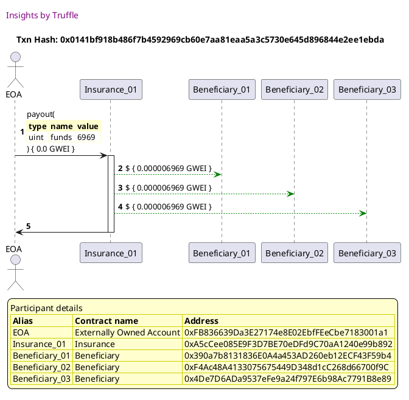

Test date: 2021 Feb 22

## pays out
[link to test...](http://github.com/trufflesuite/txlog-seedlings/blob/1d44e677781e9cf21f80c1c42ebf5a82a0cd8a22/test/insurance.js#L22)

##### d1, tx: 0x0141bf918b486f7b4592969cb60e7aa81eaa5a3c5730e645d896844e2ee1ebda

[SVG :telescope:](https://www.planttext.com/api/plantuml/svg/hLHTRzCm57tthx0s7a1ZOCTER5UZ8iq7szCcCOa7Xf2Jt7JHKhTA76YtyjznqrArtLHf4dxmjQ-FZq_kHn3wt5hTs6vI8wGxEpNT98C6jG-LcUb6Jt0DOp35IESFusRQcIAQrjC6dwP9caG9GXUjNTGmHBWVzw0BQF3JPelnvRIf7gV6wZgigx6PWB6EiRHRGEeErvIphfdLi7VmjNe4JFdMTwEBeZ9ZJCd6zQUt5nyt8j3c_IlJLkDxs-9iWM-RhYmTBxALhG7VpWs-rEtz09CvePncfQ8oup8eHSPzvQb0vLb0G6WjAMZjQvRxWX48k5z85KZEmGEWa1KQkP3brabFhaEiMtpYx0boORDLNisq-rGdf6kqoU4deJrYrx4F7O61qcrqi_W7tdSTWNlFuTuHE7iEPoS8zVBn-V109Jux6-2PNamx-_REtA6BJUxVR-nm-GdRnGomiqPFUljBrvrRhE1Bt5LEm1ANhdXQPmCNulNHE_o4oGU2ltnBhbmg3vuz_tuwRW3CZvMYWr3W0NwplhmQFUDhIRp_GS9UGJB4cm2V3p12wxP2DpivAi3ggcvt0XoJs96k0kown-NCBIBN5eshkcsemw9ee7Ldstl3PL-GRfvRQ8okwmM-_csWm66UknPU9OFCqv5aGS1Kh5dY2Ieuo8HuILQc2KGP22eP8LJJVUAzWjxPzfIXdqS0HFg9IbaiHeaW4AU5YWJH8VKu0QKogRnzoeF2ttFqj4mHBJ99cPCK92JacliiZ3tNfHdraYZbBFLLne_GUY_GfZpCkGmvPOm8Fn0-vofcN1OqZxn05a4W22bLT8IMlK3BOn1n4CPQ-Kn02afxl1HA946cP9WBeUX8WdGjW5m1RCe0VNQp-mV_1G00)

