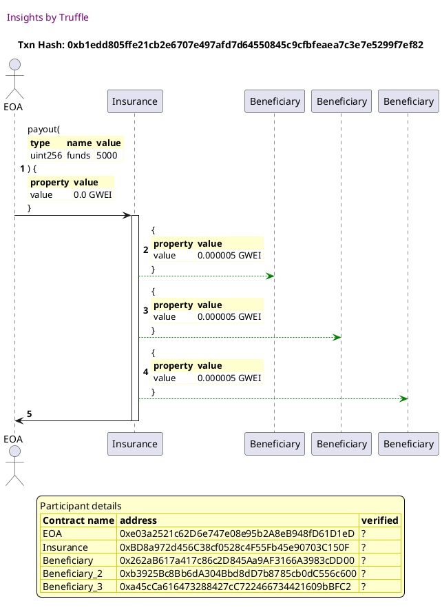

Test date: 2021 Feb 12

## pays out
[link to test...](http://github.com/trufflesuite/txlog-seedlings/blob/0e1d57622e2550f3c79e053fbe2365c8768e8cda/test/insurance.js#L20)

##### d1, tx: 0xb1edd805ffe21cb2e6707e497afd7d64550845c9cfbfeaea7c3e7e5299f7ef82

[SVG :telescope:](https://www.planttext.com/api/plantuml/svg/nPNVRvim4CVV_LTOxSkchfin-0TLbpL0MFkqIgkqXtMgZ3bIL0AHCLFJfl_x345PkgsRgcaQByVPn-U-jkyCGYUjLSPsYmeXrTccxXOP6DJUbFLI6RN05SoXpYEbR-QcwUeyRgh6uFrqbixY6KB7hLrLC45uUAv1vM3m_UXYVDgOygwfhQgcLJcl5r1RHopiDY1ranlaiZFB2XvDV2pl07l1TknSvNbPpx57ng67mHw_6KMWCVzPtPRpQzlYR8KlJ5SKZejiQIl05xSrFbNjzH4cjva7UIu9AmgWdiueS4441A5GHIvo7Z16PC1qg8ki00LAQ1y4C1g6XO12KkIsJ5idVVPXYbMBzvpTGyZjcorrkLHkhKv9PrIjOPZVUZz4HL13uHnbLaFSZlzqv1LzHgp_YzX1BZwSxEh21mT7UAbMJMTVNDQNw7Wyw5UZdQpVOhjQ0dQsLel1VbLLvrxwy3NkojfInl4Q5wvOMcSP8MGp-nBVFyLSccO9ngwsl14tiZ5vJV3xJxEp3UZ1YT_HVFXvVsu0wY_zMdRNY8_-AcF_iEUdlQB_Ax7_hnDFy5WqXqVOLJ_QN0xeVAVgSh2ghDeT1Gb97BPN4BkUDgvbjgNZ-jb0smwAm9H52JbURp-Th8VESifkWVYACjUbd2OSH220I0XPHgSIeZ2GHSAzn8F41RzxJFZUWJqdIgGA1Sq3ncDVwe8mAdMGCfPc0OEG2EB77YFfpvpT7kr9b5CLSK-em1DQSaqJTrTCLJXDVO_pgHzANoT9N_g_8RaUxbcP7r8MQHbbF9_w98YoNEQ9oAIGJ6SaZndZcl-9vGyivMwiM76F1yAdKWPKw5XG6d0k_22W7YTX5gKn7Ldk-CP3HEZ46VSZ-0O0)

