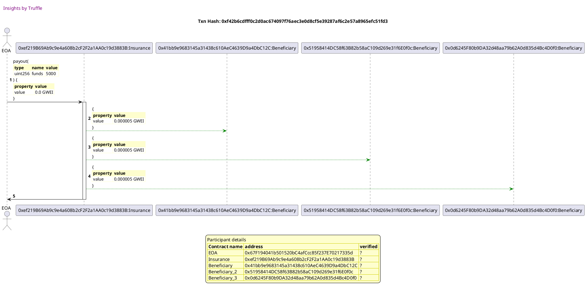

Test date: 2021 Feb 12

## pays out
[link to test...](http://github.com/trufflesuite/txlog-seedlings/blob/152a410baf2d76d60511fdf559e3219e7a4ffee9/test/insurance.js#L20)

##### d1, tx: 0xf42b6cdfff0c2d0ac674097f76aec3e0d8cf5e39287af6c2e57a8965efc51fd3

[SVG :telescope:](https://www.planttext.com/api/plantuml/svg/nPLTJzim58Rl_IiikDd4sFmHEt75EjAq7LmDQKYx61Do7Bj4f4daE5CBvR_FJQDIc42Tfccvw6bY-pclJuxV073QE6bTEoy0aAshodQUQWkQsxoifPLpMEYPBhEHLBSpMxLbbbH5PU7XT3AT91C0JXgtBFGGmEwwqJBJ5jxtjn2ULJQ_gqedYxZ8P-LSbyuJZTjEcFh13R9kRLte9mDVypiDSR1zTY6pB2zd4AF-qKCNJpxq8a2V_xniyjcDQs2wX9UsDSPpWSjTeU7beeHdihaPGBGm0KcvoemnI94CISN308dGX5ngHJNA8cMOfe94eJHS4Sr26GdEj54Ccum2NpBblFJ9bnZA1XxuU020hvlBLLvBlrUlfBMoLBeRHmjj21OZBk9KAA43oL6K4ZKbKo9n72E5HKQZY8u6suNFW2DTQkDlf5tso02dgT22HnG7JFeV6YcEKQoJW5Cn5Z8OfmacoM1dwSlGQz9Z6HOi2d0mJbXaE1r596MHJ30I6U52Kspu1Fd2xOcbFHPbd0Hi6g5KZ6DAiY2ICXGf9x4lDsLPC5B1s7EVORlImkCXF7Wi33mw6i1QBglMlRaghy19tvJl-ZXSVOHkMMleOoddNVmfYzR_MKzVmJOl7M4Shg3nZTtuo112cz6tyFubPcshMbkttF9wNC-6w3s2dxzDpZUW1oz-H_FnzyEPrRhyiTxBxXxXuAyohY_svscloVzAJFzruY7ic-Pu0Fr91HiZ0nSx3Pff9_EYsL4mHcEFNIj8lFzOVxothUEzn-gcwHHfcvjSPt2rNJfSTIxWbIruECKYGFvSCeGPGMaII9Ce5J53Q3W94S4XzQtk9tzwIdXqYpLdNw_udRDh4clIlXRnAiaxmvgrho-ypg8TQrypw5d-zVKl4O1J7_n7wnS0)

