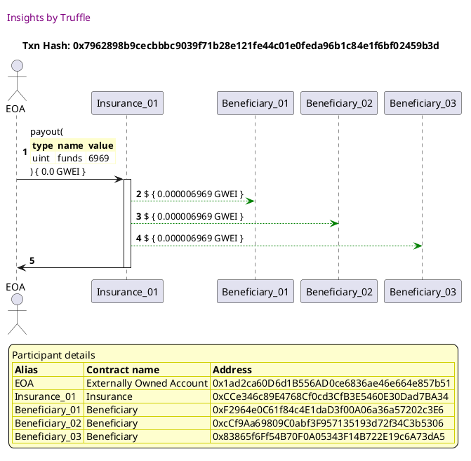

Test date: 2021 Feb 21

## pays out
[link to test...](http://github.com/trufflesuite/txlog-seedlings/blob/4af7c9e1104b5a1147ba37abd1c5713b86598a3a/test/insurance.js#L22)

##### d1, tx: 0x7962898b9cecbbbc9039f71b28e121fe44c01e0feda96b1c84e1f6bf02459b3d

[SVG :telescope:](https://www.planttext.com/api/plantuml/svg/hPHTRvim58Rl_IkiTXURkcus1eEZBXeXiFQgbLPf5-iq6N-agCI9-DYIDlllEo4iIj8gKgLnmS77BmzlpZaEGf_hHbPDEoqHacqpS-qqDnMg7metbvMSuj9CZDCZgHucrQnrEfcLimgVPccM9Yb25tMpBCqGuUwwDrAR2Z_rIumlPrNnE7EDBEEocBYfSGqGRRCLPB2vGSxRQbwQlOslnQF1rD_cRgJMXPjWIlhKdovUVEnDeFxxLwuk9lTDZVCblgrQQu6Bcg8f3RvTE7mfw_i19ejGS2yIKIwKKNcUAq6Oi27DlSXGZrhZ-ufGGwpHKl2SgiWtrFBS4iyFHCuqWfAf1godrp6MDJw1U8AWR4sXYhc4dmf6saewPNuIsYbs4_lIaN76ma9Mot_Y_TGHkVTSxXsHi-ToTe9GPn-V3mzSuhEp0PxBvQnjtjwvEtJHz_vz7uUhJxXPpWs6wEIqYxzasSB3Mhx2RG46LjZ2yDGGkU1Yi_KEFs7oWU0ltz8hQEN1Py-_dqugOzoFjQE3Kk01VhDvUNrrnDT2lFy1OQ-0375VuFC1HcXphD3DJe-qQMHHrZi57fCnGDS5XjC3FOE718v51LEtBNMiTMLgsDk-Drnr0mdtHMCg9yjoYQz_EwDnh1GSuNKpo89AxId9oPXhEWe27e-9CZnYN1gV6yvz4mLX7j1zyDv0xomxP98OvdCLYTGFUPHOeZHBx8YbWSz9oiXOwd0KCtyVUJ3uUuaEcta2t924Knlvoa-fbcDc2Oa9bs0t23tYAPRo8rZl1QnAh8Wb5n4H2P6vPPa8Gie2AfWEFSlyXEK18yUmx0Lin28UM9xPm1-590EN0VDPHc7bUIaLYiSXqt40M1Y0VWpGPxZ3V_1V)

