Test date: 2021 Feb 08

## pays out
##### d1, tx: 0x600d6456a0bab7c7821c594b0de4b9a8d8ac107d7a897e4ed4013c38ad92c0be

[SVG :telescope:](https://www.planttext.com/api/plantuml/svg/fPPRZzis48NVzIk8vAL5kYZl71dRRMHTa3urGFDM50KfKbuXicpeKgmJxt_lhA9rxHQe1TWlOqgUJyVKcIEzxmVR3UEsYI8x3hjstBhGHL7_kMxtjhDRqeHDQFtQbfyttMviVRfhTXrvM-H5dkPHTDyFXoOyHD5Zi3vqv6j4o8TTLt_PjODjagRUjDlG3eYf1ZnLuE5lXFtOxPim7_gj_X88axZwQBslsmrXD7f6-e-l-5V-BsrVRnw7dhW3-TIDLOMCQAY79f1FJotvOFl75Q5FcbAlfTAMEkjCQO2pKiNIKH-aYorui2MZnXiBiGaoU4cPA0LO7_EIEcJQSa2L-Qy9iJrvW_LDX1ior6Mzj_X_KCVOsROCVr8s_O8-5I80ZvLNsfJ2KmcPYgc2jJ0G7CH94fi22iDNfzvBv3gqeSA5xGx_G45IbBhc9ZTKGybZ2MgTIiDI3QnqWkQQsyI8rLdt_s3vZ9KnfDenow3GSLoaYMTAkg1CugbAfInY2YdZRY5MpDWOoe8B6cWQPo31kKo04RbBKirIo3nBc6I5vWknSiOgbQOYP38JKb7mALRS41wRN1eGIl9CS-5CjH2hPgoDXIu5jontigfGer70CgDOpdBG4f8rK9vNnKAiVbLRhXsLr5CEJWWeA-O4n9GBpIKJdES5q8IkmqAicR76njvKHgO5L487XNUCPapZZUGMhy8ipGM8TNc9ZLuSVFTmwTTtxrPaRm-xSVZkU_AL_6MRCU3KaEUetGrXcjNJXD_FNtwOwyFn9p8Sze5WRUrsgXE07ACZ6Ujsu4gJ8wamAtgiYbAAfp13o0iyYYwKtFt-TjE5qFw14l_b_nKv5pTXdXSsyrkQnItDyfPcTKkplgNPB6b-cDBmxcv5C8w_FHQYZsUkzM6mTTEVEIQZ6O9U79DYo7SOgIVBOCnteUydzuIkhkhWqINt9vDDrpfYadED-S6B571G9L33qVOuHLGmLHKX5uc68WY5KFBp9U6aVk8iJUV_SivsQY8jZUJhfAKfV9sqD7YlavPcxNNIqdXTe6bXebudBGtHcOGMdusEd_TONrwK_WO0)

```plantuml
@startuml

autonumber

skinparam legendBackgroundColor #FEFECE

<style>

header {
  HorizontalAlignment left
  FontColor purple
  FontSize 14
  Padding 10
}

</style>


header Insights by Truffle

title Txn Hash: 0x600d6456a0bab7c7821c594b0de4b9a8d8ac107d7a897e4ed4013c38ad92c0be

actor EOA as "EOA"
participant Insurance_01 as "0xF3e8295d567c3d048D59058B378eb89AA97F8F72:Insurance"
participant Beneficiary_01 as "0x8408acB27E7068c29485BC471C681cb30E62aA73:Beneficiary"
participant Beneficiary_02 as "0x498C6b1a18F699FCAd154be57Ad05C44F908C12b:Beneficiary"
participant Beneficiary_03 as "0x98cF230e0C9D848bbD3873EbAC61C8Dd1A141F62:Beneficiary"
participant Beneficiary_04 as "0x55CC3eD4D34508dCD3427E297E4783542D623b7f:Beneficiary"
participant Beneficiary_05 as "0xa936c32a1Eb4ffAC67581D751E1E8648AB802EfF:Beneficiary"
participant Beneficiary_06 as "0x5cBb040d028b338cf1b3890236241322EF80A0Be:Beneficiary"
participant Beneficiary_07 as "0x7a9d7f74CF8f36e5d150D1698C2a38c1a0E383Bc:Beneficiary"

EOA -> Insurance_01 ++: payout() { value: 0 }
note left #FEFECE
<#FEFECE,#FEFECE>|= type |= name |= value |
| uint256 | funds | 5000 |
end note

Insurance_01 -[#green]-> Beneficiary_01 : () { value: 5000 }
Insurance_01 -[#green]-> Beneficiary_02 : () { value: 5000 }
Insurance_01 -[#green]-> Beneficiary_03 : () { value: 5000 }
Insurance_01 -[#green]-> Beneficiary_04 : () { value: 5000 }
Insurance_01 -[#green]-> Beneficiary_05 : () { value: 5000 }
Insurance_01 -[#green]-> Beneficiary_06 : () { value: 5000 }
Insurance_01 -[#green]-> Beneficiary_07 : () { value: 5000 }
Insurance_01 -> EOA --: 


legend
Participant details
<#FEFECE,#D0D000>|= Contract name |= address |= verified |
<#FEFECE>| EOA | 0x263Eb2FC832a480721501320315fFeE3A68Fe35e | ? |
<#FEFECE>| Insurance | 0xF3e8295d567c3d048D59058B378eb89AA97F8F72 | ? |
<#FEFECE>| Beneficiary | 0x8408acB27E7068c29485BC471C681cb30E62aA73 | ? |
<#FEFECE>| Beneficiary | 0x498C6b1a18F699FCAd154be57Ad05C44F908C12b | ? |
<#FEFECE>| Beneficiary | 0x98cF230e0C9D848bbD3873EbAC61C8Dd1A141F62 | ? |
<#FEFECE>| Beneficiary | 0x55CC3eD4D34508dCD3427E297E4783542D623b7f | ? |
<#FEFECE>| Beneficiary | 0xa936c32a1Eb4ffAC67581D751E1E8648AB802EfF | ? |
<#FEFECE>| Beneficiary | 0x5cBb040d028b338cf1b3890236241322EF80A0Be | ? |
<#FEFECE>| Beneficiary | 0x7a9d7f74CF8f36e5d150D1698C2a38c1a0E383Bc | ? |
endlegend



@enduml
```

