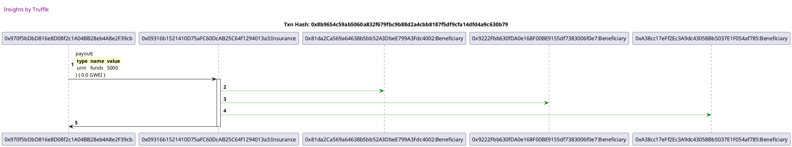

Test date: 2021 Feb 15

## pays out
[link to test...](http://github.com/trufflesuite/txlog-seedlings/blob/3bcab5a6f1789676792542f75bc3a5a304fb8b1a/test/insurance.js#L20)

##### d1, tx: 0x8b9654c59ab5060a832f679fbc9b88d2a4cbb8187f5df9cfa14dfd4a9c630b79

[SVG :telescope:](https://www.planttext.com/api/plantuml/svg/jLDDRzGm4BtxLrZR2wWKnf-nLwLgiabeRqXKua0vs8wzZPfrLlb0tNRvxvZkgX8tX8elpvuPpPitCqReSfpCCCsR3Y4pJtsSDzOFQBnluzOCPeCxl_QnAOoxNm_z79jLt_K3FgchkbfL29sFqwxp5mW_dpjl6Z_Wf-CJuwj-Q1_xE9akxzfrtFWufOnXUWcea_EGSZiFsyx_uVZIFdfC-8ljiscQDgunWQFfvpEUVpWMWOxyrt5irtVJYEqEtmnp22alcjgfy_Zc8U8hCzujCJmegwNWJcXZ1KWmYj4WCnsiqrQfXXhkh5L4PK4qGRjW26z2mursae7DD49e0GywWo1iQKj5f5Sbg40ToO4N1LNUybnvMZFjx0AVNU0K3veHQOcWX1CeCs7gbOJIvGKLAya3ePe3OOOjaufvCD7v1JuzNUAjsVNpzEOstgBpO_lV7V5Y_n5Fkwt72QFPFECFqytfyZjyZ-SszNsFGvhVc500mC7r5ZzXU0_uqzVgEdNp7yix-tQo7hoFtmyA5MaCNHaXjP5SCcM5jOBchBI-ohJEMTqu3a2NXOy-jAurmsw1b_YLw3MbjBOspIYKENWYLGrGL9g8DCQCAGOW0_ZiFz7dJ3b7Cby7MZcMwwILWL15sZ6MLQG6mKt8b7Wr-eFelz_2iyI5BjEdJf_-5m00)

