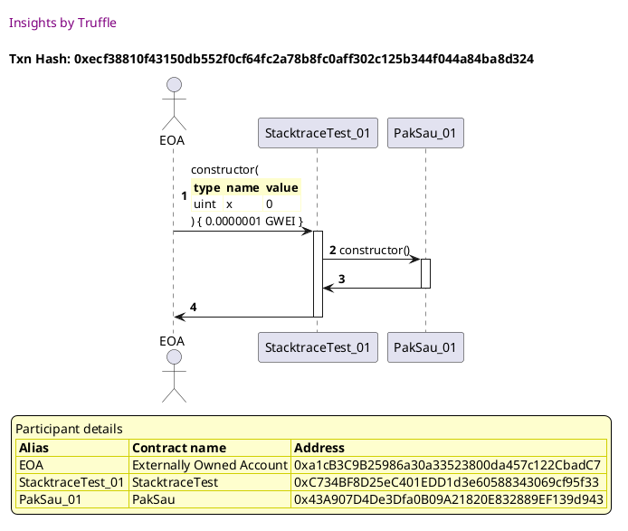
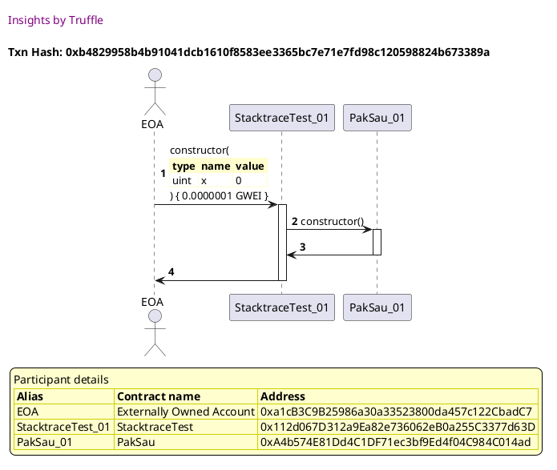
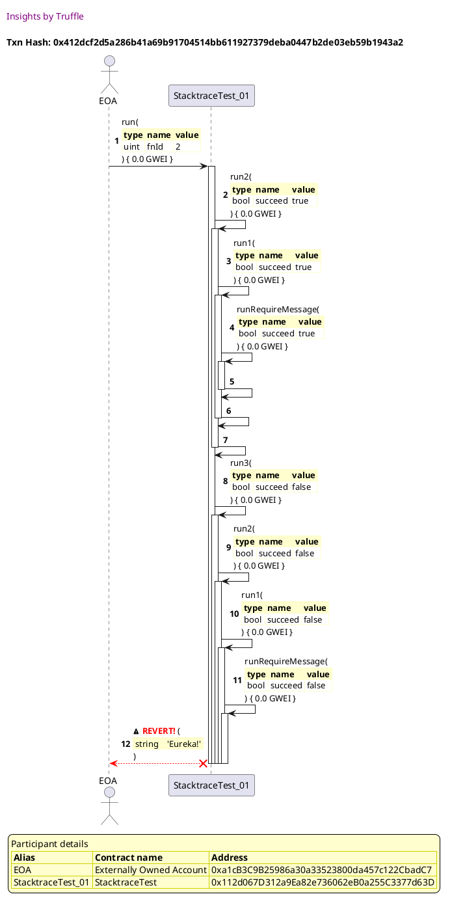
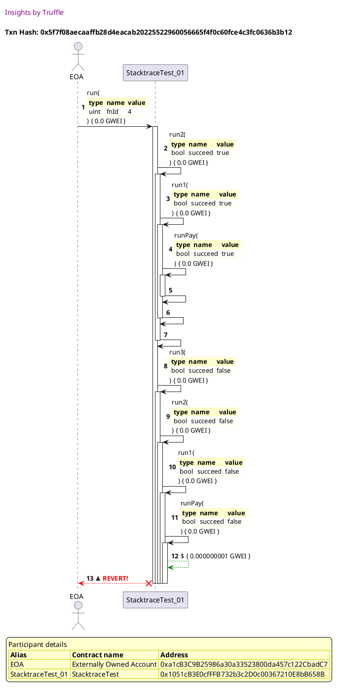
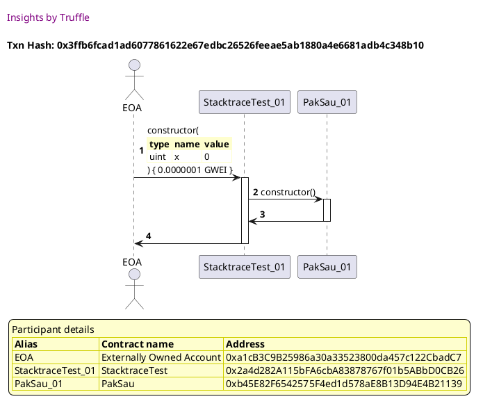
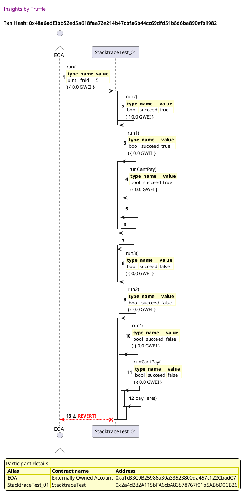
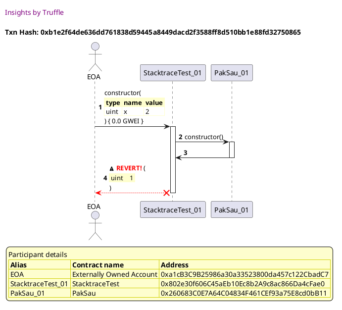
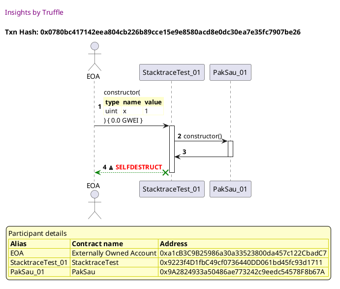

Test date: 2021 Feb 22

## succeeds
[link to test...](http://github.com/trufflesuite/txlog-seedlings/blob/1d44e677781e9cf21f80c1c42ebf5a82a0cd8a22/test/stacktrace.test.js#L4)

##### d1, tx: 0xecf38810f43150db552f0cf64fc2a78b8fc0aff302c125b344f044a84ba8d324

[SVG :telescope:](https://www.planttext.com/api/plantuml/svg/TLJVJzim47xtNt5YBqECpOcTra6ieatImHELGDeBqdJnZnAHkbNYR2rq__kSD1Gwm59ozjtvytUVBo7aedPOkMPH4eADMzfcaUkAr0-5NM652oZrN5irGVamhvQDLScoN5RmQPfDioGZvBnscrAF27JZNgFI5JprIu3BPLKyBgt3SbmMSxlGrdb4u_O9Kn_SGQwQQbNgWy1DyQWXu7lV39Kgx1m2shl-TlRyMq-2zETVsRgOtxiQyWtSLeqn7fUumfKQRjSMBh6-FmEwrj8m8G9gE0iYgl8e2WsLPi2D374eSc4aHMCO3MKGHZdZt53EKV0SXM8X9ruowJprx7eCMCEHjqV4o-OAMQpGbthZl6wkGgblTUr-qQ1BU-Czt3J3XnjidfFtgoD2kWFWTFGU19oSd85SsjfLJKlgyvsz8-VzFNtfxMZx7TncfS5RYulE_iQoyPCsVGjDuGbiOUqVklCTmnFGhxGR0VpucLrvrTyxlwNrGlODdMFoElf13QUdP_0X-AxuDeFicfBCNgccjCEYh5-LdDBKSsvBzhtdfVIJn3ULntNxuiTALRhsiVs-qRQxJlzUErrPBCiDNF-nMi5OIly1jFBGDGPomf9u4aQn622Zo5WKCa6fGXuDVRk4IOug6Hu2lss7_tqTU39aV38LQHZfXDCWIzD0CJsWaH2CCpg8fOaZmzWX-4lRFCyxCCx6CHscFDKiDKWdD1w7WGXf9bWeH9nD0nQhcBTWNj9UM7BXt_wVy0y0)

##### d2, tx: 0x7bdd00b6ef52565ca69021ec6ec010f134f004ca10a11033503090849e4e5baa

[SVG :telescope:](https://www.planttext.com/api/plantuml/svg/RLDHJzim47xthpYnbqsCxHmdQODOHPksq2UGGDeBqdIrdHAHkfNZR2rq_ttNDAfWa0T_pjtvy-VlR24kwq0-DCjA26h2oZNBkVMYVYhTcZmjeR8Bwyo8zDF2hnfdybMryl1fEfbEyeaG5tNOLdOWeFqUBHdhuQNx1RXU-V9vvG9LmwfSkALrWHcBS2oOSl90kMxykh9l4dVbimKP7sEtP4pf5Y2n2_rjyU9x9q9q-yzSNIuUGmtpBTpxfYYOLuGoL1RkDmwkgNuy1zpqviOWpbDR956I9fhI32DfTMerIYoaYWl4M9D4aXALIb1XXlquix5DvaI2BTE1fKzkXa0rd32U2BOjbBfS4n_rBh1lmPEszxOElr2sPU-Y9qAqQ-5iy54MJa_FmJVkyuDx41UTzLyx7En-GDYkBJ0wMhRucwg69_lo7JGb2zb1uMQ6GKQ7-1Tu0Vo6SFLpCcCRFzfrB-QWwkmSX3XS177xwdZ61Ygh-fMcCOuHSQ-9-yrdvKdEZMJUS5GtDCRRcdF7TODTQo6Fcs2zewhQmiqVPmqCjUPBjzUF6v9wfF9i52LPFoM5n1s9L1_HK9pqj8oYV4ucxxqbVj-2_sCjUTvJyMZQ7qU9pMEKa_5O6cLJJFfz5IjCCrraIQ4KaxCBdHVYaaT-Ely0)

## fails! hahahaha
[link to test...](http://github.com/trufflesuite/txlog-seedlings/blob/1d44e677781e9cf21f80c1c42ebf5a82a0cd8a22/test/stacktrace.test.js#L9)

##### d1, tx: 0xb4829958b4b91041dcb1610f8583ee3365bc7e71e7fd98c120598824b673389a

[SVG :telescope:](https://www.planttext.com/api/plantuml/svg/TLJVJzim47xtNt5YBqEicntd9s8LRPeEdgW4qbwGfalib8ZKgH9dQw7xttTDGsa7M4hElZj__kxp9OnTDXPhsovAnh2rbMaNgQvPyrYO9TQuW5BFjL5Zp1xdTTKQ5LTbLSEdQJ9DueInYyQkIpraq8q7ZKhNyDml0QwgkdYgZCLoL1Ppiz364c9kzmbJ2kuWbsszBFLHuBPuqY3SlM-6IXLc3eBthh-TlVZMas3z-TUcAUOFje5q3NTrc-U4osnXImrtAmDNs3oS0r-bRkX4aHUcRXe9xWgLfS8NF0-zK6ejfU-bMQ03eODSHM4c7Ev5OUYugHz86KR8IBBC4lNaPWJOm0dP4qQosI8hbaYbtbhIpTQOwJlTs5zST6bllCURPlXuY-rBydvrmbXt00o6xq70sTavP9LfRDrkINs-D_Vieh-dBxqTRhw3NIyra3MuwEnlB5kQRDCtq1P4O0ChUlZETmhFmB_oRWZuyJEv9jNVEtzBwvNi6pgdx33wGGs3mJby2BuhVfl1Tat9PWUgAMsnA9k3aYTyGfot9LFlaPGqYQcf2DVkYnyfLUk6OljzmqrtdVHUMLqRBCirtFmnMi4eo-W3sCh3LoYoiOoZiKCTuQFaAANdo91pXQuNKAiuSOeg3ew1txR3_xuEN0X7SJ-OIE5Wb63ew43wt7VqcAFZUR6KGQ1yEJa6VssRbta7Dd9JBt2JK4oK6ul9bDevasaU9ShDkHj7eHjpuQ8YC9Aq5vPTqfl-2Vy0)

##### d2, tx: 0x412dcf2d5a286b41a69b91704514bb611927379deba0447b2de03eb59b1943a2

[SVG :telescope:](https://www.planttext.com/api/plantuml/svg/pLPHJzim47xthpX06bjPDyT9amPr5RGDWuS91DNsCARf4hib8dKwnu4Mkl--QvjLCDYaRKnh5FcSk_FvysVBNnZRAomQMuuonh2qkIv7iJAik4pr60sE85D3fMK7aykXoKijktcM6zWwY0wYRiHOgx3JJBKPB9uBXL8PkAq-0GvpazxascAsdwL3FLBQKiM1NIKSK71PSboQSQRk1SxI6mMEj_ATe9If7eB3AzVNXMszha2mQluZNQJ32rj0F8M-AGS3gijiQZC5_Oc6GomkTe5FF4V8P21a0qNJZpq7_J0EdO1x3SUBOzznGX6uGIXLZDppWbX8nLqLDyBO2JqN1IFA4alGe-Dzm08soMuoeiscIJf6MkgP9TwimKJrLM4_SsUHzi2xoTXYBDJRZqLXPsSNJAcVd-jprggeVrdPzkmDsEbO0LcDeuMzmgoapZnz1cLAG6Omq4UIZ5YwNy0jy5SStdw8ZeZ5noRzDHRnPs3YFCy8HL4cYL9pFDPy3_ur96Vz89sgBsLgr3jL53XKQuIlNj-5TSgl-7AVYA81PeLQivF-b9YSDSJqJyxwxm6Sr3zk6IK_pO4kxrCwXgrdrsWqoKORMibIl2YdNQkTHk-Zq_v6hTPwlV2tuIUWeR1cBZipe7SxAeswn8tj2XMJYaGWlKAh7htP_sUOBSMRdToH9AaifbbnPvaztkESp_U6D9hqYJfT4b-gP5Uxj2-beOs5sMeSqJANFMedLXcDMJQ5usjDkxQV9FIZCDSSFa4dwRZTi2CQOTD7bwFhDeJRv5oYrmWIHuXkZB8Rt2_yK3P_z2sAEwJVt0zwhYCmZB0fLE3wt1Ugmr4q6btN3GBfkpqgJYnKNB0zQkbtvni0)

## fails, try to transfer to self
[link to test...](http://github.com/trufflesuite/txlog-seedlings/blob/1d44e677781e9cf21f80c1c42ebf5a82a0cd8a22/test/stacktrace.test.js#L14)

##### d1, tx: 0xa89e19d4811a3670e14bbf5c8f0802279b115d9a3fed90d47a309a466021ecd1

[SVG :telescope:](https://www.planttext.com/api/plantuml/svg/TLJVJzim47xtNt5YBqECpSxl85RHfitWYKeWxGLfkjXEYKYTAd6s5hh_VPSq53h0KdBstVdpTvylOUoYiLZRTbaoXgsjJBlCTCsQXyAiiCObb7gXZPgWV5ZKLMjKKfLL3P_IMJfBPeoTDtPJwX63VjnhLBg6fs49S5dLnMDbB9RZibYOfJQM47ExJqWfk8DSjVMgr0U1c-9HW_3slZagLPW523wu_lRs_Dj0WWtdNvccMDpR1h8DtDPjdXCkiuKjDTok3LnYSty6V8rHh4Mil4W8T8EGQ-5bMUxBAESHTvmmpeJmLOnkhbNCbHUYosFqWe0xGaib64acBL6VNOy16pWYUyH8Dbl8OeLKweqbtMoDKj_gnlxYeazxuptSDCU76soVa_Uh8yRw0-1qz1u4d9oSWQnCO-ks8_Nvpjony-6UlWnsjFqEThFIGDRWihU_iMnfqgLleIs8m1RMzF2TxnYUW7_b_H3mu-ViYbH_x_oErWlPDtIEsUle1pMSdfx1X-2xuhiCjcjADd-bcj8MYx9vLVAKJubpLpBr7ab9auIQYd3jllYnKhLkABRVDzhsrqdljTMrmRBSmFKVenMCfQGFe9E7MaV8YPl44yUFeu3Q0btNTzo8SuMU7qhXE4c6AWaFWT-sm_--7bnmluEVSPcdwIHqdSoLpfHBpgbB7S5dKJO9_6Xo2FxIDi_p7cpiS3UL8jEkfyFGIu8WosAUf84KaGmTVpeDKQ6WssOawI0ikw0t_HF-0G00)

##### d2, tx: 0x5f7f08aecaaffb28d4eacab20225522960056665f4f0c60fce4c3fc0636b3b12

[SVG :telescope:](https://www.planttext.com/api/plantuml/svg/pLPHJzim47xthxZ1D6rbR8xJfANg8jgI3fv0K6qFOvekZbCYKgTo76YX---xfba5Wo5jGrhpu4lkBf-_VBRyXR7zmgAnvIHZ34kRwt8IASEAorHFqU04CZLMEkwZl1oRlDJn8Czo0zl3S1WEGiQwXPrdAc1GNHSAOsNWjdu4ECnDUfDhYralIyTwehGbnCIk6uPKN45EIpFDrBt2MNgZm6ckSoSOnwaUWyFhrFSgTj_N95Wz_v4kql65BI2QmyYKIKAupAOsKp2QQJZ4ug83VEObhOItKKd498b4Esugb1W9BeJd2R7dS-xvlkybpOHBdoTIDQMRIEwxVkH6Zc0acRH4FJpk0HQmHN6BaMmsbUaKwLFFBEbc3KerKeNznfsgxK5sYx7gNTWD7gl2pau7JAbVd-jprgsbVrl7OF41x7ogWAB6IHMlC2lfPjc-W38b8Wj8z55CeRbAlu5RuEyuVFmS7f6AZqtwD1VnTsIYFC-8HL5AgTIIZpK_Y_zCoTayIYSuto1IkxiTsAJ-MYJtcIHAC2lKXctlv-JaR22dvzlWVyZgo_ROAAM__ePU1rwkGEhBUGfiHcX6nHNMwXYcZTnzTOr6azi4q9KhpwEUeD4u3J-5fwCNZKRtVPKFM4osOTChjEhHi_r_bjdAljd97LEAbSKqA-wisG4_88sMQqOkJGv5DmEoNqAowzNhnR5H1TNMxmMBolXed5bbD6RP78wlDQrcJqhwLLYw3f-X8_lkOAyllBssZov7r_M4s-OyngRNaeuGWmZZGUi-y4FZ_3LNWJlSMyA7N2R3OR_bYiYLue1Bpbs_9HmUjgE-xxNx14ugr5gmVHhfX-S7)

## fails, invokes public payable method with balance+1 funds
[link to test...](http://github.com/trufflesuite/txlog-seedlings/blob/1d44e677781e9cf21f80c1c42ebf5a82a0cd8a22/test/stacktrace.test.js#L19)

##### d1, tx: 0x3ffb6fcad1ad6077861622e67edbc26526feeae5ab1880a4e6681adb4c348b10

[SVG :telescope:](https://www.planttext.com/api/plantuml/svg/TLHHRvim47xthx2wbrLTDzk0SQekAX2ozgcHMcalbQO3cnILc0ZCbhJPVz-5qBHPMqjmzjtvytUV3mYvQ1qqhbjKX43dQjijCjEGzg6qIsXWGIipDrR7a3_CcxgpEgchkg6VfkaqJL92pbkthioOq7xS6z2ceK_3ajBBkYaVQ-kWYgfoRXV6EaGit3vXYi4TvB9hbfKv2DoKZuPoV--RWTQbdLFE1jVVtfv_6qYGuVmhsvRpUzVIR4rlcwue49UuqbM6tguilOJs_eoobLSKcInoq1oqP66e99T261aQdUL21a8Mne098EDACV2Db0fJCp_tV9KX2PGiTqWzlOuejFG8xH51sLoPbql0KcySwkOQoCsjQTqlnlkqDzx3JJDuk87kENc_EYAaFu2UZj-3e2SdPpIlRUkQRalgyvsz8-V3FNqPx7ZpdRhrqb2q5XQz_GrLXvDj-ePs9HBOq1K-RESxfa-KVMNzuFJ7p_GALN_l_2sj5x9lw1oJrz4FQZWzFQCVWk-AtsQGNLEIsIlLj75GLkshaYTiWfot9MFlePGuIR2f4DVjYu-qRaoBiVs-yQQ_Jdold6aiLDMQNl-nHjCep_43sCh3Li3ps4j6iGX6IeB7mFC2uId6DFX1c7CXaWnq4Xu2lss7_tqzk01V2oKYpeDi6iayYvIdGXNAi60y2w8ucx0a5l8G_ALjdkSzMEO7gH9J6VWY28EfRpJNGQWWLJ7t9YC_zMF1kJT2C9Hq49PSu1l_2Vy0)

##### d2, tx: 0x48a6adf3bb52ed5a618faa72e214b47cbfa6b44cc69dfd51b6d6ba890efb1982

[SVG :telescope:](https://www.planttext.com/api/plantuml/svg/pLRVJzim47xtN-61D45PX_EpAUegqf0Eda1GRGzZciwnKo9Ift8SQA7xttTDimf6jOUj3yr3phaxdxzyFlap8QUb0MsgIKu8LAPGrOHBJShxJ4r1muJcSYoL641oFzP5fKHKv8Mc-yDu64Sn8RtIp7FP9xH-xYG8gUbpyqdfUQ6pfq8PoCCy6wk9L0OhfcQTCCJWgkIqqjDSlWhSP4-IMkxQTmL2P6fCBTQuVjQsTzo08Ctw5whCndUcf7nEHxfAKwnBJ6PoIKSpHS-Xl3kXREO6u8D87SuzMmeFV2j80Jgsj2sNkvs4f-1prqqIlojIuLdS5pw7eCjaogrkO1EaB348FRuCAPHq3-qUGTfCbcHJm5-zCSYRqP38aIpD3sRLQM-yUuJKSscxlobAZuvEgAxKmQsw9Rs6-W-DxIy-KJEVIefMmQIs3v1NE5YcBsYL8P05JTM5GEEjt8VqcRAFZ7x-6byWYviM_JiM-z_0yAB84KLP9OcKIpn6_mx-DoHhzo15s0HNCDyXOEts2Tsb_8OePqiKfP2NSiTQV9kOh1t4jDqctngoASpFfPO7XnidpjhVzhKKtvS5LaSlDcxl_IDeXGhJfxrafNEOqs-rhkClyVNeNQlLEwxzVI8a7ltP0nYvyJpVuJ1PAJgvUg5JGXh8ylB5zfsnCyROSljGk56qS12X8cCbizx8K0WjIuojv_KNjHRYUsQaLf3dSthvg71ZmoJ1syDIYDWCh6JWHDs1xNK37nm6ZkFPJi2O0DVh99PjHnn4r7bT-AsM_kchYzlW2ZkmGylo-33q4nu6Jj09EdudPHRtmW4_Oz70zh4uij1mGKxnZNUWNm00)

## fails on deployment, asserts out
[link to test...](http://github.com/trufflesuite/txlog-seedlings/blob/1d44e677781e9cf21f80c1c42ebf5a82a0cd8a22/test/stacktrace.test.js#L24)

##### d1, tx: 0xb1e2f64de636dd761838d59445a8449dacd2f3588ff8d510bb1e88fd32750865

[SVG :telescope:](https://www.planttext.com/api/plantuml/svg/TLHjJzim4FxkNt43QHfbtPpNfgYhQ4Cw-0I2QlimfkbYEoKYTIl7WHROVzyr3OME4ZKv-tpt-F5pvp9sN5eqjfeMZ65bPxgQfigmyZRNSpGuXK9Db9P35BSJCwkqZ6V5pC3-A1abSS9OhxJBGlKPrC-DGgaCF3PJWDEPoHzcsc8nAFA9dYfj2J6pcu0HBQuXvvMP5sfhuIf_KE3u6zy5Ifdh2JYySVsjRUzhGu8r-v_fCf_Ss1BI9OnDbMM4osnk2mNZXOPJB6-EW2zIHxbPw4iLUg6KdT29l4W6NTyFCFBzhaGXtSmBeYZBoE_mb19e8Zst4_0e31X99YnHJyu7W2NiaTrZ99lDHJv7EkgL9TsiGQ76ghH_k5E7lV5k9rtWxHLMpy6RsHvZzGRGxk-2WCF38n0pNLfJhKXzkjRNhDVKwNDZ-q_Vm2xd2iXgdDRs3ekA1glm9wXo8l042thTjUy07e5_uV3zPt96Uk_QUKNeXUOR8WVizUexxDlj8zW9lcZ_sZTA_bxbhOzFaRsFzsWqjK8VUcBTa1JJRxKkan_9vVX3gzNxMllxy8uEpoUbdzCSb4b5vSplqAgTDMBhgy0kNjLAAejvKRxQu8IVSCvNGbF7Km5f45Ch4vBTI3wGqgYIrZPvH6ZLHFHTM6Kq5iKIpk-raZ0GWgxTYYfVe2E6NjmTka4t2j7Zw7c1wqMSI_I3Zd1SDqvHnfrjuBTD-B-l1e-ugpoUXJoCwG8agSCJ4QNke2iY554Odg0lHgZuDlXBipwFQp2NO28lvabd4FenzoFF7_cX4oTPryDEa4H2ydJeK1OZIHjXsJ5zwP_e7m00)

## SDs on deployment!
[link to test...](http://github.com/trufflesuite/txlog-seedlings/blob/1d44e677781e9cf21f80c1c42ebf5a82a0cd8a22/test/stacktrace.test.js#L28)

##### d1, tx: 0x0780bc417142eea804cb226b89cce15e9e8580acd8e0dc30ea7e35fc7907be26

[SVG :telescope:](https://www.planttext.com/api/plantuml/svg/TLJlJzim4Ftkl-84qZJAEfnVJOAwYfAc0saIQEsq3sEQ7FjQ8bAtSfpHGlU_xvg6GWUBb9nzTtv-Vda9OsUb5SPMiu8nKTcvhcOP6bRUvNeXZ9X1WLFKwbp8kwcPLrebys9ku72O3jCaPQnRsbM1FGRrTOj2eO77PWfmCJVvmrnRKVIBVAfdg2qXJkokOKZ5BUIYCei2zmgZ_071yNUvQw5KhgVWy2RrfuxTauO4Q_Q_r6K-lRKbP2iOcseo8LncSriWZ9SQBaHvUmfyoSE8Pz9tGiTt4KN4VPcvRYUBOYdH2J36A8Yua2f2hgJ7KOJe1HCPnZpCqEqmaanQefvUzK6KS43nW95iDfVvGj1HHvPqiqP876DfVt6dRdkLtLzqBUv6edfgtiqE6AitW7RlBGWuFZu5ETUbDTM6rFiRVSEwpNlwqCJU-XFOrGA1eXQpEluMHKM3JViQgfm8h659jxFD7S4Zy8ySFdzFBqdljtRU47gc-Oh84NjP_G_xTliKtWHVjdySJWsY_hbPkHM0UhllxeNHP8OUTENMaWPLhzKQfL-6WtGq_lej6RTQtPEwIDRO-fXTln1QeHLvKRvGQS07dFEDIcHNKfy62VcG2DcTNdsb39PKswthhMi7q7DfqMXH52kukjUee2ybVJCRHVbIEFBSI-9pDuYZZl2uyBp0zIBEbV23K3gkcsH29U4-y6i7_PkhmMFNzIR-m9baYH_B2G-zZk_pmO1td4pvvDdOK-HpPn_ysMbFuorOturSF_Oy4N2Vk68OUgxloXXHoO38HiCewuHqOaQIDiAoCthIR-Gl)

