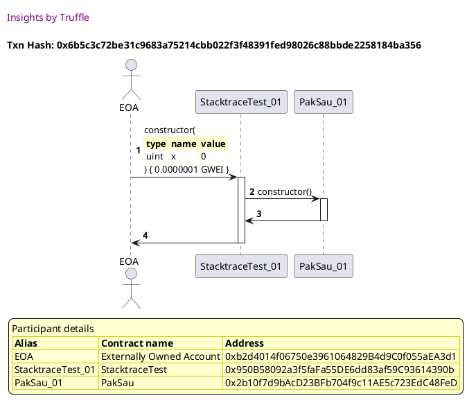
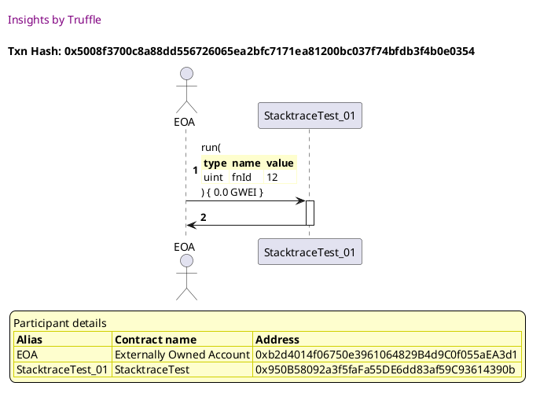
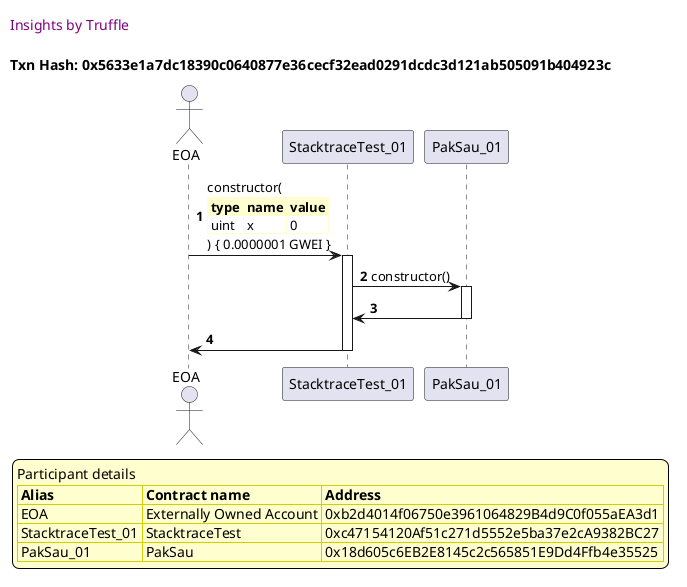
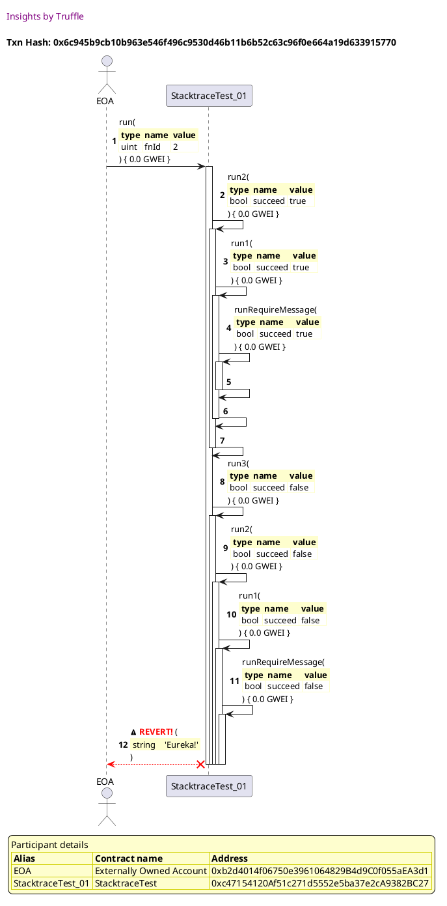
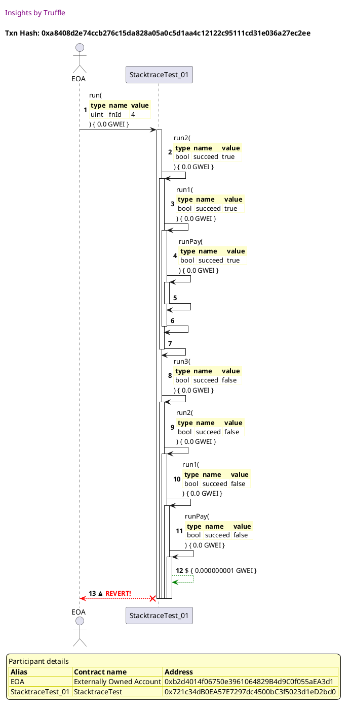
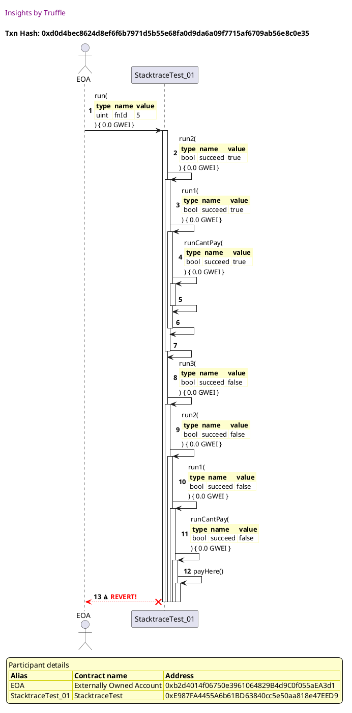
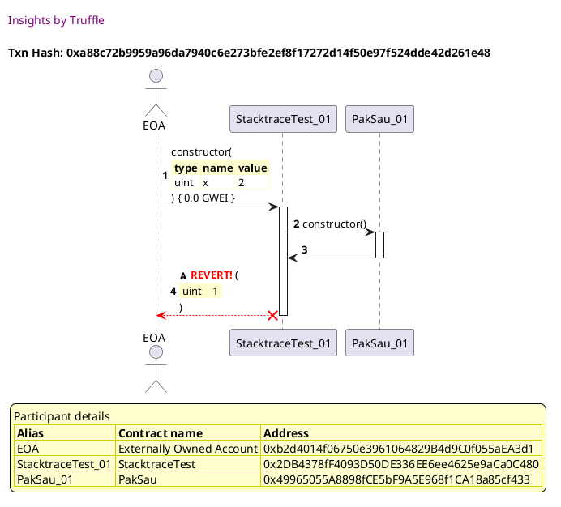
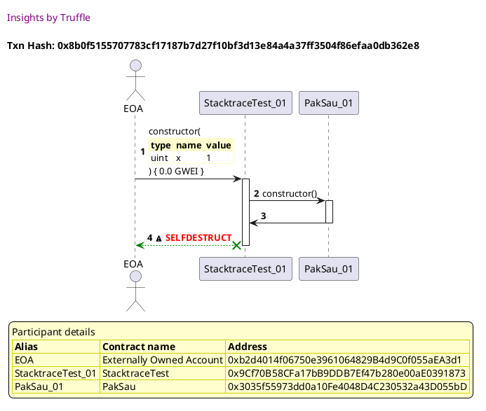

Test date: 2021 Feb 21

## succeeds
[link to test...](http://github.com/trufflesuite/txlog-seedlings/blob/4af7c9e1104b5a1147ba37abd1c5713b86598a3a/test/stacktrace.test.js#L4)

##### d1, tx: 0x6b5c3c72be31c9683a75214cbb022f3f48391fed98026c88bbde2258184ba356

[SVG :telescope:](https://www.planttext.com/api/plantuml/svg/TLJVJzim47xtNt5YBqECpKxYD46i8ctJmHELGDeBqkHVAH6fKpdEraBtl--QXa87M4hElZj__kxp9OHSD5uutougGaJhQzikf76aUIZjKZYnWChCZTKZeHxchcwj7jTLxU3JD9_cuvoGyyQlApCaq8rx8xHnyDGl0IvhLpxMreiggygvNHZh4R7m-uGf1dUGozOjAtCGk2aV3R1exvi9hKix1qPxrz_Edd_hIP3-_2lRbFDxtu1SmwrhYm9nYIzzPU1sPU5IDFTdG5Unv2fKWq2QaAaqJa8nu06Bb9Gq28gmY98mPONHQKA3M2M9bDe40KzO4aaHyfYWPCeZzVmw0z704TeZWhBvKfLBWQNUUDJDEw7ChMdyBygwj3VUmqqpyN0ZskVa_Ug8aEu0E1s-1m4d9sUWQjjursv9VRwpT-IylwSllHrkleDVBmsWjMBHsT-YQd6oJTz0MoA13QpmeJlVCJm1_KgxmU37p_mALN_l_2sj5x9lw1oJrz4FQZWzFOCFmNV5RpF8hYd9x9LgsdXHLishaYTqWfot9MFlePGu6MDJ8QxV5vzfxKo3iVs-uQQxJdoll75MLDKQhlzOeo5J2Z-0hJnq9GCTKHOLD1vmQi8qPZIEaY0THJeTqu9oBl8irEmG-6qx_E_hm5DEHpoXQI32WXTYAZYVvB7MsA05JyTf6BCeJAay17zfc-Tv1nP8Hek1JcMc9a4ucie1ZOfKCPRb77i_pFKuIgPcWc0eQIyikS0t_XF-0G00)

##### d2, tx: 0x5008f3700c8a88dd556726065ea2bfc7171ea81200bc037f74bfdb3f4b0e0354

[SVG :telescope:](https://www.planttext.com/api/plantuml/svg/RLFBRjim4BppAnRffKMQTlMW7ePhn0yvyIa1Og2N00KbahOGcJ8eghKJzz-xbWKZQQ83XzfT3cU796FNZHFMjPkACT6wshIRN5dMF9LcAwpOGALMoiY9A9vMjcwDdDPLRU7JF9jdquonOUFsbHenwBwr4b9PUEb_0MvhMpxNnebgN9Khir764QDsvu8v9K-KszPkA_KcyL0-A_32S-nUI5cQ5NZOX_vsEFpUYs3z_WlJbAkrQo3VmzAsMXClSwMh52nt1cv5inu0xZXYeeCOiKX4aaZ9UHJx4KPS2J_NHUp5dXA9voFc1GQnZiDSoppGOOuA0nuoignm93sx6uDeu8BmWf5jhYpAhQ1M7npvvgmer58rxXTwNTcxw0LZtLgu6dsKXSlB0TZMV7uqZspOM_-rnz7X1xZzLW6X4PiEVukgfScn_01jIK8EeCr24dZ-AVu5NW2_8Tpyp1PauqUx7iMSL5qDWB7JHM3thzgJoecoQbvfck4C4O-QwBofLvfCwI29rvtLZQMqgg7SUTteq5b8uyufQqHLxU7kZr4InaL1b-we7tUvBqFqGerHp545QUHX52P-EWbbEaMDd8ji74ZlBV7x8_W_rf6d72SymTGNWUPQp0NdiooICWc4vkaq3I8l35BCYPnSwBrWrpJIq_a7)

## fails! hahahaha
[link to test...](http://github.com/trufflesuite/txlog-seedlings/blob/4af7c9e1104b5a1147ba37abd1c5713b86598a3a/test/stacktrace.test.js#L9)

##### d1, tx: 0x5633e1a7dc18390c0640877e36cecf32ead0291dcdc3d121ab505091b404923c

[SVG :telescope:](https://www.planttext.com/api/plantuml/svg/TLJVJzim47xtNt5YBqECpNRY_42i8Ytfu0aaaFQ2D3csKo9IftAShONkVzyr3OKEi9ISVNV-_DtdImWvQxrqlflNXCZEDxQR5yQHzg6o2-da76epCrQFfNgOkQQpUjBKZODFqtoQJt92Jbk_gis8G3_kZTJ6mTEm1BXeNFNOM2_hhAvcTcwiHyJIxnAc6Dn2BZgtgCrUuAPwDC32dUzQQbtP6J0wkFxszlJRG88Cvr_QjfhT-nQA5TowhYmHb_ZArmPkbnOkP7j_0dGfeY0mJCPQiIH8gQ9HI9CuDa6aZ2e3Zc2KfqmhhGBDE9E5e8Ach0XfcF904PHCUQIUNsKWMpX0Uq1GDb-fQY6nr1kFkdadbRarhVz5MP_snhk_wLe-tCZkENctEY2aFm2EH-z1mD7H2QZ6jjvr6rAVx-mTEHtkwSjWH-llu5SB0sYjdFVsjwmxd6pIrz1LI60DItperdS8Jq2_qdum-F4plqJLtpj_G-k5x1iwX-Hrz8CQZezFu4FmRV6R3B9jIdBzIZLjlApgzbN9v_GSEMzAnjv3AN4omQP2NByhFjFQcHPZktsZTN-T-5vwuwoiwnLS_R56GwOKVW0RUUYou3gaB2nf50jgWZHYs3m9JyUXJYUqf4B8FCEcsGT-smx_-tfm5SPCX8pJh1HCyPXf8GGtef11RBZAqY3XumcFzy5VskPvteEnH4TKg2WVypnXeL1SYKWaWkNfkGwdPH6Q0D45Wg6aWx3a3D_uJ_W7)

##### d2, tx: 0x6c945b9cb10b963e546f496c9530d46b11b6b52c63c96f0e664a19d633915770

[SVG :telescope:](https://www.planttext.com/api/plantuml/svg/pLPjJzim4FxkNt60DBQoRdRUIb1NKKeOV9X0K6qVnZGvyQL4f4xdED12zzztRRCA1fkqZMcD8fzpTpu_Vcpv2MExfPN6LiESCLdPGbV360qhBpCzaaOE8SS1QhKdayk1AIgjUaLU6DWuY0wYNiHOkxIJ73iCviy5IeK6RkjFWCF2P3U5jZBlvjb03r5RgfZQPS811HSbHvKPvNWlS9RT80XlwJkHIcLw08BNhgzpstvTWs3r_4Uwp0ONjeHu0drJfIdLPJQpEK9_hE5GbXSxmCT14df-72Qnu74OkEXxGUg5vFLThhmW5Y8EOjz90ZS9WvHZ47XIX2fmtL3uhHPdH5bY2Nfqt0LPmZhPTKQqsIp9HfAMUcQ9DsjaWdqixMSkvcaFlEkCpST2i_DO5BQsTi1K-lcvFcVjclgNjUrCtu2TZ138QZcSsokPLzIPfK-XoWZ8559zfCWu2_SBk0N-YiFR3z4HiVZOfB_6ulmPcBWeSa9HLac2ECDZpVVWNqCIgmVf5BzKcS5tM9PoW2k4hzdSWLNAh_boduYYLEObhjX9VqfCOWKn_PEp_di0nysF6mRLfndGnNrAnx3zx5eQJRBHWNQo42_AwJGQfz7xwBI_rcYqNy_z7VW9Q2YjcSdE5EZTZ2g3bt9jiqR55988P5VIugCt-_yCiuLuivCxagJGoYmlxonpd-zppcTxGnfD-aIT7ealLRBBNUegPMXZOReSHxJCP8_QiKMZPPvFuFXQqwvrauH-56QQmyUnepmkl9G7BP-Z6mQ21zws4-vvAkpnbFk-ZBgk4lSBFvJD7ttpuedN4hud7DvDVP4uBQ5yttVGZwNRGYVfXkwsizTpMbISMAYvOBlKqk_EDm00)

## fails, try to transfer to self
[link to test...](http://github.com/trufflesuite/txlog-seedlings/blob/4af7c9e1104b5a1147ba37abd1c5713b86598a3a/test/stacktrace.test.js#L14)

##### d1, tx: 0x882732bbd7ce6bf79a2ab31e594f7eccb6f9a1ffb8ae7d62341dac0874f58cb6

[SVG :telescope:](https://www.planttext.com/api/plantuml/svg/TLJVJzim47xtNt5YBqEic_CxGQmYRTF14vL0sWlITB6T4f4wbUDiBNJ_-wvfAEq0IydPT-VFtts-XB7BngAnxQ9Y35jRwtQHAyEQnr8lqU02AZLNMevGFCvDtMevhglQmATfDit66MCNZLrNQiYW6myAfJBmt2y1hcfJFjNQOfLMvLmlbBQ4MDXzmfI2EyXbQvQLEWhSbayA77_lcw6KfPw3mtlNtyvUVEj9iFxyQzsKymVRGBw6EzCM1U4oMzfAmTrAmnKs3-V0Lt7iHfwRvp8IAioBA44NSyzHGU8NaH8Y3ui4dQB8OrIH35tFToGA7aT-4SGKPIIPi4Gzkqa16pWXUy98DbkASebKwgqbtQn1eUvKOtznfqjxuptUDCF7MsnValUh4yQw0s0mV0y2pixEGTIwiQRTalfyh-_PHNzFNtext7m7krug8AjnqTdVMBKqsQPle2s9m0PMzF2TxnIUWN_btN3Wny_icbH_x_mjhLUoR-YSiiFe1pKC1kVm8VYk-6q6spKbcnse9fN5iceEIfxm2N7UbaozHrBIP4nDHRXsNtmgfL4DnVRxXflkEkcziifehAertFpHIa8g17q0MtduAdUbpns_u64KSEKbeSD3FtQJaI-JCIzu462MUj8v1dxR3l_xEl38TOJdon7FqY3A8ZU9fF03plEnLmJS9LWrSNF9Zy5Vs-Pbte45oSZ9k9FuoIWAYedmfieFCfw68fc6Y56O2pyE4YGmahGNbbtIc_u9_m00)

##### d2, tx: 0xa8408d2e74ccb276c15da828a05a0c5d1aa4c12122c95111cd31e036a27ec2ee

[SVG :telescope:](https://www.planttext.com/api/plantuml/svg/pLRHJjim57ttLtWmJQoCORj9qrPTH2bXy0I2QdiOq-JODoKYTIh7WHQwVzzjcbKm6D8sf3KFliczDySdnvPF2DahdBIk76U4oDBbfXp7O4bnbPg9j79CCnY1qVjINOriNXezoBFSqit3w30QH8Jq2ZVB82IqkYv1Qh3qhdwaz2YtwMrkdCpwMJeoOp0E4HEtQZZ4uX9oKjf91WyAv-ajKEwjSgTIwzICA6TrwdiLUxir2LBFVsoAT7Jf2XhFwD2MIOAunAKk0pgS6deaYyikPLFPzbXR2mWyfM8Hj1JtjMoBjcI-PChNN4fFSS65K1sVSwvqamDhjgG8G0b0J2ALG-hHIP_AWcvWt20ecqjLEf7ugUSETNDMAXX2uRunNhKzocuGKhrBTyAdgdHxkqjjQROkp0NfrTA_gsCu_q3TR08Kev7ZAbxBhCIRHVkSbYaIcTF476iCtZBzbjvHzfxHZv-ZOrJngKcVvoB-ZaoSvncoA4gb01PydFrP_6TAVFqedShP6f7QsUdITUglHMg-a4I9p0fOi-tzafpu6d9wkGt-Xwo-R8uiWFdw6tfT-de9Kb_yER0febdG5TRo6CQDt7jp8wr1jmbfJoqz3tl2HkCi-XIT3Lyr6htTAXyI3MW3wRLqyEJP_Z_BP6dVvFIUAMbmCisAUsjsm0vGeyMQeKkZG-7D0EqNaTngzVfQMoYmjdeld5V6X-FKWJKoosRqvCRWQlQLmb-5XUkmQIoqnxYNi5RWCsXsMforlBRex7kwCs09ytqPzPkQFmH-R9o_vYhmG73LzFG-Y_f-40MY4sZb-Op5WsRYCu6mS21YpH0SLQYr87iuuW_F3m00)

## fails, invokes public payable method with balance+1 funds
[link to test...](http://github.com/trufflesuite/txlog-seedlings/blob/4af7c9e1104b5a1147ba37abd1c5713b86598a3a/test/stacktrace.test.js#L19)

##### d1, tx: 0x8b4f8de0008532ce59da797b73b5f8e8f396cda1881aed31e6ed7e3c1dee42aa

[SVG :telescope:](https://www.planttext.com/api/plantuml/svg/TLJVJzim47xtNt5YBqECpSvF1x6AqAQ39v10sWlIvCIN4f4wbUDiBNJ_-wvfA7I0fUJik_FdxpvVmjXPwvHrtRncJ7MkCTqyHylQXyeib5Lpg766Hf-huc5ccyxeSLCt5ZvDisaspXWxRTsgnX63VjoZqcZXQLW2N3IsUcoCKtLQLpCpH-C8iNIxX2a5jv2BpYvgt0lSL8y88jZvhfNMbPc1u8FhRszFlmqas73-fMchsRrh8L_1hUtAad2PgroDSBiqSA7Q-nFWIva7fTJ8EPUXxnKO9bh5IPp7VXwM4cNf9r6XbP1IADI-m0XrZ7uXD6BWASL8ii8HzUmg1TN20Ta3HhAvggWMYagzSQIRiwh0MspTBoxwj3VU_KtNwk56TS_9kzK1O_q1S3nw3mAEZawWQ4phRBSXzVdEtB7JuPw-37Qq_WvkjK0WQzIyjxzLtT5aaxw6hY82QrZImxU-GtW2_fNtGy2FdzabgVxU-HjQBsJVq3bahwCVr71yV08VWc-BtsImRLEowrUgQNIggjjN9K_uX3XlIgRU8obfCgQc8botApxLsc9BiTs-qRg_Jdel7LgZwde5LtyCQaYBWZw0ZJnycNiwu28eUHI77AbF18y2wINdWKx6lEHXgBBKrs8V-6qx_E_hmRD4njCq2C8mZV98d4yYNmQyA48CkL9II0pYB9ia--0lRVCyxy7y7ASYyQD8e9HZBug39FSy8MII9Zmav32D0-vD28ma7OHbP_IcVy8_)

##### d2, tx: 0xd0d4bec8624d8ef6f6b7971d5b55e68fa0d9da6a09f7715af6709ab56e8c0e35

[SVG :telescope:](https://www.planttext.com/api/plantuml/svg/pLRVJzim47xtN-61D45PXzFc9-egIfiEda1GRGzZcYxnfKIaJkKuq4Btl--QPXMCQWzR7vg7d7DtFd_vVF9dnauB0zgKaumnA4skoac4cXNtgPg2XWdFS8nAda5yFzPvgMG_ptBDzuVXCEo7Z7KACy-motZrt258rFov_kJyFDVfKwuCPBqi7Qi9AaCL4xDE659mLN9Qwcc6hm8twHDoorxxha3AL8sv9MhNpyfsZciGh5x_GXNf-CuKF9hpaIwJXEeoaveC-MYc-3aKToTSpAIGTeInxxPiwMFY9cxa1PubdSXnqFKJ43AGu8884i-p74XSJmGGEIxwiS2smuYos13qyBB7eU1xPFSOqMRIE9q2_UgD8TwCXXX7M9WVmghItdZt6AlcycPtKvGV7PrmNQg3MtNBEZNr7shRNNpYPZv5JbR1fB8Fa9KqMAOlU9aIa0LFr8KauwpSX_oPYu-2V_uQNX2BcnRzEvRMlu69yZmZ54KPnuXBF4R_3lut96lt8FMf2QvWlaF0ciqJlalvDL7jBL6KG5RWZhNuDZ5PEuXfkqs-DMHJc9-ZneF3ZHDdpM_x6kNtPO7LqKkDstd_25gHmdHv9rxf7ELq6uthy4juFNhNQ7IEAt-NIQIZFtq0WnlFynqEivMYiwiNEYNHG9eLBxPl80P2YENsaN2JQD6WJufCbSnw8tjIQYmejfxNNLHQIE-PGQqWo-Ryyb7HnlRYc6uFIo4IiwWbRM7PYN0zXtGqS2tXsduhEBDbq1U9S1m8UsrflIxyLal_z5N5my3tXZtRTfoU6xdMsS1j-xQ8OmST0U1RFjfU60u2Aauir5omKthJ7UWN)

## fails on deployment, asserts out
[link to test...](http://github.com/trufflesuite/txlog-seedlings/blob/4af7c9e1104b5a1147ba37abd1c5713b86598a3a/test/stacktrace.test.js#L24)

##### d1, tx: 0xa88c72b9959a96da7940c6e273bfe2ef8f17272d14f50e97f524dde42d261e48

[SVG :telescope:](https://www.planttext.com/api/plantuml/svg/TLHTJzim57tthxW3QHfbtPp4-J3gAaAQ3fv0K6qFOvhSs2aHgLiv3hJ0_ljkqr3eA5MRwrnV7n-VUrn2ZYihZAsd9I6YjZDTJyVAaEgsq7DXn1HADL5QdeZiTc9cjPR9h9mPs1-cmpH92UbLTbcgFe7cSwE4L0OUsrU0qvaf7cRQYZ8kYucUAcqHCRURWY5EhY7djPcNQclYgdXGuB1Dxa98MUW9EBHD_MrYxsjBWhJxd-cgcDpO2iPB69awpn6NsCAM2aOB3QUYkZa2kX1Hb8Nkc7EV2nv84N96iq2veJVEbQloA7T2DtIbmtAVAXxclikaLCoLRk0e5X6KBBD8FJsFGLImXt6Fe6oso8gvmADUMTJD6f6faQhi7-eqPM-osuiknEsLg9-BDszxX3GRGBU_2m8E3uyWc-dAcdf5wjErlYQzja-VszX_-WPsELU0KOjf4-z4MUDWLVu4TO44dc21FtUTEu17e5yeVF-Pdg7UktPU4NgX-OR80Naz-mxxRlS8Te8lkh_sZPA_L-lMnyVAtiTxOJHQeG-zR6r8hEbtEfVfZ_HozA7JwNrjydruHuVda-BNQGzAfC9s5dV2gfqz8kkhG2vUzKegAugoUhN1W0uefIkXqV7OG1maQ6L4iXl9OocDgd1kimu9hKo4puLLHekoNCBvlLOIuYp3QxUYIXTZLpAARgH1Y8RqUE3GW4KkFs6I9pIdlY_Is9FEDl1R4_wVQy3TmGdpmYWVCigzWKy7gUS5QHeenGBNLrmaWYOiejlWBsPz7ZTWZFF0Hpvn5F4eJr9_FEInd_80xrGIEv68_2nddeTWA6ahB3d69_uJ_GC0)

## SDs on deployment!
[link to test...](http://github.com/trufflesuite/txlog-seedlings/blob/4af7c9e1104b5a1147ba37abd1c5713b86598a3a/test/stacktrace.test.js#L28)

##### d1, tx: 0x8b0f5155707783cf17187b7d27f10bf3d13e84a4a37ff3504f86efaa0db362e8

[SVG :telescope:](https://www.planttext.com/api/plantuml/svg/TLHXRvim4FtkNs6rqhIcoth444YLHKs0h9KcDLeoxSCwJGRRAIenaJ5hqcR_VHT2qsRjaF3PT-Vdn-C18HUbvSPMYvmGNjb2Luj46bBUPNh93L_GNCwb5YEUtirDKMaH5dbXwF4u7iTXJ4Y_jEjS3WYjhrl9XJJqiLbIUbcOxA7GbkV3F9lhXTGM4PNTDuonk8DSLcQPouF2D7kGr77tkGaN8jDpwa2J-bF7_bb3WZJdN-aocz_QaYPhEZELKeXBR6PpIMShJIzvUNjEOHKae3p7ytpm_O2bol6Tm4zyqV6L0ubYmc4oSBdBcQyKyy1LGLSgpa4ahDkH0K79KelKu-iXvIKzmdX4K3QRfTcIuwDEBUfc3K_bJ9Rs5pXrswliuQO9lvlowgbvlpeYf3w0jWTlGT3JqtEQ5hgqfjgIUd-ZRqY_UKyVcZZOVA9slPGKe-QBElxcUOMJRVk6LXaIsD0LtiukTq8VANm4-lbxV8LwltNobj0ppLT4JiZBwd_Ojzldz4tmLVl7yTn8gNzkT-u4mDx-ktjkD9fXGFlfpf96Ya6hDOs_ZADuEllwBPorMlspkeZMsFcOJ5u8BQJbMLw-K2c2202sAg5TKNsSXEX396JtUWs5CBB4sdxVO5Cx0CULbKRpF5_Jwtij1HscANupMqLXbNI42uwheEjx85clwq3N3JgzaIjw8IZmF1uFqNE7mAyTz6-k1k-5oeUH5uHZxlZ9g1T58pzMhfzq0f00F0RMGtEpG_1dfptDQp06p5EUr_EP4C0T64iNt21ommu3ZtMuoo9acqG8Xf8smf8B7F4tyXS0)

