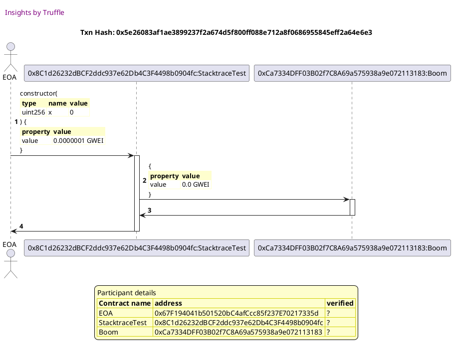
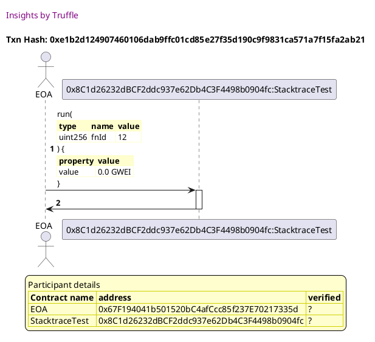
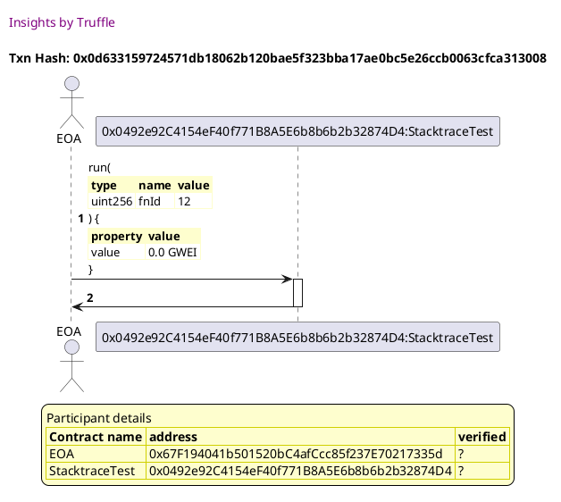
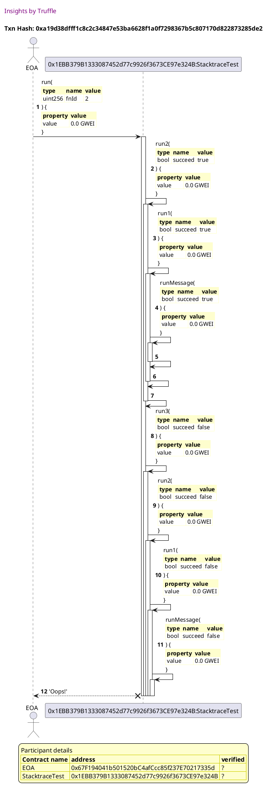
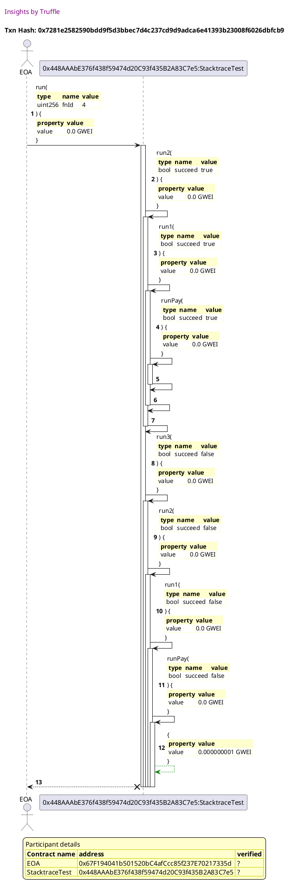
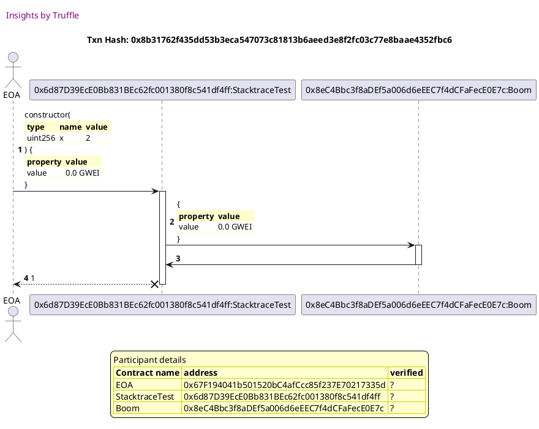
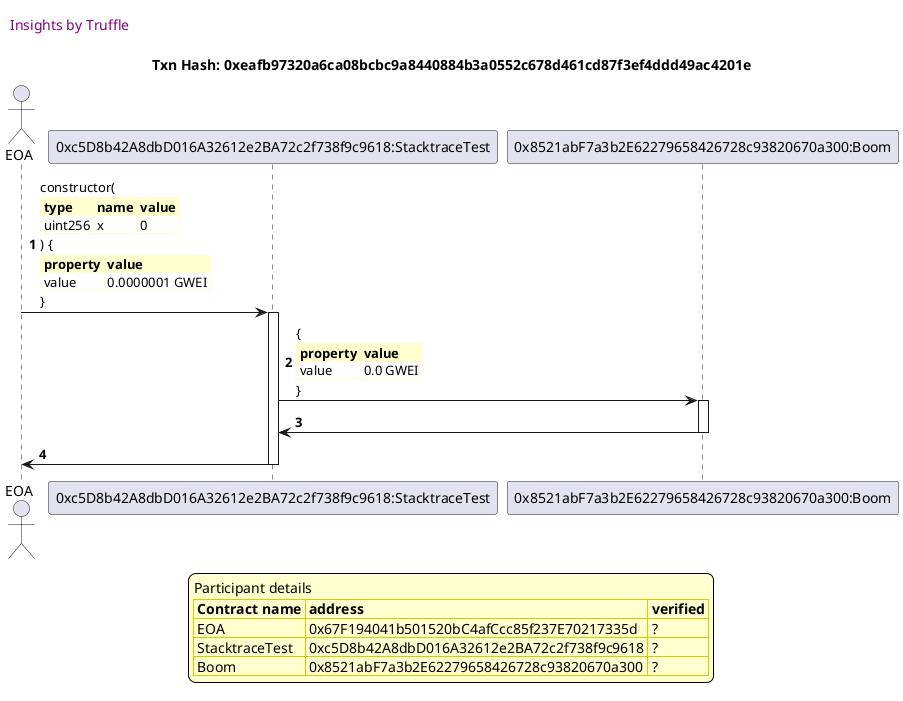
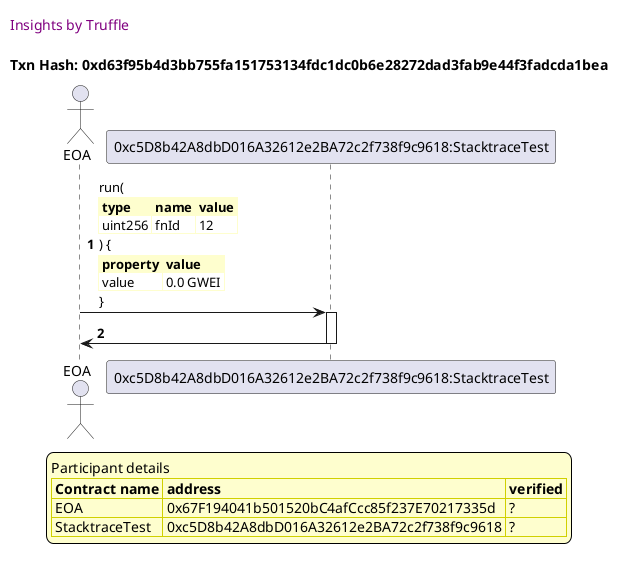

Test date: 2021 Feb 12

## succeeds
[link to test...](http://github.com/trufflesuite/txlog-seedlings/blob/152a410baf2d76d60511fdf559e3219e7a4ffee9/test/stacktrace.test.js#L4)

##### d1, tx: 0x5e26083af1ae3899237f2a674d5f800ff088e712a8f0686955845eff2a64e6e3

[SVG :telescope:](https://www.planttext.com/api/plantuml/svg/fPHTRvim58Rl_IkEkfjDNJT_y66YB6j3mjghLMgbtVJ60JknIWmoPahQzB_F41GrsIfLcYLqm3v-_9x32mXTDavOrwvBX4JhAjEk5zAYvb6RMbYnXb8kfIcc8dzSsgerHLgLbOKFsJoRftE4netRbdA2e1yhAGffuNbu1BYkh7wgZ1FbLQcNPYsDyqJb3WcPNzmZwzRMfJnQkDDF4aXmcBiLHQ7D4WWUfbxwEFuwY433-JUcqSkLQs2nXNlRAkMvo6bNIhZV6BWMpMe4U1DA6c7EX292CfuabCMAYYWEYb1nZ9N2dCkOKC4LZdYKX24FGgcwd416aY7VijnvwVEVLo0QEFFn327VDwTpNGjVwvtpZNDMvF9UDgvFmXkUae96bD5YccQqAFA4nJAYiqMGiYm84hx02GvKFZhUVOAULjLw0AOYPYoOPHbcKqnLdFAhA15X72QCYqJYc1B226UZRe_7z4BXOW9d9oV0-Va8yieqphPTPHyVp0CQ3o_xyn0dks_WjhK47urOz_6tA5j_qwNleDN6qJ227MpyXVVJd-3vBLXjgrfQjps01iu01Vm5zuF0Zr_pcptknLTnAhuhgA-mB-D_ZZivQ0_zLxykBaRmXf9zZ_jrXFPV4RfzzVuAwOGkcrSIPtZcg-mafjxydkOE_VN6jx9fUidIQgLb0Rl3rickjw2NledYZ2G13iWYn2IaU946GgLvpaFbxJsFCINUAw7V3T-F2ITMxM3lDUhViDwS7UAzrXmGlab3gn2wzC7_b_u0)

##### d2, tx: 0xe1b2d124907460106dab9ffc01cd85e27f35d190c9f9831ca571a7f15fa2ab21

[SVG :telescope:](https://www.planttext.com/api/plantuml/svg/ZPDHRzem4CVV_IbEx6LJryrs4a8GOsq3MNbQfIBjfIzER8FLu4IECq5BltkF4A62D6bv-IU-yy__ktC8kMcySBxTb8I8rbUstUJAaURPs5euiO5IhPILTw9uNhcgjJAjoih1fsoUpTCv8PF6xqer9T0zQoMaSl3QVmBSLywyLDQByhOqAxjHrYDH-rD2Xi4ZicvTNQgpmADvKS32qzg3aDBO5J3QBxrrEldUco3z-GlRcDNQDv3lOEbQhP5BlF6bWkNMmhrercEWMyLoBXaF4ng7GyheK8eyqRgWh92ZIF5O1v5a2IqIdOm2LeWePYBMBDA2YvmpWYqhF5gV_xu5qS00TK08zisRmjG2Qttqs3ZlHA6Mgl5T4jsEKYRva0TStgKPbx98WbWD-ImFqo0BmsIKquI6kXYVxqPqTm9SJs5m4OAhgp6urdv-iazaqa_dQw_J_G_mkre1gXMRJl-AiiMNG_eUMcCzZuQm1sqN4eNnO-WBlFuBMBkgLixlJh2UrOE1VgFmwyzySGIzeVTBouSoZlLSZm5xIOvNZJnyw9zKNfYo-U1WHcUKqeE356y8qlof9hmTJZLDvqWveut2MavRf_jkJkXiEumpbeGqP7b4MSHfdeP2fqKnYZGFudbCEOi3d3qc_pmdNCpp0FlVQVOmhB2lav0R5FpptW40)

## succeeds but fails anyway
[link to test...](http://github.com/trufflesuite/txlog-seedlings/blob/152a410baf2d76d60511fdf559e3219e7a4ffee9/test/stacktrace.test.js#L8)

##### d1, tx: 0x9492560012d75434ffb17699bf6db462f7674e487174a4c60c42f7c0d9655955

[SVG :telescope:](https://www.planttext.com/api/plantuml/svg/fPHTRvim58Rl_IkEkfjDNJURs1YYBckQaBLNgzHAk-cD0PEY4eECcP8s_UyzE2ngirMgD4leW3-UyvwN0uISjKvPrwqgGbJdQjEjKcr9Ur-QHbcrWaeljSdFLNQ_j7LdybbTrHO-B995Cai8EMtTfj8J0dxSQPLh2u_38y15RSk7sZXLJQjoQLRQE2GMRhzXWOixPDFPfjAl5gxB1msCx-UkL9wNPWcC3bDFFfv-7KIG8V-bQSlbdMiXtS2DxOe2kSILhj9mipPmeTgxCT1rpED0X9Io89U2ZtXHf4o6SPmMOPxoC2XaABdcaMIIAvw5DECubz4y3eM8XI1eMUPGUl9p2gg58un7XA1lhipAHc6jrmwDSrPb-aQtpc-YQufvTHpCE1DSBpWjf6JdqLGaOHgbOHgaeo2IVCx7hqyVeC_hUlK7E8rYFehIEPk6NEICHybe9EQ2BhXC-zgYN0lDf-F-36AyK3YPmD511ZW-7aDMczRPhg_iuwsv9QV3o_uynCds6xXDem6ZKIiVVwkgmvj--nQwqZWq5hQmnelkfZ_1urkmnjQDjcwp1msS0Ghq2_M3mOzVoUKEzuHL78hl2_8L-ZB-9zr1eXtqNtwTd8pX3IKxZ_qw8RklY5ozU7-vTggisXSIvtIELVOIPzZyI7DxVx7nhMvRBrdRiYXr3jlzqSdMjo1ANuTomM9EEKi5PIAWwOohOfPbaIY2aKma3PZ4ti3JyFqruQ1LUzXx6_Llc6zEZtXdQmu8D6cmYf0p3FXVUWO0)

##### d2, tx: 0x0d633159724571db18062b120bae5f323bba17ae0bc5e26ccb0063cfca313008

[SVG :telescope:](https://www.planttext.com/api/plantuml/svg/ZLDDR-8m4BtxLupePLVTxjhE9uXbIqFOSjfAHTfBBtRYWDNWH8wpWfR-zmuXGWLffURo4i_upNip4q9k6oUiQpSb8Q9rbMatKbdIF6jJ2oisKAgLClcTo9vNjcfDdbHbPU5gdixJ92LatBXTgIO4kcUjHAuilFQV0FULrI-LSQASbdfbDieuP2pSAM6EmIDbtTgwL6U1H_sYWFcdimUHvzgiWD7-wAt3yOzU1EdhBqoZLslNWDp1qhP5WRp4QLSgM6uDt8jcFGAwfNdeUImOHjmF8fPB5jEGIyQf52eeFEv9ALWa59LPe7YOPPBIqCkAJ7ZCepGcsBBCeVJqpnH40mF40I7ODwSpNGlq-kYmSSwAJ2rLuxeahEiFkHhon6U1h-O-BQA8tSNJ80rbB4F9fSVZo9_ve_FRIDrLW9i932v2S7qz0jkQBq_cYOpxwNphSRB_2MvNAq0qOjFXFr6s-798tqEhZUD127iep297OFmO-Wgl_oEiRLKhwtOdifwh9mRwdSBll-dYIFI6sYyb7smS_ToC07j9Zgj67ZxqBrTEwBBve616PvJIWu84DmJPtCaJReTLJTCfKbONMg6NqzN9lfiJAjk6qPmDVUep6L0MuBmJNnH9biL1mRqeZIXdaUS5XqxyEcUucEU1xBFJxCdGOU-Ja5i4_FFU0G00)

## fails! hahahaha
[link to test...](http://github.com/trufflesuite/txlog-seedlings/blob/152a410baf2d76d60511fdf559e3219e7a4ffee9/test/stacktrace.test.js#L13)

##### d1, tx: 0x5552ac1c25809f864437239cde8fa9c115a90b86edaf3e499fb245eac7276373

[SVG :telescope:](https://www.planttext.com/api/plantuml/svg/fPHTRvim58Rl_IkEkfjDNJT_O0nHbxKGilPgbLffDxrnmAHMYK76J4cR_lSPWg8cMwLAiuGEs3wFt_Do0A6BradhkbM5aEnSRRhLGbdKFchJI2jNKAcbCaKYyyUbhJjJf7LLM_Wmp-PPcY5qthfDfQO8Xl6WPA4iF8-F05UrrK-rSRAwhFJIh9HndbYw_OQvNzmXcyusbJfOkDLF2aYmdxkHHQ7D4WWUfrw6UFvr5876ywzDgvSFheN51kviLvQUYvnsbOAxjO4hsJvC0AyvvrJc9ASymd4PXK7016LnNgYeb75E29SnNaIXAcJ9L137vO86NCbSK14omP2tB7TUUlRp4cGB9pwU8EHzSphNZVIrtZfldBCoLtUgTSCcl2PPaZ0H9uGnXYCHS5e8aSSn3KiM2fPciL2C1idaCFi8dTJrQWIcKWGaZ4AM5OpoEAIHaE5iDkSu329CHHedD2h3ODBdUCmW5CwcS79q0foUJY2lJUjirrVsyTxSe_FnPNyUutJx3TocKU2ZaQiX_fPLvs_wxLlej76KXx25jR_mRleJFBy5QspTAEisUz386Q60l-1X4FZnAxlUuLvy5SVY-uA62eSo_kUueuDsq7_vTNOsWJUKx3mUrX7QVKNevjNxAvIJkcfVIPpXcQ-obvZwvlSqj_VNDxvLRJj8LbQNMXMmtQTEjqCBUkdhKCn97E20B3WcdE956iWopVE8bvI9J61A16FSPyFtGy9Hg_QmzpRgtx2XENl4UrjpH7YJHgiGkl31_vV-0000)

##### d2, tx: 0xa19d38dfff1c8c2c34847e53ba6628f1a0f7298367b5c807170d822873285de2

[SVG :telescope:](https://www.planttext.com/api/plantuml/svg/tLPTJzim57tthxXZ3monRlv8whHY7RIaWuS9993smekJs2KYTIBRGIsK_pudpIfWsZHD23RoSXBVwtFlELRaYz2-TSAuUbuW96fNwdgUI8FiLQuhOSGS2ZcJEXkBz6fcobfdax8e3RoTnjDu4YEqPzsoa2C4xNCfHIODt7QV04UboMzAxKHnKEGpFPVQUKRbDWbJ7rnJLhMf2laWS9RVI231PkrKP5ckPq1mjtJNujx7hWdKrJ_MDfzTEWl94ivDhPJdHIvtXOJpXOOZOI-7W1U2338MPKefaaOfJLaG1Lo6B17zFeqK4LXnEeXOdoTX6c5EECuYIYFEQ1HcaY9lMUfyw_790GWBMnwt4FA-kJpDA-6rdZbld3CYbUVIkZO9BqWy7ZC-61F668vu4DACytGme7tbQx59FE2IqM0yVBZRKxSLe3U2hKSXsDqTWgdrkmjzWVQwqtdVuMZr2Tooak1HYtcBrwAe_KkJle8wruw6VLY1qiUP1xgExC3jh_WgKrRIkEM6gwFgU05_mF3bMtoy9hhphJ_k-3SgwD_9ICgoyALjdQPIDZAS-H5yAINarIZvAgqLC_d_w-drXl2YgPsXx8ciLAAmydNyh_-05F9wf3pj7_jSWXQzHb9xpmrX-wIix9jjX3BfRzhyMZZvazndZo6qdedGwRsBFfDEv8MzPyeXFiGODwPC_2ZZjxkDqtwCCVvmMfEaoLNUEBpPEbgr0uKtQz7dKp88S42I49EGucGI23L9qoXKbF6OOqeuOs5pFfyVCZmQF1goFnqxEZAliDE9qBu7Fo9-1m00)

## fails with extra info
[link to test...](http://github.com/trufflesuite/txlog-seedlings/blob/152a410baf2d76d60511fdf559e3219e7a4ffee9/test/stacktrace.test.js#L17)

##### d1, tx: 0x514262da817b0131020db2cd5a6f9cd9a100d6f67c22ad8d4be8aff1c05fb601

[SVG :telescope:](https://www.planttext.com/api/plantuml/svg/fPJVRvim4CVV_LUSkfTDNJVRO0DHbvLIMFkqIgsqbxuORAUen21ZfgHD__Sv14LjjagLPWaT_d6V-zxv0A6ptWdhXcM3a1XSQuPbgIpg7shJ2IkMqAY5Cl9SL0yBsmv6PctJMlXGv4MUvGYTzcxTg3c2STmh8PM5fsaASDdQ-h4rJZHfKo_CKXddYThj3nH-SuVi1jirwjN6JVseW8JxjMiXPMqMGF2qz3pQqw-J23J5lp9zlRXtFPHhkBM3rfwBNEqQ1RSh0vUYlvy1NZ4IKawbY4bKOX8GJB4iQIMPu3gfP288nf9h7bMK2XdBi5Inq9fKcEcIOu9yoIhdfUS_Kn0z77bxX92lcwkhkXC-rnld2-UigDIjwjru2A_2C4xJjCo3YEimY3LBmYYK56T9uEVidAPna4MApLvx7w3FstOv0ObCWuopC9Ni0ZDEYyApE4wOZdZ2Cqnv4RCWfBEjZyUCGk5a3aS74U3uU0PLQtfdXsrc7-_C7JgTBllpPEURR-3MdG9lZLYEzhTe1l-oFRw1eJQECWuRMFa7xvO_mTDRiCwsdR9klGTDd0aA-0iU1u4Vl_Ah7UxPPt4eVflGcE6Onl-4EmYqW_whNYSdCtX3oQx6upv2kwy8NR-uFwcSg9l-XSGBVE6pt4hCVFDxcjlNrpU-LNq_IbQsrhMIiDcxpZTZ2thfAnuL90bnI4g62QEup4AXiwgAcQP1b4UOaYW8cFU6xwy91wswXRstKV-6ZSsvHRotDIU4Bz9KAeJElF7_fJy0)

##### d2, tx: 0x7281e2582590bdd9f5d3bbec7d4c237cd9d9adca6e41393b23008f6026dbfcb9

[SVG :telescope:](https://www.planttext.com/api/plantuml/svg/tLPTJzim57tthxY2bqsic_FL91NhA24TF0q9f3sCFJZsJR58dSXnK0lblyz9imhOfpO46twvYQzzxZt7iN88sQiDqwQP5uImnfIgcMUeINqXLSKqcqE1CrHYd_6BcIuR9PAoA3LiJzDfcgI4xDPcMU2OG3VEaGdKSDs_0XoMMbwLoh1YKiYPcgCo5Z4tcmLJcrn3Lesk2hoJE95N28w_cJjcGaWr0uVsKpTTt7tJDq7w-aUgbhDpKqEsX5FTvBd59KQQ0k5qeU2GrUSZe8lGZHnqWyWDOfe94UU1yB8CUIXyxdeX5x68cU1iYBxZnLxcUfH6-P2wGv7bF8k9bOmRsthwOGAiXYqRjmYnkXd9PSKirnDZXJEQSJp5sdIBwCBteybaagLUECnzByg3s0zzuT8azknxiEzE8Yy9CHZTtMsXkmem6CFMlHJix8n0D-h5cJeZk_tflEhZUFKMpB92i56nUHSlMT7OXtRv2XgfZ1iCOGMvEX8s-ElCIxZ-4LwbomgrMMwmUgWU5-Xh2ky_faThe1lR-lsEVyB2_JCQMLaMjdJTS8xOqZ3wQ_Afc3ZFXianM_x_N0Q34JpfqbvCxu6ap5bHu_Eug_y05UVvK7cus_feP3vjppIY-lmzLgE_gjmFvnSTB0PjwUuFszvdWVRdBY-PmM_wUVGS8MiRHevlUGk1XicYlgNA0JsmF5jL4kkUx7QpEMJhd3JMTQSIQfdBzd0tMyUhpiDOjHR3SEh4FlMTBA1EuD8iyLcUS1u5kVL4QKXT9_IyeFqqtjr5kETrMh3VTJezc6NOyoHapmRhIhy0)

## fails on deployment!
[link to test...](http://github.com/trufflesuite/txlog-seedlings/blob/152a410baf2d76d60511fdf559e3219e7a4ffee9/test/stacktrace.test.js#L21)

##### d1, tx: 0x8b31762f435dd53b3eca547073c81813b6aeed3e8f2fc03c77e8baae4352fbc6

[SVG :telescope:](https://www.planttext.com/api/plantuml/svg/hPJVJzim4CVV_LUSsCicris9yukATT0q7JmD2QIzyEBOvsAHEfNZe1RA_pudZIeeJE9XaQ9BdFFdxhw-2o5dZUFMjSkA4DwwshJB4YrfxhLPSSkNKE42ZPnoSR-mTMjaNbUrXK_pObxa1I6dZTjKE27GNtV89Lfu6bu1Bcgh7slZU7LUwOLPed6UgDpUOUu_xf2hrgugVFNXMZyY1D5-xOfBgSq20ZeiFVVszFkG11dYNvf6B-vS0-K6RcohbESIfrs5SBCsSC6Rkp7GTLQo84r25R5OofYL30MFevIcJ6H15h0ouOYIOQP29IWJQOfPoJbw_r2L8Y5UCk5ywiNlS-0D77bxH8ZNpMcXLzpNUksySCvoWJVOkDw9hXEPfJDsKeY2JikC1TD295q46h2Cgap4KI1LfDJuzUu3zBIkbmCmmpoQbeAfZCyA5NDA4vbWKUIfYcG-vtFqeOfKZBiz7jCd2gC971r4WEFZCOZQDCwsNMMVRyqjEHqE--jW9ziVu3Oh16yDN_RsWLUjV-ZSjz1guy8uWIsi_Htkbh_0qxzWArklqBhD7ZHm1YZGRnH-_IakTw1dd_zXsbqfVMrz0Vynq0xwdbAZqHZUoMGzwfnxVSSG42BHjuX-u0xV87pxx8QBNBquLecEwwfvaV-CpYYbNVwvdmc_tUrbz_DWiMdwUj1gfL72ThzrikqxqzUrJj9vS1BHA2XZ6iGXBVE8gro8B5OXIukKXa7A_1Xuvv-l2GSTtCC-sBzlONtFTeYFTko0y28DKX5ovet_NVq5)

## SDs on deployment!
[link to test...](http://github.com/trufflesuite/txlog-seedlings/blob/152a410baf2d76d60511fdf559e3219e7a4ffee9/test/stacktrace.test.js#L24)

##### d1, tx: 0x4ed54473ad64a6fce65f8729e1ad3473eb81a75398c05bb53d0d6e646029ffa5

[SVG :telescope:](https://www.planttext.com/api/plantuml/svg/hPJVJzim4CVV_LUSsCicris9yukATT0q7JmD2QIzyEBOvsAHEfNZe1RA_pudZIeeJE9XaQ9BdFFdxhw-2o5dZUFMjSkA4DwwshJB4YrfxhLPSSkNKE42ZPnoSR-mTMjaNbUrXK_pObxa1I6dZTjKE27GNtV89Lfu6bu1Bcgh7slZU7LUwOLPed6UgDpUOUu_xf2hrgugVFNXMZyY1D5-xOfBgSq20ZeiFVVszFkG11dYNvf6B-vS0-K6RcohbESIfrs5SBCsSC6Rkp7GTLQo84r25R5OofYL30MFevIcJ6H15h0ouOYIOQP29IWJQOfPoJbw_r2L8Y5UCk5ywiNlS-0D77bxH8ZNpMcXLzpNUksySCvoWJVOkDw9hXEPfJDsKeY2JikC1TD295q46h2Cgap4KI1LfDJuzUu3zBIkbmCmmpoQbeAfZCyA5NDA4vbWKUIfYcG-vtFqeOfKZBiz7jCd2gC971r4WEFZCOZQDCwsNMMVRyqjEHqE--jW9ziVu3Oh16yDN_RsWLUjV-ZSjz1guy8uWIsi_Htkbh_0qxzWArklqBhD7ZHm1YZGRnH-_IakTw1dd_zXsbqfVMrz0Vynq0xwdbAZqHZUoMGzwfnxVSSG42BHjuX-u0xV87pxx8QBNBquLecEwwfvaV-CpYYbNVwvdmc_tUrbz_DWiMdwUj1gfL72ThzrikqxqzUrJj9vS1BHA2XZ6iGXBVE8gro8B5OXIukKXa7A_1Xuvv-l2GSTtCC-sBzlONtFTeYFTko0y28DKX5ovet_NVq5)

##### d2, tx: 0xd63f95b4d3bb755fa151753134fdc1dc0b6e28272dad3fab9e44f3fadcda1bea

[SVG :telescope:](https://www.planttext.com/api/plantuml/svg/ZLDDRnen4BtxLupIIwiqhUtz154Q0al3gP62r4ik_WGhYtVbzLQGaFyUiwnGGAhKlJolP_pytimOeTl6C-VRJOaGQtrbsmrN3ZNFnjRCiGsKQgMil6FYUUMgriffLLOEFisBUJ4j41erVbUgCOBkMoicbOFN_XVWldBcfRAUbPFIhEn6MHyOjJybp4FmI5cthYxLMU3Hl2WWyMdlWKbfx0e8xhVUEXnzxqMW_lw5RSngxHlWErYwLkl0YxpnfOBbri8zQzP3m5kPHdgGy5X6d6T9eXb9I9P498gr54GAp5D5SvfHoMIa6H-eEDPX8OLaX2k6Gic43zABtnDW3Lm5l48erCqROMeMl3xwK3Zlc51BrVWk2Mz5CijvJ2Uvv3DCqab4Kq8LlPjaL52THRaUY45Ayk7vwK3TtG0tOxYw2C7rzH1SQpy_sISqwhlpjSVn_WVuNQqWe6MR3l-oiWsBG_eUMcCzJLBOWxOB6O3GO-WBlFwBi7PLhPpVdSXwhfuOy3SCl_uKYoFHMz1-AVbWu-ZdPWYXbkWuQkZXG_sayioKpGS5Cpp361yKJCE413P_yXIcmwccwHGfPxHHmSlfw7ZVzIaeswRPd0nY71EUO99GpASnqrCXyaJJA2ioJ4aMHScX4Z_F6IxwUI3xtsxsPC5XxnEXsm3XvRq3)

