Test date: 2021 Feb 15

## succeeds
[link to test...](http://github.com/trufflesuite/txlog-seedlings/blob/3bcab5a6f1789676792542f75bc3a5a304fb8b1a/test/stacktrace.test.js#L4)

##### d1, tx: 0x998dae4742f8c25578f71c55045db34c160451e677b410be05b9b258ed835ff0

[SVG :telescope:](https://www.planttext.com/api/plantuml/svg/fLDBRzim3BxhLn3PPKENJP8bFu8ig9quQsy56c2NNcGz4gEs7CZoaBJPVv-Q60LwB490-4YAubD4wBRtmlcXRH0IW-_iq5RQeVwvjdlXH0kDtcgh2Y6VjwuRh5fsJUVWoxfSbyiIeNdlZurU83ZJJWkb7RoE8i1Tv-gNpdhHv4szjQssFdWq_jrW7IulBlU3spVwmyLZ_QA1i7VTWr2gjbiWU5JzE-FyvvW46kFVsxxUxdmFrH4sRZ0c-4M-zes6pS72dUXtCy27B4kLq2nXrAIISfwa9Y6ISyougY8cIHmuekCagHZ1bSQyoYhAKwtIY1k34K8JV4XekLH9pWgIBOL952aYAh31HInYigAibCIi8v5FOBg0O1zXl28ivKL9XE118gcIUKNpJ64MfOgmAgUcuBD77vhkdP1weti_WPkR6SZEzjuDqdVkwvDzGlDn4Dz7N9n-WJ_kDGIqeZtZNz4CWNapFy5GXmcSu10ElkY-mIlW7_XC17x_AUz3Mw_9yr8cPeB91ATcJLS9Zp92yap65AUSYpncb31ZOhQIiwBhsajnwFFFhcpfT7g9UcMjd_W2Rm7HRTYei77_0G00)

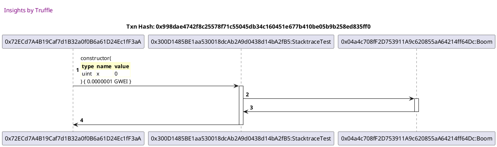

##### d2, tx: 0xbda82e7286a1d113757a8f4f74e8cbc684472c8acb0ef014cf16c414968e1924

[SVG :telescope:](https://www.planttext.com/api/plantuml/svg/fL9DRzim3BthLn3PPKFNJP8LMmcoe7RghBaDQ81TUg7ruHXrv42MXwHD__kqn2Ymup1TdaW-F59F9EIk3-Z3i6y9mI5qRjXNnfF-kN47zBY7rjJ6wGBLS-sxmUbLrtOUFgpBTRag2LdquTIQ9O7BsHdKniFh608yTBvvwLp0Dc-RsksD2r7HXdV2EXQlaeV17rhpL-6nUJ70n7lk1shTk1eO7LDl5rny7OSWO_-Dwvjw5tgeJh3rWxLHbuGcj0QsHmSFsE_cG8-LHibDncMAJ3EMPDCCfHKs4qQgIgLIY8mhYQgYnb8cb6Mf4apCKcdOZ0j2o8GUCrwkT9QBWirMQ3FDYeGZjRH8CMNtN9IAsNM2-GHkbn3v2QNtJCXfKJB4QOoOr2glU3xJL2HICr7bt1RJ-ME8fWUFocnD7oPmSpC7FxYFJ-w9BCOF-3pYylmDmkbW8AB3_GL_OJl4on_w6OOcEdy6wpOw0kFN_2Tu1Vg5mlUVvIQQ-J_JNH_t3sRSpe6GkxXRSVT-0m00)

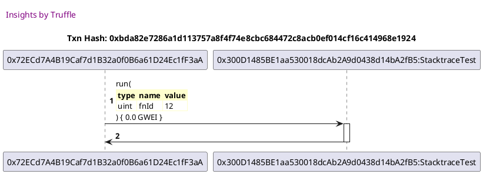

## succeeds but fails anyway
[link to test...](http://github.com/trufflesuite/txlog-seedlings/blob/3bcab5a6f1789676792542f75bc3a5a304fb8b1a/test/stacktrace.test.js#L8)

##### d1, tx: 0xdbc98f4bc73680fa2389e789d9129b790c6df4637521b10a9c0224713cc5763c

[SVG :telescope:](https://www.planttext.com/api/plantuml/svg/fLDBRzim3BxhLn3TPKENJI_RKf05jHDxxMr00-pIYopBYL5R3cHvIDhilqzDZ08x5Y4WV199yKs4xWQld1-x5Y4r-jwENMaS6fuRkrTETT2QhR5LflJprlMZhLPzspluLEH5lieHMWp-s9ebWZFjZAgCWzVf2N3Vk-QbjrwrQTjiRMUi3nPh_wvG1E75v7vq-zRy9tXiNWmG_ixxfQggiLiWU6BzFUFY-nG4clm_sA7Pxlm0vH4sRgphO1VvnhS6DWSBzshOpG4Vgb9BKVDI9omMk5QK2MaI8Ij9g2mJYNLSrJncIKH9IR2I6bFA4yAqZfAOQOJG3JuaD5zLISep8bUgJYgICQfmZRDOnMHDUQv9NJ2Lti1i2K6_PYmbaSHvagrfpAIEjM2SnslAqZGJAezLlcQYd3_wK7Jlb3ORC_WRkBsTW-xjuDseVUy-Fzadj9WQyNN2vUa7-EFUG42hkZF-KUqOBc_g9nYRq84J7CB15zuNU0Ny3P-9mC_V-KCewpLnNjACw3gcD2fu5d5CE9MP48HBOgJWSaKZ71NrIWWsp_g-koI7FlxjofBEPXUlL-RwWH5uSuZkmaQ5ZVi7)

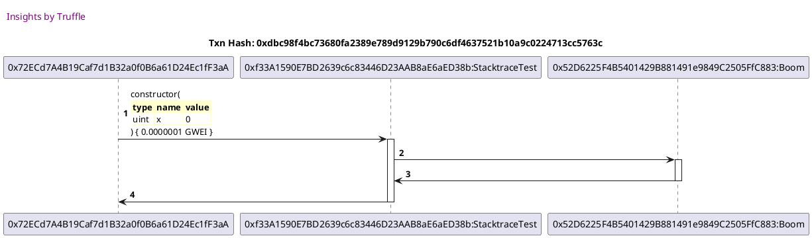

##### d2, tx: 0x1a7140ba12ca9cf40740ae4b58db70390ca11d0f61220d1e83bc4c1783201dd2

[SVG :telescope:](https://www.planttext.com/api/plantuml/svg/fLBBRjim4BppAnRkfKMQbg_eORX695jkV2iG0xtaiX99MOX46HHLs8dpxsLj8K2FHNaPSdOmN0wNaFl1e_DZrnA2e-_js9NQaU6viGTqs46hQsrLZjLpxVhHgbNVzWu-R8fDiIe8MGp-rEebWSlQQrJQmUjq17ZeNVFIMuzjrZQrxRJrmT7uTy4c5A-MXz4TMlrNuR5vqS3aE_S3bMfi3OnErDi55r-d9iXq_zOEJRtt0vGdsBdHcE1BVEDR3RkZXGSSzdEWHuOnaxH4nYjCAoDfB2bgMTubgeofI6c5Z2bg8iOvLKmdegnanU94SCgKueIG6Jt6l5YfE9CvIrTeOiLomP4QcaSOiJMNHSNCHc0sWzib1BqH8cDtAItYVCqZaLPHbGWfepKNMPOdM4HOh4LIpXzz2DqxhFHE3tu6DpTpSAFz-6IVo6BwWCyJBi_Vm9yE6W9Qx2xu2zinRFx8pp0s8Vap6BjL0HY_yf_W5UWN2jz_5jiGvlzqTttSFuHnEmT2xiDiXTdx3G00)

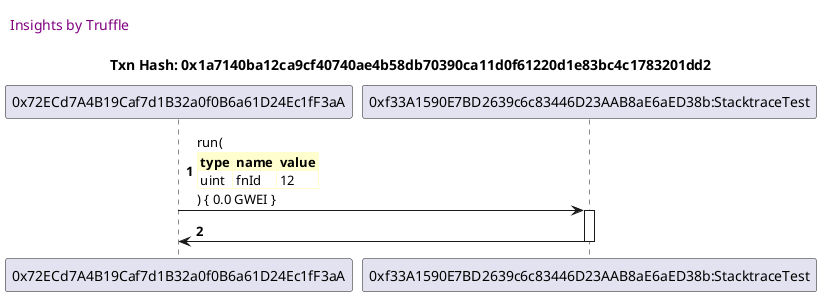

## fails! hahahaha
[link to test...](http://github.com/trufflesuite/txlog-seedlings/blob/3bcab5a6f1789676792542f75bc3a5a304fb8b1a/test/stacktrace.test.js#L14)

##### d1, tx: 0x5971dcafce4ee9fafb386bc476aae00ab0b26eb7be75e04fe37c5cc1c2a56776

[SVG :telescope:](https://www.planttext.com/api/plantuml/svg/fLFDRjim3BxhAOZiig7B9jcIPGTPqDXrrju6DC0klT2ob1Xrv42MXwJDtdrgOXJOiGW1uPD8YlyavBRtwFomQmd1mNTss5NQaVwviNjqk8DMRxIjSrJF6zSDjYwwjdFmQLMkog8aPDxxOwiN1CwqrLXh1w_Z4-2-SyrBPpssoxRPs9ssFbWq_brX5OGNa_l1xLlzd-2nUT70-3ll5zPrOpV0wCZwUyRvzp48Clf_i7spsVeUgYEitM1Ci4jyuriDwuE5U-otCw07aKbMApHASwqpWwQAqwHIN2Q8cbAiQ1KbkfALba9JRdGibL2AgGX58cL229dGWupAefPBdhEiG2DhbiSHKaFp11Ds5_5ICREASJc1wGA2VXvbSH7nX4iXi2wAZ1QnoR8ybqRGBAQKyhJWQJ9xzA7etg7IQztx2TpSp41rjlTkKBvpdv_i4vcFZVWwukBq0_nnho6WnTqP_s0xXCkR-Wc69dJW18Tmw8Nt1Lw1VgDdOl3pT_aGodfDd9SqCvbIAkwGYKZ4WjCeKo8lsLALQLAaN56PQu4CPtdNxIx9aOz_kxAaq-d5wvMvVc04tXoIsx1HOUF-0G00)

##### d2, tx: 0x706c6a71a863e4bae77e88ba78beb798204517d7fc46b7082ba82b76294fc3b7

[SVG :telescope:](https://www.planttext.com/api/plantuml/svg/xPVVRzCm4CVV_LSStSD0e-3yQ9nKfTgIjMmF2CGcyS1uk2IND5hgLBOpjLlvt_7MC8aN9BOYfh8eqILtfw_ziQtJXR53RL2PTbupXgrfP3jFIJ5zMSa5Afn3JIN9FCRiibHDA_EagHi5UzF9T99C61jfiwffpE3kcX7cfE2c-mGuQLHrtKY3zL5TbN9EqbZ5mjmdJ6rm8xberQAcNm9drJM1uz_xFc6ULx84XtUkxtTszBQR1El6FvMwAcT6Gxg2SzKMXTLbfZ8rmVbImWdgsH3uKl0W2r0u60OU-IcI41I6AOemfLH4eSlzWIDoKMH-a0eUkYdQHmHkv1UPbmh6MC-gk9Ca5qT-x4G95Y9tOiz5Nl0umC0vTlr9vXHJ3uzwq1-3pO_To4jSF_35O81vaaGyyOeeYcDH37ZaSSxzCF73O7XcxA8RXHcTapOzE3WOWchbomjvmKRT1hpkx7Zz3ingGM2jnFcTlSAwjI-twMjeAxloQoZaQMwDkt6_WXlWRpYy_p8vjMlvcCbjXyrz65pQDBMbqcsM4Tto6VKp-EGGdTr7_41QOqax3Dhl3-5v_7z-qBmj7R42QqqxNXAVCgFp7p1kjoZ-7T9b_-jUer2Mz6q3_GUzZQq8dycqIiB34BLHjwtT6koz_x5Pw1Vx7H_B2JDJNQ6Xnsp4iynlPDYXRVBjJy0F)

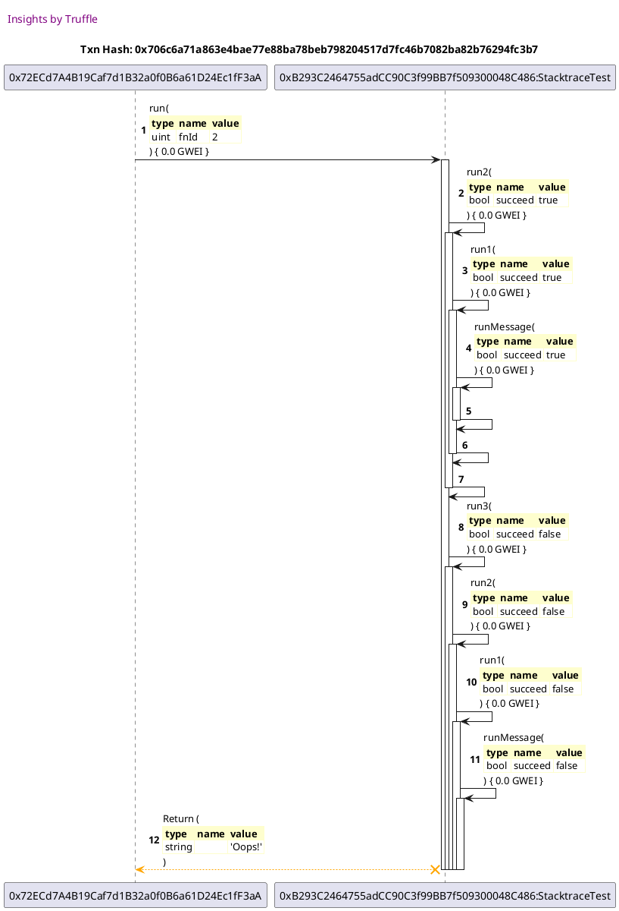

## fails with extra info
[link to test...](http://github.com/trufflesuite/txlog-seedlings/blob/3bcab5a6f1789676792542f75bc3a5a304fb8b1a/test/stacktrace.test.js#L19)

##### d1, tx: 0x8d022d1eb5a9f5de2302d3bce8f0739cddadaa90b17d6542090b756b9d62c51f

[SVG :telescope:](https://www.planttext.com/api/plantuml/svg/fLDBRnen4BxxLupefLLAQtjV654K34kJMwGWzPBBxDg6LNQzoEkj8A7_lGwi8kKOCP8ru_4tRmyXjvr7v_kc9WHxtzg-ARGZtNDbz-YmWLfljLKIo-UjQtkhbctTElYopjVvCYTarlbZhUS4phJJgBI3r-4ASDUwwgMr7kj5NMrjewqF7er_1wp3uyNbldVxMdzuUAnUDB3uNVU0IbLs2umEgdzdFliv9466-FUsgxOxtq5nX8thZGb-YQzyhM5pi727tMuAz31Hb7F5T96WC8dIFA9SHKMf9uPcaIYLGeKeQC4obIOnfq7CahGGAkLbmWmXP4GF6S-NAbl4aeabcamn6N6aXieKKxRYSLuoiuvmCOBn708-04GqOMKQhVXYbKwCo51mFaaZJIdDub8o9cEQJ1zzQBftMEgDxlm8RcwcKBQsywulVUk-FjadCXi6yNtWyzClyCUzXi0jDcV-5-i-26_m4_HLcC093k7GY-uRl0BzGS_4uFUV_3wqzPeyBsKAjbG2PI9YkM8oM1GoORdX6LqaccUhL2LnbCVHLBPjSocEVDxiofQEnvUeLzRwYI_m5f3SXeqA6_SV)

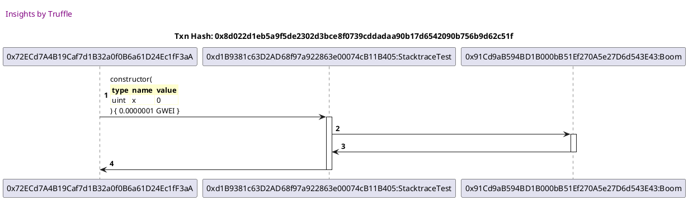

##### d2, tx: 0x41ff07a98938b23e5f4cec28a67127a2b9deca6f626f293793a65cccbcd8fe84

[SVG :telescope:](https://www.planttext.com/api/plantuml/svg/xPTBRzim383l-XL4UjdGPRDanuyW2vhdcbk15jXXtO6HASUe8mUoN2Hjzj-df5w1NGPioR0Ygo-qI8BaHmc4nDX5PT7OUbamXhKjTRsSas7LNQvNQ7091MMaqo7AkyoKjKv7PL4QE9jEffFHXB5UPJS5zHdilmLXIWOUcoN0PMdoXr9RB0P5dkabQUiYAlliC7N6fv2hsgmA-ibmdJyGyE1PTuLfckiCkDUelkrbxqDJ16loptILPmjRmNm3DwPMoiLbDhS5mSrQmoLMYovuwu0hvKMOn8aVpuLF7HL8aYB6CE8YGZ5FKf8Ogb24IYH-bFWOTgIKSvd6YkA0CTRorf6OZD9e40nvCa8LfNpe2_IKDmmnv6CHJ2HNKny7BMZtmVax1vUFoz0VYy4uZ5NYIX0Y3dtoF2yAv93pOU1rkjVMDTqQb7H3bMt1-NaNJAtVtEfRrcisu5qZ-zkFO3Sh0YSrBlVo7elQ_UpSjr3dhlDRK7gMEX4ygT_28tZlFVZqUJ9plJoakEEmYJ-3cvTbuQYgMagY7PyrFuml3f6VFk8LRauOijtkmcl-Vtx8_2CTCOL5HIS-3byo8_yF68yt4FyIvPUpp13fhmVY7ZWOrgwEqg3Eg2daDwvMkw6K4agRtwEbGoXUm_mY3BjmZm7tMFWE)

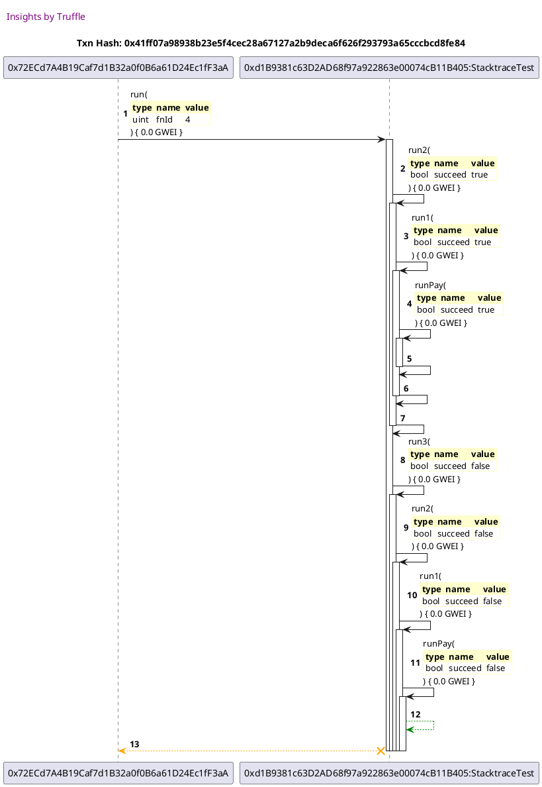

## fails not enough minerals
[link to test...](http://github.com/trufflesuite/txlog-seedlings/blob/3bcab5a6f1789676792542f75bc3a5a304fb8b1a/test/stacktrace.test.js#L24)

##### d1, tx: 0xa67f132e823754b1fb497761a0a5de8893402502acd6617caf6e0816ea24c967

[SVG :telescope:](https://www.planttext.com/api/plantuml/svg/fLFDRjim3BxhAOZkig7B9icoBGTPqCHnrju6DC0klT2Id1YrvK2MXwJDtdrgOXJOiGW1uPD8YlyavAxtwFpGDeJWu3ixjALnf7-kxHuTjj2OhR5wYUfvwxh1whnhEWUVriMwo0j2Phq_DcPEu4mxWzeuU1sV0FUTgrywwx5PDFNMjiRwOB7oxmhh8BoOt0zktvZ_18_rYm4ctdc_KElQRe7HaVNtZBFlOn1azFzW-tgxypsKHzYueQg2NU9htnZO72pSOx-R0ZrWabOiuaRoA8r5oQfIP6cQCAGOQoDb5WdAOyfHwIHXgS8gCLIon20NAajIGiWDFQIyo7Mw44kMvLYbcYqZZhIYomGJjkAYKAnQHxYuWSaSWluYOgiiZhDKgvBBEC-p0ZMdQQop99EbaX4JbEOuVVIXwDwXCXlJ-nkulPs2wcpltQ1yvpu_sISo6nlnTSJvwGVuuzv0G8lj6VzWCuJBc_e9XZfqu0I7SEY5zmLUWNwZPsBmytVn4CfwJPoNDFbgeRMML4PHb0kjL9doJCPY5V7O92ifjQXu5OlfiklQItBauz-kBEbaSl5wPQuV684tX-GkR5JOk7y0)

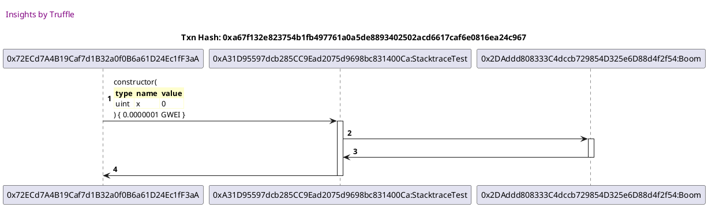

##### d2, tx: 0x7f239890163d45e3e4d48a5a834277a751673e923d19caefb830903439ead4c9

[SVG :telescope:](https://www.planttext.com/api/plantuml/svg/xPTHRzem4CVV_IbEz6LJnnR72OaHGuKqjBnLAj8UrZrSOYT43Gvod0fQzjrd8Akqnmsc8TQyN79d_Uz-5-ja4t9L6zIcMPI4O6CgrImIgKdzMAWbQbn0ANEfn1ZJnrnNZH9HLLOQBYRn98vYGWQrMPToI63tp2KAgU6b_GIuhNJnN2c3vQWiShMGobZ5pBmkcDZWNdBPw6KfVmdS5yyIgFVgkqCX2fK3TLhNzvqTV6gB86t-gQgBV6vgIDOmqqsMMLrY2bDAcAqKt68zxuEp2ZANyP0xjCU4vqicFU65w6F8F3S8CF1fBs2IkqnGdgBCaf0vt64UupQDbt92ICUgk74aWf4tfZp2B11qp5nqCcVSmnwzThqufTc4uQW3tI7OzID6hxdlyq2aYHlwKSHZ5AuJ-8BtU9Ya8QEUuqJOlpUswKPZAcUoDXsulEo3RjIx1_L01kqF-D3QuUOpcFLIWhKA5plxX6LZNxRBDz0KjlCRoDHKMEFltU_X1PoF3jnyYQUsbuSKTnmszy_WagegBLNTfAcKMpwZVmPF3f6UFsA4ojpX-en1kzq-lEN_vnkD7McBPLZMyin7uYapql-0yRX3yMH93yg_wdwzg3IgN7xRb_8RPwljH18IKrCyeP67SBp9_7qPScKl5VRIyGC0)

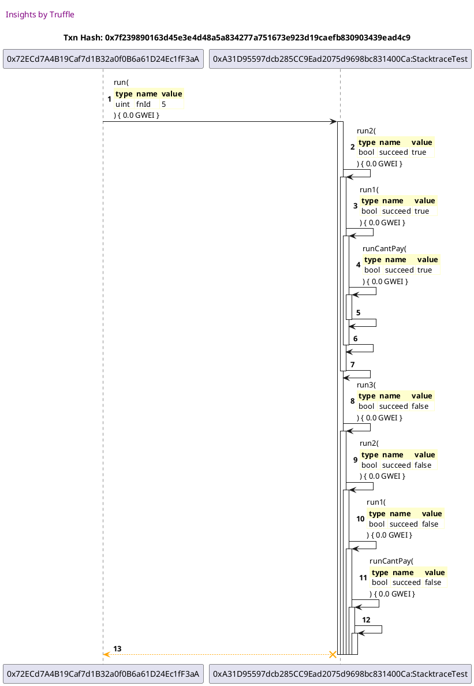

## fails on deployment!
[link to test...](http://github.com/trufflesuite/txlog-seedlings/blob/3bcab5a6f1789676792542f75bc3a5a304fb8b1a/test/stacktrace.test.js#L29)

##### d1, tx: 0x477878f19cd3e3e95372eb2db0c58256801732c9a1993d0f0ca20afae999ba14

[SVG :telescope:](https://www.planttext.com/api/plantuml/svg/fLHHRziW47xdLvpQbqrTDi3Os54MDNQJjc_J6caFwnxE1ZjMRHnXN2Ljzj_74glI7hiWqC7TSNTy7q38TU_Gkg5j2C71TMPeSsr9_rIRBLfieT6LDYh5ugcotM1KrZMTXSlLShNCbeJCUhTlz9p0iMqqActXTLm2t7MsVkcCmsRHr9LfjN4-OkdU75RUU0gv7UosqVyO7keN3KoywRwXKhMfWD5HzViePr_68iYO_zxqTRLnFUHxMDkXB7rSuchNQ5Zl3DnXlva2tGafOncNB2bKe0ETX87aEkSgfqKOyp2AAPC1Bn9aIH8eMj82ESKITP8aEVgw2BcWEycNcP8BaR8amr8gbWOSlNCQOSHkk5WMh5m5kBY0oHoyF-UifA6aQHXn6gqA5eOYfcaUYpnD2f49INDKKaqVd0VTMIpqMlVk0gwkfb1qfdTsA5ndFpoQHp8RYVWqoldXAxZzLeEN1jkZVCPcy9E_xWSOQi_00NP-y9Fk8xm2_KpXziVotWDwJeNZ0QaG4GyqPJ6xIQCm2f6AE5kKSIW2ZxWeqqN9P3XDkwuz7OkyVzkPO4ucOzR_3R2R_BpiB9fA_pgLyevxu7D_rswm1iuYqNSsSaYKniBLp-ZqER0GSkqVk_yC_W00)

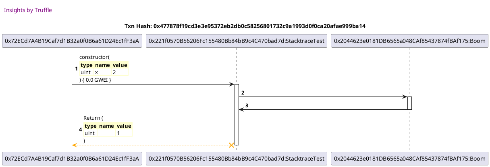

## SDs on deployment!
[link to test...](http://github.com/trufflesuite/txlog-seedlings/blob/3bcab5a6f1789676792542f75bc3a5a304fb8b1a/test/stacktrace.test.js#L33)

##### d1, tx: 0x4c496b342a8a9ce08f179f4ca979d9d4a356bc9667304b3089bb8da8357674be

[SVG :telescope:](https://www.planttext.com/api/plantuml/svg/fLFVRziW47xdhpYrBvkwR61ZR4TPLDk9rxvDQwGzh7i00ubL6qSOJqcR_UzZiLLfUskBX0wEuxiVtnr2rxtZrWrjWn0VN6U6LYYB-eVQxBdbBJHggupCUVMmjTrWPD4rdONBSbskYpL2YzuT6xL4S5uxnQMoy3HT0MuwMpzsnl4cQ-gjQPLn7b6xPuFIFuwG-y7k6_NFmrtzg83GPzrNBcLjja3mfFfzbejFKn1eydzh-dgxSps88spieBN7HQvsZOBDmS0DxtTpm0TQqPI9a0OyuMcbSA99d6fQyJHEPIef3oCcgfInECHKX3X9XKWaJy8ePZ4L7XDTu4CSh0iPPpGdQS5rB4aU1Xnhd3FEo2gWwuheCkJP1SoMuEqhjb8qfL6I4C8A4M4Tu28CMH1bB0XMeeYAf2npCRzplkZEyafjLEykuEfg3bLdUcU7odNstRsvHuk9Y0-JN9u-Wplk5NXfU7kMltWp-CDVynCCjMVW10U_oQXx3q-0FsBuydrzwmlwbWZ715d6YZGkggoW39EaI6GQwGoJKAvuL0gsOY4HeOpdUTUrOrhevT_UMCpPRFJwQe33ZyieqfgGdxCnb1VqWVVzJRd16dWTYRrgj5HZ8tWYuN_DcLQ4hltW-i7-0m00)

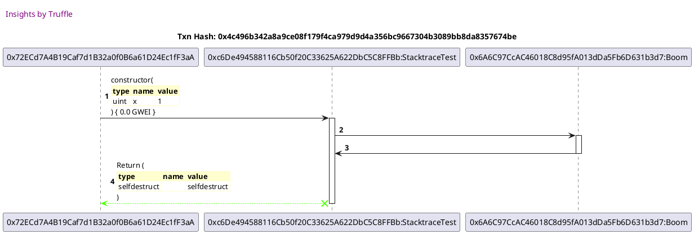

## succeeds
[link to test...](http://github.com/trufflesuite/txlog-seedlings/blob/3bcab5a6f1789676792542f75bc3a5a304fb8b1a/test/stacktrace.test.js#L4)

##### d1, tx: 0x196b6fac80bee81eae3719d26f2bead99ec9997806e4c73eeb22245ab08f6c07

[SVG :telescope:](https://www.planttext.com/api/plantuml/svg/fLF1Rjim3BthAuZiig7B9icERGLPqDYnrzuADC0klT0sdHYrvK2MXwJD_drgOXJeiGW1WH95FPAF8cEtlKLZXxPX30VRwQ7DoR3-kTPxDDX2GrlIPOp5yzPqWowJhkaCVCdIB4rInXQzFJQqP72M7M591bx78y1TP-gNJbjiLaszrIrfwn0h--wGkSiBv7um-uO-N3pMBmJ2VxSzO5dMUWk2ZwP_PxtuEIR1nlZtkg-tEzj3VeID6QhAuJ9RsuPWSz1mX_rk3lmWL9075HOHpuaYGKXUA5GfWqhc3aWfAfHIOSG3yelG8ygbbFuCSnvLGS53njY47qAP9cMuycEX4gp2KiIUH5xnEC10hAMV5gBAF5nDOBe4vn-bgWncoInJQwwyB8nYNtaUhMCLhMKaa4S-HXZp-QDrf5k31MsejnEukPb3qUdUcg6mdVdwf9_OOcp4zr4lJx_07lS4Jcjip_elDeFRlBcVOAXT1qvmS8jVRD_W5VWFVXO1l_-azuxMQ_Ayb9cNwArv4AXApaXuYITbviW8CnuwCe9uHfHavIgSnrtNNefZdtzs9QNJwINgbRL-uWky1MItRgBSnFq7)

##### d2, tx: 0xb346eb7de2b690609f788599501cc957f229072f0753319687511bc624005c6a

[SVG :telescope:](https://www.planttext.com/api/plantuml/svg/fLBBRjim4BppAnRkfKMQbjIBek4QiMofyIr03FIIoqeaPI4IPL1KOIVElvUrXG0v5kLboDd1S3bSGku6XzQDNKi8ZgutOrSgIuRdnXpGOWUjgfMH6LRFjUr78zTzsrluLEH5liu9MGpkrAebWSlQAvJAmkjq1BZlRVFI6uVjgcrgqodZlADsxuB25w-MXz4UMlMXyDYyA63HE_U0KZQc1aOdwks2Y-zJ4sIwVsk6fjwx0SeJxEoejVSbhd6jWjtHm3qE-pdGOnb6YIgvL46P29fGeNcQnaB4b5MLYBaE0a5ve2cFmv299EKnOsML116bSPKW8MH6Zpp8rvAleeo9DMekMHO6I3ND4apO9eZoYkaYnDKCRfVWzMakP1Aluq9ig0WBdcQH24EroKIw2LA6D8qmnOpE7vqFtLcir4uDRWOtDtEme_dyP9x8Olg0hnCkpp_0dGuAF1hiBlWRsz5l_ihFC3O--JDeivKUM73bly0hq6yKVlxAjpxC_-dk-hX_2EDs3eJS-Tdoi_S7)

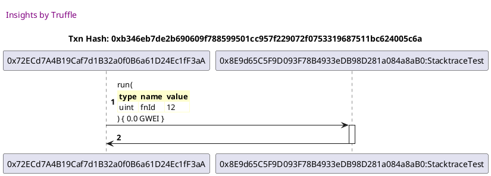

