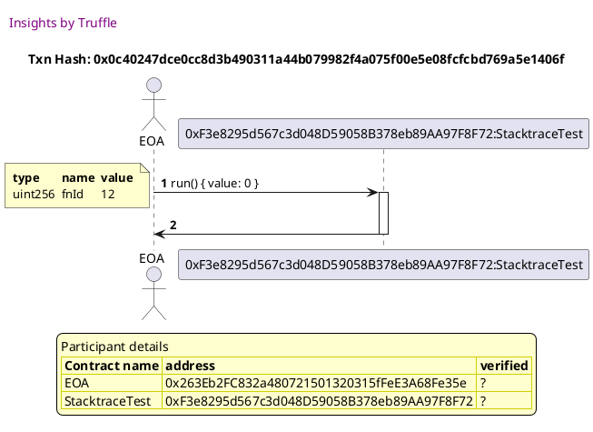
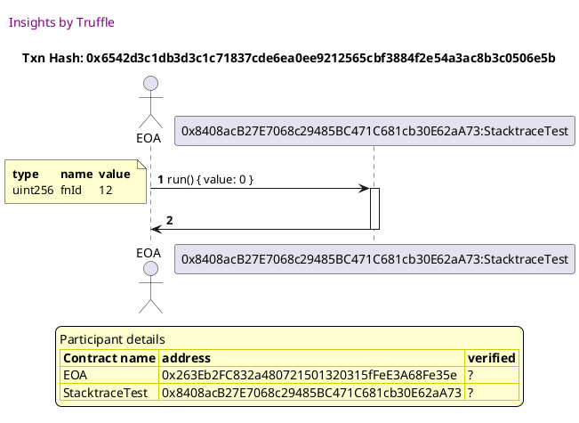
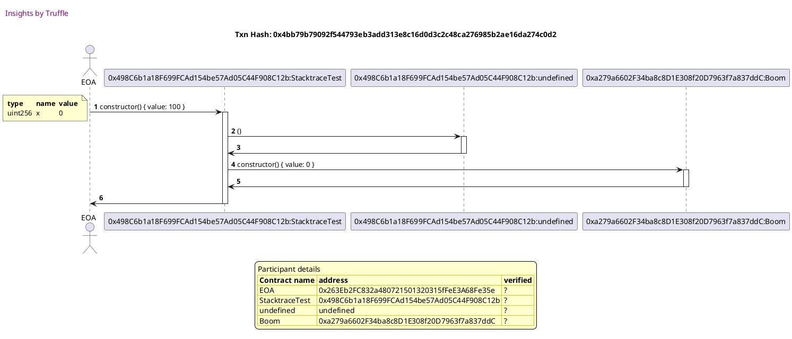
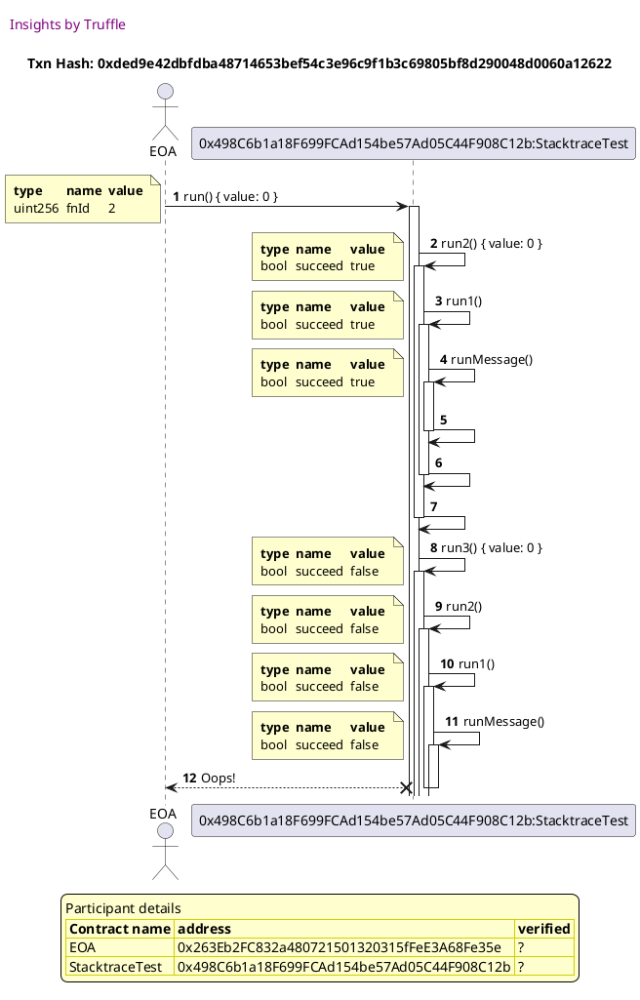
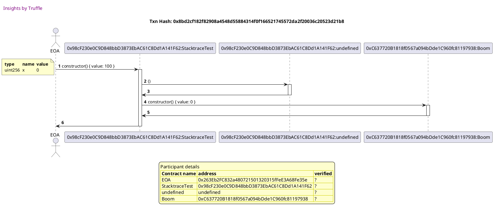
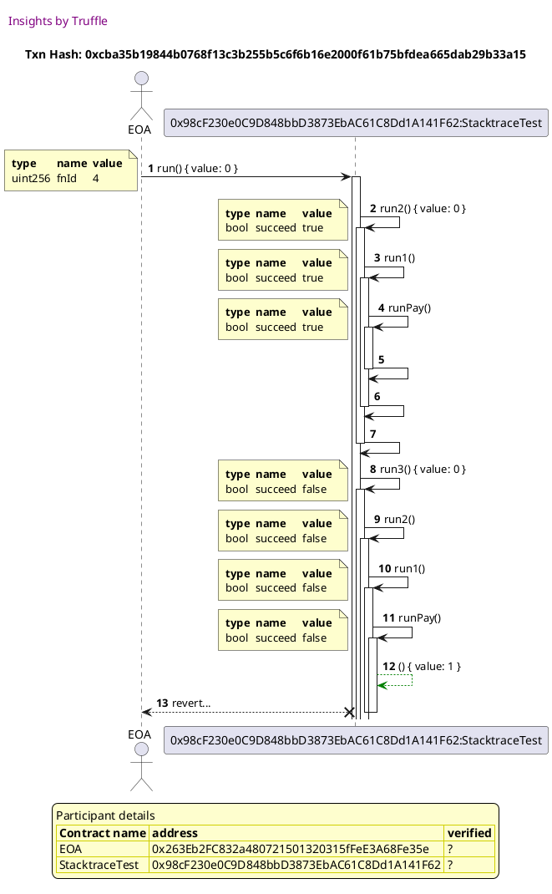
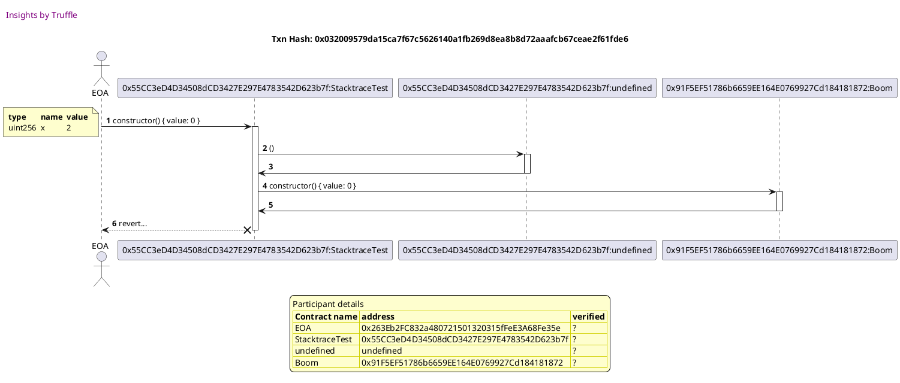
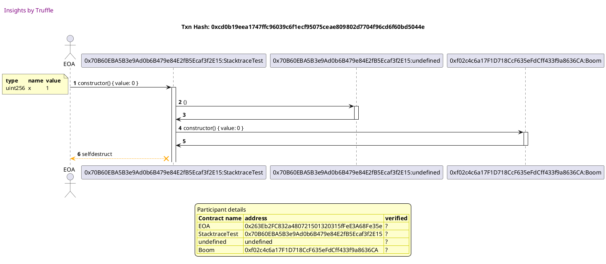
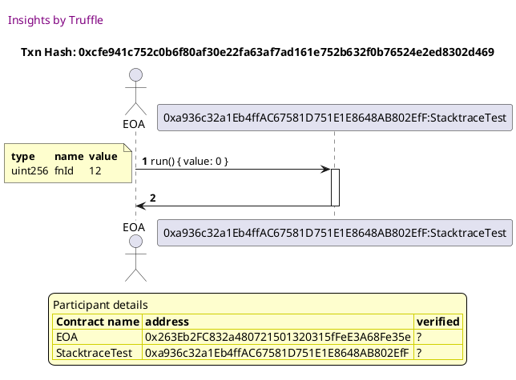

Test date: 2021 Feb 08

## succeeds
##### d1, tx: 0x7a6f1a3a5d8b5c11b9fd2911fe78b66f1e677e4d074b997d2b5c564344f55f55

[SVG :telescope:](https://www.planttext.com/api/plantuml/svg/dPHjJzim482_-rUSs9TD3CrEuhnKZD6NHEpJaE3xvCINOf4wLU9C1Sf_vnBQZWmqiLMjBhMT9tVFsJbldMfSjweOKvshRRVAiM6ilJLshHgrWWgNQFLC5RVBfkwidjTLtS27BCtIUShOQUlkAZnZx0QLnWOU6C15tPZxsZfLJIkpj2kqZZ2bewcCXfy9wwvPLxWRkZBt22AWVvTAQsEN83Xx9FgNFNxF_svRixnnBUHtSDrqPKaCveoh4Aut5YvKUpC1lebKM0hbAwdZN1P2v4cflKI84gCu3saEmoZ2GFCeo9CaqXwjac7W1q4f9Nt9Hk4eo_J755GBHnIF60bnfZ1hHVLSEJBY6bNWDRRk9nV3Chx9V8ozH6ePHeMlUH0lPC9bFFEZ6FCucKwJA8kpo9kC0MCuQSRIMDJ_mJtSEqREwdhrcyQv29HSU6KO-hxoajZtWfJxWXT9A28-om9TpiKYdFIt7J7MQpWvUwFeu-C95BLjNTFrlZv-WWVufQeE9zH13e_CrWw7vX-spEdkulCkdcs_WhjR8r2qQZN40G5RjeNEMEV94BQmeH-dCTgDq5CPUvqEvJXorwT7ER7Hu9k5d9nCu6tWtjnVIkqBtI_xH_fWjfzbxFcaiSiNNTFebAdQ5yuMVC4vxvtDwTmGp1saqSbfi6q7VzYOqg0cNQS7pSEpoE762_qqzx8vTLq5COyy8RdmFUg_B3DC_MaOP-XBWiAtCM5SmW1xxyPy3Jiq1SRNVophnGvFUk-ctI78vSueVSufzY-v9m00)

##### d2, tx: 0x0c40247dce0cc8d3b490311a44b079982f4a075f00e5e08fcfcbd769a5e1406f

[SVG :telescope:](https://www.planttext.com/api/plantuml/svg/ZPDVRvim5CNV_IckkfTDNJLZ_fceoveceFPfbPhtoU1BOfMOo9WfQUbttmrDeqRRmtWv-1f-FlSUkEcyShxVD8ofthUstvJe6EkUZDqgfpRGu0gjlbNLqygrlTNpjcaTV2ho8f_dZ5rtVj_WbB4rAeqENXZ0NUlCSskzQcQDMTaDMa-OsjDMGUKtmhPtsmQFfKVpZ114j7fGMXkxWe2pLw9_UyU_y-zjPrPhtq6vXwNhwveOp1lV82nt5kvKjvu0t_4guY9ATOMyggGEooZZOH2eA2fvccLIr97YQLnpZZ5oMLTrLUeqoLICGSIJcgPHUNAP_vo1wk22z8BHGBofp5PHFu-U9kATgd29dV_5W_4nlYj2b2ABTPoaLQXv91TnncDv6wOIIvdDPbbQo28LatF01ME7ewwc_m1VNax0zVRp5tY1twhfaHg4LsPRZ-DOJs5S7s--7dKwV0U_toAGMhKPTGJ0m0ReZVKYJc20sjvhaa1GdRA60vcnlusGkz7arGGeaBSFWpry68f6hqpJVJ2ou0lE-S78d68cc3yveQ0TTjre2fsf3PA9qwlJOJnhe2n54kQbAEOo52gIF1L1p8DGK9vnNM0UpX9PO1WJ57wS4yvR667_cyyHHXqU-wJhXlJmf_m1)

## succeeds but fails anyway
##### d1, tx: 0x319bcf765700c19e663f09ae98e124cc58b0a5b244e861477d2d17659eb0f575

[SVG :telescope:](https://www.planttext.com/api/plantuml/svg/dPJVRvim483V_LUSkfTDNJNR_8wwhWabwfvMgNcV31ofLM8YOwQqJV_t7ZJ9obfDtP3GWJ4VTz_PdBTEMTUjQiPKvnhJhNAqZBMtsgoLLIkeSOccdAdYTccRpfHfKpSMFiopUPPcZ9ssxgx6CyPkK9LeuO41N3PMtpV6gNfQwwLPeN64gHmzcjFmCs7TsNMDkw5hVOyWVBgxKcMfpH84Puz4_xB7x_dVJQkNDww5_0uMjgigOZ2dNOsms1YuLEtD1FZ64qbUL54OH9mN8i4mz2gUA4nY5D8lYY3EkGfowViOXyAFebAMWgOdcFCgY0AoKJZAClin1TN24SKZHaASBlHQKJtNZemugmfSOEj-SZ5CuvlOvx4gPZBA8Xx6XKpyE9YbVYJIC1P5xl4ib6eQUPCnO0mdpLXfW-L_S0_lZf6pfbdzfWNSJnESIZ_8KwyeayXFlB2KLOGycGNLb1p9q8lJIV_Q4MEzXfEpDue-Ffv0qPZMsQxtzV4JFC0lLNSueGvoU6IcSJWq_x1aJdSNdtVnRFiLtDqQWQ9Hgo4E2DYoBNJQE1c4i8KDdPp6Q3L2JsNiTJgKuyXTdnxbn4Q3RnPoSZA1ju5xStyfjIzqF-qVwOFP_YbZppkDNRteMebEwRfzuUo2Nt3EUsSfxHk2kOCqsZaMstRmXrPN6alITNhGF7oB76wejLakvsdiIUN7F98YuCAJt1D1DSVCcuRn7Bs0eF1jJ1YNCC3Ukp1VmmvDWV7r7zDwiSENthjeTmXokJDAnpd5_YVt1000)

##### d2, tx: 0x6542d3c1db3d3c1c71837cde6ea0ee9212565cbf3884f2e54a3ac8b3c0506e5b

[SVG :telescope:](https://www.planttext.com/api/plantuml/svg/ZPDVRvim5CNV_IckifTDNJLZywzHbpMXeFPfbPhtoPXBOfMOo9WfQUbttmrDeqRRmtWvOE3dSy-1cyuhv_jDmvZgVMlxJOcEiUx9sAroQWCDhj1M2wMVLgxjRPMrJUlWKv4NUPOpTjtvVOCpnjQeAdJmmW3kMcUUM-jLCs_CocxGUiBKdcuLjFn6sFPks-1nwT4y8mGXNJsegZ9s1G5dhqJ_zev_vz_RpgpMleDo3qlNrpKnc3U-GLZkBDofRZq5lekZK5HI1rKf3wAJ89M9hZ16nH6lH22YED9bBTCqh0L6eP9AfwNKFE8nHYMbeJsvp7_EGNKm8Pqm2iGRRRQAvddqb8XtIkCIE_-B1-DZV9U6F5Lw8P8yuN6gnLMOHeiiJ88iJWDTIfx7GiqJEJq7J1WxR7Kv-mVuuc8AhhUVly0B_5PDZpGWl3BRUXnZFPLnVJpvUjJPy1tyVej0QjLcr1400nkWDzPJ2Z10RUyhaa3GEdKD1p9ZVniXTwF9oobG8MyV1dlu44g5Nfcc-s3abjzopWz6CggPOFxaX8fss7MZANIcDaWcJg_EXd6lWReKiSnBKMIf52fCUIA2Y0TIS1b4TO6vdCTfWJ8YAFmu9voFCCB-jvyZZ2Oypad73UdXJ_a3)

## fails! hahahaha
##### d1, tx: 0x4bb79b79092f544793eb3add313e8c16d0d3c2c48ca276985b2ae16da274c0d2

[SVG :telescope:](https://www.planttext.com/api/plantuml/svg/dPJVRvim483V_LUSkfTDNJLZypFgkgO4r3sjKli-6NoaLec9m4nfb_xlEsYIbRMQkg6W0sC-ttq-SjuvrRf-LJEcUjVOVbLWorXtP-nQjMe5DIxHwWjLtYtRfhSwRUgcXNTvbcTfnjXfv-vhF6Fi5fN65duoWCkcDG-DTQgUrsPfLsWTOIf7Zt8QVYAi-tPTusxesZmWU3xTNIcjZLs2nzaZqJ_jyNl-LzkPvQtheBY7cxQlAc8mProDSBEnSAcwsndmZLyKKK8_deWgyFqeaLX8GajFObnweUPQbgBqurA9A4pYe10AQPZk_99hGJPAHrbct-QWEZYYUCH8Y3EbMIkgvzgH4TUg4c-mSz-vDqwZXPCu3GjFUN4U9acUphKN-0K6qLpp8FNzFE5nwebYDWLCuQGPAsDH_mVtyEuKUT4qgzyqAZDHOSX5Blr2nMMyy3B9uqhmHPI4iefKB2EjqzdmsX5ZWuQJirUAFZwUGTdOphNzuElz1_W9FrJTuunsaCCZiut3SVCFBNEwk_YuYsVRp-3krmWKhLgDSKJ0bcsXDzQ988GjREZaD4RT20ELiPVfK8uJTqDwb1ER3BvQoCd935u7xitzfTIXqFsqVwIFPeUdZ3rzQUpgsQvfTChKtJDd2xxWd0_EKlfk2EOEqgYzM-owqH-sfZAeITVfGVEu5ZdSY51cXSZJM0hbnpmINi0zARZqWYh7JCx3E4SP41I-J0dJ4aROMnlp9UomAJ2z_cFQ87PSwQrDkqEGovrHEiuf3dzolm00)

##### d2, tx: 0xded9e42dbfdba48714653bef54c3e96c9f1b3c69805bf8d290048d0060a12622

[SVG :telescope:](https://www.planttext.com/api/plantuml/svg/pPPVJzim5CNV_IdksCicLitEFvAATNIX4JnC8D7toOblYaNgLBQ32fJlpcqe2CI4q3QqvkKcjdFoEpTMJWwSbzPtyuOnsVdMTFCIBMFkGfk5j78E3SxGg1-okfZPjZCgRvlMmiTYKapo2MFxpbyrE6Bi7AL22pSCuAYr-herNZRZHi_C78qdcThJL473zmgBpYuQt0oTwMi44T7LgLHAcna8pcv9_Uk3_8F-iN5wTkuTb5SmjLrTamRpsZS8qwM18-dEXy2N2bM6KQ3AMfKoIlT4bCHXYNKSLI5cIPNLeWoh94jvNDQf2ZBEerHndd0fWYG8g1kL9yh9oHYaWnsgEumQudMb5vByd7dgYBUomYaw_ukBVXbVHbcQ9wMG8YsIB2loiH9nL6AyDrOypgEeo7YQYw0SFXVOOMpzgC7eDyAxkqEmdVdq6MxWKZOTaa6uPQRrsBVryMNiRqw-REfezGtyrGA1gf7pllO2i68hwBJnGPp02cfphAW4D4ol6jR2ZBtaU0qk-DTqPTisnEIwga9SqtdRp_mfe230hOFwYSx96MuLsc0mXF-zTjEUyDqtLIqRXt-vxRUFIcmbrNjkzhUmBGT4Hn_P8Poq2_U1AQHFlBwKXF9YyUkJZDs78Zjz4WWAlTIDU-Baa1zopjTESeeu4l2FLYZaBBMZTuLMrthjul7MqQhFdHNbM924ap8eyZGCACRuNY1YBiA0XoAk2vo4uoGjC8n95Bu_LtYEtOkzDPisOkHmuvEE0whhluGx)

## fails with extra info
##### d1, tx: 0x8bd2cf182f82908a4548d55884314f0f166521745572da2f20036c20523d21b8

[SVG :telescope:](https://www.planttext.com/api/plantuml/svg/dPJVRvim483V_LUSkfTDNJNR_39HrpKbGTtJAZNlay4cjKfCPCoKjkd_teCcMLchgHiIEZ3cu-xpcVFMI-UxLKs8x7nZkrMX7I7jhR5hwUGAQhtKLbt8ydRfciwghAaR1n_oUJxFveISjlwkrcU4t6Yfj8C70d3PE7FVM2_hQMsMTgMjHqpbyL6Emy-4TUVMjTuDNPjx3Ip4kokfbB5BO9Gy8ltB7h_dVxUjMTxu5eexMBYkgf11lF6rXiN6mgLiRoP0Dw9GlAoOu9NWAHKoZ4AXeaY8C61XHIiMnn5dIHX52LUILvpI82uvZNYWE2i4sYWzPZd_CGNPmX768u92l2dDMc8zrnwDU2TBlT2j_qdPC8rkKb7cFA2QPkbCXA8ePe58WdanpMAMYPbYKnQoFEQJCM0CHyswCbQh_-0UtXqZBvfczPkMnK6IS7h111CLZU94qZGiPagpB8rfLGh6qYGDnAH_xOYGNiF9sHj57nzFe6niwrtN-_hu2HxWbwmxFS4LfF18REFriFY7bZdTNNpUnRFjL_1tQmqOhLmDSK30bcoXCzRpA8OjRF2aE8RT23sLaDVfO8uZTtrwc1CP3RvPoCd91Du6xitzfTI-qFsqVwGFPlkdX3plD7BrOjMKzjBKxGjdCpgZbFRECjmt2FC7QRXpd6xRmPzsfZ9QeQxJW-RXM-XmmsDi79vd8k0o53JXBA8iu3HWKPNhUJ2DHQw32A7mRKmObp30tjkOhs67HO7nzH_JUh73bzxRj3i4kjmPnUCSO_-JUm80)

##### d2, tx: 0xcba35b19844b0768f13c3b255b5c6f6b16e2000f61b75bfdea665dab29b33a15

[SVG :telescope:](https://www.planttext.com/api/plantuml/svg/pPPFJzj04CNl-ob6S6b5GtUziUD4D2LrOi6faU1MLTMkFGuhd7MqNgC4mdVln0G40Y7K5ZMvJB9_VddpFChBSUsLyysyP4mrlhBDNADZhBuqTg6ScaE9CxJvDvLTpbpLs3ofoih1VZf99yc4iQFQhqeSCdQ1AaS7DmpWf7Bckh9UbQFIpEmShITCuMahfUKxmg9nYnAtIsVc6a5qwTDKvRcnCn2StHBzypt-ddzgQpExy3Ne5PoxfYY8mRpn9SBvqiA9gYy6m9UPLZBKeXztkvhtehWGCfCw24CTPb4HQH5Xm3al8g5xeIvoL54Kvae7VIsb4Y6vaNbIEVa-0bN37jKzHePuavc5edxEF3dYdShm76l_Yuls65_suomD94UUzCTnDzPwBEEUdEXH4eaa7kTY9BeYZOB1Ky0UOvklwWnV01yS3C0rziD7k84hLJP83S8jivN7rjQ7Xt6qVVDfMuVhB-1N2mIgLitRsW9WpTRG6Ek3C88r5FOqfzAbPNhKi04pzbp7Q-A2VwrELrL9ckecon0twhnhT_vKe221EoTggbOx9QlJ6S3_FhkrHhxxG1MghF4lHtxtL8cTLFLUW_ucNJ_sPmxH_dnHu00U3vgWGNj-PjcXg_JpJAtW5Jf_U7Z8A34oRwuKDVJimkkRZDr5Afi-YfCSlJ9b_SYFCHzJG6tyI2WW2U0V3A68T5ZNhJVeJ64sNZnS7QxRr5fJ2WOH9K-G9h4CL3VclK24NCY0In4MAKxaA8fJb251uUjJmbFPBUojoRQ5KOVRFkbrJ7Np7-Ct)

## fails on deployment!
##### d1, tx: 0x032009579da15ca7f67c5626140a1fb269d8ea8b8d72aaafcb67ceae2f61fde6

[SVG :telescope:](https://www.planttext.com/api/plantuml/svg/dPHHJzim483V_IiizhA9bTbEuYGLOq2QY3qD2TudDxuKYzIf70SLAFzzbz1sP22DhL9rgNl-UlvyrzFMA-UxPKs8wdnZk-KS727jhR4hvTIIrh00gyzLURjmJMTrrjIDen-AlCYpd93Zrj_NS4B83IWDZZuIIYyQPnuQwrLzLfk5NOBrYAayVbNWyZDXrRbL3TkbA_C0b8VuwL9fRUo2SaQUaFvbXz_nlzlMB6vyI-VtzDfrLOKCueslWLwlBRrGxSsKiZKB16Df5ATQyQXKSINZCf92yf0fNis5J7K2AfadEXPAgQgSOm8e49NabGQ9DagFLUO_pgXgwG760u92l2dDIk5vhZmQyKwLS0sj_yduaCRMKPHb0Sp2MH16BD4PHX7d8etpC4w2A1GpAO9vN4t7W34SDKDbBEZ_uExtZf7dJRFyJKjv4UL5nED4pgMCqZpdCinPBDDKn9dcISWJdiHYscyx8AJNC3bvuz27XrDQDhRrhkjzVVn47-cTgZl0Iw1Fn3OUXglVDypnzk7pDfvilb9_lmAAqQhb40S0tP0DxOpr8f9qGzVu5hY6lKXxAY6lYy4AH-Rwuh0YCbfyynYJoPI-3Tnv-yj1Tsd_GbzFC1lDJgc3Et3-wEY8QC2-CtSAjRtQW4FmF8payiN5Ql3ArEqBiJCsOuprOZCSBGJulLaSBWTjEqW6Poe36fqUx-zYwFSDpe-GGJuNHPO4GeK9YmMF6CUP2dXK5P07Pp8f88WGIh-D2UEo1zXxU_SrR7zpTFpyHrflV_Ybz_Rr5e4kjqRnTOgn_n_y1G00)

## SDs on deployment!
##### d1, tx: 0xcd0b19eea1747ffc96039c6f1ecf95075ceae809802d7704f96cd6f60bd5044e

[SVG :telescope:](https://www.planttext.com/api/plantuml/svg/dPHRJzim583V_IiiUDd4gZat9waOemc9sDEGu6sQ9jS-BXQfKoNELA3yzvsabv61DBPArKbT-_CvduzptZhHk6vP4I8wLzjkEOU6aFREs9Len99Mi02hCY7l5atTMPNNLTtGux8eYxmWvBHrznMS4N8BGa537mcbbtLZ7chhH3MhpC8kmJh4Q8T_bJYy9QowPbN1RkZQF03rGlnr9PGoTa4zHfwG_d6Ft_E_sDOiRbrBv_VqfkcqHWPnnbL0RzQMNehsTahPMYeszr80uSLXhBLCEGjIoRK7KgSHYoC90XAM9inNSSn2dNAfkEPihY8MXiWKqc6MnTSP5IqzmdX4K8Wpqgm4rdFjq8XhX8GRQDqFvWtJs3fc6MT5Deko0D8PPi6pC4uX2GjVPr4XXGwqNtZHT0mOmr4pQ6D1_GVti7QCpEfw-PkccIz3oT5EwLt4NfBBaWSHb2hNEWm2dOg41poVJVjbHuJq6YPdhnHzSZAbihQjQxhUrxltz97-55K7U0ZqYTZQmN3qXuOvtJrysCMppIVgxbT0CLgn7E80e1koePsnpeyutT0rVZqSmrwaFPMGbybWXYDpVNAO4HaDlbh6P3AbhmFttlvIw7xQlz3Nas_7TIFi0hxZCbGyfIrKMi5s4-pvxTqZLy_EKO4JfcgVURnW5uontcEEDmatS0UHU9SQQDl1AJH66r2eyFIWVcZl3LuNdmV5t2_p9F15cB3OzoBc1JuBl4YNK0GpdfI03OAJFuy9ux86s5jRzINiS51q_Fp7j5xsiDDRstY7G9Sxe_WvnzY_zdu1)

## succeeds
##### d1, tx: 0x2cabd784a8f5972f3662499d8134743a276551034aca67c2d18b04544f3cbba6

[SVG :telescope:](https://www.planttext.com/api/plantuml/svg/dPJVRvim483V_LUSkfTDNJN_mf2ewvfGekvfbThtoO2TMYKc0ZEbNVg_xw19LjPgweQ43epvkFjyvhmDkWdTgY94Tw7stIet3I7jdVDhtUWLL6PfV3dNnTsogJjVfdLLD_1kaIsoD2Faj0ttbJaZvDReqZJmam1Srerxg7tGrQnoIxyoFY361doqmE4dmhfhrfNP3Lsx1mDCujsLBaldby0eUKJwfpr-p__gMxUy3Itazt3JTDOYWmGNAWCt6m-NkhsT0jtmGkTbd4YTs6WISokKud8oAHCcP2o5vh6A8aQ5r8LMSS5BbkHKHb9QKUIvLcYZ29Xbzcq6keKZZ4S4XGHNkBN6Ugu36WcDBioDQSDtoePfTACdGXM2QvRbqjfPgk8eOHTnn3AM9Kecitb2UMONqp5W34VDnZflol_W7juT8-TrlVfDuuMAM9pFPSBpbAiauaWIUivKdaveH1DXOskvdFQl7H7IQpWvUwNeu-Cf5BLlGzFrljv_W9_mGrUTcU8AKdWalWvcMFn3ovpkBZxkujdsCuJxjG6CNg-6E21WIxRGEHzuf60B6pmfZc4tGaybv6KwcEF8NPyUvaH6WwyMSd8oXTU1UtD_ARKlT3_j7-c3sVuf8KyxZLmzMxNI1Esgzfcp2tf1AUsTfRXl41OEqd3dDAPj1t-cSTQP4dMT7ZGFtzhscqE9BEUBDC5-aWcDEOie4vmA5jc5oSHC9GiZ8eJ2bp5XNC80UsjZleGT5WN6rtzCwyK-fVt6fjqXqENEA1xd6FkVt2y0)

##### d2, tx: 0xcfe941c752c0b6f80af30e22fa63af7ad161e752b632f0b76524e2ed8302d469

[SVG :telescope:](https://www.planttext.com/api/plantuml/svg/ZPDHRvim58NV_IkkkfTDNJNRW4EYBckQWDgdLMhU9mFNYLLY8cEcfAN_VJSqZHfj3-Fbm3LyFlSUVDC6xKEtgHdJNMXSjodGCzO-MRVLNc-WnXMwwbQNJolVTAwQDtNZuLEUvTayO-ow3ViQfuojKLVeuOK1t3NUFZSkw7fMsvNRe0k4CO6MSYg_4RQTtzPuB3tQPmGHqzE3hYhhLY0uUoNwjtVyE__UjNQr3YqKUrZwpXXYi613ZR3SERZJxNe2V5SQ7CUY72Mov8KoATScuYYbqIhIPgGheGJIQg4YQNWnKecCKMALHbnMiHhJDCf0BhEVCz0jN91UC1f8iANTQkhdCT14WjSbBh4DlxWONkCxFOvK6KajiY8sPZPNeoGLYr4YCf6bAavdjocNcSadvu0BnWvRNKt_0Rwyd83ltESly0A_TTqXDGYlp3K1Xx6UmhW-tdmzwhJ_3c6_HI1rUZFe082UzT1P5sIYe0VZxYiI8QbEMSE1pDZVHiZTOF9g0XJ8su_17ZuCfSAWRTr-CBBW2yxvmSYSOYPOE3cXe3ssxM0AlJKMoSJfqsa_xDLJbb95MI7pUKfZZLC-aYBX8f8y4ed9COjcAiqnIWWAFyu9voqCiF_DvmYZ3ezzqdL3UZWfVm00)

