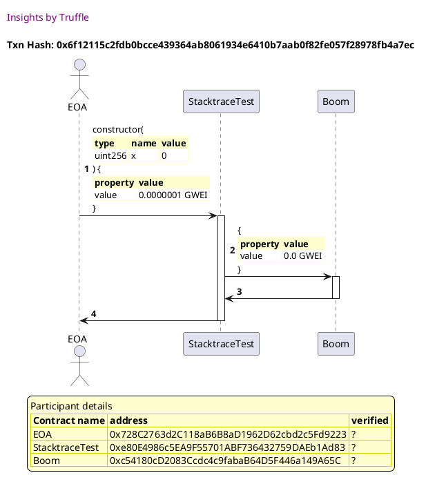
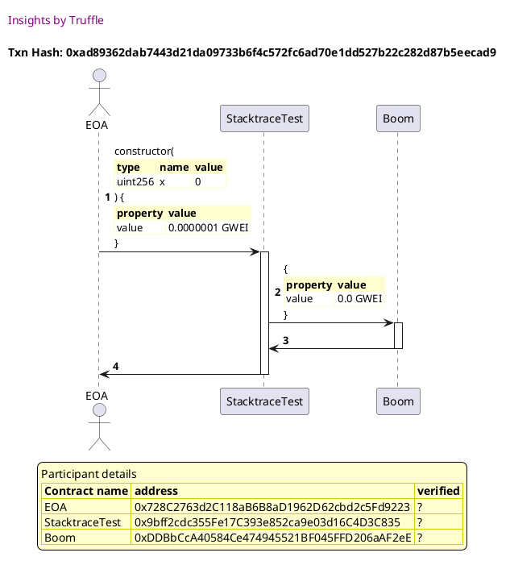
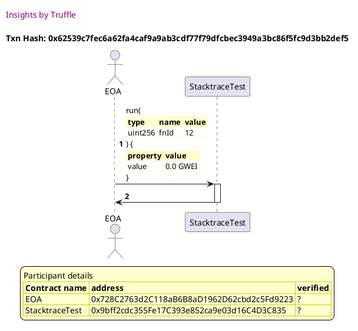
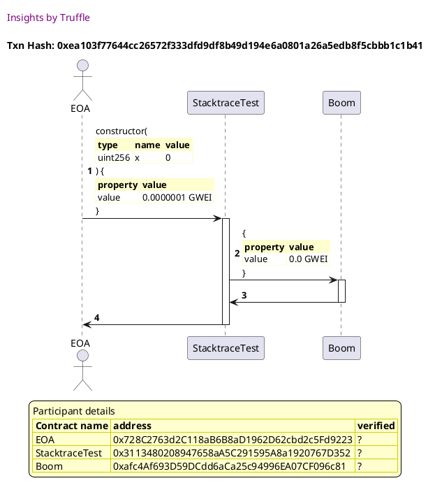
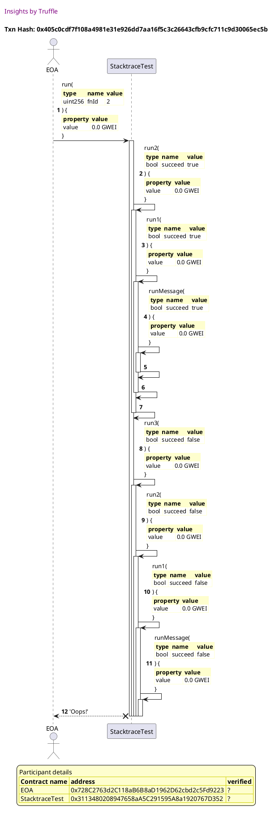
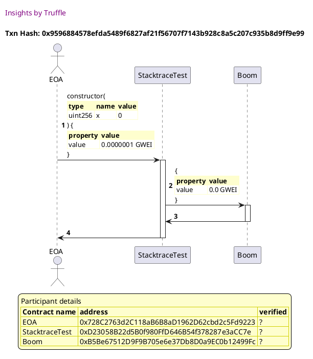
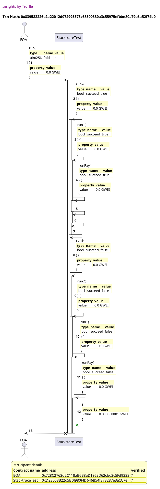
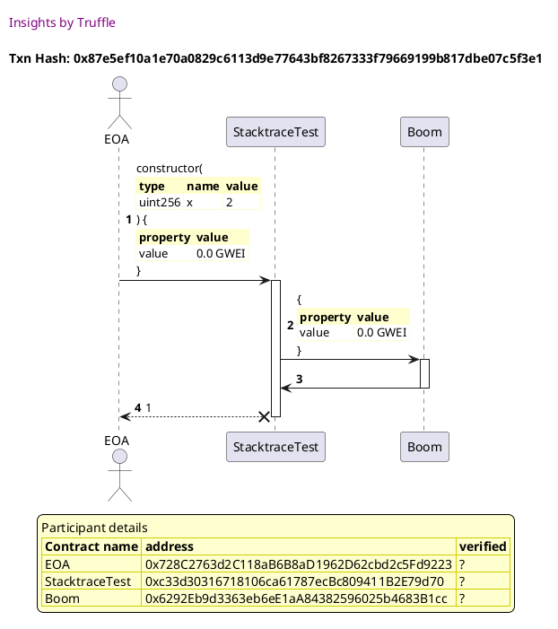

Test date: 2021 Feb 12

## succeeds
[link to test...](http://github.com/trufflesuite/txlog-seedlings/blob/0e1d57622e2550f3c79e053fbe2365c8768e8cda/test/stacktrace.test.js#L4)

##### d1, tx: 0x6f12115c2fdb0bcce439364ab8061934e6410b7aab0f82fe057f28978fb4a7ec

[SVG :telescope:](https://www.planttext.com/api/plantuml/svg/fPHDJzmm48Rl_XMZzjAAqjhEDw9Rilaed8e4KYzS7DjPBB9Ev3ZLBYp_lKusMi4MJhKKZJCpVlpEP1I4BdhBZ1tM3K9iiAqUrfKqg7zGkcE6hQ6HAwd5al67bMa7BRAsQGryB8koo0g4pdkxRUG2mRJk9HFImDFy2d3P6lNOQikQj54hlPRQEc9j3mcb2-wHtM2wHhuAtAX72SG_-AwP44glWE3PzJpPys-p23JVVwLxjRgtFLHRk3L3NJikiies4cut6YvPVty6U1FMX18IS5gB2bUSIzzBlD1dLOn3adY-37s2guYn2jSnhIKEefh6IHJNbSyYoP5h6RTEUl4h1TR31sS_8EJwPXLN7NErtbZNE6iObxUojrFIQzTH_h9jrrFMk76n2GcdYt-EmSd96V1MzzOCeuPFT_eEdS-VvSji5xllOBUT16SrMq_s3si6jndJTp0eRMaGmWusxi5xzsTuUW_McRQJncuFe9apGm5_nTCYyFDtSRN7FRigZiMF1KqLJcNyptL75-sXR_NhzFGCtb6ox_4KHsW_x-ZwnKSHqZBLz2yavZXtLOuICpUcZcOF_NKZQcJVJvAbKRMI0dQ7eulTD2nE-YQYSKQZq1Cq8oHcot0Pivma8Sr3oYj1UL2AX5BF9VzuJJWQgX4cOrpuIHpoe4YJCWWYJD9b6RbfzcWK97bQL2GLyHkmQU9610zy4cEUKnnx6HVSvqdDAgVBpuFIzqD6_2GDWsn6k2RDhKBemXdt1_aB)

##### d2, tx: 0x6527487d58300dd728e8c932c3c8a86206afebf1880e056a734268b13fae7030

[SVG :telescope:](https://www.planttext.com/api/plantuml/svg/TLF1Sfim4BthAtRIIpjfMY4C28_h1jlG-DJCn3Ezv2AGi3N1WX6YOoVEltUDgITEfrmUxAuUxxq5GcvR9wphjXKXedErwRQvigHzqgOHLcoXKcjbv4mKJsjRTqREwwgsy25BitIU4Z9ftRvIKmBzjL52AWilmoF0NMtrSssSg99AhyrM6OUCfJiFPDWyKJQTRIfrqNZGpmgyqRbsBwJKPWqU7KglFKw-3YB8yFwbQVLwurh8zx2oNLaYBt7QLGfMEmDtejsCWUx2W4KZ7ic0-vHA6J6kU17xhF0BBdZ8Q2XAbPSUvrJH81IHFs8Xpps_52gYFYKOMU5GUlep0T725U8L8PYRquLk17fzS1YSiw9GAzMwVkYoXFFzCRYP_jE2w-insCvyV3IFP394_dd0wU4Rk7sZ0D68RO-_HTNXpN7y09qsZWKX7A0qIudWiLFh4xpyZx2nTQEisv_91gw16EWN2Zz-fSiJqIjgVo_vQEFavsOC610vVJ_a_aqeKZcXg_QDWWLTK4gF2kQuTcHpPq-uSglQjbUah2wrGY_dezD37pugs-7wvYmAVSdcdiV5B9nniV3Ya2r2LkII5K4cOyPy7Fv-oV1kIKSonMawYdbO16aIPq4GKI-PPP4VZdmM1V4YINClaVml6JeSV19oYu2_qny0)

## succeeds but fails anyway
[link to test...](http://github.com/trufflesuite/txlog-seedlings/blob/0e1d57622e2550f3c79e053fbe2365c8768e8cda/test/stacktrace.test.js#L8)

##### d1, tx: 0xad89362dab7443d21da09733b6f4c572fc6ad70e1dd527b22c282d87b5eecad9

[SVG :telescope:](https://www.planttext.com/api/plantuml/svg/fPJVRvim4CVV_LUSkfTDNJSmc1zLbpM1iFPfbLffBtqnzf6Y4eECcP8s_Tzd71IrwVOqI-ZCtVdZxnqd2Bdi3TTcM3U4yC6qQbYNg4d_MAkEQxw61bUev8ABnvLk1oMpjcarV2YMnJ9R4dBHcss3Cm9kFI2NgE5vUWMuQdNzr2h3ctbJhzGQbR74oXmI2XlS8xj1Tms-2TpMJmX-UF3TS2bhjGBVcrmlpbvydKIGwVvhrTUh1zD3kOKxFLILvH9JcmRXRgFWYlSFv-1jk4pI8AAIbt4O1fBwadjf70HbL8M2nRGI4PUnXxwKZCObfO8cL2PnoH05bocnBHF6Ib_-d0FluSJQ4q9itqmjwexRMc-DRPpHNE0TziOblNKTvI_QTksonesDEIISpTuTWzFJSn2jweqUHWqVxzKzkPW-o-V9pdRVm6mx16iLNplxcpU3tOpfEnXgPIYBO0SR-tXxzoTu_XUiqss7scmFe8apGS7xuhdbmuzVo-izxiLMSIn-BCXLwChud-kEBjf3_zQlixDp-8UIVOzTd93zl9ERLnz5ek5rqx-Ic7kvhNAKcDanjJHpwAyTKOrzxoIZhgiQ9UmEHsSxDonM-YQcIKRZoCvTvli9NqIBXET-6j4yegAKLB12ffG6DldxMyBHK8smjAmgAgG862lGZxCW3J1XLF0KlK3wKHRcGPO4x3tCJTo8oFD5cObvwB4ap32CmpHaZFgBmWjPKUJKY_YyeBYS4BP9Kwi8kRJ6_a7-0000)

##### d2, tx: 0x62539c7fec6a62fa4caf9a9ab3cdf77f79dfcbec3949a3bc86f5fc9d3bb2def5

[SVG :telescope:](https://www.planttext.com/api/plantuml/svg/TLFHRfim57ttLrnrBvkwRc07YACiQqEIDK-hr4XxwOknhnEhn21ZfgPD_xqEGL7JQRmSkFVwSCwvGCXruuNpxROaHBI-ikssG4UQHsDhuSGMIboZLLCX7zUkQgtAgx9oy6anNyppEI7ZnkzAd13ehWqAXGvU-aU0sygPvyfwKTwKPcstQ7rWrFuqi0ZD8sNTkhh4iyQzUKQ81wVQdL3As3N4KLzwxN3ylHT1-lSlRMFM6zz0iOELQxKElCGRNoAidYpSYcOpWkWffGdZCjCeKv5IBGPIQ2wuA9XKEijqnfMM1Kh61romGWvJdMZ95IiAgb0d94GcVP0-_tq3ee6BW1U4XDoyaQOMmUkz3y5v9oIkiF7Tq7afp7V7u6hoJmikBqVWMllvmJwGSH_vrnud-n_WTpL2G2ks7VuLPHjk3kDxQ8trD4bX3zekLO2O7bjVuEL_XBMhQdH-ToBhkNfYYBv5yElFV7aaUWtQFqe-s3ZwkHf128WSlnzozouKXLwOidcdO1RDeYWwACZ3sWERFtaAAtVOD9qYT4OR35vEHoVxBloWx2cZmvncALCqZ-EXcARJePZ5FAMpbCf2KPai5AUKXU6VvmmVbdGWuuNML2h9acI1SPOppd2OK2auHap5QJwOiNp8afuiEEnz4d8T8FnERm00)

## fails! hahahaha
[link to test...](http://github.com/trufflesuite/txlog-seedlings/blob/0e1d57622e2550f3c79e053fbe2365c8768e8cda/test/stacktrace.test.js#L13)

##### d1, tx: 0xea103f77644cc26572f333dfd9df8b49d194e6a0801a26a5edb8f5cbbb1c1b41

[SVG :telescope:](https://www.planttext.com/api/plantuml/svg/fPHHRvim4CVV_IbEtSkchfjjmE2govf0ilPfbLffBtqnjabHYK76J4cRVlSQWg8cNPzc2PsvE__yl-C4GfUj4zPrgmeXqRdQTAjSMzG-bgOHLgoWqajjr4p8nwMjEwFIkgejV5hC5_DqZj15wpQLdY0OreCMIbju7by1hcfRFjN6YMfQbKkpqiPvOk7s2GiVt26RpZQLFWZSbayQIBZttGYbIhC4WaVNos0lleyYq7Z_jMdBvODh8T_0dUsAmdEHArsbuMvju4gq3-U0rreG71HnpC9GIigYc1P14AX2SLKaUSWLuQ5c0YUO2Cf4f5MU597Cyvn8aeS4-PP9vwNFVqz1j73YxGb2lc-kb6KZVAstpZVEMI7rdMxTa7JeEigVrVLgoEetFZOWuMpoxXYSdfw3h4thRDTh-7nlxj75-5c-ZdQo_G5kqsZmreZLOF-AglERFdqBNMaSZHXiOUqVl7D_WUUFO8sj6stTPWyQEICKy3SyB0A__iolTxWNNyMn-BwWeSAXZF-vxkYY7VHV_JexEuSFbEnwFCGHsiqxkddpKPHsegpQDn8pdFagUucf7rDFS_l--X6rkcq7oTgMHQaLRFT79zjXMBpqTKoJbCOiK3Gb914pDaj4HZYZ6QCoLrH62yKf3NpopqF2qL3ri82G84mmnGaFOnObOXgbb9E8HzD444vnpE8iYEXxs31nFK8KCfmMZ0TPnBDKAIPIGIF9GyxPV8hZT84vamaP4Rv9OwiGklJ6_q5U0G00)

##### d2, tx: 0x405c0cdf7f108a4981e31e926dd7aa16f5c3c26643cfb9cfc711c9d30065ec5b

[SVG :telescope:](https://www.planttext.com/api/plantuml/svg/tLPDJnin4BtxLqpfWIAQrlPcloAQ4l9HSgX08b8lN1pR6omstfNjHGc4_rvdiuq8g3rK25hsydOzu-TvRsND87Hi7JEkckS8iSeLkffFfK7sMkcI6JQ7NCwa5YUCNyzCKMdHB_B2mFlHS3Ji3n4wicwPoow2-hcIJ4W3Tyqdm6bXr6sX7SjxkPhfkTJECsPkcp3omGrbMPaobpk12tKhWRItQ-TC2ALdG72pT5_ZqUUc2DISFzPMpQwSXUaI9gRACi-Bd7AvXCb2mocpLnt0YpOEEUOYYpE24zPE4o838bCQ2H4pHg8iv06dKTGEU3PDUSPZGdWg0eoZKF9mYhnbtFdIXsSzO1RsFEuXv7rpYgkIUQqNpXld3EDo8gshatQNV7wz3LhT9o4uFEo0gVI7Its9ZXhBFpRONNq1jombUDHiNkCDool_iavVGQMqes44AyZqM7YWcyW1tFsEhpH5AOrRRhaQgeONy2SCttuCnnkYUr_wuuh_e8B-dOnfKUJ-Q5jnBkLQXZE_Wg-bXBmP9T-bjMmc_tyzhLO7NZMrCJHu9YipbblvDkxhFo25l1qfptjZNqhGehMMLFUv3koV5QLzju-GaBvzgXlcvDEk-D8nX3Q33Zf_qBs5T4pbze4f0pp06AzDwVlvn6ztMwVzR6BypwbDaaPbQktmTcjtLKy9tgn5J9C-ZQD0q3uX2Jk9JX8s86b41n7bKq5vE18ffO5F_hhBy6YQM9C5X0Jj15ESfEqu2XFM2_iq9M4QzX96KehZA1u48Mt8lC969qB77lpSznC0)

## fails with extra info
[link to test...](http://github.com/trufflesuite/txlog-seedlings/blob/0e1d57622e2550f3c79e053fbe2365c8768e8cda/test/stacktrace.test.js#L17)

##### d1, tx: 0x9596884578efda5489f6827af21f56707f7143b928c8a5c207c935b8d9ff9e99

[SVG :telescope:](https://www.planttext.com/api/plantuml/svg/fPHHJzim4CVV_IbEx6KJOtESEBOHwo19CtWQ4aXxuSL9x1AHEfNZJ2sKxuwJHXMKyJHBqJbtvv__Tpa5eVFEIUlwPOEGx5rh-cMXBEeUQhEILYwXKGjbgaIM3mlRzgPAswQry2cVv_DqZj1PvpQDcY4OrxsIbRBmDBq2NBQsVcoDayr5Ko_CKXddYThj4t8Vt25NlLqrwatWfdvK44HxtxMigjei8C2JwtcqPzyd4MYw_yfqzUBUTL1iuDRsMdikShLh5Dok3LpAxluKy5fG4NCUKSQLhYIDkD0n9qng4cWQCymq2wAm48INNDAIO5QAa1Qy4beB9GJoBIkTbpx_VG6oWoDlZn3oVNDrMQ-ah_N6-SOvAqjrgpet9hrr7UGdRRiSiuQDZur8E9czEmR7nwTGjgPpjXyqVBupT-Xi-YnV9plR_W2tMIdmriZbQF_AflUR8NqBVMqSeJ5iOUqVl7D_WQUFO2lRhfHrcpreuanGmD_mk0BuzMT-jSCz-oeEnGy5ZHMEPVpFTGSNxQ3_wjV9oIbye6JNup6Eq6xUqVMhZr8f9-kcUoKnmvclSf2O-Z7rDBVlhnzHgxfkbAnihMjLmNP_TBOTXyLBNpF2KyBYi29f472Pn0cNMI1YaiMaB2fIqhmIX8G--UTRmi5G3R2CX9ZoX92A9bWBZdETnL6Sq4Y7Z1FEL2ZJbAdti77Y1aH24nKp6f1Cv29XcAfOXImhU8QbcAUu24WaH5vE2D-agLK8dNlZ_o0l)

##### d2, tx: 0x839582226e2a22012d072995375c68500380a3c55975efbbe80a79a6a52f74b0

[SVG :telescope:](https://www.planttext.com/api/plantuml/svg/tLR9Rjim4BtpAmR9fKNgbg9CBKRg9fRjngS6I80UcXueQUGGaIc1eW8xSVwzbAmQMRe0RP2quML8pl3Dl4SG748EAYEqgHSv8Q8sXQeNCMfINKXL2YqMaECSLJeIoSLS5xLAeo8lDEnE9zD9D25alpAh78S4sd6E8aKDrzqIuAZGygfGHkI7kPoh1IfZ4JEp3PXQvmQoh7MPunt7YRn2SFhRlMEHfbBDmQ7TrarhzzzrHP0k_qnLSdvkAeXNSAhhBBEun4YJ8vmk5Ho9wdm0T1cu8GyOOnuomHXrM4fz5eRSzNdY1PnIDw32JJWFVOvP7ADT-g7m16UPtuyfiP8bnfO--NG8ee8TQtS8iRePcSXIMAudnWfdj4Zm52lJ1jtTil7jCUWD7xXWRsy0kbQlpjGPsUyaVzFPuVezc5M9OAqIYzPUYhosaoPy3RLKXd4Frf2fMMfDV-Dv3TS_mojrKQ8sgorM1zNX0drBuUFdoMm3T6DBlr_nBrYmFwCH5qLkKrTraY0sD8p-xdmk9iwBON8iLly_brvl0CyQsedfFfAKcSWhV1blzH-WuhmSAe_tMf-Cp9VTkKPKNt_4Ql1NcRlX_AQ2PQz9tVwmpNjEqVxOyb8OVFWHFxMFa4rlHOvlDGmf6Y7pwfOgOpgsF1jL8jiIsUDcUycs7T9OLQrAg6KccylT7XsksyR4ghNqMH0nttDJ5ZbE84RUA11Z9_JOs6D9dBA4JzEGCTS6VxYBSA-1QS36pAKy636MyX7Dme1Eix7NzqQydxb-m08VNH55FdPWbc77av03Qsoh-Gq0)

## fails on deployment!
[link to test...](http://github.com/trufflesuite/txlog-seedlings/blob/0e1d57622e2550f3c79e053fbe2365c8768e8cda/test/stacktrace.test.js#L21)

##### d1, tx: 0x87e5ef10a1e70a0829c6113d9e77643bf8267333f79669199b817dbe07c5f3e1

[SVG :telescope:](https://www.planttext.com/api/plantuml/svg/hLHTJzim57tthxXYBvjODt-qJbAn3jAcWwSXWRGNNXpRAHQf4paEQg7yzpbfL45XRuiKNUVw-EJSSs-2q7dZXVFjkaH8jBwoxJhN3ZKFnjR2YJMKUgMjIeLyMBcgjMfUbPM3JyjicSqpXCuQlotr345_tMkXj8FduH7WidBcgR9Ub1UbMTcrjZum5lu0M8RDFMNTkhhKRpPkp9C6CZxaheLIngw0u27rqiUpxuC8DBp_oZPcTUyRoBTmwzgY2Bp86rzgkDrOk1JD_HJm9exqH1S42w8ZB71C4ya9OIhHKSJ7B2zYoYF6M14bd2SaIVAOH2hNE9AJWcc2WcNI1-dPxmiG3Po4U89GyCqRQMeHQhtnmJZlXDItkl4zw6tg29zMrRf7TOkmrrF2QFRk69oUJa5Mjl6kxJHylhDtw6neozSXpdO_m6zh3I5QiUxZeoZRiEZWEsYDzNJ2OGURSDDz-Wiy_ukiTbMjdTyUY0QUWHJmDmo__cHNUwANeFzOTbTANrjVm7zyqPxq8wT6eobye6Gpwi2zlrC8lLGwDDCy2gy_w17QVmRe-bMlbFR2bCqh_Gkym1Xt-kTXUiDnVx0zJAxJJTFNevqfZ5QmEnoTxVeP2dLj8XhFQSIPedD2Of7oD1OBad2wu5JcYih9KYMKiW3--PRXQDOwCicOOfWH7f6OO2u59r6OUfdA62TZGbAQHOcAy7koVX0x2auJckM9OempdNET4N4HZrbC9md7T9AFUSnI8kL04KmQh4BeF8JmO_aB)

## SDs on deployment!
[link to test...](http://github.com/trufflesuite/txlog-seedlings/blob/0e1d57622e2550f3c79e053fbe2365c8768e8cda/test/stacktrace.test.js#L24)

##### d1, tx: 0x8e28c6be1ec62ded75cd99940cbf416caf45579c65b0ba03ed667fdad658bfcb

[SVG :telescope:](https://www.planttext.com/api/plantuml/svg/hLHTJzim57tthxXYBvjODt-qJbAn3jAcWwSXWRGNNXpRAHQf4paEQg7yzpbfL45XRuiKNUVw-EJSSs-2q7dZXVFjkaH8jBwoxJhN3ZKFnjR2YJMKUgMjIeLyMBcgjMfUbPM3JyjicSqpXCuQlotr345_tMkXj8FduH7WidBcgR9Ub1UbMTcrjZum5lu0M8RDFMNTkhhKRpPkp9C6CZxaheLIngw0u27rqiUpxuC8DBp_oZPcTUyRoBTmwzgY2Bp86rzgkDrOk1JD_HJm9exqH1S42w8ZB71C4ya9OIhHKSJ7B2zYoYF6M14bd2SaIVAOH2hNE9AJWcc2WcNI1-dPxmiG3Po4U89GyCqRQMeHQhtnmJZlXDItkl4zw6tg29zMrRf7TOkmrrF2QFRk69oUJa5Mjl6kxJHylhDtw6neozSXpdO_m6zh3I5QiUxZeoZRiEZWEsYDzNJ2OGURSDDz-Wiy_ukiTbMjdTyUY0QUWHJmDmo__cHNUwANeFzOTbTANrjVm7zyqPxq8wT6eobye6Gpwi2zlrC8lLGwDDCy2gy_w17QVmRe-bMlbFR2bCqh_Gkym1Xt-kTXUiDnVx0zJAxJJTFNevqfZ5QmEnoTxVeP2dLj8XhFQSIPedD2Of7oD1OBad2wu5JcYih9KYMKiW3--PRXQDOwCicOOfWH7f6OO2u59r6OUfdA62TZGbAQHOcAy7koVX0x2auJckM9OempdNET4N4HZrbC9md7T9AFUSnI8kL04KmQh4BeF8JmO_aB)

##### d2, tx: 0xd9fdd718e1a6b4463f308e6835a4e2fffb76aa93195c1f646b453ed51d1b8818

[SVG :telescope:](https://www.planttext.com/api/plantuml/svg/TLFHRfim57ttLrnrBvkwRjY0Ow8kQvEGDK-hr4fxwOl1TcgL66JCbBJfl_U6eAZfD5uEt7jzEETS8EIg3TA7RbqH8hjGksvTQ4_Q9-iQwUKQAhtIJarb-RJoTUVKhAvg3vyM-IAVvOHSjc5RwGc1_dhKKcaFByCZm4tjxNFjWgokAxjoQ-q2Cffm75XWyq3PTBwfz4dZpZvheCcnTYkLicu5D1fAhprUVXz4aE7zIzVQrMDeeTZ2lU-CGLuIRAWqt6yStCZsSGpHHcL6gH4LcafU90cFJHm9pKMSoaGpOqmnub9cCStIaXgUu50QQvLIHGiXg20OMHbGUlxx6cGBPuXdX61kmPQsaUZrBc1mmSjIt-isz4Ed9PplZy75v9yMd9-FmNVkyuDx89T3v5y7dEn-GDWs6X2TNFVuLrOTtkp7Tz1P5rZAOGV6BHK2POVM5tZv7s7ZwqRxi3sI3Lm3CKJV8lZr9ryUY5vH-qV9Uni7FnTZm838uViXj-z2KJf8MxNl5CoZUHH5UmKpN3koXQCdNBdNRTihqjuQgz7ByUXaruUFoZOZ9cPin6F5PfGAEULJ8USquspEMLaeLgOBbJ4Mu_3FKuOFIzgJgP7XipI9yfJpKNbTv6mXqZGL8g4cOhd8U4v56YS36JeSV19oXO2_qni0)

